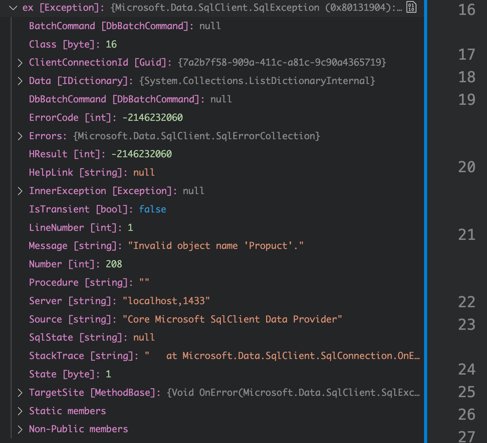
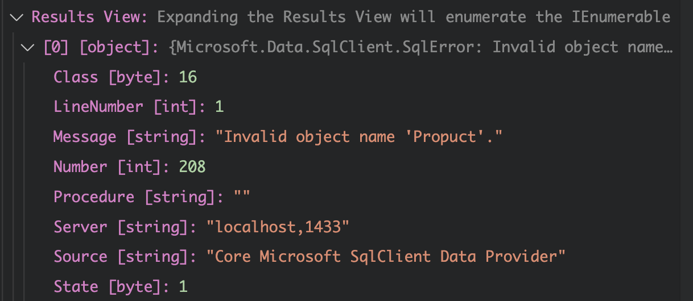

# 09 `ADO.NET` Exception


## Structure de base

```cs
try {
    using var connection = new SqlConnection("Sever=BadServerName...");
    using var cmd = new SqlCommand("INSERT INTO ...", connexion);
    
    connexion.Open();
    rowsAffected = cmd.ExecuteNonQuery();
}
catch (Exception ex) {
    ResultText = ex.ToString();
}
```


## Résultat d'une `exeception`

Code fautif (`Propuct` au lieu de `Product`) :

```cs
app.MapPut("/exceptionhandling", SimpleExceptionHandling);

IResult SimpleExceptionHandling(SqlConnection connection, InsertProductDto product)
{
    try
    {
        var sql = @"INSERT INTO Propuct (Name, Price, CategoryId)
                            VALUES (@Name, @Price, @CategoryId)";

        using var cmd = new SqlCommand(sql, connection);
        connection.Open();
        // ...
    }
    catch (Exception ex)
    {
        return Ok(ex.ToString());
    }
```

L'erreur est ici très parlante.

```bash
"Microsoft.Data.SqlClient.SqlException (0x80131904): Invalid object name 'Propuct'.\n   at Microsoft.Data.SqlClient.SqlConnection.OnError(SqlException exception, Boolean breakConnection, Action`1 wrapCloseInAction)\n   at Microsoft.Data.SqlClient.SqlInternalConnection.OnError(SqlException exception, Boolean breakConnection, ...
```



L'objet `exception` contient toutes les infos.


## Problèmes de cette méthode

- On perd les infos importantes venant de `SQL Server`
- On n'a plus accès à l'objet `Command`.


## Alternative avec `SqlException`

```cs
try
{
    // ...
}
catch (SqlException ex)
{
    var errors = ex.Errors.
}
```



On a maintenant toutes ces infos.


## Exemple avec une procédure stockée

### `sql` de la procédure

```sql
USE AdoTestApi
GO
SET ANSI_NULLS ON
GO
SET QUOTED_IDENTIFIER ON
GO
ALTER PROCEDURE Product_Insert
	@Name nvarchar(150),
	@IntroductionDate datetime,
	@Price decimal,
	@Id int OUTPUT
AS
INSERT INTO Product (Name, IntroductionDate, Price)
VALUES (@Name, @IntroductionDate, @Price);

SELECT @Id = SCOPE_IDENTITY();
```

Dans le code maintenant :

```cs
IResult CatchSqlException(SqlConnection connection)
{
    try {
        var sql = "ProductInsert";

        using var cmd = new SqlCommand(sql, connection);

        cmd.Parameters.Add(new SqlParameter("@Nem", "Boum")); // <= génère l'erreur
        cmd.Parameters.Add(new SqlParameter("@Price", 10));
        cmd.Parameters.Add(new SqlParameter("@IntroductionDate", DateTime.Now));

        cmd.Parameters.Add(
            new SqlParameter {
                ParameterName = "@Id",
                Value = -1, // ?
                IsNullable = false,
                DbType = DbType.Int32,
                Direction = ParameterDirection.Output
            }
        );

        cmd.CommandType = CommandType.StoredProcedure;

        connection.Open();

        var rowsAffected = cmd.ExecuteNonQuery();

        return Ok(rowsAffected);
    }
    catch (SqlException ex) {
        var errors = ex.Errors;

        return Problem(ex.ToString());
    }
}
```


## `SqlExceptionManager`

On va créer une classe pour gérer les `exception`

- `Singleton`
- elle possède la méthode `Publish(ex, cmd)`
- elle crée un objet `custom exception`

Elle contiendra

- la clause `SQL`
- Les `Command Parameters`
- La `Connection String` (moins le `UserId` et le `Password`)
- Les erreurs `SQL Server`


