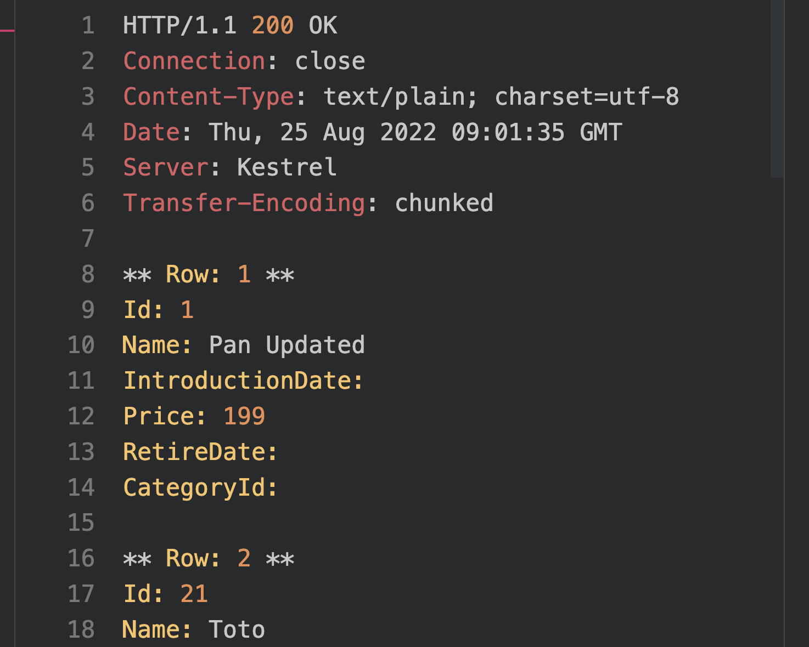

# 19 Les classes déconnectée

## objectifs

- Remplir une `DataTable`
  - Utiliser `SqlDataAdapter`
  - Créer une liste générique depuis un `DataTable`
  - Utiliser la méthode d'extension `Field()`
- Utiliser la class `DataSet` pour gérer les résultats de plusieurs ensembles de données (set de données)
- Trier et firltrer les données en utilisant un `DataView`


## `DataTable`

C'est une structure en mémoire que l'on remplie avec un `SqlDataAdapter`. 

Un ensemble de lignes (`Rows`) et de colonnes (`Columns`) sont créée. 

La connection est fermée automatiquement. 

Le `DataTable` est en mémoire.


## Classe `Helper` : `ProductManager`

```cs
public class ProductManager
{
    public const string PRODUCT_SQL = "SELECT Id, tName, IntroductionDate, Url, Price, RetireDate, CategoryId FROM Product";
    public const string CATEGORY_SQL = "SELECT Id, Name FROM Category";
}
```


## Implémentation de `DataTable`


```csharp
public void GetProductsAsDataTable(SqlConnection con)
{
    DataTable? dt = null;

    using SqlCommand cmd = new SqlCommand(ProductManager.PRODUCT_SQL, con);
    using SqlDataAdapter da = new SqlDataAdapter(cmd);

    dt = new DataTable();

    da.Fill(dt);

    var result = ProcessRowsAndColumn(dt);

    return result;
}
```

La méthode `Fill` utilise un `DataReader` pour remplir (`populate`) le `DataTable`.

La méthode `Fill` ouvre une connexion, traite (`processes`) chaque ligne puis ferme la connexion.

```cs
private string ProcessRowsAndColumn(DataTable dt)
{
    StringBuilder sb = new StringBuilder(2048);
    int index = 1;
    // process each row
    foreach(DataRow row in dt.Rows) {
        sb.AppendLine("** Row: " + index.ToString() + " **");
        // process each column
        foreach(DataColumn col in dt.Columns)
        {
            sb.AppendLine(col.ColumnName + ": " + row[col.ColumnName].ToString());
        }
        sb.AppendLine();
        
        index++;
    }
    
    return sb.ToString();
}
```



Les `DataRow` et `DataColumn` contiennent plein d'information, l'utilisation des `DataTable` est consomme pas mal de ressource (= instanciation de **gros** objets).


## Créer une liste générique `List<T>`

- On doit convertir le `DataTable` en `Enumerable`
- On utilise la méthode `Field<T>()`
- Gérer les champs `nullable`


## `GetProductsAsGenericList()`

```cs
public static List<ProductDto> GetProductsAsGenericList(SqlConnection con)
{
    List<ProductDto> products = new();
    DataTable dt = new();

    string sql = ProductManager.PRODUCT_SQL + " WHERE Name LIKE @Name";

    using SqlCommand cmd = new(sql, con);

    SqlParameter parameter = new("@Name", "Riko");

    cmd.Parameters.Add(parameter);

    using SqlDataAdapter da = new(cmd);

    da.Fill(dt);

    if(dt.Rows.Count > 0) {
        products = dt.AsEnumerable().Select(row => new ProductDto(
            row.Field<int>("Id"),
            row.Field<string?>("Name"),
            row.Field<decimal>("Price")
        )).ToList();
    }

    return products;
}
```

`Row.Field<T>("ColumlName")` permet de caster n'importe quel type.

 `T` peut être `nullable` : `string?`

```cs
row.Field<string?>("Name"),
```


## `DataSet`

Le `DataSet` est une collection de `dataTable` et les garde en mémoire.

Plusieurs clauses `SELECT` créent plusieurs objets `DataTable`.


```cs
public static MultipleResultSetDto GetMultipleResultSet(SqlConnection con)
{
    // CRÉER LES LISTES
    List<ProductDto> products = new();
    List<CategoryDto> categories = new();

    DataSet ds = new();
    string sql = $"{ProductManager.PRODUCT_SQL};{ProductManager.PRODUCT_CATEGORY_SQL}";

    using SqlCommand cmd = new(sql, con);
    using SqlDataAdapter da = new(cmd);

    da.Fill(ds);

    if(ds.Tables.Count > 0)
    {
        products = ds.Tables[0].AsEnumerable().Select(row => new ProductDto(
            row.Field<int>("Id"),
            row.Field<string?>("Name"),
            row.Field<decimal?>("Price")
        )).ToList();

        categories = ds.Tables[1].AsEnumerable().Select(row => new CategoryDto(
            row.Field<int>("Id"),
            row.Field<string>("Name")
        )).ToList();
    }

    return new MultipleResultSetDto(products, categories);
}
```

On retrouve les deux `DataTable` avec `ds.Tables[0]` et `ds.Tables[1]`.


## `DataView`

C'est une structure en mémoire.

Elle a comme propriété `Sort` et `RowFilter` qui permettent respectivement de trier et de filtrer les données en mémoire.

On peut aussi éditer les données et choisir des les placer en `DB` plus tard.


### Utilisation

```cs
public static List<ProductDto> GetProductsSortByPriceDescending(SqlConnection con)
{
    DataView dv = new();

    // Remplir un DataTable
    DataTable dt = new();

    string sql = ProductManager.PRODUCT_SQL;

    using SqlCommand cmd = new(sql, con);
    using SqlDataAdapter da = new(cmd);

    da.Fill(dt);
    // fin

    dv = dt.DefaultView;
    dv.Sort = "Price DESC"; // ASC est la valeur par défaut

    return dv.ToTable().AsEnumerable().Select(row => new ProductDto(
        row.Field<int>("Id"),
        row.Field<string?>("Name"),
        row.Field<decimal?>("Price")
    )).ToList();
}
```

Pour passer d'un `DataView` à un `DataTable` : `dv.ToTable()`.

C'est le plus souvent plus efficace de trier en mémoire un groupe de données que sur la `database`.


## Filtrer les données avec `dv.RowFiler`

```cs
dv.RowFiler = "Price < 100";
```

On peut filtre avec `And`, `Or`, `True`, `False`, `Is`, `like`, etc.

C'est la syntaxe qu'on retrouve avec la clause `WHERE` mais sans écrire le mot `WHERE`.

```cs
dv.RowFilter = "Price < 100 AND Name LIKE %am%";
```


## Cumul de `Sort` et `RowFilter`

```cs
public static List<ProductDto> GetProductsFiltered(SqlConnection con)
{
    DataView dv = new();

    // Remplir un DataTable ...

    dv = dt.DefaultView;
    dv.RowFilter = "Price < 100";
    dv.Sort = "Price DESC";
    
    int rowsAffected = dv.Count;
    Console.WriteLine(rowsAffected);

    return dv.ToTable().AsEnumerable().Select(row => new ProductDto(...)).ToList();
}
```

Pour avoir le nombre de lignes correspondantes (`rowsAffected`), on utilise `dv.Count`.


## Créer un `DataView` avec `Linq`

On peut créer un `DataView` directement depuis une requête `Linq` sur un `DataTable` :

```cs
DataView dv = new();

dv = dt.AsEnumerable().Where(row => row.Field<decimal>("Price") < 500).OrderBy(row => row.Field<string>("Name")).AsDataView();
```


