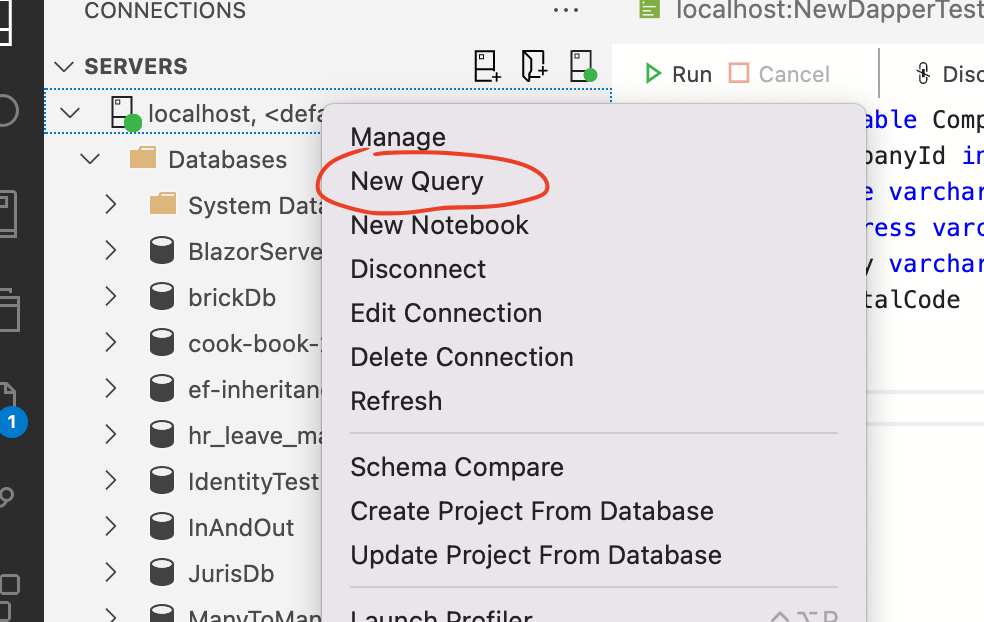

# 02 Mise en place

## Créer une `DB` et une table dans `Azure Data Studio`



Ensuite on entre la première `query` :

```sql
create database DapperBrughen;
go
```

Puis

```sql
use DapperBrughen;

create table Companies(
     CompanyId int identity(1,1) primary key ,
     Name varchar(50),
     Address varchar(255),
     City varchar(50),
     PostalCode  varchar(4)
);

go
```

`identity(start, increment)` 

`identity(1,1)` commence à `1` et incrémente de `1`.


