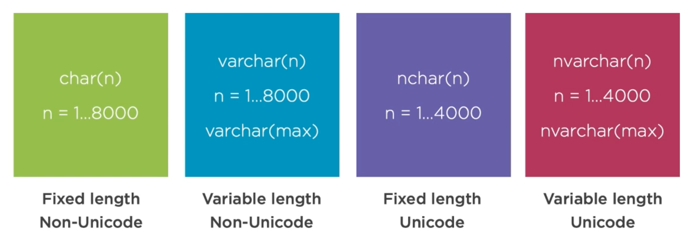
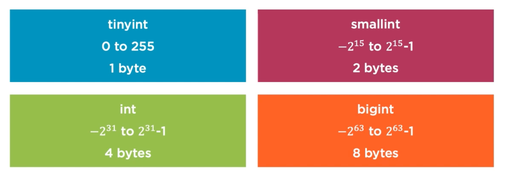

# 02 Concevoir et implémenter des `Tables`


## Créer Des `Tables`

### `Database`

Elle a besoin d'un `Database Name` et d'un `Schema Name`.

Si on ne lui donne pas un `Schema Name`, celui par défaut est `dbo` : `database owner`.


### `Table`

On a besoin d'un `Table name`


### `Column`

De nouveau un `column name`

Les `data types`

Les `Constraints` :

- `Primary Key`
- `Nullability`


## Créer des identifiants correctes

On a quatre règles :

- Ils doivent commencer par une lettre, underscore `_`, at `@` ou un dièse `#`
- ensuite on a des lettres des nombres et `@`, `$`, `#` ou `_`
- Pas de nom réservé (Database, Table, ...)
- Pas d'espace interne ou de caractères spéciaux

Un identifiant ne suivant pas ces règles doit être mis entre crochets : `[Bad Identifiant!!!!]`.

Un identifiant ne peux pas être plus long que 128 caractères.


## Conventions de nom

Ne pas utiliser `@` en premier caractère

- Utilisé pour les variables en `T_SQL`

Ne pas utiliser `#` en premier caractère

- Utiliser pour les objets dans `tempdb`


## Création simple

```sql
USE Rodents;
GO
CREATE TABLE Mice.TheQuestion
(TheAnswer int NOT NULL);
INSERT INTO Mice.TheQuestion
(TheAnswerd) VALUES (42);
```


## Types de données


## Données Textuelles

- `char` : taille fixe de `1` à `8000`, chaque `char` prend un `byte`, pour des enregistrement court et ayant tous la même taille.
- `varchar` : taille fixe `1` à `8000` utilise la taille réel, c'est un type efficient.
- `varchar(max)` => `2 Gb` par colonne

Pour les textes en `Unicode` on a `nchar` et `nvarchar`. Ils prennent `2 Bytes` par caractère.




## Données entières

`tinyint` 0 à 255

`smallint`

`int`

`bigint`



On peut utiliser un `smallint` pour une quantité et un `int` pour l'`Id`.


## Les nombres décimaux

`decimal` et `numeric` sont identiques.

`decimal [(p,s)]`

`p` precision le nombre de chiffre devant la virgule.

`s` : `scale` le nombre de chiffre derrière la virgule

Par défaut on `p = 18` et `s = 0`.

`money` a `4 decimal`.

`smallmoney`


Attention `money` et `smallmoney` sont propres à `SQL Server`.


## Type `date`

`date` le plus simple

`time[(n)]`

`datetime` a des limites. Il enregistre les fractions de secondes

`smalldatetime` a des limites. N'enregistre pas les fractions de secondes.

`datetime2(n)` combine `date` et `time` avec le choix de la précision pour les fractions de secondes.

`datetimeoffset` combine `datetime2` et le `time zone`.


#### Conseillés :

`datetime2` et `datetimeoffset`.


#### à éviter :

`datetime` et `smalldatetime` trop spécifique à `SQL Server`.


## Flag

On utilise le type `bit`.


