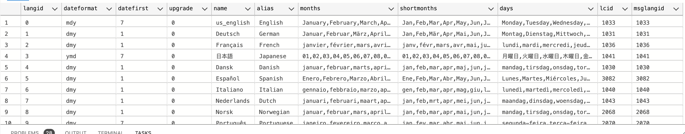
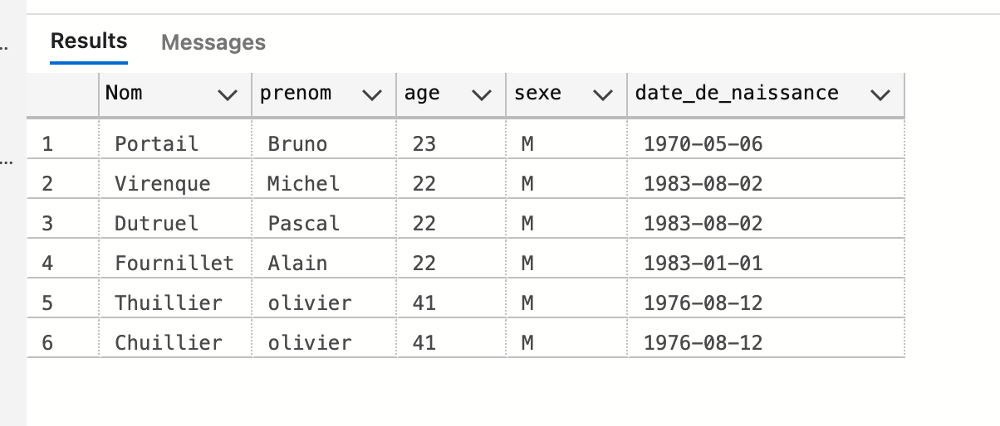
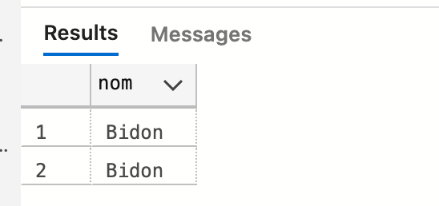

# 04.1 `TSQL` avancé : `AS`, `LIKE` et `TOP`


## Les alias : `AS`

```sql
SELECT Nom AS Pseudo FROM Etudiant
```

```sql
SELECT prenom as PR, Nom as NM FROM Contact
```


## Créer la `DB` `Contact`

Problème lors de l'insertion des dates :


Le problème ici c'est que c'est le format français et pas le format américain (sinon ça peut fonctionner juste avec de simple guillemet).

> On peut utiliser `sp_helplanguage` pour obtenir des informations sur les formats utilisés
>
> 
>
> Pour connaitre son langage :
>
> ```sql
> select @@language;
> ```
>
> 
>
> Pour le modifier :
>
> ```sql
> SET LANGUAGE Français
> ```
>
> Ou juste le format de la date :
>
> ```sql
> SET DATEFORMAT 'dmy'
> ```
>
> `d` day, `m` month, `y` year on a `mdy`, `dmy` ou encore `ymd`.


## Opérateur `LIKE`

Pour affiner les recherches avec le `WHERE`.


### Je veux chercher tous les noms où il y a un `u` :

```sql
SELECT * FROM Contact WHERE nom LIKE '%u%'
```

Insensible à la casse, on peut noter de manière équivalente :

```sql
SELECT * FROM Contact WHERE nom LIKE '%U%'
```


### Syntaxe équivalente

```sql
SELECT * FROM Contact WHERE nom = 'Marchand'

-- Et 

SELECT * FROM Contact WHERE nom LIKE 'Marchand'
```


### Tous les ages commençant par `2`

```sql
SELECT * FROM Contact WHERE age LIKE '2%'
```


### Finissant par `2`

```sql
SELECT * FROM Contact WHERE age LIKE '%2'
```


### Toutes les dates contenant `08`

```sql
SELECT * FROM Contact WHERE date_de_naissance LIKE '%08%'
```


### Sélectionner plusieurs choix de valeur `[12]`

```sql
SELECT * FROM Contact WHERE age LIKE '%[123]'
```



```sql
SELECT * FROM Contact WHERE nom LIKE '[abcdef]%'
```


```sql
SELECT * FROM Contact WHERE nom LIKE 'F[ao]urnillet'
```


## `TOP`

Le `TOP` permet de retourner le premier ensemble de lignes.

```sql
SELECT TOP(2) * FROM Contact
```

=> on obtient les `2` premières lignes.


### Avec `DELETE`

```sql
CREATE TABLE Bidon (nom varchar(20))

INSERT INTO Bidon VALUES ('Bidon'),('Bidon'),('Bidon')

SELECT * FROM Bidon
```


```sql
DELETE TOP(1) FROM Bidon
```




### Avec `UPDATE`

```sql
INSERT INTO Bidon VALUES ('Bidon'),('Bidon'),('Bidon')
```

```sql
UPDATE TOP(3) Bidon SET nom = 'Dindon'
```


