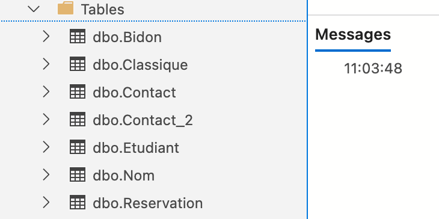
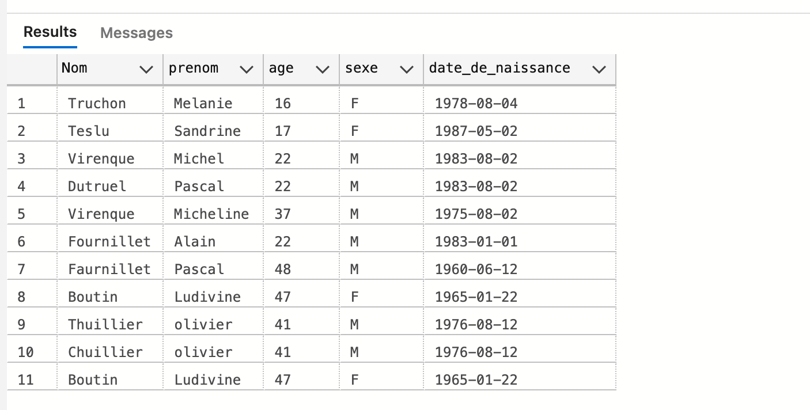
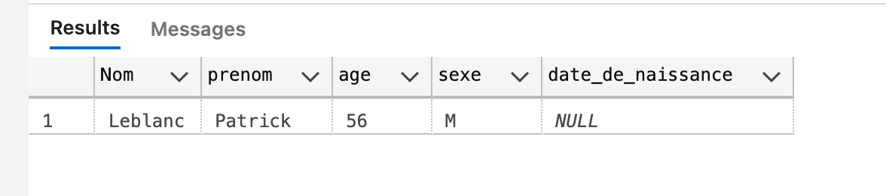

# 04.2 `TSQL` avancé


## Le `DISTINCT`

Ne sélectionne pas les valeurs dupliquées :

```sql
SELECT * FROM Bidon
```


```sql
SELECT DISTINCT * FROM Bidon
```


### Sur une colonne précise

```sql
SELECT DISTINCT nom FROM Contact
```


## Copié une table avec `SELECT INTO`

Par sécurité on peut faire une copie de table :

```sql
SELECT * INTO Contact_2 FROM Contact
```

`Contact_2` étant la nouvelle table.



### Copier quelques données avec le `WHERE`

```sql
SELECT * INTO Contact_3 FROM Contact WHERE nom LIKE '%u%'
```




### Copier juste une colonne

```sql
SELECT nom INTO Contact_4 FROM Contact
```


## Les opérateurs de comparaison

`=` égal

`>` `>=` `<` `<=` inégalité

`<>` ou `!=` différent

```sql
SELECT * FROM Contact WHERE age < 22
```

```sql
SELECT * FROM Contact WHERE age <> 41
```


## `IN`, `NOT IN`

Détermine si une valeur correspond à une valeur dans une liste donnée.

```sql
SELECT * FROM Contact WHERE nom NOT IN ('dutruel', 'thuiller')
```

N'est pas sensible à la case :

```sql
SELECT * FROM Contact WHERE nom NOT IN ('DuTruel', 'thuiller')
```

Donne la même chose.


## `IS NULL` et `IS NOT NULL`

`NULL` = vide

```sql
SELECT * FROM Contact WHERE date_de_Naissance IS NOT NULL
```

```sql
SELECT * FROM Contact WHERE date_de_Naissance IS NULL
```




## `ORDER BY` : `ASC` ou `DESC`

Cela permet de trier un résultat de requête.

On peut trier sur une ou plusieurs colonnes.

De manière `ASCENDANTE` ou `DESCENDANTE`.


