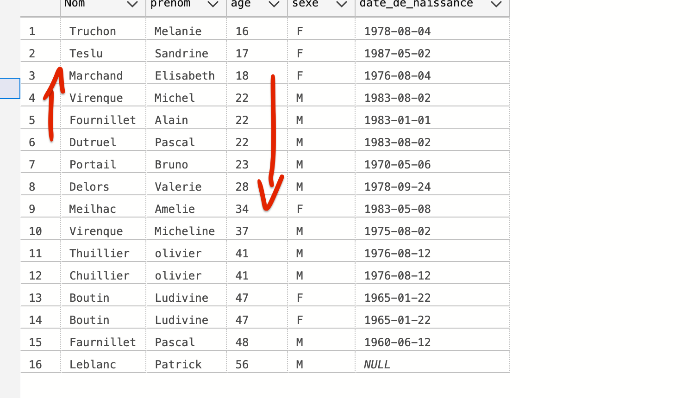
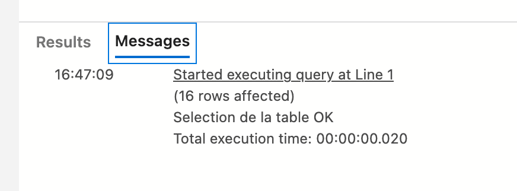
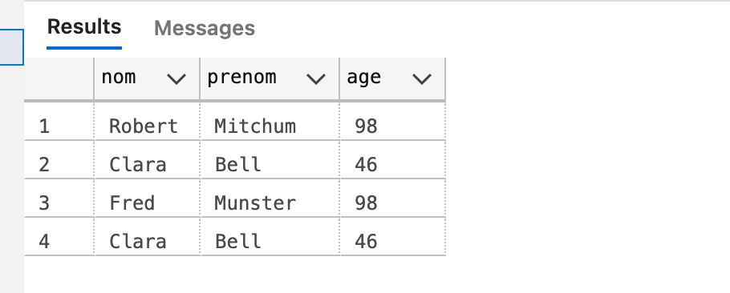

# 04.2 `TSQL` avancé


## Le `DISTINCT`

Ne sélectionne pas les valeurs dupliquées :

```sql
SELECT * FROM Bidon
```


```sql
SELECT DISTINCT * FROM Bidon
```


### Sur une colonne précise

```sql
SELECT DISTINCT nom FROM Contact
```


## Copié une table avec `SELECT INTO`

Par sécurité on peut faire une copie de table :

```sql
SELECT * INTO Contact_2 FROM Contact
```

`Contact_2` étant la nouvelle table.


### Copier quelques données avec le `WHERE`

```sql
SELECT * INTO Contact_3 FROM Contact WHERE nom LIKE '%u%'
```


### Copier juste une colonne

```sql
SELECT nom INTO Contact_4 FROM Contact
```


## Les opérateurs de comparaison

`=` égal

`>` `>=` `<` `<=` inégalité

`<>` ou `!=` différent

```sql
SELECT * FROM Contact WHERE age < 22
```

```sql
SELECT * FROM Contact WHERE age <> 41
```


## `IN`, `NOT IN`

Détermine si une valeur correspond à une valeur dans une liste donnée.

```sql
SELECT * FROM Contact WHERE nom NOT IN ('dutruel', 'thuiller')
```

N'est pas sensible à la case :

```sql
SELECT * FROM Contact WHERE nom NOT IN ('DuTruel', 'thuiller')
```

Donne la même chose.


## `IS NULL` et `IS NOT NULL`

`NULL` = vide

```sql
SELECT * FROM Contact WHERE date_de_Naissance IS NOT NULL
```

```sql
SELECT * FROM Contact WHERE date_de_Naissance IS NULL
```


## `ORDER BY` : `ASC` ou `DESC`

Cela permet de trier un résultat de requête.

On peut trier sur une ou plusieurs colonnes.

De manière `ASCENDANTE` ou `DESCENDANTE`.

```sql
SELECT * FROM Contact ORDER BY nom DESC
```

```sql
SELECT * FROM Contact ORDER BY age ASC, nom DESC
```



### Trier juste sur l'année de naissance

```sql
SELECT * FROM Contact ORDER BY year(date_de_naissance) -- ASC par défaut
```

Par mois :

```sql
SELECT * FROM Contact ORDER BY month(date_de_naissance)
```

Et par jour :

```sql
SELECT * FROM Contact ORDER BY day(date_de_naissance)
```


## Opérateur `AND` et `OR`

Ils s'appliquent au `WHERE`

```sql
SELECT * FROM Contact WHERE month(date_de_naissance) = 12 AND age > 16
```

Ici toutes les personnes nées en décembre et ayant plus de 16 ans.

```sql
SELECT * FROM Contact WHERE nom = 'portail' OR nom = 'virenque'
```


## Le `BETWEEN`

Sélectionne un interval de données.

Le `BETWEEN` et toujours associé au `AND`.

```sql
SELECT * FROM Contact WHERE age BETWEEN 16 AND 45
```

Les personnes nées entre `1976` et `1987`

```sql
SELECT * FROM Contact WHERE year(date_de_naissance) BETWEEN 1976 AND 1987 ORDER BY date_de_naissance DESC
```


On voit que les valeurs des bornes sont incluses.

### Utilisation avec `NOT`

```sql
SELECT * FROM Contact WHERE year(date_de_naissance) NOT BETWEEN 1976 AND 1987 ORDER BY date_de_naissance DESC
```


## Le `GROUP BY`

Le `GROUP BY` fonctionne de paire avec les fonctions d'`Agregation`

```sql
SELECT COUNT(*) AS Total, sexe, date_de_naissance 
FROM Contact 
WHERE sexe = 'M' AND year(date_de_naissance) = 1976 
GROUP BY sexe, date_de_naissance
```


C'est le nombre de personne de sexe `'M'` nées en `1976` : `2`.

Si on ne met pas de `GROUP BY` on obtient une erreur :


Dès qu'on utilise une fonction d'agrégation, on doit regrouper les données avec un `GROUP BY`si cette fonction ne contient pas les colonnes à afficher.


## L'opérateur `HAVING`

Proche de la condition `WHERE` mais s'utilise avec les fonctions `SUM()`, `COUNT()`, `AVG()`, `MIN()` ou `MAX()`.

```sql
SELECT COUNT(*) AS total, sexe, age
FROM Contact
WHERE sexe = 'M' AND age BETWEEN 20 AND 31
GROUP BY sexe, age
HAVING COUNT(*) > 2
```


On peut faire la même chose avec `SUM`

```sql
SELECT COUNT(*) AS total, sexe, age
FROM Contact
WHERE sexe = 'M' AND age BETWEEN 20 AND 31
GROUP BY sexe, age
HAVING SUM(1) > 2
```

`SUM(1)` ajoute `1` par ligne regroupées (avec le `GROUP BY`).

#### ! Le `HAVING` est **toujours** placé après le `GROUP BY`.


## La commande `PRINT`

Retourne un message à l'utilisateur.

```sql
SELECT * FROM Contact
PRINT 'Selection de la table OK'
```



### Récupération de ce message en `.net`

```c#
using Dapper;
using Microsoft.Data.SqlClient;

var connectionString = "Server=localhost,1433;Database=EloaBdd;User=sa;Password=huk@r2Xmen99;MultipleActiveResultSets=true;Encrypt=false";

using var connection = new SqlConnection(connectionString);

connection.InfoMessage += ReceiveMessage;

dynamic responses = connection.Query<dynamic>("SELECT * FROM Contact PRINT 'Hello Info Hukar'");

foreach(var resp in responses)
{
    // Console.WriteLine(resp.Nom);
}

void ReceiveMessage(Object sender, SqlInfoMessageEventArgs evt)
{
    Console.WriteLine(evt.Message);
}
```


## `UNION` et `UNION ALL` : concatenation des tables

Regroupe des tables avec le même nombre de colonnes.

```sql
CREATE TABLE Client_1 (nom varchar(20), prenom varchar(20), age int)

INSERT INTO Client_1 VALUES ('Robert', 'Mitchum', 98), ('Clara', 'Bell', 46)

CREATE TABLE Client_2 (nom varchar(20), prenom varchar(20), age int)

INSERT INTO Client_2 VALUES ('Fred', 'Munster', 98), ('Clara', 'Bell', 46)	
```


### `UNION`

```sql
SELECT * FROM Client_1
UNION
SELECT * FROM Client_2
```


Les enregistrements identiques sont fusionnés, ici `Clara Bell`.


### `UNION ALL`

```sql
SELECT * FROM Client_1
UNION ALL
SELECT * FROM Client_2
```



Ici les doublons sont affichés.


