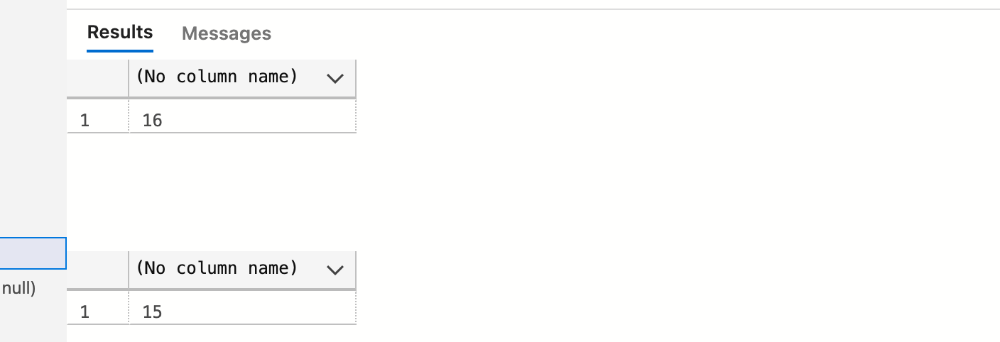
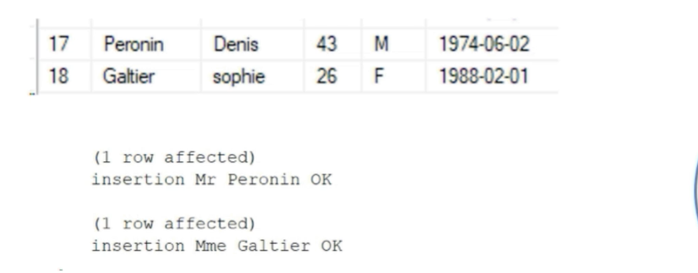

# 05 Fonction d'agrégation

## `MIN`, `MAX` et `AVG`

`MIN` retourne la valeur minimum d'une colonne.

```sql
SELECT MIN(age) FROM Contact
```

`MAX` retourne la valeur maximum d'une colonne.

```sql
SELECT MAX(age) FROM Contact
```

`AVG` sélectionne la valeur moyenne d'une colonne.

```sql
SELECT AVG(age) FROM Contact
```


### Avec des caractères

```sql
SELECT MIN(nom) AS MIN_NOM FROM Contact
SELECT MAX(nom) AS MAX_NOM FROM Contact
-- SELECT AVG(nom) AS AVG_NOM FROM Contact
```


Cela focntionne par ordre alphabétique.

Par contre `AVG` avec des caractères provoque une erreur :

```sql
SELECT AVG(nom) AS AVG_NOM FROM Contact
```


## `SUM` et `COUNT`

### `SUM`

`SUM` fait la somme total d'une colonne contenant des valeurs numériques.

```sql
SELECT SUM(age) FROM Contact -- 519
```


#### Pas possible

```sql
SELECT SUM(*) FROM Contact
SELECT SUM(nom) FROM Contact
```

Ces deux syntaxes ne fonctionnent pas, `SUM` s'utilise uniquement avec des colonnes numériques


#### `SUM(1)`

On peut compter les lignes avec cette syntaxe :

```sql
SELECT SUM(1) FROM Contact -- 16
SELECT SUM(3) FROM Contact -- 48
```


### `COUNT`

`COUNT` va compter toutes les lignes d'une colonne, pour tous les types de colonnes.

```sql
SELECT COUNT(nom) FROM Contact
```

> `COUNT` ne compte pas les `null`
>
> ```sql
> SELECT COUNT(*) FROM Contact
> 
> SELECT COUNT(date_de_naissance) FROM Contact
> ```
>
> 


#### `DISTINCT` et `COUNT` pour enlever les doublons

```sql
SELECT COUNT(DISTINCT prenom) FROM Contact -- 13 au lieu de 16
```


## Exercices

### 1 Nombre de personnes dont le prénom est `Ludivine`

```sql
SELECT COUNT(*) FROM Contact WHERE prenom = 'Ludivine' -- 2
```


### 2 Somme des femmes nées en `1983`

```sql
SELECT SUM(1) 
FROM Contact 
WHERE sexe = 'f' AND year(date_de_naissance) = 1983 -- 1
```


### 3 Nombre homme entre `20` et `45` ans dont le nombre est supérieure à `1` en classant par l'age `desc`

```sql
SELECT COUNT(*) as NB_HOMME, age 
FROM Contact 
WHERE sexe = 'm' AND age BETWEEN 20 AND 45
GROUP BY age
HAVING SUM(1) > 1
ORDER BY NB_HOMME DESC
```


### 4 Nombre de ligne `DISTINCT` dans la colonne `sexe`

```sql
SELECT COUNT(DISTINCT sexe) 
FROM Contact -- 2
```


### 5 Insérez deux lignes et imprimez le résultat



```sql
INSERT INTO Contact 
(nom, prenom, age, sexe, date_de_naissance) -- pas nécessaire
VALUES 
('Peronin', 'Denis', 43, 'M', '1974-06-02')
PRINT 'Insertion Mr Peronin OK'

INSERT INTO Contact 
VALUES 
('Galtier', 'Sophie', 26, 'F', '1988-02-01')
PRINT 'Insertion M. Galtier OK'
```

```
Insertion M. Galtier OK
(1 row affected)
Insertion Mr Peronin OK
(1 row affected)
Total execution time: 00:00:00.028
```


### 6 Sélectionnez les personnes qui n'ont pas entre `20` et `27` ans

```sql
SELECT * FROM Contact WHERE age NOT BETWEEN 20 AND 27 -- 13
```


### 7 Comptez les personnes qui on la lettre `a` dans leur prénom, qui ont entre `18` et `40` ans de sexe masculin et dont le total est supérieur à `1`

```sql
SELECT COUNT(*) age, sexe
FROM Contact 
WHERE prenom LIKE '%a%' AND  age BETWEEN 18 AND 40 AND sexe = 'M'
GROUP BY age, sexe
HAVING SUM(1) > 1 -- 2
```


