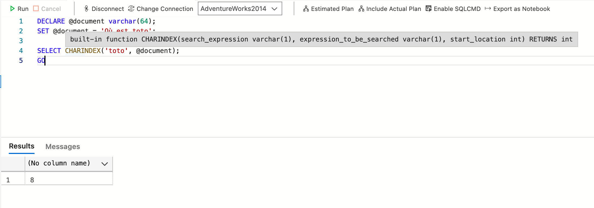
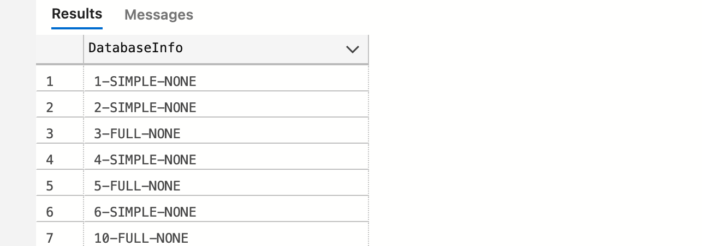

# 06.2 Les chaines de caractères

## `LEFT` et `RIGHT`

Permet d'extraire le début (`LEFT`) ou la fin (`RIGHT`) d'une chaîne de caractères.

```sql
SELECT prenom, LEFT(prenom, 2), RIGHT(prenom, 4) FROM Contact
```


### Concaténation

```sql
SELECT nom, prenom, UPPER(LEFT(nom,1) + RIGHT(nom, 1) + LEFT(prenom, 1)) AS Trigramme FROM Contact
```


## `REPLACE`

Remplace toutes les occurences dans une chaîne de caractère.

### `REPLACE(string_expression, string_pattern, string_replacement)`

```sql
SELECT REPLACE('le bon jambon à l''oignon', 'on', 'eau');
```

`l''oignon` pour échapper une guillemet simple, il faut la doublé.


## `LEN` et `DATALENGTH`

Renvoie la longueur d'une chaîne de caractère à l'exclusion des espaces à droite.

```sql
DECLARE @v1 varchar(40);
SET @v1 = 'combien de caractères ? ' -- 24 avec l'espace de droite
SELECT LEN(@v1) AS [varchar LEN], DATALENGTH(@v1) AS [varchar DATALENGTH];
-- | 23 | 24 |
```


## `REPLICATE`

Réplique une chaîne de caractère un certain nombre de fois.

### `REPLICATE(string_expression, integer_number)`

```sql
USE AdventureWorks2014
GO
SELECT Name, ProductLine, REPLICATE('0', 4) + ProductLine AS 'Line Code'
FROM Product
WHERE ProductLine = 'T'
ORDER BY Name
GO
```

```
... | 0000T
```


## `REVERSE`

Retourne l'ordre de la chaîne de caractères.

```sql
SELECT FirstName, REVERSE(FirstName) AS Reverse
FROM Person.Person
WHERE BusinessEntityID < 5
ORDER BY FirstName
GO
```


## `CHARINDEX`

Permet de donner la position d'une chaîne de caractères.

```sql
DECLARE @document varchar(64);
SET @document = 'Où est toto';

SELECT CHARINDEX('toto', @document);
GO
```



On observe que l'`intellisense` nous donne des infos sur la fonction `CHARINDEX`, notamment un troisième argument pour spécifier la position de départ pour la recherche.

On obtient `0` si la valeur n'est pas trouvée.


## `STRING_SPLIT`

Fractionne l'expression de caractères à l'aide du séparateur spécifié.

Il faut modifier la compatibilité :

```sql
USE master
GO
ALTER DATABASE EloaBDD SET COMPATIBILITY_LEVEL = 130
GO
```

```sql
USE EloaBdd
GO
SELECT * FROM STRING_SPLIT('1,2,3,4,5', ',')
```


## `STUFF`

Insérer/remplacer une chaîne de caractères dans une autre.

### `STUFF(character_expression, start, length, replacewith_expression)`

```sql
SELECT STUFF('abcdef', 2, 3, 'ijklmn'); -- aijklmnef
```


## `CONCAT` et `CINCAT_WS`

```sql
SELECT CONCAT('Bonjour ',' mon ', 'pote il est ',4,' heures')
```

### Avec un séparateur `CONCAT_WS` : `With Separator`

```sql
SELECT CONCAT_WS('-', database_id, recovery_model_desc, containment_desc) AS DatabaseInfo FROM sys.databases
```




