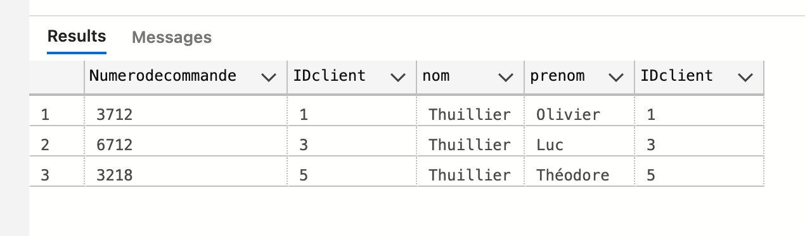
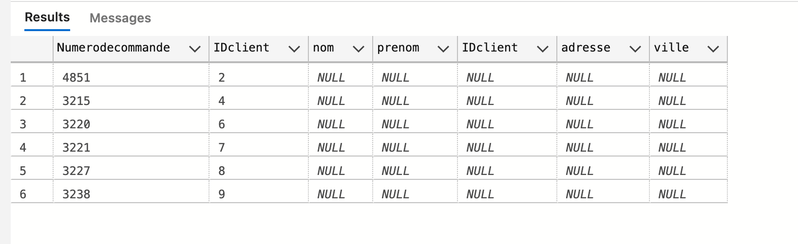
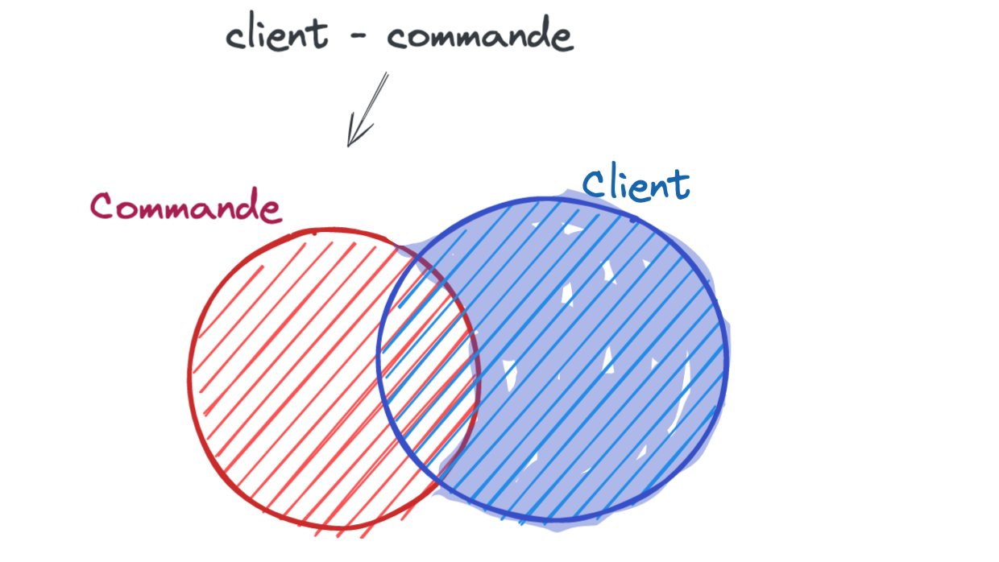
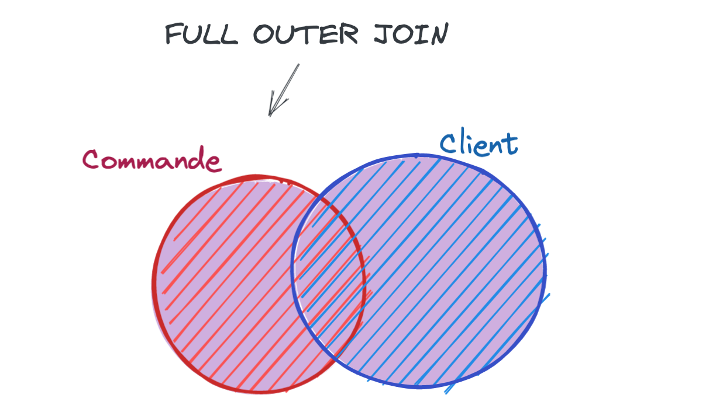
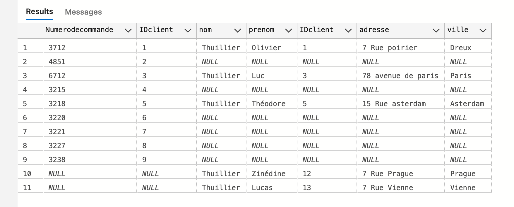

# 07.1 Les jointures

Joindre des tables entre elles.


```sql
SELECT Employees.LastName, Orders.ShippedDate
FROM Orders
INNER JOIN Employees
ON Orders.EmployeeID = Employees.EmployeeID
```


## `INNER JOIN`

Sélectionne les éléments communs aux deux tables.


```sql
SELECT A.Numerodecommande, A.IDclient, B.nom, B.prenom, B.IDclient
FROM commande A
INNER JOIN client B
ON A.IDclient = B.IDclient
```



> ### Le mot `INNER` est facultatif
>
> ```sql
> SELECT A.Numerodecommande, A.IDclient, B.nom, B.prenom, B.IDclient
> FROM commande A
> JOIN client B
> ON A.IDclient = B.IDclient
> ```
>
> Même résultat que plus haut.


## `LEFT JOIN` et `RIGHT JOIN`


```sql
SELECT *
FROM commande
LEFT JOIN client
ON commande.IDclient = client.IDclient
```


On obtient toutes les commandes et des valeurs `null` si aucun client n'y est associé.

```sql
SELECT *
FROM commande
RIGHT JOIN client
ON commande.IDclient = client.IDclient
```


### `Commande moins Client`

Les commandes sans client.

On peut créer une soustraction d'ensemble en ajoutant une clause `WHERE xxx IS NULL` :


```sql
SELECT *
FROM commande
LEFT JOIN client
ON commande.IDclient = client.IDclient
WHERE client.IDclient IS NULL
```




### De même `Client moins Commande`

Les client qui n'ont pas de commande.



```sql
SELECT *
FROM commande
RIGHT JOIN client
ON commande.IDclient = client.IDclient
WHERE commande.IDclient IS NULL
```


> ### `OUTER`
>
> Syntaxe facultative :
>
> ```sql
> RIGHT OUTER JOIN client
> -- équivalent
> RIGHT JOIN client
> ```
>
> De même pour `LEFT JOIN` et `LEFT OUTER JOIN` : pas de différence.


## `FULL [OUTER] JOIN`

Permet de combiner le résultat des deux tables.



```sql
SELECT *
FROM commande
FULL JOIN client -- ou FULL OUTER JOIN
ON commande.IDclient = client.IDclient
```



Prends toutes les données des deux tables et rempli de `null` les espaces manquants.


### `FULL JOIN` sans intersection


```sql
SELECT *
FROM commande
FULL JOIN client
ON commande.IDclient = client.IDclient
WHERE commande.IDclient IS NULL OR client.IDclient IS NULL
```


On observe que les enregistrements concordants ne sont pas repris.


## `CROSS JOIN`

C'est le produit cartésien de deux tables.

Cela va associer les lignes.

```sql
SELECT *
FROM client
CROSS JOIN commande
```

On obtient `45` lignes : `9` lignes pour `commande` X `5` lignes `client`


> à quoi ça sert ???