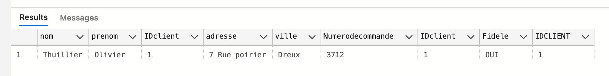
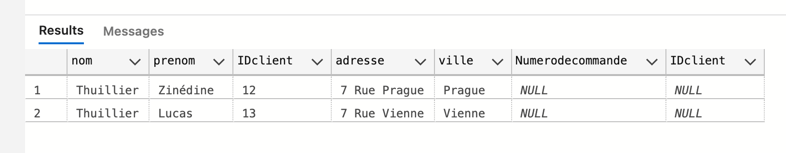
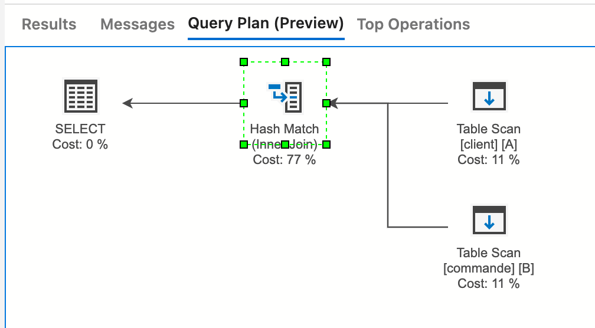
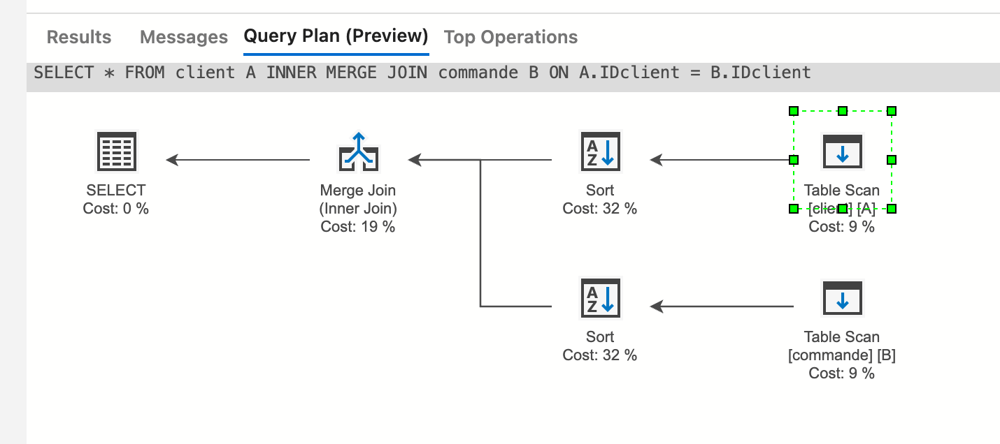
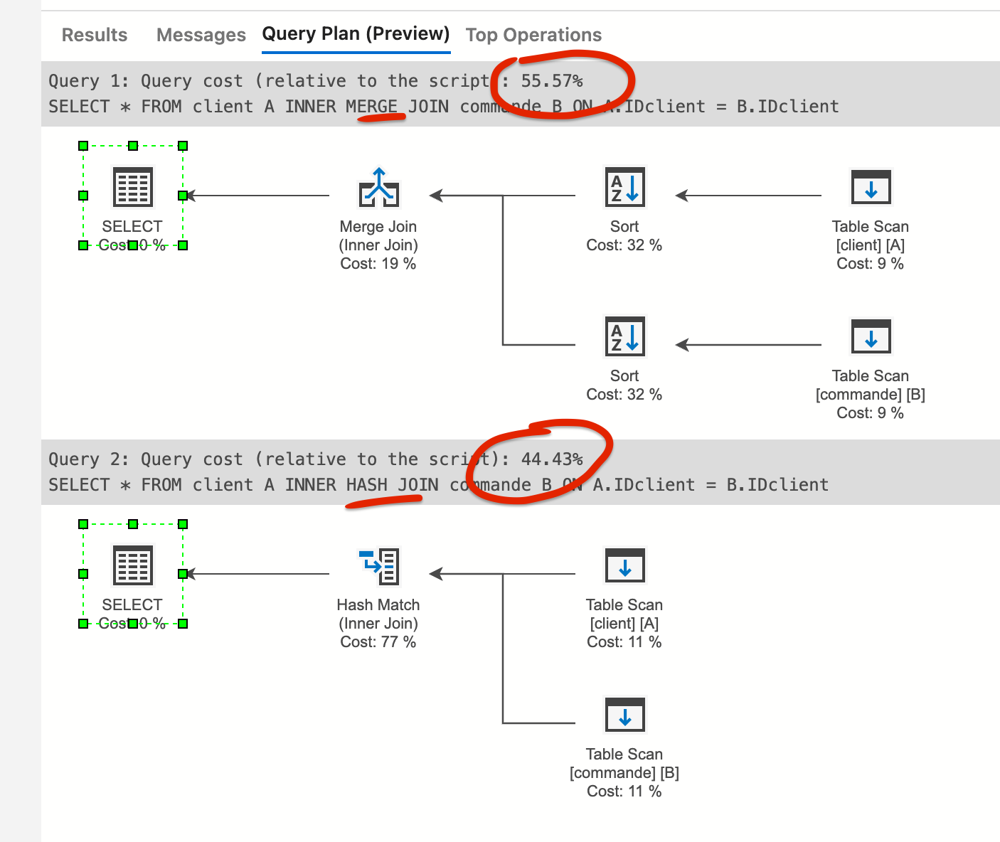
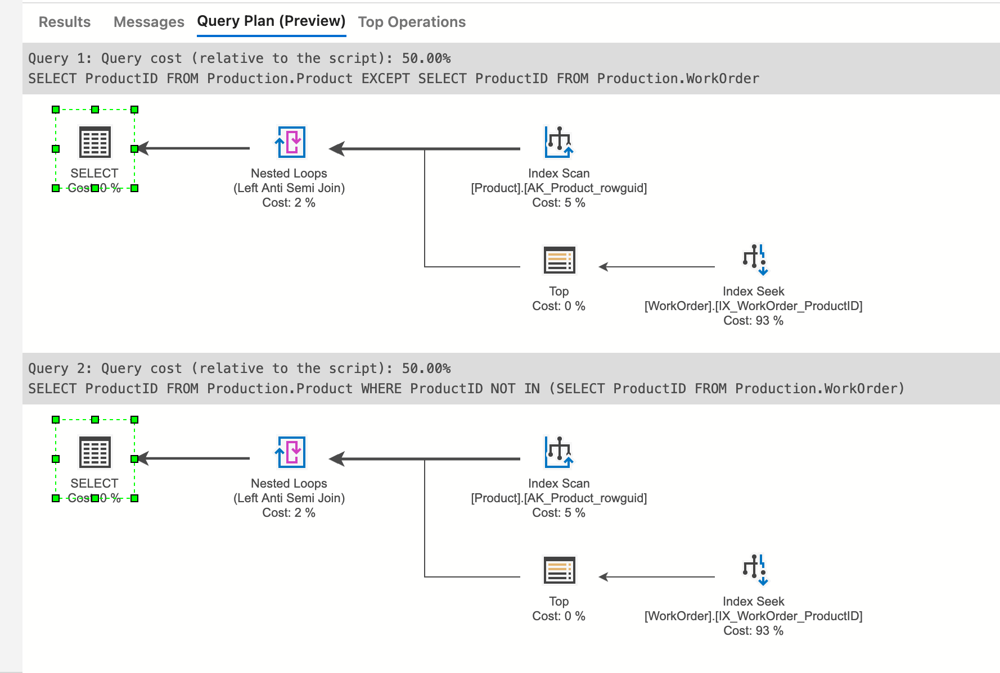
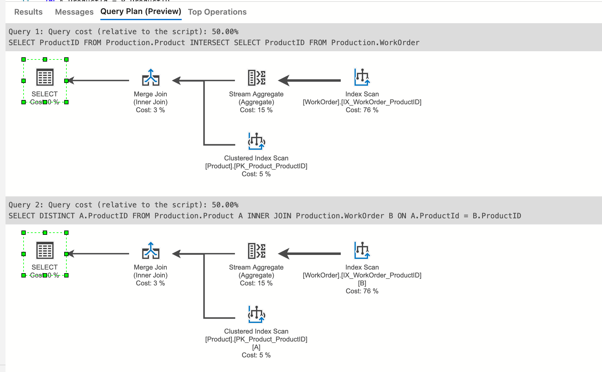
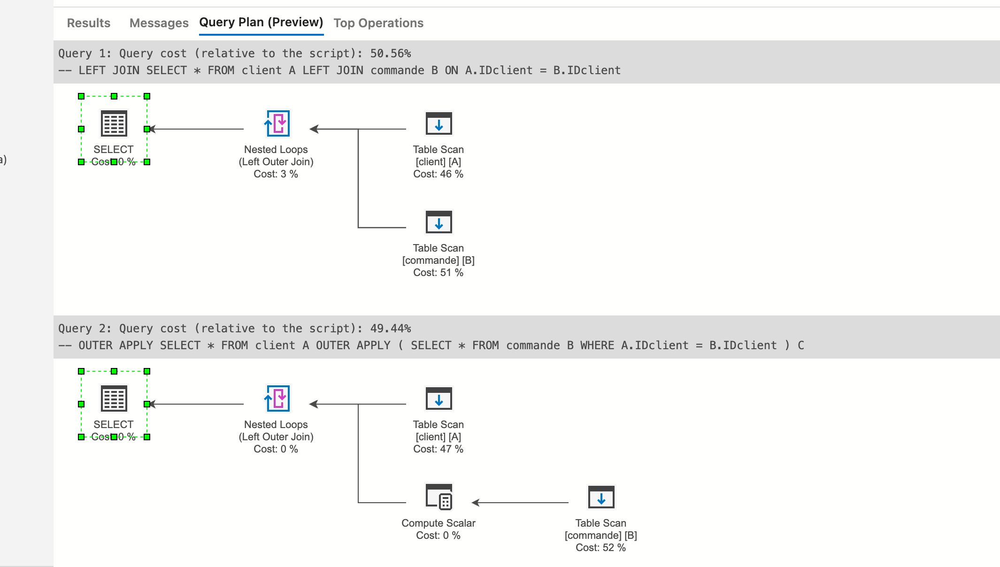

# 07.2 Les jointures avancées


## Jointure sur plusieurs tables

Je veux les clients qui ont des numéro de commande et aussi une carte de fidélité

```sql
SELECT *
FROM client A
INNER JOIN commande B
ON A.IDclient = B.IDclient
INNER JOIN carte_fidelite C
ON A.IDclient = C.IDCLIENT
WHERE Fidele = 'OUI'
```




## `LEFT JOIN` vs `NOT IN` vs `NOT EXISTS`

Pour avoir les clients sans numéro de commande je fais la requête suivante :

```sql
SELECT *
FROM client A
LEFT JOIN commande B
ON A.IDclient = B.IDclient
WHERE B.IDclient IS NULL
```




### Avec `NOT IN` et une sous-requête

```sql
SELECT *
FROM client
WHERE IDclient NOT IN (
	SELECT IDclient
    FROM commande
)
```

On obtient le même résultat.


### Avec `NOT EXISTS`

> ### `EXISTS`
>
> C'est un opérateur logique qui renvoie `true` ou `false`.
>
> Il renvoie `true` si la sous-requête placée après retourne au moins une ligne, sinon `false`.
>
> La sous-requête doit être un `SELECT`.
>
> ```sql
> SELECT
>     customer_id,
>     first_name,
>     last_name
> FROM
>     sales.customers
> WHERE
>     EXISTS (subquery)
> ```

```sql
SELECT *
FROM client A
WHERE NOT EXISTS (SELECT * FROM commande B WHERE A.IDclient = B.IDclient)
```

Utile si la requête teste l'existence de quelque chose sans renvoyer les données.


## `UPDATE` avec jointure

```sql
UPDATE T2
SET T2.Colonne2 = T1.Colonne2
FROM T1
INNER JOIN T2
ON T1.Colonne1 = T2.Colonne1
WHERE T2.Colonne1 IN (3, 4)
```

Avec des alias (si nécessaire) :

```sql
UPDATE T2
SET B.Colonne2 = A.Colonne2
FROM T1 A
INNER JOIN T2 B
ON A.Colonne1 = B.Colonne1
WHERE B.Colonne1 IN (3, 4)
```


## Les `Hints` dans les jointure

On peut utiliser des opérateurs sur les jointure.


### `HASH JOIN`

```sql
SELECT *
FROM client A
INNER JOIN commande B
ON A.IDclient = B.IDclient
```

On regarde le plan d'exécution :



On observe que par défaut une table de `Hash` est créée.

On peut ajouter un `HINT` :

```sql
SELECT *
FROM client A
INNER HASH JOIN commande B
ON A.IDclient = B.IDclient
```


### `MERGE`

On peut aussi mettre un `MERGE` :

```sql
SELECT *
FROM client A
INNER MERGE JOIN commande B
ON A.IDclient = B.IDclient
```



Comparaison des deux plans d'exécution :



Le `HASH` est moins gourmand que le `MERGE`, ce qui est le plan d'exécution par défaut choisi par `SQL Server`.


### `NESTED LOOP`

implémentation la plus simple pour faire une jointure, utilisé sur les petites tables.

```sql
SELECT *
FROM client A
INNER LOOP JOIN commande B
ON A.IDclient = B.IDclient
```


On peut voire aussi qu'elle est ici beaucoup moins gourmande.

On peut jouer sur les `HINT` pour améliorer les performances.

Il existe aussi `REMOTE` en cas de serveur distant.


### Syntaxe alternative

```sql
SELECT * 
FROM client A
INNER JOIN commande B
ON A.IDclient = B.IDclient
OPTION (MERGE JOIN)
```


## `EXCEPT` et `INTERSECT`

### `EXCEPT`

Retourne les lignes distinctes de la requête d'entrée à gauche mais non trouvées par la requête d'entrée à droite.


= `LEFT JOIN`sans intersection.

```sql
SELECT *
FROM client A
LEFT JOIN commande B
ON A.IDclient = B.IDclient
WHERE B.IDclient IS NULL
```

### Exemple

```sql
USE AdventureWorks2014
GO

SELECT ProductID
FROM Production.Product
EXCEPT
SELECT ProductID
FROM Production.WorkOrder

SELECT DISTINCT A.ProductID
FROM Production.Product A
LEFT JOIN Production.WorkOrder B
ON A.ProductId = B.ProductID
WHERE B.ProductID IS NULL
```


On a là une net différence de performance en faveur du `EXCEPT` : `18,76` vs `81,24`

#### Et avec `NOT IN`

```sql
SELECT ProductID
FROM Production.Product
WHERE ProductID NOT IN (SELECT ProductID FROM Production.WorkOrder)
```

Avec un temps d'exécution identique au `EXCEPT` :




### `INTERSECT`

Retourne des lignes distinctes qui sont générées par les deux entrées, droite et gauche.


= `INNER JOIN`.

```sql
SELECT *
FROM client A
INNER JOIN commande B
ON A.IDclient = B.IDclient
```

### exemple

```sql
USE AdventureWorks2014
GO

SELECT ProductID
FROM Production.Product
INTERSECT
SELECT ProductID
FROM Production.WorkOrder

SELECT DISTINCT A.ProductID
FROM Production.Product A
INNER JOIN Production.WorkOrder B
ON A.ProductId = B.ProductID
```

Les plans d'exécution sont identiques :




## `CROSS APPLY` et `OUTER APPLY`

`CROSS APPLY` correspond à une jointure `INNER JOIN`

`OUTER APPLY` correspond lui à un `LEFT JOIN`

> Il faut absolument utiliser un alias pour la sous-requête pour que cela fonctionne :
>
> ```sql
> CROSS APPLY (
> 	SELECT *
>     FROM commande B
>     WHERE A.IDclient = B.IDclient
> ) C -- ici l'alias C
> ```
>
> 


### `CROSS APPLY` : `INNER JOIN`

```sql
-- INNER JOIN
SELECT *
FROM client A
INNER JOIN commande B
ON A.IDclient = B.IDclient

-- CROSS APPLY
SELECT *
FROM client A
CROSS APPLY (
	SELECT *
    FROM commande B
    WHERE A.IDclient = B.IDclient
) C
```

Le plan d'exécution est identique.


### `OUTER APPLY` : `LEFT JOIN`

```sql
-- LEFT JOIN
SELECT *
FROM client A
LEFT JOIN commande B
ON A.IDclient = B.IDclient

-- OUTER APPLY
SELECT *
FROM client A
OUTER APPLY (
	SELECT *
    FROM commande B
    WHERE A.IDclient = B.IDclient
) C
```

Légère différence des plans d'exécution en faveur du `OUTER APPLY`



