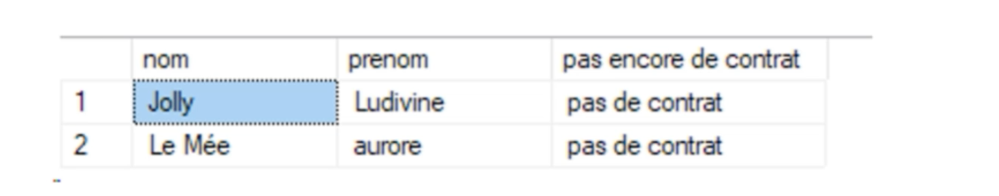
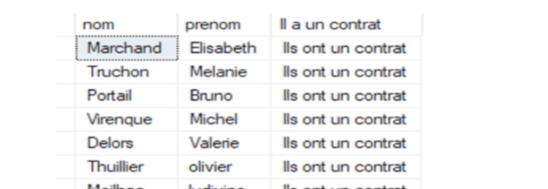
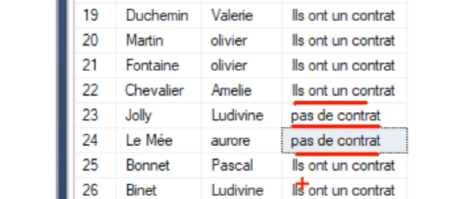

# 07.3 Les exercices


#### Tables

```
salarie
statut_emploi
bareme_salaire
```


## 1 Trouver la fonction de chaque salarié

```sql
SELECT *
FROM salarie A
INNER JOIN bareme_salaire B
ON A.fonction = B.Fonction -- 31 lignes
```


## 2 Idem que 1 mais avec un `cross apply`

```sql
SELECT *
FROM salarie A
CROSS APPLY (
	SELECT *
    FROM bareme_salaire B
    WHERE A.fonction = B.Fonction
) C -- 31 lignes
```


## 3 Trouver les femmes commerciales jointure avec `bareme_salaire`

```sql
SELECT *
FROM salarie A
INNER JOIN bareme_salaire B
ON A.fonction = B.Fonction
WHERE sexe = 'F' AND B.Fonction = 'commercial' -- 2 lignes
```

> #### ! le `WHERE` doit être après le `INNER JOIN` et le `ON`.


## 4 Trouver les personnes en CDI avec un salaire entre 2000 et 3000 euros

```sql
SELECT *
FROM salarie A
INNER JOIN statut_emploi B
ON A.IDclient = B.IDclient
INNER JOIN bareme_salaire C
ON A.fonction = C.Fonction
WHERE B.Types = 'CDI' AND C.salaire = 'entre 2000 et 3000' -- 4 lignes
```

> #### ! toujours le `WHERE` après tous les `INNER JOIN ... ON ...`


## 5 Obtenir le personnes sans contrat



```sql
SELECT nom, prenom, 'pas de contrat' AS [pas encore de contrat]
FROM salarie A
LEFT JOIN statut_emploi B
ON A.IDclient = B.IDclient
WHERE B.IDclient IS NULL
```

### Utilisation d'un `CASE WHEN` :

```sql
SELECT a.nom, a.prenom, 
CASE WHEN b.Types is null THEN 'No contrat' END AS 'Pas de contrat'
FROM salarie a
LEFT JOIN statut_emploi b ON a.IDclient = b.IDclient
WHERE B.IDCLIENT IS NULL
```


## 6 Toutes les personnes qui on un contrat



```sql
SELECT nom, prenom, 'Ils ont un contrat' AS [Il a un contrat]
FROM salarie A
INNER JOIN statut_emploi B
ON A.IDclient = B.IDclient -- 29 lignes
```

### Avec un `CASE WHEN`

```sql
SELECT a.nom, a.prenom, 
CASE WHEN b.Types is not null THEN 'contrat' END AS 'Ils ont un de contrat'
FROM salarie a
RIGHT JOIN statut_emploi b ON a.IDclient = b.IDclient
```

Pas besoin du `WHERE` car le `RIGHT JOIN` ne prendra pas les `salarie` dont le `IDclient` n'est pas dans la table `statut_emploi`.


## 7 Les deux dans la même requête



```sql
SELECT nom, prenom, 'Ils ont un contrat' AS [pas de contrat]
FROM salarie A
INNER JOIN statut_emploi B
ON A.IDclient = B.IDclient
UNION ALL -- ou juste UNION car Boutin Ludivine est en double
SELECT nom, prenom, 'pas de contrat'
FROM salarie A
LEFT JOIN statut_emploi B
ON A.IDclient = B.IDclient
WHERE B.IDclient IS NULL
```

### Avec le `CASE WHEN` et le `ELSE`

```sql
SELECT a.nom, a.prenom, 
CASE WHEN b.Types is not null THEN 'j''ai un contrat' ELSE 'je n''ai pas de contrat'  END AS 'Avoir Contrat'
FROM salarie a
FULL JOIN statut_emploi b ON a.IDclient = b.IDclient
```

Utilisation du `FULL JOIN`.

`''` pour échapper un guillemet : `'j''ai un contrat'`


## 8 `UPDATE` et jointure

```sql
UPDATE T2 t2
SET t2.Colonne2 = t1.Colonne2
LEFT JOIN T1 t1
ON t2.Colonne1 = t1.Colonne1
WHERE t2.Colonne1 IN (3, 4)
```


