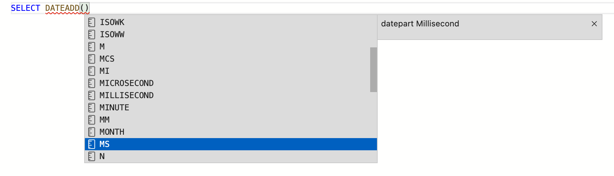

# 08 Les `DATES`

## `DATEADD`

### `DATEADD(datepart, number, date)`

`datepart` peux prendre plusieurs valeurs `year`, `month`, `week`, `day`, `hour`, ...



```sql
SELECT DATEADD(month, 1, '20220830')
SELECT DATEADD(month, 1, '20220831')
```


### Utilisation

Calcul de la date d'envoie : `DATEADD(day, 2, OrderDate)`

```sql
USE AdventureWorks2014
GO
SELECT SalesOrderID, OrderDate, DATEADD(day, 2, OrderDate) AS PromisedShipDate
FROM Sales.SalesOrderHeader
```


## `DATEDIFF`

`quarter` ou `qq` signifie trimestre.

### Chercher le premier jour du trimestre précédent

```sql
SELECT DATEADD(qq, DATEDIFF(qq, 0, GETDATE()) - 1, 0)
```

```
2022-04-01 00:00:00.000
```


### Chercher le premier jour du trimestre actuel

```sql
SELECT DATEADD(qq, DATEDIFF(qq, 0, GETDATE()), 0)
```

```
2022-07-01 00:00:00.000
```


