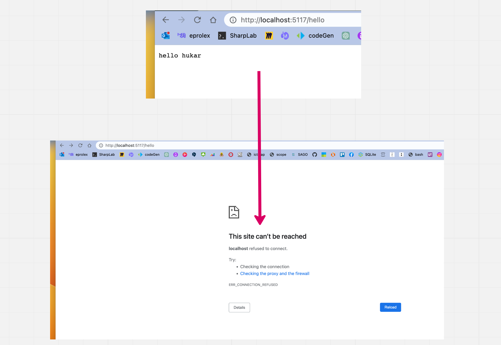
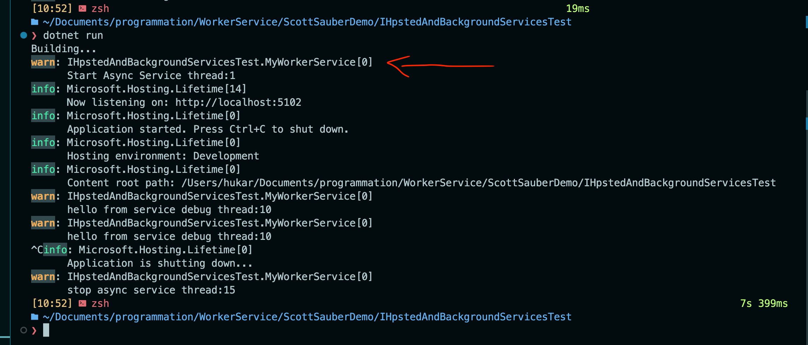

# 02 `IHostedService`

## `IHostedService`

Le `Background Service` à faire soi-même.

Vous hégergez le `Background Job` dans une application `.net`.

Cette `interface` possède une méthode `StartAsync` et une `StopAsync`.

`StopAsync` a `5 s` pour éteindre l'application élégamment.

`StopAsync` ne doit pas être appelé si l'app s'éteint de manière inattendue.

C'est un `building block` de `.net` et on l'utilise en toile de fond pour d'autres options.

On l'enregistre par `injection de dépendance` et `services.AddHostedService<T>()`


### Exemple

```cs
using System.Diagnostics;

namespace HttpClientBase;

public class HukarService : IHostedService
{
    private readonly ILogger<HukarService> _logger;

    public HukarService(ILogger<HukarService> logger)
    {
        _logger = logger;
    }
    
    public Task StartAsync(CancellationToken cancellationToken)
    {
        _logger.LogInformation("Hello IHosted Service");
        IdInfo();

# pragma warning disable CS4014
        DoSomethingAsync(cancellationToken);

        return Task.CompletedTask;
    }

    private async Task DoSomethingAsync(CancellationToken token)
    {
        while(token.IsCancellationRequested == false)
        {
            _logger.LogInformation("Some Work Async");
            IdInfo();

            await Task.Delay(2000);
        }
    }

    private void IdInfo()
    {
        Process process = Process.GetCurrentProcess();
        Thread thread = Thread.CurrentThread;
        _logger.LogInformation($"ProcessId: {process.Id}");
        _logger.LogInformation($"ThreadId: {thread.ManagedThreadId}");
    }

    public Task StopAsync(CancellationToken cancellationToken)
    {
        _logger.LogInformation("Bybyby IHosted Service");
        IdInfo();

        return Task.CompletedTask;
    }
}
```

On enregistre le `Hosted Service` dans `Program.cs`

```cs
builder.Services.AddHostedService<HukarService>();
```

On remarque qu'il ne faut pas utiliser `await` dans l'appelle de notre méthode de traitement asynchrone, d'ou l'utilisation d'une directive `# pragma warnig disable`.

### ! Attention à l'utilisation de `await` dans `StartAsync`

Si on modifie légèrement le code pour avoir :

```cs
public async Task StartAsync(CancellationToken cancellationToken)
{
    _logger.LogInformation("Hello IHosted Service");
    IdInfo();

// # pragma warning disable CS4014
    await DoSomethingAsync(cancellationToken);

    // return Task.CompletedTask;
}
```

L'application ne sera plus accessible:



C'est parce que `StartAsync` est exécuté avant que le serveur soit en route:



Si on place le `await` à ce moment, le serveur n'a plus l'occasion de démarrer.


On remarque que le `service` n'est pas arrêté proprement dans ce cas (pas d'appelle à `StopAsync`).

`Kestrel` utilise aussi un `IHostedService` pour démarrer, si on ne veut pas bloquer le `server HTTP` il ne faut ni mettre un `await` ni un long traitement (sauf si voulu) dans `StartAsync`.

On utilise `IHostedService` quand on désire un contrôle total sur notre `Service`, sinon on utilise plutôt `BackgroundService` ou `WorkerService` la pluspart du temps.

`BackgroundService` et `WorkerService` utilisent implicitement `IHostedService`.
