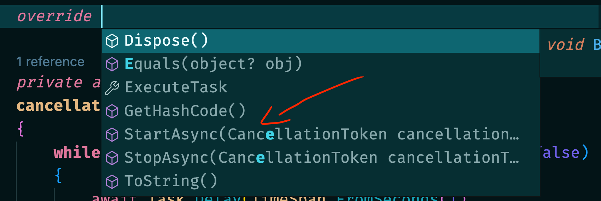

# 03 `BackgroundService`

Plus simple que `IHostedService` et plus sûr.

Hébergé dans une application `asp.net`.

C'est une classe abstraite qui implémente `IHostedService`.

Expose une méthode `ExecuteAsync`.

Gère pour nous le `start` et le `stop`, prévient ainsi les pièges de `IHostedService`.


## Implémentation

```cs
public class MyBackgroundService : BackgroundService
{
    private readonly ILogger<MyBackgroundService> _logger;
    public MyBackgroundService(ILogger<MyBackgroundService> logger)
    {
            _logger = logger;    
    }
    
    protected override async Task ExecuteAsync(CancellationToken stoppingToken)
    {
        await TickMethod(stoppingToken);
    }

    private async Task TickMethod(CancellationToken cancellationToken)
    {
        while(cancellationToken.IsCancellationRequested == false)
        {
            await Task.Delay(TimeSpan.FromSeconds(1), cancellationToken);
            _logger.LogWarning($"hello from service debug thread:{Thread.CurrentThread.ManagedThreadId}");
        }
    }
}
```

Cette fois ci on utilise `await` et le résultat est celui qu'on attend:


Le `server Kestrel` se met en route et le `BackgroundService` est lancé.

On peut si nécessaire `overrider` `StartAsync` et `StopAsync`:



On enregistre le service avec `AddHostedService`:

```cs
builder.Services.AddHostedService<MyBackgroundService>();
```


## Ne pas utiliser si ...

> `Idempotent`: une fonction est `idempotent` si elle ne change pas l'état du système.
>
> Qu'elle soit appellée une ou plusieurs fois n'a pas d'incidence.
>
> Rechercher un `user` est `Idempotent`.
>
> Annuler une `commande` est aussi `Idempotent`.
>
> Créer une `commande` par contre n'est pas `Idempotent`.

Dans le cas d'un `scale out` (multiplication des instances) de l'`API` contenant un `BackgroundService`, cela peut poser un problème si le `BackgroundService` n'est pas `Idempotent` (car il y aura une multiplication des instances du `Service` aussi).
