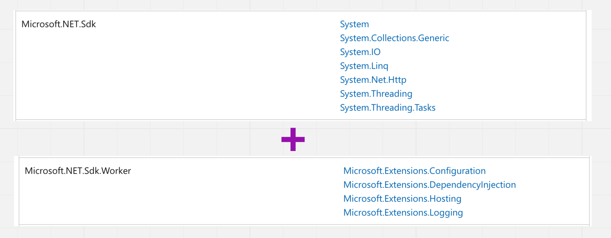

# 04 `WorkerService`

- Indépendant d'une application `asp.net`.
- C'est une application `Console` améliorée.
- Elle possède un `IHost` avec `Configuration`, `Dependency Injection`, `Logging`, etc.
  `implicit using directives`
  
  Certain packages utilitaires ont été découplé d'une application `asp.net` pour être regroupée dans un `IHost`.
- Il n'y a pas de manière particulière pour l'héberger:
  - Appellée depuis un `scheduler`
  - `Windows Service`
  - `Systemd`


## Créer un `WorkerService`

```bash
dotnet new worker -o MySuperWorker
```


## Ajouter la possibilité d'être hébergé sur `Windows` ou `Linux`

```bash
dotnet add package Microsoft.Extensions.Hosting.Systemd
dotnet add package Microsoft.Extensions.Hosting.WindowsServices
```

On les utilise alors dans `Program.cs`:

```c#
IHost host = Host.CreateDefaultBuilder(args)
    .UseWindowsService() // <-
    .UseSystemd() // <-
    .ConfigureServices(services =>
    {
        services.AddHostedService<Worker>();
    })
    .Build();
```

Il faut implémenter une `class` héritant de `BackgroundService` et l'ajouter au conteneur de `services` avec `AddHostedService`:

```cs
public class MyWorker : BackgroundService
{
    private readonly ILogger<MyWorker> _logger;

    public MyWorker(ILogger<MyWorker> logger)
    {
        _logger = logger;
    }

    protected override async Task ExecuteAsync(CancellationToken stoppingToken)
    {
        while (!stoppingToken.IsCancellationRequested)
        {
            _logger.LogInformation("Worker running at: {time}", DateTimeOffset.Now);
            _logger.LogWarning($"Thread: {Thread.CurrentThread.ManagedThreadId}");
            await Task.Delay(1000, stoppingToken);
        }
    }
}
```

```cs
IHost host = Host.CreateDefaultBuilder(args)
    .UseWindowsService()
    .UseSystemd()
    .ConfigureServices(services =>
    {
        services.AddHostedService<MyWorker>(); // <-
    })
    .Build();
```


## Comment héberger un `WorkerService`

- un `scheduler` peut appeler une `app` `worker`
  - `Windows Scheduled Tasks` , `k8s cron jobs` , `Azure Logic Apps` , `AWS Scheduled Tasks` , `GCP Cloud Scheduler`


## Quand utiliser les `WorkerServices`

Quand on préfère héberger un `service` en-dehors d'une application `asp.net` (`web app`).