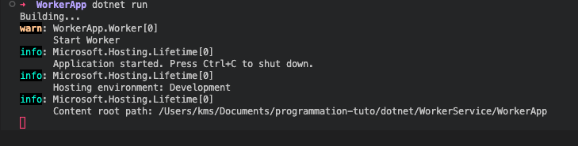
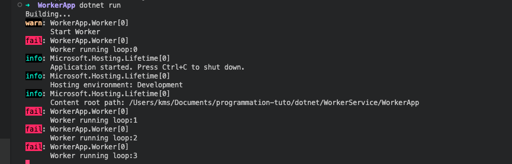
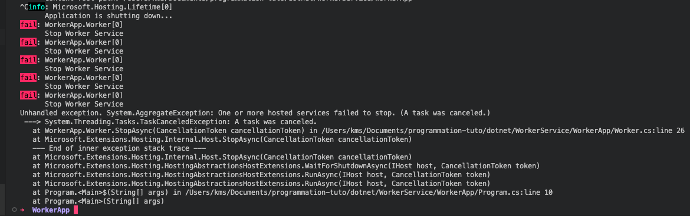
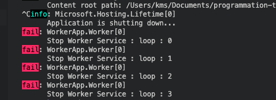

# 01 Présentation des `Worker Services`

Video `Youtube` de `Shiv Kumar`

https://www.youtube.com/watch?v=M3qS73D-Vuc&t=1295s&ab_channel=ShivKumar

On les appelle aussi `Background Services` ou `Background Workers`.


## `Hosted Services`

Ona une application qui héberge un ou plusieurs services.

L'application contrôle le `cycle de vie` (`life cycle`) des services, contrôle leurs initialisations et permet une `extinction` (`shut down`) élégante des services.

L'application offre aux `services` la possibilité de `Dispose` les `resources`.


## `IHost`

`IHost` comme `IWebHost` est une abstraction de programme, mais sans la partie `Web`.

On a accès aux différents mécanismes de `Dependency Injection`, `Configuration` et `Logging` mais sans les outils `HTTP` et `Web`.

Par exemple `WebApplication` implémente `IHost` dans une `minimal api`.

```cs
IHost host = Host.CreateDefaultBuilder(args)
    .ConfigureServices(services =>
    {
        services.AddHostedService<Worker>();
    })
    .Build();

await host.RunAsync();
```

On voit qu'un service hébergé (`Hosted service`) `Worker` est ajouté.


## `BackgroundService`

```cs
public class Worker : BackgroundService
```

`BackgroundService` est une classe abstraite fournissant trois méthodes pour gérer le cycle de vie du service :

- `StartAsync` => `virtual` peut être modifié par une classe dérivée avec `override`
- `StopAsync` => `virtual`
- `ExecuteAsync` => `abstract` une méthode `abstract` est implicitement `virtual`, il n'y a pas d'implémentation.

> une classe `abstract` doit fournir une implémentation 


## `StartAsync` et `ExecuteAsync`

`ExecuteAsync` est lancé dans `base.StartAsync`.

Si on ne joue pas ce code le contenu de `ExecuteAsync` n'est pas exécuté :

```cs
public override Task StartAsync(CancellationToken cancellationToken)
{
    _logger.LogWarning("Start Worker");
    // return base.StartAsync(cancellationToken);
    return Task.CompletedTask;
}

protected override async Task ExecuteAsync(CancellationToken stoppingToken)
{
    for(int i = 0; i < 4; i++)
    {
        _logger.LogError($"Worker running loop:{i}");
        await Task.Delay(1000, stoppingToken);
    }
}
```



On voit que `ExecuteAsync` n'est jamais appelé.

```cs
public override Task StartAsync(CancellationToken cancellationToken)
{
    _logger.LogWarning("Start Worker");
    return base.StartAsync(cancellationToken);
}
```



Cette fois `ExecuteAsync` est bien appelé.


## `StopAsync`

L'application attend une durée de temps limité son extinction (`shut down`) de `5 secondes`.

Cela a pour conséquence que quelque soit la tâche de `StopAsync`, son exécution ne peut durer plus de `5s`.

Ce `timeout` ne paraît pas facile à modifier :

```cs
public override async Task StopAsync(CancellationToken cancellationToken)
{
    while(!cancellationToken.IsCancellationRequested)
    {
        _logger.LogError("Stop Worker Service");
        await Task.Delay(1000, cancellationToken);
    }
}
```



On voit que le `logger` a été appelé `5` fois (c'est à dire `5s`).

Comme l'exécution de `StopAsync` n'était pas terminée on a une levée d'erreur.

Si mon traitement est inférieur à `5s` aucune exception n'est levée :

```cs
public override async Task StopAsync(CancellationToken cancellationToken)
{
    // while(!cancellationToken.IsCancellationRequested)
    for(int i = 0;i < 4; i++)
    {
        _logger.LogError($"Stop Worker Service : loop : {i}");
        await Task.Delay(1000, cancellationToken);
    } // traitement inférieur à 5 secondes
}
```

 