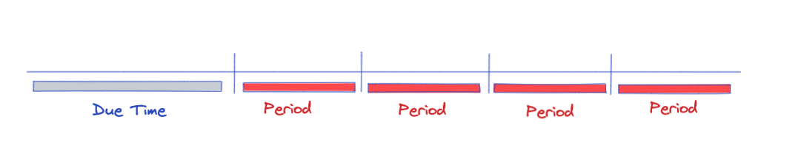

# 02 création de son propre service

## `TimerWorkerService`

```cs
public class TimerWorkerService : IHostedService, IDisposable
{
    private readonly Logger<TimerWorkerService> _logger;
    private Timer? _timer;
    
    public TimerWorkerService(ILogger<TimerWorkerService> logger)
    {
        _logger = logger
    }
    
    public Task StartAsync(CancellationToken cancellationToken)
    {
        _timer = new Timer(OnTimer, cancellationToken, TimeSpan.FromSeconds(2), TimeSpan.FromSeconds(5));
        return Task.CompletedTask;
    }

    private void OnTimer(object? state)
    {
        _logger.LogInformation("OnTimer event call");
    }

    public Task StopAsync(CancellationToken cancellationToken)
    {
        _logger.LogInformation("StopAsync event call");

        return Task.CompletedTask;
    }

    public void Dispose()
    {
        _logger.LogInformation("Dispose event call");
    }
}
```

`IHostedService` n'implémente que deux méthode `StartAsync` et `StopAsync`.

Ces méthodes sont appelées par le `Host` (l'application principale `main app`).

`System.Threading.Timer` est `thread safe`.


### `Timer`

`Timer.Timer(TimerCallback callback, object? state, TimeSpan dueTime, TimeSpan period)`

`dueTime` le temps avant que `callback` se lance.

`period` le temps entre deux exécution de `callback`




### `BackgroundService`

`ExecuteAsync` est lui existe pour les `BackgroundService` est est appelé depuis `StartAsync`.

```cs
public abstract class BackgroundService : IHostedService, IDisposable
{
    protected BackgroundService();

    public virtual Task ExecuteTask { get; }
    public virtual void Dispose();

    public virtual Task StartAsync(CancellationToken cancellationToken);
    public virtual Task StopAsync(CancellationToken cancellationToken);
    
    protected abstract Task ExecuteAsync(CancellationToken stoppingToken);
}
```

