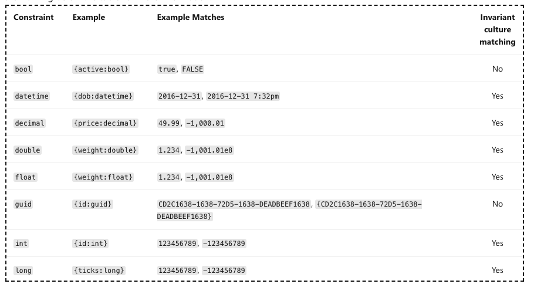

# 02 Le `Routing`

On a des fichiers `.razor` : dédié aux composants `razor`.

### `_Imports.razor`

```cs
@using System.Net.Http
@using Microsoft.AspNetCore.Authorization
@using Microsoft.AspNetCore.Components.Authorization
@using Microsoft.AspNetCore.Components.Forms
@using Microsoft.AspNetCore.Components.Routing
@using Microsoft.AspNetCore.Components.Web
@using Microsoft.AspNetCore.Components.Web.Virtualization
@using Microsoft.JSInterop
@using MyApp
@using MyApp.Shared
```

C'est dans ce fichier qu'on définit les `@using`.

Dans les fichiers `.razor`, les instructions `C#` commencent par un `@`.

Cela rend tous les composants importés dans ce fichier disponnible pour les autres fichiers `.razor` sans que ceci n'utilisent de `@using`.

### `_Host.cshtml`

Les `.cshtml` sont des fichiers mélangeant `HTML` et code `c#`, ce sont des pages `razor` classiques.

Il se trouve dans le dossier `Pages`.

C'est le fichier par défaut vu dans `Startup.cs`.

```cs
@page "/"
@namespace MyApp.Pages
@addTagHelper *, Microsoft.AspNetCore.Mvc.TagHelpers
@{
    Layout = null; // pas de layout explicitement spécifié
}
```

`@page "/"` route de la page.

`@{ ... }` permet d'écrire du `c#` sur plusieurs lignes.

```html
<script src="_framework/blazor.server.js"></script>
```

Script utilisé par `Blazor` pour faire les appels à `signalR` et récupérer les morceaux de `html` requis.

```html
<div id="blazor-error-ui">
  <environment include="Staging,Production">
    An error has occurred. This application may no longer respond until reloaded.
  </environment>
  <environment include="Development">
    An unhandled exception has occurred. See browser dev tools for details.
  </environment>
  <a href="" class="reload">Reload</a>
  <a class="dismiss">🗙</a>
</div>
```

Affiche un `pop-up` en cas de déconnexion.

```cs
<component type="typeof(App)" render-mode="ServerPrerendered" />
```

Permet de rendre un composant `razor` ici `App`. Tous les composant sont contenus dans une classe ici `App`.

plusieurs mode de rendue `render-mode`. Ici `ServerPrerendered` est la valeur la plus performante.


## `App.razor`

Ce composant ne contient que le **routeur**.

```html
<Router AppAssembly="@typeof(Program).Assembly" PreferExactMatches="@true">
    <Found Context="routeData">
        <RouteView RouteData="@routeData" DefaultLayout="@typeof(MainLayout)" />
    </Found>
    <NotFound>
        <LayoutView Layout="@typeof(MainLayout)">
            <p>Sorry, there's nothing at this address.</p>
        </LayoutView>
    </NotFound>
</Router>
```

`AppAssembly` référence les `Assembly` où sont contenus les différents composant `razor`. Ici il n'y a qu'un seul projet donc tous les composant se trouve dans `@typeof(Program).Assembly`.

On passe `Program` car on est sûr que cette classe est bien présente => l'`assembly` qui contient la classe `Program`.

On a ensuite deux balises enfants `Found` et `NotFound`, la route est soit trouvée, soit pas trouvée.

`@routeData` ce sont les données récupérées du `context` et passées à la `RouteView`.

C'est ensuite le `DefaultLayout` qui est renseigné ici `MainLayout`.


## Le `Layout`

Il est contenu dans le dossier `Shared`. Ce dossier est partagé par tous les composants.

Il est référencé dans `_Imports.razor` :

```cs
// ...
@using MyApp.Shared
```

`MainLayout.razor`

```csharp
@inherits LayoutComponentBase

<div class="page">
    <div class="sidebar">
        <NavMenu />
    </div>

    <div class="main">
        <div class="top-row px-4">
            <a href="https://docs.microsoft.com/aspnet/" target="_blank">About</a>
        </div>

        <div class="content px-4">
            @Body
        </div>
    </div>
</div>
```

`NavMenu` est un composant `razor`.

J'ai accès à `@Body` grâce à l'héritage de `LayoutComponentBase`.


## Le composant `NavMenu`

```cs
<div class="top-row pl-4 navbar navbar-dark">
    <a class="navbar-brand" href="">MyApp</a>
    <button class="navbar-toggler" @onclick="ToggleNavMenu">
        <span class="navbar-toggler-icon"></span>
    </button>
</div>

<div class="@NavMenuCssClass" @onclick="ToggleNavMenu">
    <ul class="nav flex-column">
        <li class="nav-item px-3">
            <NavLink class="nav-link" href="" Match="NavLinkMatch.All">
                <span class="oi oi-home" aria-hidden="true"></span> Home
            </NavLink>
        </li>
        <!-- ... -->
    </ul>
</div>

@code {
    private bool collapseNavMenu = true;

    private string NavMenuCssClass => collapseNavMenu ? "collapse" : null;

    private void ToggleNavMenu()
    {
        collapseNavMenu = !collapseNavMenu;
    }
}
```

`NavLink` est un composant de `blazor` utilisant `href` pour le routage :

```html
<NavLink class="nav-link" href="counter">
  <span class="oi oi-plus" aria-hidden="true"></span> Counter
</NavLink>
```


## La page `Counter`

```cs
@page "/counter"

<h1>Counter</h1>

<p>Current count: @currentCount</p>

<button class="btn btn-primary" @onclick="IncrementCount">Click me</button>

@code {
    private int currentCount = 0;

    private void IncrementCount()
    {
        currentCount++;
    }
}
```

`@page "/counter"` indique à `blazor` que cette page est attendu à cette `url`.

C'est en fait cette page qui va remplacer le marqueur `@Body` du fichier `MainLayout.razor`.


## paramètre de `Route`

On va passer la valeur de départ du compteur à l'`URL` :

`/counter/7` par exemple.

```csharp
@page "/counter"
@page "/counter/{value}"

  <p>@currentCount</p>

  <button @onclick="IncrementCount">Click Me</button>

@code {
  private int currentCount = 0;
    
  [Parameter]
  public int Value { get; set; } 

  private void IncrementCount()
  {
    currentCount++;
  }
}    
```

On défini deux routage possible, tout simplement `@page "/counter"` à l'`url` `/counter` et aussi `@page "/counter/{value}"` à l'`url` `/counter/67` où `value` est égal à `67`.

#### ! Une page peut avoir plusieurs directive `@page`

Ensuite pour récupérer ce paramètre de route, on utilise l'attribut `[Parameter]`.

#### ! Par défaut un paramètre d'`url` est de type `string`, si on veut un `int` il faut le préciser : `@page "/counter/{value:int}"`.

On appelle `:int` une contrainte de route.

Il existe beaucoup de contraintes de route :

https://docs.microsoft.com/en-us/aspnet/core/blazor/fundamentals/routing?view=aspnetcore-5.0




## Séparation `Vue` et `Code`

Ici le `code` et la `vue` sont dans le même fichier. On peut vouloir séparer ces deux éléments dans deux fichiers distincts.

Dans `Blazor`, un composant est en fait une classe qui porte le nom du composant.

### Utiliser les calsse `partial`

On peut utiliser les classes partielles de `c#`.

On va créer un fichier `counter.cs`

```cs
using Microsoft.AspNetCore.Components;

namespace blazor_mommer.Pages
{
    public partial class Counter
    {
        private int currentCount = 0;

        [Parameter]
        public int Value { get; set; }

        private void IncrementCount()
        {
            if (Value != 0)
            {
                currentCount += Value;
            }
            else
            {
                currentCount++;
            }
        }
    }
}
```

Et notre fichier `Counter.razor` :

```html
@page "/counter"
@page "/counter/{value:int}"

<h1>Counter</h1>

<p>Current count: @currentCount</p>

<button class="btn btn-primary" @onclick="IncrementCount">Click me</button>
```

Qui se simplifie en retirant la partie `@code { ... }`.

### Utiliser l'héritage

On peut aussi créer une classe `CounterBase` qui hérite de `ComponentBase`.

```cs
using Microsoft.AspNetCore.Components;

namespace blazor_mommer.Pages
{
    public class CounterBase : ComponentBase
    {
        protected int currentCount = 0;

        [Parameter]
        public int Value { get; set; }

        protected void IncrementCount()
        {
            if (Value != 0)
            {
                currentCount += Value;
            }
            else
            {
                currentCount++;
            }
        }
    }
}
```

Je passe ce qui était `private` en `protected`.

Il faut dire à sa `page` de quelle classe elle hérite grâce à la directive `@inherits` qui remplace les deux points `:` en `c#` classique.

```html
@page "/counter"
@page "/counter/{value:int}"
@inherits CounterBase

<h1>Counter</h1>

<p>Current count: @currentCount</p>

<button class="btn btn-primary" @onclick="IncrementCount">Click me</button>
```

Cette façon permet de conserver `private` pour des détails d'implémentation de la logique sans que la `vue` n'y ait accès.


## Exercice le nombre magique

Deviner un nombre entre 0 et born Max

### Pour faire de l'aléatoire : `new Random()`

La classe `Random` nous permet d'instancier un générateur de nombre aléatoire

```cs
var rand = new Random();
int nb = rand.Next(20) // entre 0 et 20 [0, 20[
```


### Initialiser les données de départ : `OnInitialized()`

On va utiliser l'`override` de la méthode `OnInitialized` :

```cs
protected override void OnInitialized()
{
    IsWin = null;
    MagicNum = rand.Next(21);
    InputNum = 0;
    Lives = 5;
}
```


### `Binding` : `<input @bind="value">`

```cs
<p><input @bind="InputNum"></p>
```


### Solution

```cs
@page "/MagicNumber"

@if (IsWin.HasValue)
{
    if (IsWin == true)
    {
        <h1>You win the number is @MagicNum 🥳</h1>
    }
    else
    {
        <h1>You loose the game 😭</h1>
    }
    <button @onclick="StartGame">Try Again</button>
}
else
{
    <h1>Choose a number between 0 and 20 includes</h1>
    <p><input @bind="InputNum"></p>

    <p><button @onclick="CheckNum">Check your entry</button></p>
    <p>
    @for (int i = 0; i < Lives; i++)
        {
            <span>💙</span>
        }
    </p>
}

@code {
    public bool? IsWin { get; set; }

    private static Random rand = new Random();
    public int MagicNum { get; set; }
    public int InputNum { get; set; }
    public int Lives { get; set; }

    public void CheckNum()
    {
        if (InputNum == MagicNum)
        {
            IsWin = true;
        }
        else
        {
            Lives--;

            if (Lives == 0)
            {
                IsWin = false;
            }
        }
    }

    protected override void OnInitialized()
    {
        StartGame();
        base.OnInitialized();
    }

    private void StartGame()
    {
        IsWin = null;
        MagicNum = rand.Next(21);
        InputNum = 0;
        Lives = 5;
    }
}
```


