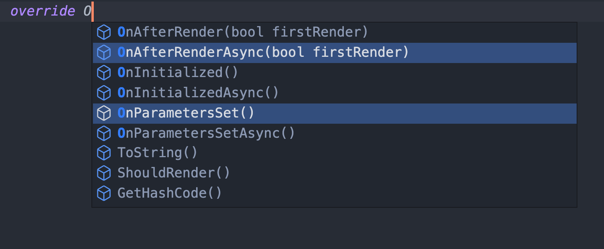
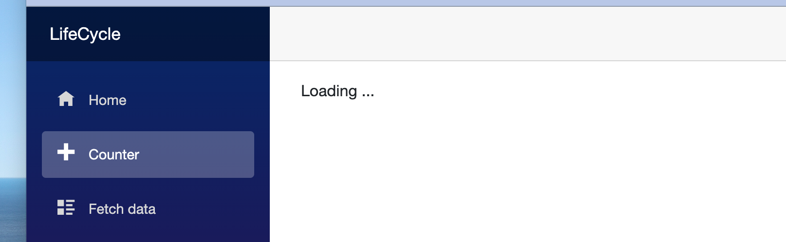
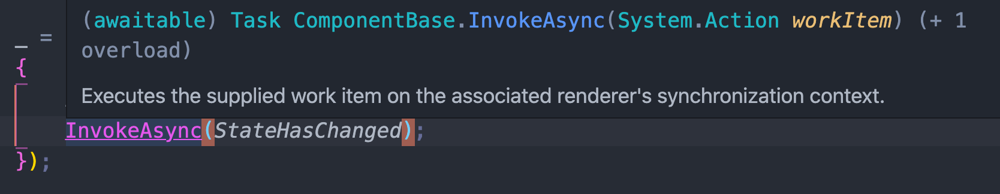

# 03 Le cycle de vie

Lorsqu'on hérite de `ComponentBase` on obtient des méthodes correspondants au cycle de vie.

Si on tape `override` dans `VSCode` on obtient ces méthodes de cycle de vie :



On voit que chaque méthode possède une version `async`.

Dans un premier temps privilégier les méthodes synchrones.


## `OnInitialized`

Il existe une version asynchrone de cette méthode : `OnInitializedAsync`.

Cette méthode débute le cycle de vie du composant.

Cette méthode n'est exécutée qu'une seule et unique fois.

C'est ici qu'on va effectuer nos requêtes `HTTP` et afficher un `loader`.

C'est le meilleur endroit pour commencer à charger de la donnée.

### Simuler un chargement de données

On va utiliser `Task.Delay` pour simuler un chargement :

```cs
public class CounterBase : ComponentBase
{
  protected bool Loading { get; private set; }
  
  protected override void OnInitialized()
  {
    Loading = true;
    
    _ = Task.Delay(5000).ContinueWith(_ => { Loading = false; });
    
    base.OnInitialized();
  }
}
```



`Loading` n'est jamais passé à `false` car le `thread graphic` n'est pas au courant du `thread` lancé par `Task`.

### `StateHasChanged`

On doit dire à `Blazor` de rafraîchir ses objets graphiques lorsque les données (le `state`) ont changées : `StateHasChanged`.

```cs
protected override void OnInitialized()
{
  Loading = true;

  _ = Task.Delay(5000).ContinueWith(_ =>
                                    {
                                      Loading = false;
                                      StateHasChanged();
                                    });

  base.OnInitialized();
}
```

Le `StateHasChanged` est exécuté sur un `thread` qui n'est pas le `thread graphic`, cela ne fonctionne toujours pas.

On doit utiliser une méthode invocation : `InvokeAsync`.

```cs
_ = Task.Delay(5000).ContinueWith(_ =>
                                  {
                                    Loading = false;
                                    InvokeAsync(StateHasChanged);
                                  });
```



`InvokeAsync` va exécuter `StateHasChanged` dur le `thread graphic`.

Maintenant cela fonctionne.


## `OnParameterSet`

