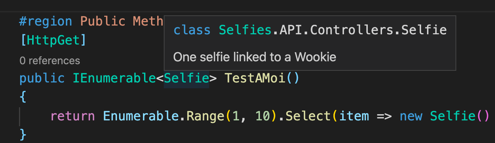
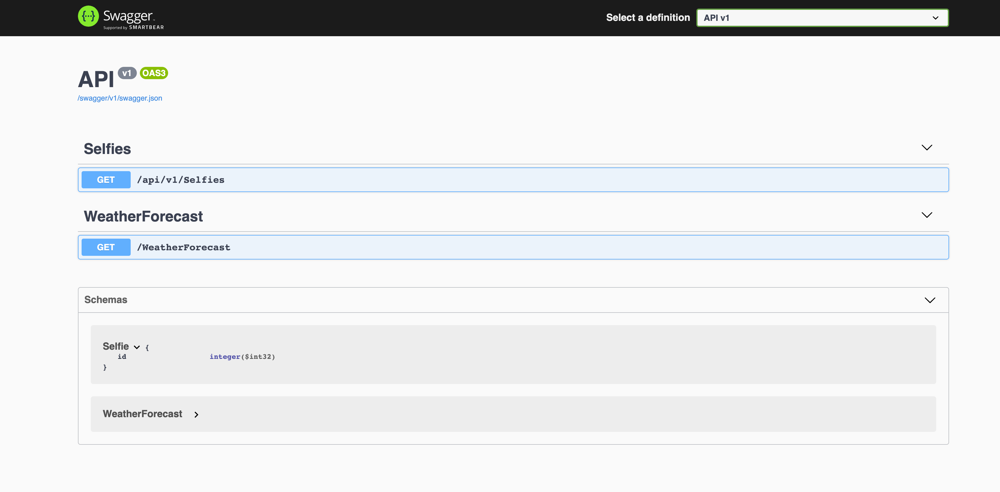
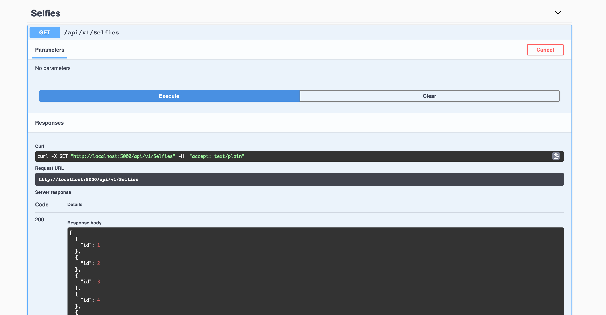
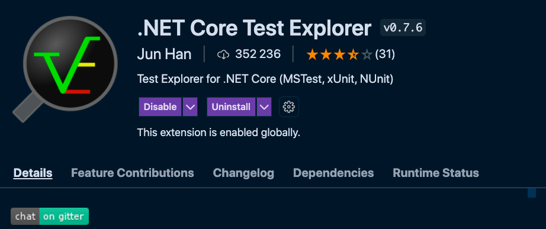
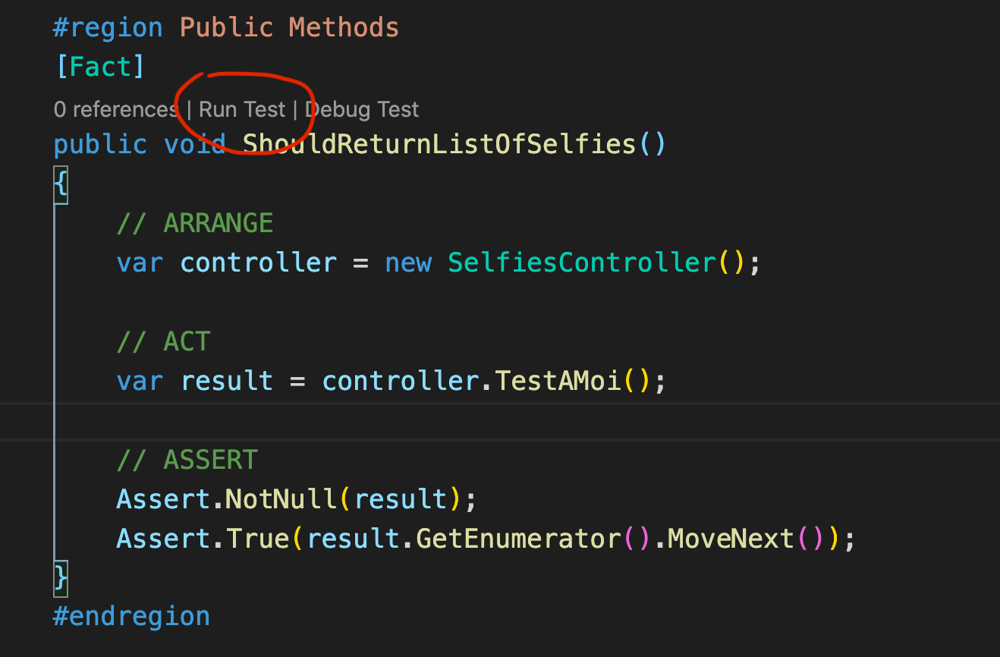

# 01 Controller

C'est un écouteur de requête `HTTP`.

Un contrôleur va encadrer une route particulière et repondre avec ses méthodes suivant le verbe `HTTP` et/ou les paramètres reçus

## Terminal : commandes utiles

Afficher toutes les variables d'environnement

```bash
env
```

Afficher l'historique des commandes

```bash
history
```


## Bootstrap du projet 

```bash
mkdir SelfieAWookie
```

Création du fichier de solution

```bash
dotnet new sln
```

Création d'une `webapi`

```bash
dotnet new webapi -o API 
```

Ajout à la solution

```bash
dotnet sln add API/
```

Liste des projets dans la solution

```bash
dotnet sln list 

Projet(s)
---------
API/API.csproj
```

Lancer l'application en mode `watch`

```bash
dotnet watch run --project API/
```


## Anatomie

Il hérite de `ControllerBase`.

À chaque requête, un nouveau contrôleur est instancié = `stateless`.

Chaque requête est traitée dans un contexte qui lui est propre.

`1000` requête = `1000` instanciation du contrôleur.

```csharp
public class WeatherForecastController : ControllerBase
{

  // ...

  public WeatherForecastController(ILogger<WeatherForecastController> logger)
  {
    _logger = logger;
    Console.WriteLine("instance of controller");
  }
```

```bash
info: Microsoft.Hosting.Lifetime[0]
      Content root path: /Users/kms/Documents/programmation/rest-api-evan-boissonnot/API
instance of controller
instance of controller
instance of controller
instance of controller
instance of controller
instance of controller
instance of controller
instance of controller
instance of controller

instance of controller
```

À chaque fois qu'une nouvelle requête est envoyée, le contrôleur est instancié de nouveau => `stateless`.

## les attributs

Ils permettent d'ajouter de manière déclarative des meta-données au code.

On appelle l'utilisation d'`attribut` :  `programmation par aspect`

> **wikibooks**
>
> Le rôle d'un attribut est d'associer des informations, des méta-données à une déclaration. Ces données peuvent être utilisées par le compilateur, ou le Framework .NET, ou par l'application elle-même.

### Sur la classe `controller`

`[ApiController]`

Applique des consignes strictes de comportement d'api sur la classe `controller` :

- [Exigence du routage d’attribut](https://docs.microsoft.com/fr-fr/aspnet/core/web-api/?view=aspnetcore-5.0#attribute-routing-requirement)
- [Réponses HTTP 400 automatiques](https://docs.microsoft.com/fr-fr/aspnet/core/web-api/?view=aspnetcore-5.0#automatic-http-400-responses)
- [Inférence de paramètre de source de liaison](https://docs.microsoft.com/fr-fr/aspnet/core/web-api/?view=aspnetcore-5.0#binding-source-parameter-inference)
- [Inférence de demande multipart/form-data](https://docs.microsoft.com/fr-fr/aspnet/core/web-api/?view=aspnetcore-5.0#multipartform-data-request-inference)
- [Fonctionnalité Détails du problème pour les codes d’état erreur](https://docs.microsoft.com/fr-fr/aspnet/core/web-api/?view=aspnetcore-5.0#problem-details-for-error-status-codes)

 `[Route("[controller]")]`

Défini le nom de la route, ici du même nom que le `controller` (`MonEndPointController` => `MonEndPoint`).


### Sur les méthodes du `controller`

`[HttpGet]`  défini le verbe `HTTP` censé exécuter cette méthode.


## Créer un `controller` : `SelfiesController.cs`

### Utilisation de `aspnet-codegenerator`

Installer `aspnet-codegenerator` et les `templates`

```bash
dotnet tool install -g dotnet-aspnet-codegenerator

# les templates :
dotnet add package Microsoft.VisualStudio.Web.CodeGeneration.Design
```

Créer un `controller`

```bash
dotnet aspnet-codegenerator -p API/ controller -api -name SelfiesController --relativeFolderPath Controllers -namespace Selfies.API.Controllers
```

`-p` spécifie le projet

`-api` crée un `controller` d'`api` (hérite de `ControllerBase` et `attribute` spécifiques)

`-name` nom du contrôleur

`--relativeFolderPath` chemin relatif

`-namespace` spécifie le `namespace`

```c#
using System;
using System.Collections.Generic;
using System.Linq;
using System.Threading.Tasks;
using Microsoft.AspNetCore.Http;
using Microsoft.AspNetCore.Mvc;

namespace Selfies.API.Controllers
{
    [Route("api/[controller]")]
    [ApiController]
    public class SelfiesController : ControllerBase
    {
    }
}
```

On ajoute un versionning à son `api` :

```c#
[Route("api/v1/[controller]")]
```

On va créer une classe `Selfie` très simple, bien penser à la mettre dans le même espace de nom que le `controller`.

`API/Selfie.cs`

```c#
namespace Selfies.API.Controllers
{
    /// <summary>
    /// One selfie linked to a Wookie
    /// </summary>

    public class Selfie
    {
        #region Properties
        public int Id { get; set; }
        #endregion
    }
}
```

`///` avec le plugin `vscode` : `C# XML documentation comments` permet de générer la documentation.



`API/Controllers/SelfieController.cs`

```c#
using System;
using System.Collections.Generic;
using System.Linq;
using System.Threading.Tasks;
using Microsoft.AspNetCore.Http;
using Microsoft.AspNetCore.Mvc;

namespace Selfies.API.Controllers
{
    [Route("api/v1/[controller]")]
    [ApiController]
    public class SelfiesController : ControllerBase
    {
        #region Public Methods
        [HttpGet]
        public IEnumerable<Selfie> TestAMoi()
        {
            return Enumerable.Range(1, 10).Select(item => new Selfie() { Id = item });
        }
        #endregion
    }
}
```

On remarque que le nom de la méthode n'a pas d'immportance.


## `Swagger`

Le `Swagger` intégré permet de tester son `api` très simplement :






## `TDD` Test Driven Development

Le test devient le protecteur de notre conception.

### Ajouter un projet de tests `xUnit`

Dans un dossier `Test`, créer un projet `TestWebApi`.

```bash
# créer un dossier Test
mkdir Test
cd Test

# Créer un projet TestWebApi
dotnet new xunit -o TestWebApi

# Se remettre au niveau de la solution
cd ../

# Ajouter le TestWebApi à la solution
dotnet sln add ./Test/TestWebApi/

# Ajouter une référence de /API dans /TestWebApi
dotnet add ./Test/TestWebApi/ reference ./API
```

Du coup dans `Test/TestWebApi/TestWebApi.csproj`

```c#
<Project Sdk="Microsoft.NET.Sdk">

  <PropertyGroup>
    <TargetFramework>net5.0</TargetFramework>

    <IsPackable>false</IsPackable>
  </PropertyGroup>

  // ...

  <ItemGroup>
    <ProjectReference Include="..\..\API\API.csproj" />
  </ItemGroup>

</Project>
```

On peut contrôler l'ajout de la référence vers `API.csproj`.

Dans `TestWebApi` on crée un fichier `SelfieControllerUnitTest.cs`

```csharp
using System;
using Xunit;

namespace TestWebApi
{
    public class SelfieControllerUnitTest
    {
        [Fact]
        public void Test1()
        {

        }
    }
}
```


## Un test unitaire `ShouldReturnListOfSelfies`

Méthode `3A`

- `ARRANGE` préparer les jeux de données
- `ACT` action que l'on va faire
- `ASSERT` prouver que c'est vrai

```csharp
#region Public Methods
  [Fact]
  public void ShouldReturnListOfSelfies()
{
  // ARRANGE
  var controller = new SelfiesController();

  // ACT
  var result = controller.TestAMoi();

  // ASSERT
  Assert.NotNull(result);
  Assert.True(result.GetEnumerator().MoveNext());
}
#endregion
```

#### ! Parfois `omnisharp` ne fonctionne plus, il faut fermer et relancer `VSCode`.

> ## Solution
>
> Installer une extension pour lancer les tests :
>
> `.Net Core Test Explorer`
>
> 
>
> ou plus simple en ligne de commande :
>
> ```bash
> dotnet test
> ```
>
> 

Si `omnisharp` fonctionne, c'est hyper facile de lancer les tests :



```bash
# Dans l'onglet OUTPUT du terminal
----- Test Execution Summary -----

TestWebApi.SelfieControllerUnitTest.ShouldReturnListOfSelfies:
    Outcome: Passed
    
Total tests: 1. Passed: 1. Failed: 0. Skipped: 0
```

Si on demande à notre `controller` de renvoyer plutôt `null` :

```csharp
public IEnumerable<Selfie> TestAMoi()
{
  return null;
  //return Enumerable.Range(1, 10).Select(item => new Selfie() { Id = item });
}
```

On obtient aux tests :

```bash
----- Test Execution Summary -----

TestWebApi.SelfieControllerUnitTest.ShouldReturnListOfSelfies:
    Outcome: Failed
    Error Message:
    Assert.NotNull() Failure
    Stack Trace:
       at TestWebApi.SelfieControllerUnitTest.ShouldReturnListOfSelfies() in /Users/kms/Documents/programmation/rest-api-evan-boissonnot/Test/TestWebApi/SelfieControllerUnitTest.cs:line 22
    
Total tests: 1. Passed: 0. Failed: 1. Skipped: 0
```


