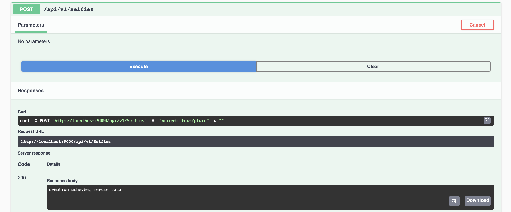
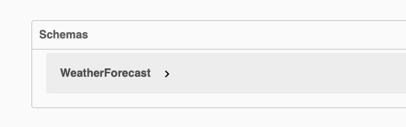
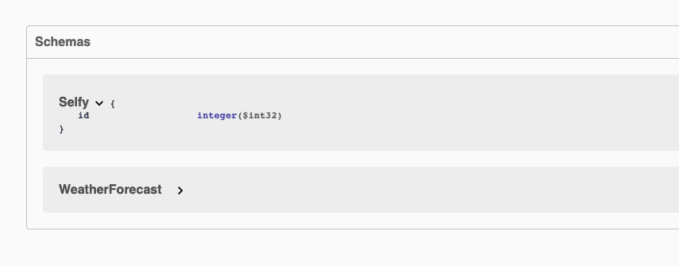
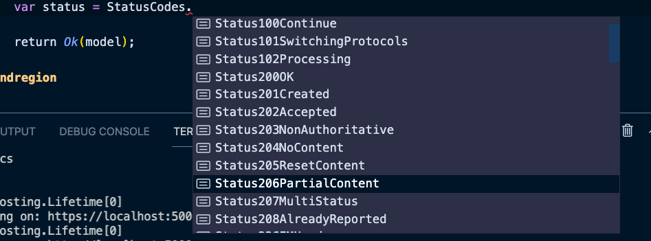
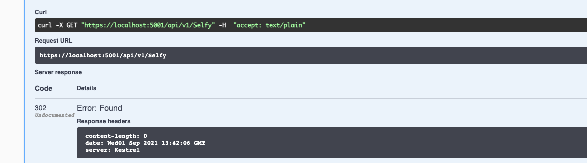
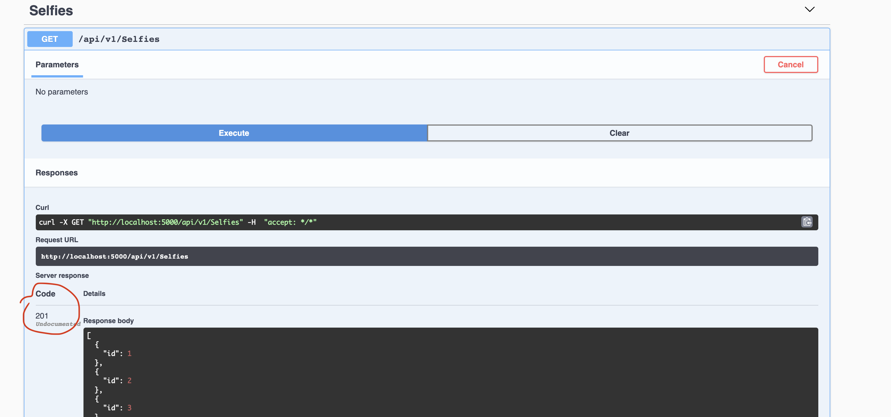
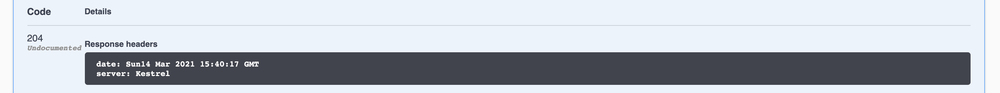

# 02 Le Modèle

Le modèle est le résultat d'une action :

`action`: Je veux la liste des selfies à Wookie => `model` : la liste des selfies

`action` : Je veux un wookie => `model`: Un wookie


## Renvoyer un status personnalisé

Le contrôleur par défaut renvoie un `status` que l'on peut observer dans `Swagger` :



Par exemple ici on voudrait avoir un `201`.

### Refactor de notre méthode avec `IActionResult`

```cs
public IActionResult GetSelfies()
{
    var model = Enumerable.Range(1, 10).Select(item => new Selfy { Id = item });

    return Ok(model);
}
```

On a la méthode `Ok` qui retourne un `OkObjectResult` qui lui même hérite de `IActionResult` :

```cs
public class OkObjectResult : ObjectResult 
```

et

```cs
public class ObjectResult : ActionResult, IStatusCodeActionResult, IActionResult
```

Il produit un `StatusCodes.Status200OK`.

On peut observer que dans `Swagger` le schémas de notre `Selfy` a disparu :



Il faut plutôt utiliser le type de retour `ActionResult<MonType>` :

```cs
public ActionResult<IEnumerable<Selfy>> GetSelfies()
```




### `StatusCodes`

On peut produire le `status code ` que l'on souhaite en utilisant `StatusCodes.{...}`



On peut même renvoyer directement un `StatusCodes` :

```cs
[HttpGet]
public ActionResult<IEnumerable<Selfy>> GetSelfies()
{
    var model = Enumerable.Range(1, 10).Select(item => new Selfy { Id = item });
    var status = StatusCodes.Status302Found;

    return StatusCode(status);
}
```

On a `StatusCodes` avec `s` pour la liste de tous les `status codes` et `StatusCode` sans `s` pour renvoyer un `StatusCodeResult`.




```csharp
[HttpGet]
public IActionResult TestAMoi()
{
    var model = Enumerable.Range(1, 10).Select(item => new Selfie() { Id = item });

    Response.StatusCode = StatusCodes.Status201Created;

    return new JsonResult(model);
}
```
ou encore

```cs
public ActionResult<IEnumerable<Selfy>> GetSelfies()
{
    var model = Enumerable.Range(1, 10).Select(item => new Selfy { Id = item });

    return new JsonResult(model) { StatusCode = StatusCodes.Status207MultiStatus };
}
```


Grâce à `StatusCodes` on peut choisir son `status code http` :



On peut aussi retourner directement `StatusCode` car cette méthode renvoie un `StatusCodeResult` :

```csharp
public virtual StatusCodeResult StatusCode([ActionResultStatusCode] int statusCode);
```

Et `StatusCodeResult` implémente `IActionResult` :

```csharp
public class StatusCodeResult : ActionResult, IClientErrorActionResult, IStatusCodeActionResult, IActionResult
```

Un contrôleur peut renvoyer :

- Type spécifique : `String`, `IEnumerable<Post>`, `int`
- `IActionResult`
- `ActionResult<T>`

### exemple `204` : `No Content`

```csharp
[HttpGet]
public IActionResult TestAMoi()
{
  var model = Enumerable.Range(1, 10).Select(item => new Selfie() { Id = item });

  return this.StatusCode(StatusCodes.Status204NoContent);
}
```



Ce qui a du sens si l'`api` ne renvoie rien (plutôt que 404 qui est une erreur d'`url`).

On peut aussi utiliser `NoContent` :

```cs
return NoContent();
```


## Architecture

### architecture hexagonale


Création de nouveaux projets de `classlib`.

### Créer un dossier `Libs`

```bash
mkdir Libs
cd Libs
```


### Créer un projet `SelfieAWookies.Core.Selfies.Domain`

```bash
dotnet new classlib -o SelfieAWookies.Core.Selfies.Domain
```

Mettre dans le projet la classe `Selfie.cs`.

Modifier son `namespace`.

```csharp
namespace SelfieAWookies.Core.Selfies.Domain
{
    /// <summary>
    /// One selfie linked to a Wookie
    /// </summary>

    public class Selfie
    {
        #region Properties
        public int Id { get; set; }
        public string Title { get; set; }
        public string ImagePath { get; set; }
        public Wookie Wookie { get; set; }
        #endregion
    }
}
```

On ajoute une classe `Wookie.cs`

```csharp
namespace SelfieAWookies.Core.Selfies.Domain
{
    /// <summary>
    /// One Wookie AAAEUEURGHHEU
    /// </summary>
    public class Wookie
    {

    }
}
```

On va référencer notre projet `classlib` dans notre `webapi` :

```bash
dotnet add ./API/ reference ./Libs/SelfieAWookies.Core.Selfies.Domain/

Référence '..\Libs\SelfieAWookies.Core.Selfies.Domain\SelfieAWookies.Core.Selfies.Domain.csproj' ajoutée au projet.
```

Il faut aussi ajouter une clause `using` dans `SelfieController.cs` :

```csharp
using SelfieAWookies.Core.Selfies.Domain;
```

Apparement il faut aussi ajouter une référence de `SelfieAWookies.Core.Selfies.Domain` à `TestWebApi` :

```bash
dotnet add ./Test/TestWebApi/ reference ./Libs/SelfieAWookies.Core.Selfies.Domain/

Référence '..\..\Libs\SelfieAWookies.Core.Selfies.Domain\SelfieAWookies.Core.Selfies.Domain.csproj' ajoutée au projet.
```

