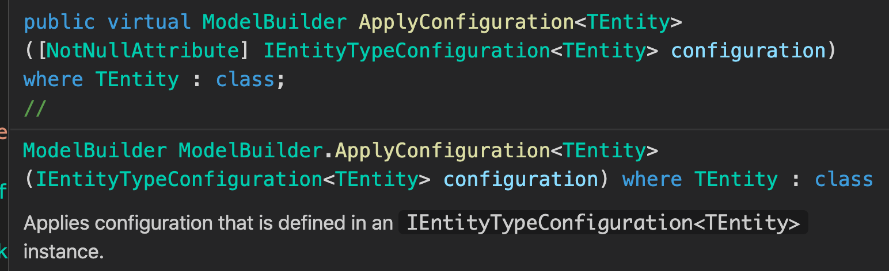
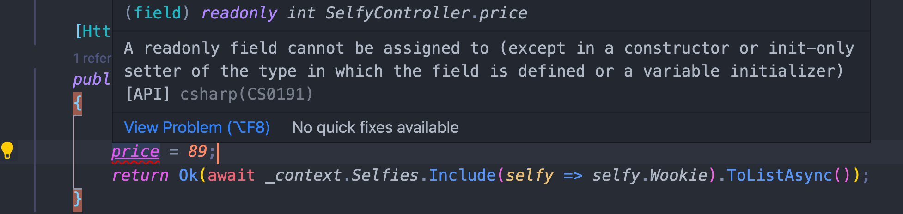
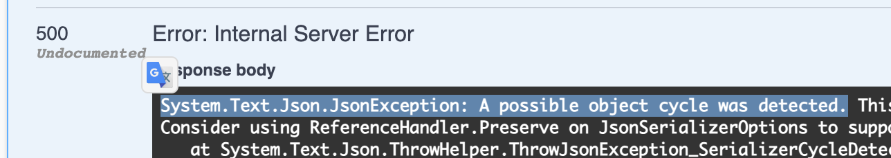
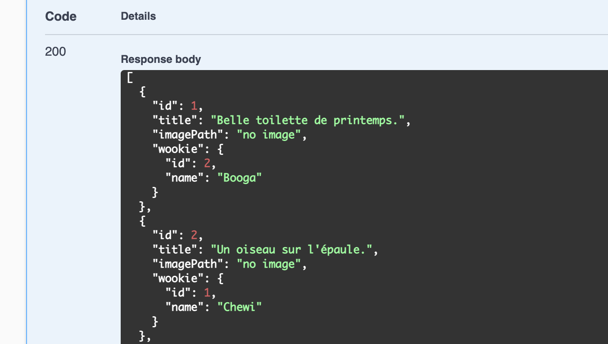
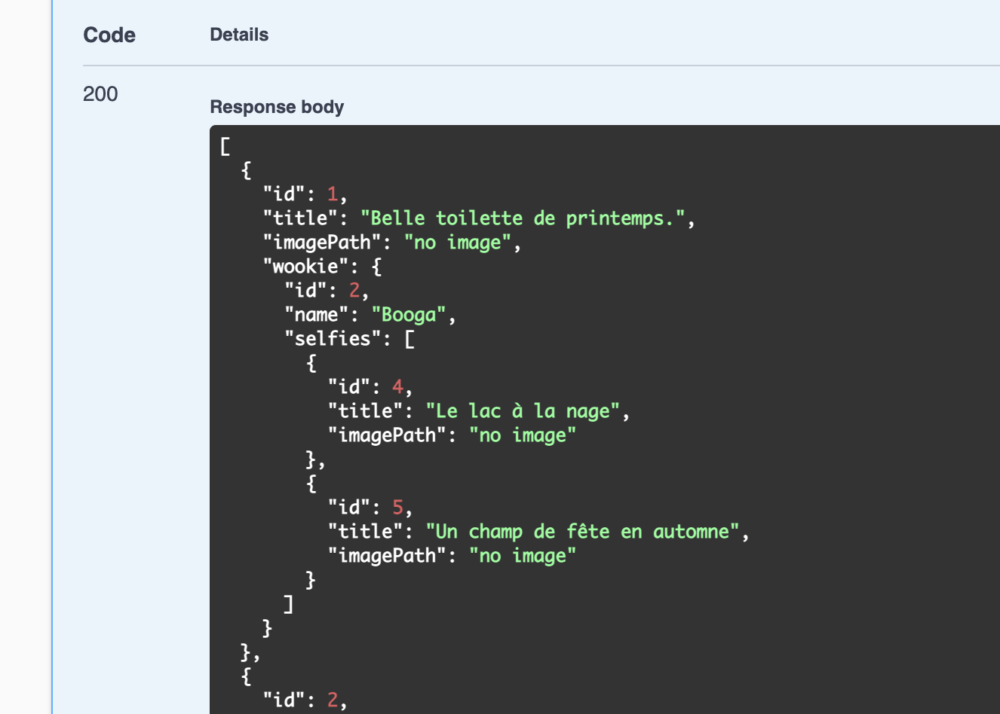
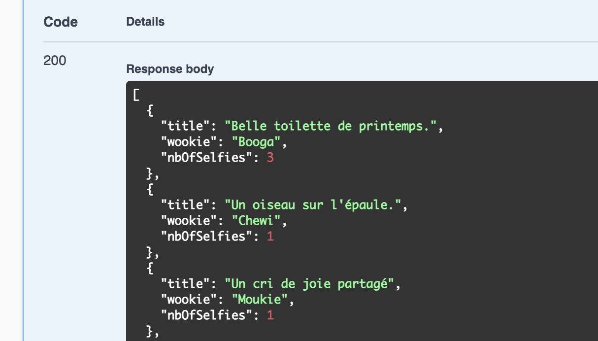

# 03 Base de Données

Notre modèle représente le `Domain`.

`Linq` permet de requêter les données.

## `ORM` Object Relationnal Mapping

Lier les objets aux bases de données.

L'`ORM` est traducteur entre le langage de programmation et le langage `SQL` de la base de données.

C'est aussi un système de `cache` (`== context`).

### Code First : `EF core`

On ajoute un nouveau projet `classlib` : `SelfieAWookies.Core.Selfies.Infrastructures`

Ajouter une référence à `API` et à la solution :

```bash
cd Libs
dotnet new classlib -o SelfieAWookies.Core.Selfies.Infrastructures
```

```bash
cd ..
dotnet add API/ reference Libs/SelfieAWookies.Core.Selfies.Infrastructures/

Référence '..\Libs\SelfieAWookies.Core.Selfies.Infrastructures\SelfieAWookies.Core.Selfies.Infrastructures.csproj' ajoutée au projet.
```

```bash
dotnet sln add Libs/SelfieAWookies.Core.Selfies.Infrastructures/

Projet 'Libs/SelfieAWookies.Core.Selfies.Infrastructures/SelfieAWookies.Core.Selfies.Infrastructures.csproj' ajouté à la solution.
```

On crée un dossier `data` dans le projet `SelfieAWookies.Core.Selfies.Infrastructures` et dedans une classe `SelfieContext.cs`.

### Ajouter `Entity Framework Core` à `SelfieAWookie.Core.Selfies.Infrastructures`

```bash
dotnet add package Microsoft.EntityFrameworkCore --version 6.0.0-preview.2.21154.2
```

On récupère cette ligne sur `Nuget.com`.

## Ajouter `Microsoft.EntityFrameworkCore.Tools`

```bash
cd ./Libs/SelfieAWookies.Core.Selfies.Infrastructures/
dotnet add package Microsoft.EntityFrameworkCore.Tools --version 5.0.4
```

Bien ajouter le `package` à `SelfieAWookies.Core.Selfies.Infrastructures`.

### `SelfieContext.cs`

C'est dans cette classe que l'on va créer nos `DbSet`, nos jeux de données en provenance de la base de données.

Pour cela il faut référencer le projet contenant ces classes : `Libs/SelfieAWookies.Core.Selfies.Domain`

```bash
kms:SelfieAWookies.Core.Selfies.Infrastructures kms$ dotnet add reference ../SelfieAWookies.Core.Selfies.Domain/

Référence '..\SelfieAWookies.Core.Selfies.Domain\SelfieAWookies.Core.Selfies.Domain.csproj' ajoutée au projet.
```


```csharp
using Microsoft.EntityFrameworkCore;
using SelfieAWookies.Core.Selfies.Domain;

namespace SelfieAWookies.Core.Selfies.Infrastructures
{
    public class SelfieContext : DbContext
    {
        #region Internal Methods
        protected override void OnModelCreating(ModelBuilder modelBuilder)
        {
            base.OnModelCreating(modelBuilder);
        }

        #endregion

        #region Properties
        public DbSet<Selfie> Selfies { get; set; }
        public DbSet<Wookie> Wookies { get; set; }
        #endregion
    }
}
```

C'est dans `OnModelCreating` qu'on va pouvoir configurer notre `ORM`.

> ## ! Il faut passer les options `DbContextOptions` au constructeur de `DbContext`
>
> ```cs
> public class SelfyContext : DbContext
> {
> 
>   public SelfyContext(DbContextOptions options) : base(options)
>   {
> 
>   }
>   // ...
> ```
>
> Car dans `Startup` ce sont elles qui définissent le `provider` :
>
> ```cs
> services.AddDbContext<SelfyContext>(options => {
>   options.UseSqlServer(
>     Configuration.GetConnectionString("SelfyConnection"),
>     sqlOptions => { }
>   );
> });
> ```

### `Type Configurations`

Dans notre `SelfieContext.cs` on va ajouter une configuration :

```csharp
modelBuilder.ApplyConfiguration()
```



En allant sur la définition de classe (`command`+ click) on récupère le nom de l'interface :

```csharp
public virtual ModelBuilder ApplyConfiguration<TEntity>([NotNullAttribute] IEntityTypeConfiguration<TEntity> configuration) where TEntity : class;
```

### `IEntityTypeConfiguration`

Dans le dossier `data` on va créer un nouveau dossier `TypeConfigurations` et à l'intérieur une classe `SelfieEntityTypeConfiguration.cs` .

Cette classe va regrouper les réglages pour lier notre base de données à notre application.

Par défaut la table en `BDD` va prendre le nom du `DbSet` ici `Selfies`, on vaudrait que la table s'appelle plutôt `Selfy` :

```cs
using Microsoft.EntityFrameworkCore;
using Microsoft.EntityFrameworkCore.Metadata.Builders;
using SelfieAWookies.Core.Selfies.Domain;

namespace SelfieAWookies.Core.Selfies.Infrastructures.data.TypeConfigurations
{
    public class SelfieEntityTypeConfiguration : IEntityTypeConfiguration<Selfie>
    {
        public void Configure(EntityTypeBuilder<Selfie> builder)
        {
            builder.ToTable("Selfy");
        }
    }
}
```

De même pour les `Wookies`

`WookieEntityTypeConfiguration.cs`

```csharp
using Microsoft.EntityFrameworkCore;
using Microsoft.EntityFrameworkCore.Metadata.Builders;
using SelfieAWookies.Core.Selfies.Domain;

namespace SelfieAWookies.Core.Selfies.Infrastructures.data.TypeConfigurations
{
    public class WookieEntityTypeConfiguration : IEntityTypeConfiguration<Wookie>
    {
        public void Configure(EntityTypeBuilder<Wookie> builder)
        {
            builder.ToTable("Wookie");
        }
    }
}
```


On la passe à `SelfieContext.cs` :

```csharp
#region Internal Methods
protected override void OnModelCreating(ModelBuilder modelBuilder)
{
  base.OnModelCreating(modelBuilder);

  modelBuilder.ApplyConfiguration(new SelfieEntityTypeConfiguration());
  modelBuilder.ApplyConfiguration(new WookieEntityTypeConfiguration());
}

#endregion
```


Cela permet de regrouper et d'externaliser les configurations => meilleur organisation du code.

On a séparer les responsabilités `context` et `configuration`.


## Type Configuration de `Selfie`

```cs
public class SelfieEntityTypeConfiguration : IEntityTypeConfiguration<Selfie>
{
  public void Configure(EntityTypeBuilder<Selfie> builder)
  {
    builder.ToTable("Selfie");

    builder.HasKey(item => item.Id);
    
    builder.HasOne(item => item.Wookie)
                    .WithMany(item => item.Selfies);
  }
}
```

`builder.ToTable`  défini le nom de la table en base de données

`builder.HasKey` définie la propriété qui sera la clé primaire en base de données.

> #### ! Préférer les conventions aux configurations.

### Relation `1 -> many`

```csharp
builder.HasOne(item => item.Wookie)
  			.WithMany(item => item.Selfies);
```

Il faut ajouter la propriété `Selfies` au `model` : `Wookie` :

```cs
public class Wookie
{
    public int Id { get; set; }
    public IEnumerable<Selfy> Selfies { get; set; }
}
```

On aurait aussi pu ajouter simplement une `WookieId`  dans `Selfy` pour ne pas avoir à écrire ce code (par `convention`).

`EF Core` utilise des conventions de nom pour faire les liens.


## Provider

L'`ORM` va avoir besoin d'un `provider` pour savoir dans quelle langue parler à la `BDD`.

Chaque `BDD` a son propre `SQL`.


## Branchement dans `Startup`

On va brancher notre `ORM` (notre `context`) avec le `provider` pour `SQL Server`.

On va brancher notre service de `BDD` dans la méthode `ConfigureServices` :

```cs
public void ConfigureServices(IServiceCollection services)
{
  services.AddDbContext<SelfyContext>(options => {
    options.UseSqlServer(Configuration.GetConnectionString("SelfyConnection"), sqlOptions => {});
  });
}
```

Le `connection string` se place dans `appsettings.json` :

```json
// ...
"ConnectionStrings": {
  "SelfyConnection": "Server=localhost,1433; Database=selfy; User=sa; Password=huk@r2Xmen99"
}
```

Dans `appsettings.json` c'est `ConnectionStrings` avec un `s` car il peut y en avoir plusieurs.

Dans `Configuration.GetConnectionString` pas d'`s` car on en récupère `un` spécifique.


## Comparaison des conventions et de la configuration

### `Migration` obtenu avec la configuration

```cs
public void Configure(Microsoft.EntityFrameworkCore.Metadata.Builders.EntityTypeBuilder<Selfy> builder)
{
  builder.ToTable("Selfy");
  builder.HasOne(item => item.Wookie)
    .WithMany(item => item.Selfies);
}
```

On obtient :

```csharp
migrationBuilder.CreateTable(
  name: "Wookie",
  columns: table => new
  {
    Id = table.Column<int>(type: "int", nullable: false)
      .Annotation("SqlServer:Identity", "1, 1")
  },
  constraints: table =>
  {
    table.PrimaryKey("PK_Wookie", x => x.Id);
  });

migrationBuilder.CreateTable(
  name: "Selfy",
  columns: table => new
  {
    Id = table.Column<int>(type: "int", nullable: false)
      .Annotation("SqlServer:Identity", "1, 1"),
    Title = table.Column<string>(type: "nvarchar(max)", nullable: true),
    ImagePath = table.Column<string>(type: "nvarchar(max)", nullable: true),
    WookieId = table.Column<int>(type: "int", nullable: true)
  },
  constraints: table =>
  {
    table.PrimaryKey("PK_Selfy", x => x.Id);
    table.ForeignKey(
      name: "FK_Selfy_Wookie_WookieId",
      column: x => x.WookieId,
      principalTable: "Wookie",
      principalColumn: "Id",
      onDelete: ReferentialAction.Restrict);
  });

migrationBuilder.CreateIndex(
  name: "IX_Selfy_WookieId",
  table: "Selfy",
  column: "WookieId");
```

### Sans configuration et sans `WookieId` dans le modèle `Selfy`

On a juste un `Wookie` dans `Selfy` et un `IEnumerable<Selfy>` dans `Wookie`.

```cs
public void Configure(Microsoft.EntityFrameworkCore.Metadata.Builders.EntityTypeBuilder<Selfy> builder)
{
  builder.ToTable("Selfy");
  // builder.HasOne(item => item.Wookie)
  //         .WithMany(item => item.Selfies);
}
```

On obtient exactement la même chose.

Il n'est donc pas nécéssaire de spécifier le `WookieId` dans `Selfy`.


## Injection du `context` dans le `controller`

On peut injecter `SelfyContext` dans le constructeur de notre `Controller `: `SelfyController` 

```cs
public class SelfyController : ControllerBase
{
	private readonly SelfyContext _context;
  
  public SelfyController(SelfyContext context)
  {
    _context = context;
  }
```

> ## `readonly`
>
> Ne peut être assigné qu'à la déclaration et/ou dans le `constructor`.
>
> ```cs
> private readonly int price = 8;
> public SelfyController(SelfyContext context)
> {
>   Console.WriteLine(price);
>   
>   price = 12;
>   Console.WriteLine(price);
> 
>   price = 45;
>   Console.WriteLine(price);
> }
> 
> [HttpGet]
> public IActionResult Get()
> {
>   Console.WriteLine(price);
>   return Ok();
> }
> ```
>
> ```bash
> 8
> 12
> 45
> 45
> ```
>
> On peut donc assigner plusieurs fois un champ en `readonly` mais seulement dans le `constructor`.
>
> Après ce n'est plus possible :
>
> 

Le `context` va être renvoyé à chaque fois que le `controller` sera instancié.

On utilise alors notre `context` dans nos `actions` :

```cs
[HttpGet]
public ActionResult<IEnumerable<Selfy>> GetSelfies() =>
    Ok(_context.Selfies.ToList());
```

> ## ! Lancer la migration
>
> Il ne faut pas oublier d'appliquer la `migration` sur la `BDD` :
>
> ```bash
>  SelfieAWookie : dotnet ef database update --project Infra -s API 
> ```
>
> Comme je suis à la racine je spécifie le projet ou se trouve la migration `--project` ainsi que le projet `startup` `-s`.
>
> Pour `database update` il n'est pas nécéssaire de spécifier le `--project`, par contre le projet `startup` est obligatoire.


## `Include(selfy => selfy.Wookie)`

Pour avoir les données du `Wookie` associé au `Selfy`, on utilise `Include` :

```cs
[HttpGet]
public ActionResult<IEnumerable<Selfy>> GetSelfies()
{
  return Ok(_context.Selfies.Include(selfy => selfy.Wookie).ToList());
}
```

On obtient une erreur de référence cyclique :



C'est normal car `Selfy` référence `Wookie` qui lui référence une collection de `Selfy`.

### `[JsonIgnore]`

On peut résoudre ce problème avec `[JsonIgnore]` :

```cs
public class Wookie
{
  public int Id { get; set; }
  public string Name { get; set; }
  [JsonIgnore]
  public IEnumerable<Selfy> Selfies { get; set; }
}
```



Mais on a plus les `Selfies` associé au `Wookie`.

Ou bien aussi avec le package `Microsoft.AspNetCore.Mvc.NewtonsoftJson` (from https://www.nuget.org/packages/Microsoft.AspNetCore.Mvc.NewtonsoftJson/ )

On ajoute le `service` à `Startup.cs`

```cs
services.AddControllers().AddNewtonsoftJson(options =>
    options.SerializerSettings.ReferenceLoopHandling = Newtonsoft.Json.ReferenceLoopHandling.Ignore
);
```

Maintenant on a une réponse plus complete :




## Retourner `IQueryable` ou `IEnumerable`

On pourrait retourner un `IQueryable` en retirant le `ToList()` :

```cs
[HttpGet]
public ActionResult<IQueryable<Selfy>> GetSelfies()
{
  return Ok(_context.Selfies.Include(selfy => selfy.Wookie));
}
```

Cela fonctionne aussi car `IQueryable<T>` implémente `IEnumerable<T>`.

### Version `async`

Ici on est obligé d'utiliser `ToListAsync` :

```cs
[HttpGet]
public async Task<ActionResult<IEnumerable<Selfy>>> GetSelfies()
{
  return Ok(await _context.Selfies.Include(selfy => selfy.Wookie).ToListAsync());
}
```


## Faire une projection avec `Select`

On peut vouloir renvoyer que certaines données, on utilise pour cela un objet anonyme `new { ... }` avec `Select` :

```cs
public async Task<ActionResult<IEnumerable<Selfy>>> GetSelfies()
{
  return Ok(await _context.Selfies.Include(selfy => selfy.Wookie).Select(item => new {
    Title = item.Title,
    Wookie = item.Wookie.Name,
    NbOfSelfies = item.Wookie.Selfies.Count()
  }).ToListAsync());
}
```

### `Select(item => new { ... })`



On devrait créer une classe `DTO`.


## Mise à jour du `Test`

```cs
[Fact]
public void ShouldGetSelfiesNotNull()
  public async void ShouldGetSelfiesNotNull()
{
  var controller = new SelfyController(null);

  var result = await controller.GetSelfies();

  Assert.NotNull(result);
  Assert.IsType<OkObjectResult>(result);

  // OkObjectResult okResult = result as OkObjectResult;

  Assert.NotNull(result.Value);
}
```

Pour l'instant le test ne passe pas, certainement car on ne fournit pas de `context` à `SelfyController`.


