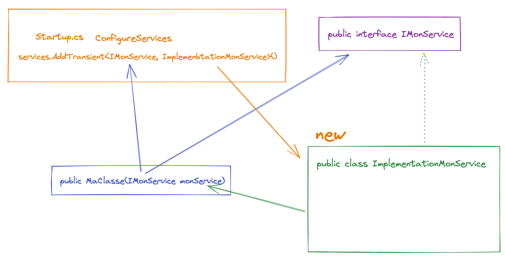
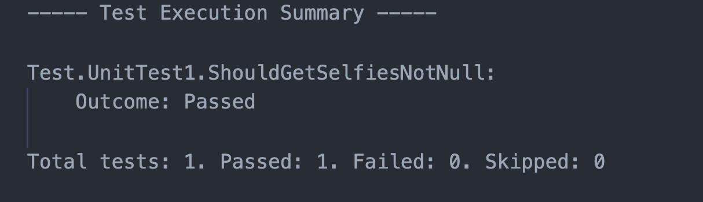
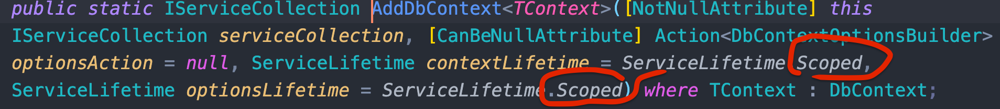
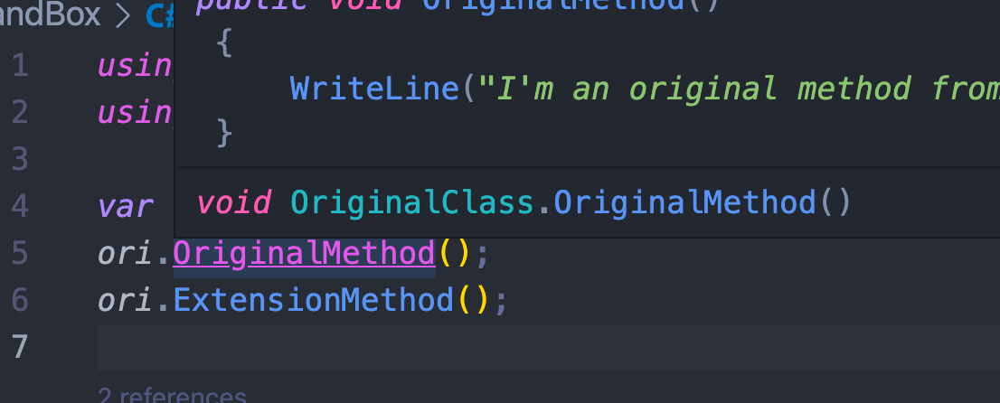
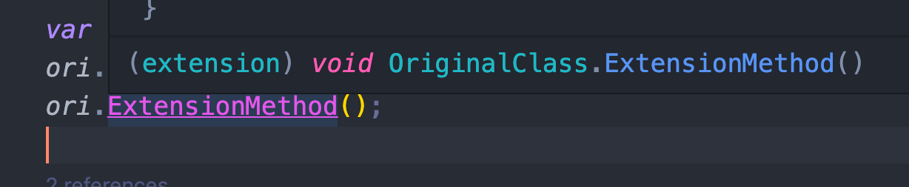
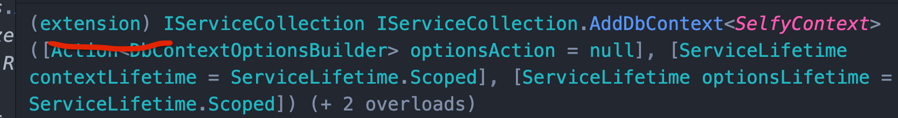

# 04 Injection de dépendances


## Injection du `context`

```cs
public void ConfigureServices(IServiceCollection services)
{

  services.AddDbContext<SelfyContext>(options => {
    options.UseSqlServer(
      Configuration.GetConnectionString("SelfyConnection"),
      sqlOptions => { }
    );
  });
```

La classe `Startup` contient une méthode `ConfigureServices` dans laquelle on va pouvoir ajouter nos dépendances.

`AddDbContext` est une méthode d'extension capable d'ajouter un `DbContext` aux `services`.

> ## Rappel méthode d'extension
>
> ```cs
> using System;
> 					
> public class Program
> {
> 	public static void Main()
> 	{
> 		Console.WriteLine("Hello World");
> 		
> 		var p = new Poco() { Name = "Coco" };
> 		Console.WriteLine(p.Abla());
> 	}
> }
> 
> 
> public static class MyExtension
> {
> 	public static string Abla(this Poco poco)
> 	{
> 		return $"hello my name is {poco.Name}";
> 	}
> }
> 
> public class Poco
> {
> 	public string Name { get; set; }
> }
> ```
>
> La classe et la méthode sont `static`.
>
> On utilise le mot clé `this` pour définir la classe visé par la méthode.

Dans notre `Controller` on injecte le `context` par le constructeur :

```cs
private readonly SelfyContext _context;
public SelfyController(SelfyContext context)
{
  _context = context;
}
```

C'est `aps.net` qui va se charger d'instancier (`new`) le `context` du type spécifié par `AddDbContext<Type>` :

```cs
new SelfyController(selfyContext);
```


## Création due l'interface `ISelfyRepository`

On va créer cette interface dans notre `Domain`.

C'est une abstarcation de tout ce que l'on peut faire sur notre `Domain`.

```cs
public interface ISelfyRepository
{
  Task<ICollection<Selfy>> GetAll();
}
```

L'implémentation du `repository` se trouvera dans `Infra`.

On va donc créer un dossier `Repositories` dans `Infra`  et dedans on a la classe `DefaultSelfyRepository` :

```cs
public class DefaultSelfyRepository : ISelfyRepository
{
  private readonly SelfyContext _context;
  
  public DefaultSelfyRepository(SelfyContext context)
  {
    _context = context;
  }
  
  public async Task<ICollection<Selfy>> GetAll() 
    => await _context.Selfies.Include(item => item.Wookie).ToListAsync();
}
```

Ainsi on découple le `controller` du `context`.

Dans le `controller`, on ne veut pas savoir comment les données sont fournies (`orm`, `in memory`, ... ).

On veut savoir le **Quoi** pas le **Comment**.


### Modification du `Controller`

On peut dès lors drastiquement simplifier le `Controller`

```cs
[Route("api/[controller]")]
[ApiController]
public class SelfyController : ControllerBase
{
  private readonly ISelfyRepository _repo;
  public SelfyController(ISelfyRepository repo)
  {
    _repo = repo;
  }

  [HttpGet]
  public async Task<ActionResult<IEnumerable<Selfy>>> GetSelfies() 
    => Ok(await _repo.GetAll());
}
```


### Ajout du `service` : `DefaultSelfyRepository`

`Scoped` une instance par requête.

`Transient` une instance à chaque demande (plusieurs instances par requête possible).

```cs
public void ConfigureServices(IServiceCollection services)
{
  services.AddTransient<ISelfyRepository, DefaultSelfyRepository>();
```

On donne l'interface `ISelfyRepository` que l'on va trouver dans les paramètres du constructeur demandant ce service, ainsi que la classe d'implémentation de cette interface ici `DefaultSelfyRepository`. 

C'est cette classe qui va être instanciée lorsqu'un constructeur va demander un `ISelfyRepository repo`.




## Tests Unitaires avec `moq`

On doit pour tester notre `Controller` pouvoir lui passer un `repository` à l'instanciation.

On va utiliser un package `Moq` pour simuler le `repository`.

```bash
dotnet add package Moq --version 4.16.1
```

```cs
public async void ShouldGetSelfiesNotNull()
{
  // ARRANGE
  var repositoryMock = new Mock<ISelfyRepository>();
  repositoryMock.Setup(item => item.GetAll()).ReturnsAsync(new List<Selfy>() {
    new(),
    new()
  });

  var controller = new SelfyController(repositoryMock.Object);

  // ACT
  var result = await controller.GetSelfies();

  // ASSERT
  Assert.NotNull(result);
  Assert.IsType<ActionResult<IEnumerable<Selfy>>>(result);

  Assert.NotNull(result);
}
```




## Création d'un `DTO`

Dans le projet `API` on va créer un dossier `Application` et dedans un dossier `DTOs`.

`SelfyResumeDto.cs`

```cs
public class SelfyResumeDto
{
  public string Title { get; set; }
  public string WookieName { get; set; }
  public int NbSelfiesFromWookie { get; set; }
}
```

On l'utilise dans le `Controller` avec un `Select` :

```cs
[HttpGet]
public async Task<ActionResult<IEnumerable<Selfy>>> GetSelfies()
{
  var selfies = await _repo.GetAll();

  return Ok(selfies
            .Select(item => new SelfyResumeDto() { 
              Title = item.Title, 
              WookieName = item.Wookie.Name, 
              NbSelfiesForWookie = item.Wookie.Selfies.Count() 
            }));
}
```


## `Transient` / `Scoped` / `Singleton`

### `AddSingleton`

```cs
services.AddSingleton<ISelfyRepository, DefaultSelfyRepository>();
services.AddSingleton(typeof(DefaultSelfyRepository));
services.AddSingleton<DefaultSelfyRepository>();
```

Une seule instance pour toute la durée de l'application.


### `AddScoped`

Une seule instance par requête. Si un autre constructeur demande le même service durant la même requête, alors on garde la même instance.


### `AddTransient`

Une nouvelle instance du service à chaque demande d'un constructeur.


## Choisir pour son `repository`

On voit que `AddDbContext` envoie un service avec une durée de vie : `scoped`.



Le `context` reste donc le même le temp de la requête.

Il est recommandé de prendre la même durée de vie pour un `repository`.

### `services.AddScoped<TService, TImplementation>()`

```cs
services.AddScoped<ISelfyRepository, DefaultSelfyRepository>();
```

Ainsi le context reste stable durant la même requête.

> https://stackoverflow.com/questions/38138100/addtransient-addscoped-and-addsingleton-services-differences
>
> ## Lequel utiliser ?
> `Transient`
>
> Comme ils sont créés à chaque fois, ils utilisent plus de mémoire et de ressources et peuvent avoir un impact négatif sur les performances.
> à utiliser pour les services légers avec peu ou pas d'état (`state`).
>
> `Scoped`
>
> meilleure option lorsque vous voulez maintenir l'état (`state`) dans une requête.
>
> `Singleton`
>
> les fuites de mémoire dans ces services s'accumulent avec le temps.
> Ils sont également économes en mémoire car ils sont créés une fois et réutilisés partout.
>
> Utilisez les `singletons` lorsque vous devez maintenir l'état de l'application. La configuration ou les paramètres de l'application, le service de journalisation, la mise en cache des données sont quelques-uns des exemples où vous pouvez utiliser des `singletons`.


## Regrouper par méthode d'extension

Ce sont des méthodes qui ne font pas parti de la classe de base mais vont venir s'accrocher sur celle-ci.

Cela applique en fait le pattern `Decorator`.

> ## Méthode d'extension
>
> ```cs
> var ori = new OriginalClass();
> ori.OriginalMethod();
> ori.ExtensionMethod();
> 
> public class OriginalClass
> {
>     public void OriginalMethod()
>     {
>         WriteLine("I'm an original method from original class");
>     }
> }
> 
> public static class ExtensionForOriginalClass
> {
>     public static void ExtensionMethod(this OriginalClass oc)
>     {
>         WriteLine("I'm an extension method in an extension class");
>     }
> }
> ```
>
> On peut voire sur `VSCode` un `(extension)` devant la signature avec l'`intellisense`:
>
> 
>
> 

Ainsi on peut vérifier que la plupart des méthodes dans `ConfigureServices` sont des méthodes d'extension fournies par des `packages` tiers :




### Création d'une méthode d'extension pour injecter ses services

On crée le dossier `ExtensionMethods` dans le projet `API`.

```cs
public static class DIMethods
{
  public static void AddMyInjection(this IServiceCollection services)
  {
    services.AddScoped<ISelfyRepository, DefaultSelfyRepository>();
  }
}
```

Et miantenant dans `Startup` :

```cs
using API.ExtensionMethods;

public void ConfigureServices(IServiceCollection services)
{

  services.AddMyInjection();
```


## `Unit Of Work`

> Gère une liste d'objets durant une transaction et permet de gérer l'écriture des changements ainsi que les problèmes de concurrence. **Wikipedia**

On va créer un nouveau project `Framework`.

Dedans une interface `IUnitOfWork` :

```cs
public interface IUnitOfWork
{
  int SaveChanges();
}
```

C'est `SelfyContext` qui va implémenter le `IUnitOfWork` :

```cs
public class SelfyContext : DbContext, IUnitOfWork
{
  // ...
}
```

Comme `DbContext` possède déjà une implémentation (`EF Core`) de `SaveChanges`, il n'y a rien à faire.

Ondoit ajouter une référence à `Infra` :

```bash
dotnet add Infra reference Framework 
```

Toujours dans `Framework` on va ajouter une nouvelle interface `IRepository`.

```cs
public interface IRepository
{
  IUnitOfWork UnitOfWork { get; }
}
```

Du coup notre `ISelfyRepository` hérite de `IRepository`. On donne une référence à `Domain` vers `Framework` :

```bash
dotnet add Domain reference Framework 		
```

```cs
public interface ISelfyRepository : IRepository
{
  Task<ICollection<Selfy>> GetAll();
}
```

Dans notre `DefaultSelfyRepository` cela va forcer l'implémentation de notre `UnitOfWork` :

```cs
public class DefaultSelfyRepository : ISelfyRepository
{
  // ...

  public IUnitOfWork UnitOfWork => _context;
```

Cette méthode permet de découpler la méthodes `SaveChanges` de `EF Core`.


## Résumé

L'important en `Injection de Dépendance` c'est de découpler le `quoi` (`interface`) du `comment ` (`implémentation`).

