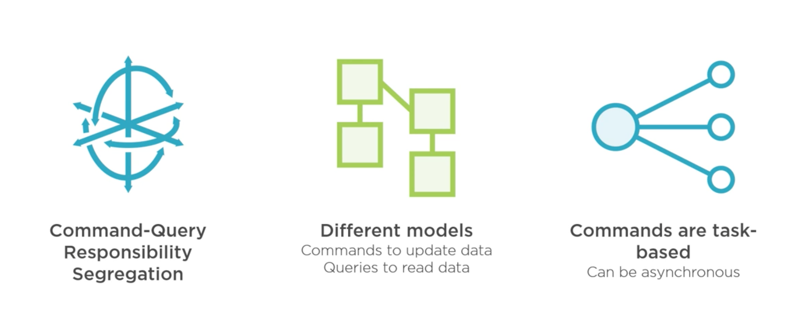
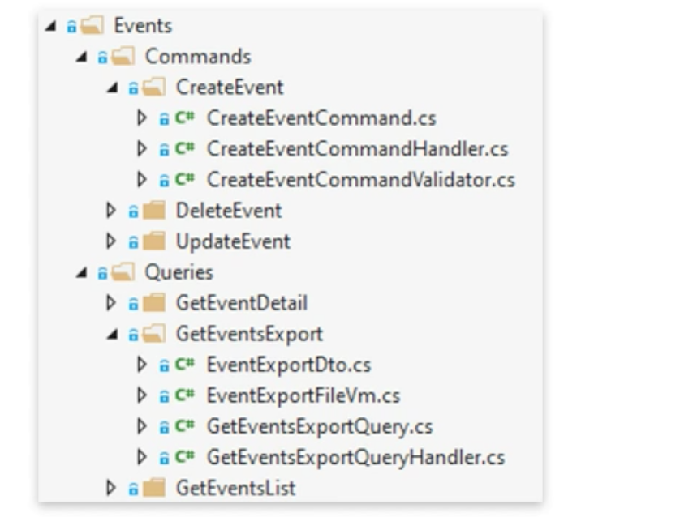

# `CQRS` :

#  `C`ommand and `Q`uery `R`esponsibility `S`egregation

## Le même modèle pour écrire et lire des données

### Problèmes dans les grandes applications :

- les requêtes sont différentes
- les objets retournés sont différents
- La logique pour sauvegarder les entités est complexe
- La sécurité est différente


## Ajouter `CQRS`

On va séparer les requête en lecture et en écriture.

C'est un moyen d'organiser au sein de l'architecture.



### Avantages :

- Séparation des préoccupations / séparation des responsabilités (`Separation Of Concerns`)
- Mise à l'échelle `Scaling`
- Sécurité
- Facilité pour effectuer un changement, pas d'effet de bord (`no further impact`)

### désavantage

- ajoute de la compléxité


## Structure

Sans `CQRS` on aurait probablement une architecture des `services` comme ceci :


Le problème c'est que chaque service peut être assez complexe, et si certain service dépendent d'autres services, les changement peuvent être complexe.

Avec `CQRS` on va créer des classes plus petites et donc avec moins de responsabilités :



## ajouter `CQRS` à l'application


On va réorganiser la structure du projet.

Ce sont toutes les instructions de lecture : `Queries`

On va maintenant créer un dossier pour toutes les instructions d'écriture : `Commands`

- `Commands`
  - `CreateEvent`
  - `UpdateEvent`
  - `DeleteEvent`


## `Categories` et `Orders`

On va faire la même chose pour `Categories` et `Orders`.

Dans l'ensemble `Categories` fonctionne comme `Events`.

On ajoute une nouvelle `Query` qui retourne les `Categories` avec les `Events` associés :

`GetCategoriesListWithEventsQueryHandler`

```cs
public class GetCategoriesListWithEventsQueryHandler : IRequestHandler<GetCategoriesListWithEventsQuery, List<CategoryEventListVm>>
{
    private readonly IMapper _mapper;
    private readonly ICategoryRepository _categoryRepository;

    public GetCategoriesListWithEventsQueryHandler(IMapper mapper, ICategoryRepository categoryRepository)
    {
        _mapper = mapper;
        _categoryRepository = categoryRepository;
    }

    public async Task<List<CategoryEventListVm>> Handle(GetCategoriesListWithEventsQuery request, CancellationToken cancellationToken)
    {
        var list = await _categoryRepository.GetCategoriesWithEvents(request.IncludeHistory);
        return _mapper.Map<List<CategoryEventListVm>>(list);
    }
}
```

On remarque qu'on utilise le `repository` spécique `ICategoryRepository` et non plus le généraique `IAsyncRepository`.

La raison est qu'on utilise une méthode spécifique : `GetCategoriesWithEvents`.

### `ICategoryRepository`

```cs
public interface ICategoryRepository : IAsyncRepository<Category>
{
	Task<List<Category>> GetCategoriesWithEvents(bool includePassedEvents);
}
```

On a un paramètre pour savoir si on inclus les `Events` passés ou pas.

#### ! On doit s'assurer que `AutoMapper` est bien configuré

`Profiles/MappingProfile`

```cs
public MappingProfile(): Profile
{
    CreateMap<Event, EventListVm>().ReverseMap();
    CreateMap<Category, CategoryDto>().ReverseMap();
    CreateMap<Event, EventDetailVm>().ReverseMap();
    CreateMap<Category, CategoryListVm>();
    CreateMap<Category, CategoryEventListVm>();
}
```


## `Commands`

### Créer une nouvelle entité


Dans `Events/Commands` on crée un nouveau dossier `CreateEvent` .

Dedans on ajoute la classe

###  `CreateEventCommand`

```cs
using System;
using MediatR;

namespace src.Core.GloboTicket.TicketManagement.Application.Features.Events.Commands.CreateEvent
{
    public class CreateEventCommand : IRequest<Guid>
    {
        public string Name { get; set; }
        public int Price { get; set; }
        public string Artist { get; set; }
        public DateTime Date { get; set; }
        public string Description { get; set; }
        public string ImageUrl { get; set; }
        public Guid CategoryId { get; set; }
        
        public override string ToString()
        {
            return $"Event {Name} By {Artist} On {Date.ToShortDateString()}";
        }
    }
}
```

C'est le message de `CreateEventCommand` qui sera envoyé au `Handler` de `MediatR`.

Il contient tous les champs nécessaire pour créer un nouvel `Event`.

`IRequest<Guid>` signifie qu'on attend un `Guid` de l'`Event` créé en retour.

On va ajouter le handler :

### `CreateEventCommandHandler`

```cs
using System;
using System.Threading;
using System.Threading.Tasks;
using MediatR;

namespace src.Core.GloboTicket.TicketManagement.Application.Features.Events.Commands.CreateEvent
{
    public class CreateEventCommandHandler : IRequestHandler<CreateEventCommand, Guid>
    {
        private readonly IMapper _mapper;
        private readonly IEventRepository _eventRepository;
        
        public CreateEventCommandHandler(IMapper mapper, IEventRepository eventRepository)
        {
            _eventRepository = eventRepository;
            _mapper = mapper;
        }
        
        public async Task<Guid> Handle(CreateEventCommand request, CancellationToken cancellationToken)
        {
            var @event = _mapper.Map<Event>(request);
            @event = await _eventRepository.AddAsync(@event);
            
            return @event.EventId;
        }
    }
}
```

On doit ajouter un `mapping` dans `Profiles/MappingProfile`

```cs
CreateMap.Map<Event, CreateEventCommand>().ReverseMap();
```


## `Update` Command

### `UpdateEventCommand`

```cs
public class UpdateEventCommand : IRequest
{
    public Guid EventId { get; set; }
    public string Name { get; set; }
    public int Price { get; set; }
    public string Artist { get; set; }
    public DateTime Date { get; set; }
    public string Description { get; set; }
    public string ImageUrl { get; set; }
    public Guid CategoryId { get; set; }
}
```


Le message comporte cette fois ci l'`EventId` pour identifier l'`Event` à modifier.

Il ne renvoie rien car c'est un `Update`.


### `UpdateEventCommandHandler`

```cs
public class UpdateEventCommandHandler : IRequestHandler<UpdateEventCommand>
{
    private readonly IMapper _mapper;
    private readonly IEventRepository _eventRepository;
    
    public UpdateEventCommandHandler(IMapper mapper, IEventRepository eventRepository)
    {
        _eventRepository = eventRepository;
        _mapper = mapper;
    }

    public async Task<Unit> Handle(UpdateEventCommand request, CancellationToken cancellationToken)
    {
        var eventToUpdate = await _eventRepository.GetByIdAsync(request.EventId);
        
        _mapper.Map(request, eventToUpdate, typeof(UpdateEventCommand), typeof(Event));

        await _eventRepository.UpdateAsync(eventToUpdate);
        
        return Unit.Value;
    }
}
```

La `Task` retourne `Unit`.

#### `_mapper.Map(<objet source>, <objet destination>, <type source>, <type destination>)`

On doit ajouter un `mapping` :

```cs
CreateMap<Event, UpdateEventCommand>().ReverseMap();
```


## `Delete` Command

### `DeleteEventCommand`

```cs
public class DeleteEventCommand : IRequest
{
    public Guid EventId { get; set; }
}
```


### `DeleteEventCommandHandler`

```cs
public class DeleteEventCommandHandler : IRequestHandler<DeleteEventCommand>
{
    private readonly IMapper _mapper;
    private readonly IEventRepository _eventRepository;
    public DeleteEventCommandHandler(IMapper mapper, IEventRepository eventRepository)
    {
        _eventRepository = eventRepository;
        _mapper = mapper;

    }

    public async Task<Unit> Handle(DeleteEventCommand request, CancellationToken cancellationToken)
    {
        var eventToDelete = await _eventRepository.GetByIdAsync(request.EventId);

        await _eventRepository.DeleteAsync(eventToDelete);

        return Unit.Value;
    }
}
```


