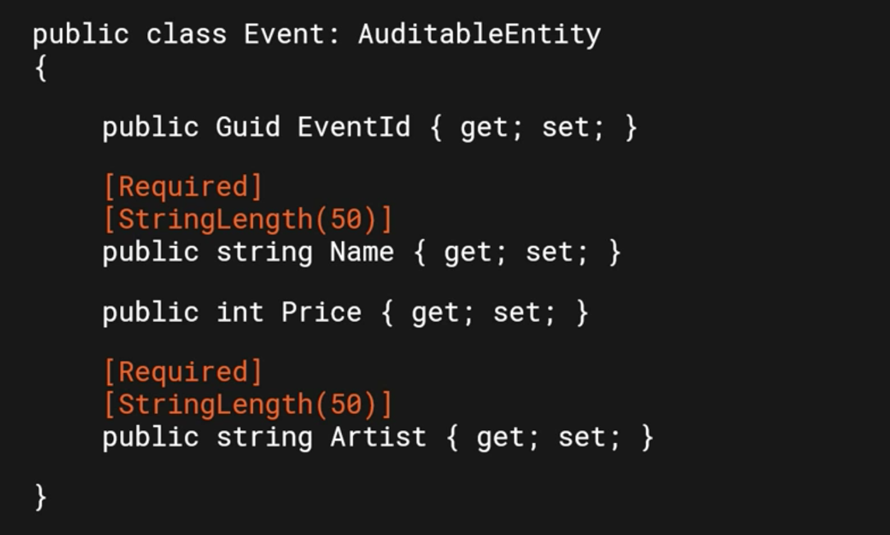

# 05 `Fluent Validation`

Les annotations fonctionne très bien pour des règles simples :



Mais pour des règles complexe ce n'est pas suffisant, par exemple :

> Si le `titre` contient `2020` alors la `date` ne peut pas être `2021`


## Utiliser `Fluent Validation`

`Fluent` utilise les expression `Lambda` pour définir les règles.

On peut ainsi séparer totalement le `Domain` et la validation.

On peut ajouter une validation spécifique par `Feature` (fonctionnalité).


### Custom Validator

```cs
public class CreateCategoryCommandValidator : AbstractValidator<CreateCategoryCommand>
{
    public CreateCategoryCommandValidator()
    {
        RuleFor(p => p.Name)
            .NotEmpty()
            .WithMessage("{PropertyName} is required");
    }
}
```

Ensuite on peut l'utliser dans un `RequestHandler` :

```cs
var validator = new CreateCategoryCommandValidator();

var validationResult = await validator.ValidateAsync(request);
```


## Custom Exceptions

On a besoin de plusieurs `Custom Exception` :

- `NotFoundException`
- `BadRequestException`
- `ValidationException`

```cs
public class NotFoundException : ApplicationException
{
    public NotFoundException(string name) : base($"{name} is not found")
    {
        
    }
}
```


## Mise en place `Fluent Validation`

Dans le projet `GloboTicket.TicketManagement.Application` on va ajouter le pa

ckage `FluentValidation.DependencyInjectionExtensions`

```bash
dotnet add package FluentValidation.DependencyInjectionExtensions --version 10.1.0
```

```cs
<Project Sdk="Microsoft.NET.Sdk">

  <ItemGroup>
    <ProjectReference Include="..\GloboTicket.TicketManagement.Domain\GloboTicket.TicketManagement.Domain.csproj" />
  </ItemGroup>

  <ItemGroup>
    <PackageReference Include="AutoMapper.Extensions.Microsoft.DependencyInjection" Version="8.1.1" />
    <PackageReference Include="FluentValidation.DependencyInjectionExtensions" Version="10.1.0" />
    <PackageReference Include="MediatR.Extensions.Microsoft.DependencyInjection" Version="9.0.0" />
  </ItemGroup>

  <PropertyGroup>
    <TargetFramework>net5.0</TargetFramework>
  </PropertyGroup>

</Project>
```


## `CreateEventCommandValidator`

On va placer cette classe dans le dossier `Commands/CreateEvent` :

```cs
using FluentValidation;

namespace src.Core.GloboTicket.TicketManagement.Application.Features.Events.Commands.CreateEvent
{
    public class CreateEventCommandValidator : AbstractValidator<CreateEventCommand>
    {
        public CreateEventCommandValidator()
        {
            RuleFor(p => p.Name)
                .NotEmpty().WithMessage("{PropertyName} is required")
                .NotNull()
                .MaximumLength(50).WithMeasseg("{PropertyName} must not exceed 50 characters");
            
            RuleFor(p => p.Date)
                .NotEmpty().WithMessage("{PropertyName} is required")
                .NotNull()
                .GreaterThan(DateTime.Now);
            
            RuleFor(p => p.Price)
                .NotEmpty().WithMessage("{PropertyName} is required")
                .GreaterThan(0);
        }
    }
}
```

On peut aller dans `CreateEventCommandHandler` pour utiliser notre `Validator` :

```cs
public async Task<Guid> Handle(CreateEventCommand request, CancellationToken cancellationToken)
{
    var validator = new CreateEventCommandValidator();
    var validationResult = await validator.ValidateAsync(requset);
    
    var @event = _mapper.Map<Event>(request);

    @event = await _eventRepository.AddAsync(@event);

    return @event.EventId;
}
```


## `Custom Exceptions`

On va créer dans `Application` un dossier `Exceptions` et y placer nos trois `Customs Exceptions` :

- `BadRequestException`
- `NotFoundException`
- `ValidationException`


### `BadRequestException`

Hérite de `ApplicationException` qui se trouve dans `System`.

C'est pour les entrées invalides.

```cs
public class BadRequestException : ApplicationException
{
    public BadRequestException(string message) : base(message)
    {

    }
}
```


### `NotFoundException`

Par exemple si on veut `update` un `event` mais cet `event` n'existe pas (plus!).

```cs
public class NotFoundException : ApplicationException
{
    public NotFoundException(string name, object key) : base($"{name} ({key}) is not found")
    {

    }
}
```


### `ValidationException`

```cs
public class ValidationException : ApplicationException
{
	public List<string> ValidationErrors { get; set; }
    
    public ValidationException(ValidationResult validationResult)
    {
        forech(var validationError in validationResult.Errors)
        {
            validationErrors.Add(validationError.ErrorMessage);
        }
    }
}
```

On doit ajouter le bon `using` :

```cs
using FluentValidation.Results;
```

Et pas celui des `annotations`.

Maintenant dans le `Handler` on va intercepter les erreurs de validation :

```cs
public async Task<Guid> Handle(CreateEventCommand request, CancellationToken cancellationToken)
{
    var validator = new CreateEventCommandValidator();
    var validationResult = await validator.ValidateAsync(request);
    
    if(validationResult.Errors.Count > 0)
    {
        throw new ValidationException(validationResult)
    }
    
    var @event = _mapper.Map<Event>(request);

    @event = await _eventRepository.AddAsync(@event);

    return @event.EventId;
}
```

Pour l'instant ce sont des validations qui aurait été possible avec de simples `annotations`.


## Validation complexe avec `Fluent`

On va modifier `CreateEventCommandValidator` :

```cs
public class CreateEventCommandValidator : AbstractValidator<CreateEventCommand>
{
    private readonly IEventRepository _eventRepository;
    
    public CreateEventCommandValidator(IEventRepository eventRepoository)
    {
        _eventRepositiry = eventRepository;
        
        RuleFor(p => p.Name)
            .NotEmpty().WithMessage("{PropertyName} is required")
            .NotNull()
            .MaximumLenght(50).WithMessage("{PropertyName} must not excced 50 characters");
        
        RuleFor(p => p.Date)
            .NotEmpty().WithMessage("{PropertyName} is required")
            .NotNull()
            .GreaterThan(DateTime.Now);
        
        RuleFor(e => e)
            .MustAsync(EventNameAndDateUnique)
            .WithMessage("An event with the same name and date already exists");
        
        RuleFor(p => p.Price)
            .NotEmpty().WithMessage("{PropertyName} is required")
            .GreaterThan(0);
    }
    
    private async Task<bool> EventNameAndDateUnique(CreateEventCommand e, CancellationToken token)
    {
        return !(await _eventRepository.IsEventNameAndDateUnique(e.Name, e.Date));
    }
}
```

On utilise `MustAsync` avec un prédicat asynchrone (**validation asynchrone**) pour vérifier s'il n'existe pas déjà une combinaison  (nom + date) identique.

On doit ajouter la méthode `IsEventNameAndDateUnique` dans le contrat du `IEventRepositoty` :

```cs
public interface IEventRepository : IAsyncRepository<Event>
{
    Task<bool> IsEventNameAndDateUnique(string name, DateTime eventDate);
}
```

Je dois passer le `repository` dans la méthode `Handle` :

```cs
public async Task<Guid> Handle(CreateEventCommand request, CancellationToken cancellationToken)
{
    var validator = new CreateEventCommandValidator(_eventRepository); // <= ici
    var validationResult = await validator.ValidateAsync(request);

    if (validationResult.Errors.Count > 0)
    {
        throw new ValidationException(validationResult);
    }

    var @event = _mapper.Map<Event>(request);

    @event = await _eventRepository.AddAsync(@event);

    return @event.EventId;
}
```


## `CreateCategoryCommandResponse`

On peut aussi créer un objet de réponse avec plus d'informations, comme par exemple les messages d'erreurs de validation :

Dans un dossier `Responses` on crée la classe `BaseResponse`

```cs
public class BaseResponse
{
    public BaseResponse()
    {
        Success = true;
    }
    public BaseResponse(string message = null)
    {
        Success = true;
        Message = message;
    }

    public BaseResponse(string message, bool success)
    {
        Success = success;
        Message = message;
    }

    public bool Success { get; set; }
    public string Message { get; set; }
    public List<string> ValidationErrors { get; set; }
}
```

Ensuite on va crée une `response` pour `CreateCategoryCommand` qui hérite de cette classe de base :

`CreateCategoryCommandResponse`

```cs
public class CreateCategoryCommandResponse: BaseResponse
{
    public CreateCategoryCommandResponse(): base()
    {

    }

    public CreateCategoryDto Category { get; set; }
}
```

Maintenant on peut utiliser cette `response` dans la méthode `Handle` de `CreateCategoryCommandHandler` :

```cs
public async Task<CreateCategoryCommandResponse> Handle(CreateCategoryCommand request, CancellationToken cancellationToken)
{
    var createCategoryCommandResponse = new CreateCategoryCommandResponse();
    
    var validator = new CreateCategoryCommandValidator();
    var validationResult = await validator.ValidateAsync(resquest);
    
    if(validationResult.Errors.Count > 0)
    {
        createCategoryCommandResponse.Success = false;
        createCategoryCommandResponse.ValidationErrors = new List<string>();
        
        foreach(var error in validationResult.Errors)
        {
            createCategoryValidationResponse.ValidationErrors.Add(error.ErrorMessage);
        }
    }
    if(createCategoryCommandResponse.Success)
    {
        var category = new Category() { Name = requset.Name };
        category = await _categoryRepository.AddAsync(category);
        createCategoryCommandResponse.Category = _mapper.Map<CreateCategoryDto>(category);
    }
    
    return createCategoryCommandResponse;
}
```

Cela permet au `client` de gérer les erreurs de validation avec des messages précis.


