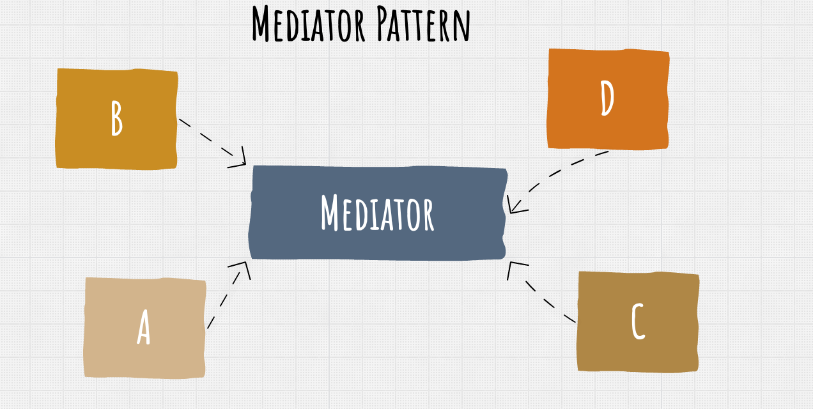
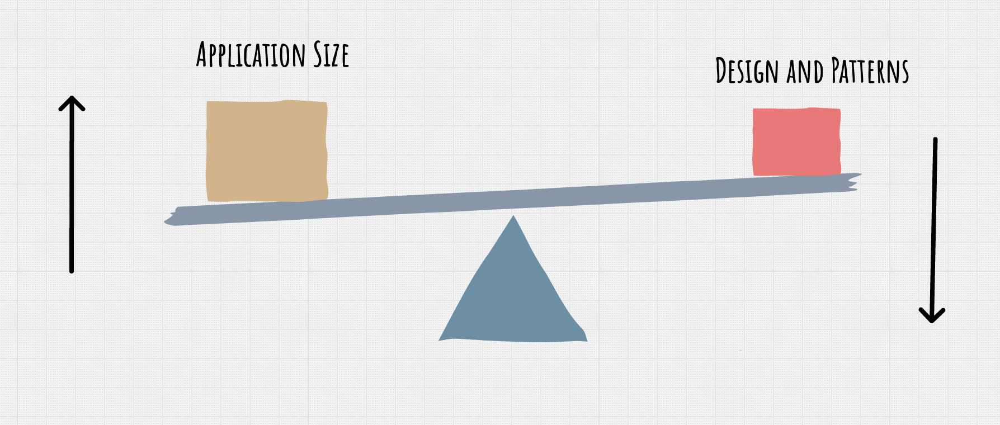
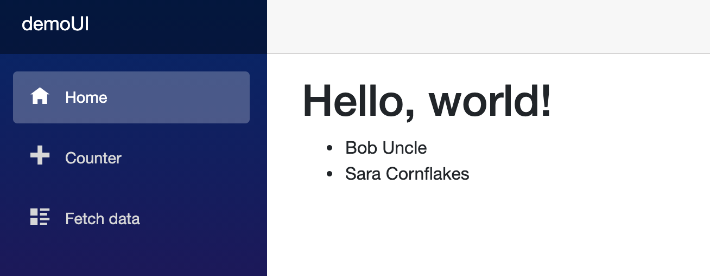

# CC `MediatR` et `CQRS`

## Tim Corey

### `CQRS` :

- `C`ommand
- `Q`uery
- `R`esponsability
- `S`egregation


### `Mediator`


Si plusieurs `services` s'utilisent les uns les autres dans une application, la liste d'injection de dépendances (injection de services) peut devenir assez longue.

Pour simplifier et organiser tout ça, on va pouvoir utiliser le pattern `Mediator`.




### Principe de la balance

Plus l'application est grosse, plus il est nécessaire d'ajouter des `patterns` pour rendre la maintenance et la gestion plus facile.



### Implémentation

On crée une `classlib` et un `blazorserver`.

Model : `PersonModel`

```cs
public class PersonModel
{
    public int Id { get; set; }
    public string FirstName { get; set; }
    public string LastName { get; set; }
}
```

Access : `DemoDataAccess`

```cs
public class DemoDataAccess : IDataAccess
{
    private List<PersonModel> people = new();

    public DemoDataAccess()
    {
        people.Add(new() { Id = 1, FirstName = "Bob", LastName = "Uncle" });
        people.Add(new() { Id = 2, FirstName = "Sara", LastName = "Cornflakes" });
    }

    public List<PersonModel> GetPeople()
    {
        return people;
    }

    public PersonModel InsertPerson(string firstName, string lastName)
    {
        PersonModel p = new() { FirstName = firstName, LastName = lastName };
        p.Id = people.Max(x => x.Id) + 1;
        people.Add(p);

        return p;
    }
}
```

`Max(x => x.Prop)` retourne la plus grosse valeur de la propriété `Prop` (`Linq`).

On extrait l'interface :

`IDataAccess`

```cs
public interface IDataAccess
{
    List<PersonModel> GetPeople();
    PersonModel InsertPerson(string firstName, string lastName);
}
```


`index.razor`

```cs
@page "/"


<h1>Hello, world!</h1>

<ul>
    @foreach (var p in people)
    {
        <li>@p.FirstName @p.LastName</li>
    }
</ul>

@code {
    List<PersonModel> people;
    protected override Task OnInitializedAsync()
    {
        throw new NotImplementedException();
    }

}
```


### Installer `Mediatr`

Dans `DemoLib` on installe `Mediatr` :

```bash
dotnet add demoLib/ package MediatR --version 9.0.0
```

On va créer des dossiers `Queries` et `Commands` aussi.

On crée un dossier `Handlers`.


### Notre première `Request`

Dans `Queries` on va créer notre première `Query`, ce sera un `record` :

`GetPersonListQuery`

```cs
using System.Collections.Generic;
using demoLib.Models;
using MediatR;

namespace demoLib.Queries
{
    public record GetPersonListQuery() : IRequest<List<PersonModel>>;
}
```

Un `record` se prête bien à être un message (`request`) utilisé par `Mediatr`.

Le record n'a pas de propriété car on demande la liste de toutes les personnes, mais on pourrait avoir la pagination :

```cs
public record GetPersonListQuery(int CurrentPage, int SizePage) : IRequest<List<PersonModel>>;
```

Il est possible d'utiliser une `classe` plutôt qu'un `record`.


### Notre premier `Handlers`

Dans le dossier `Handlers` on va créer une classe `GetPersonListHandler`

```cs
public class GetPersonListHandler : IRequestHandler<GetPersonListQuery, List<PersonModel>>
{
    private readonly IDataAccess _data;
    public GetPersonListHandler(IDataAccess data)
    {
        _data = data;

    }
    public Task<List<PersonModel>> Handle(GetPersonListQuery request, CancellationToken cancellationToken)
    {
        return Task.FromResult(_data.GetPeople());
    }
}
```

`Task.FromResult` permet de créer une `Task` (complétée avec succès) à partir d'un résultat (synchrone).


### Ajouter notre service à `demoUI` dans `Startup`

```cs
public void ConfigureServices(IServiceCollection services)
{
    services.AddRazorPages();
    services.AddServerSideBlazor();
    services.AddSingleton<WeatherForecastService>();
    services.AddSingleton<IDataAccess, DemoDataAccess>(); // <= ici
}
```

On va ajouter `MediatR.DependencyInjection` au projet `Blazor` : `demoUI`

```bash
dotnet add demoUI/ package MediatR.Extensions.Microsoft.DependencyInjection --version 9.0.0
```

On peut maintenant injecter `MediatR` :

```cs
services.AddSingleton<IDataAccess, DemoDataAccess>();
services.AddMediatR(typeof(DemoLibMediatREntryPoint).Assembly);
```

On a créer dans `demoLib` une classe vide `DemoLibMediatREntryPoint` comme point d'entrée pour `MediatR`.

`typeof(DemoLibMediatREntryPoint).Assembly` va renvoyer une référence vers l'`assembly` de `demoLib` afin que `MediatR` puisse scanner les différents `Handlers` et `Request`.


### Retour à `index.razor`

On va injecter un `mediator` dans la page :

```cs
@page "/"
@inject MediatR.IMediator _mediator

<ul>
    @foreach (var p in people)
    {
        <li>@p.FirstName @p.LastName</li>
    }
</ul>

@code {
    List<PersonModel> people;
    protected override async Task OnInitializedAsync()
    {
        people = await _mediator.Send(new GetPersonListQuery());
    }

}
```

On met les dépendances dans `_import.razor`

```cs
// ...
@using demoUI
@using demoUI.Shared
@using demoLib.Models
@using demoLib.Handlers
@using demoLib.Queries
```



#### La complexité a été retirée de la partie `UI`.

#### La logique est contenu entièrement dans les `Handlers`.


## Ajoutons `DemoApi`

On crée un projet de `Web API`.

On ajoute à ce projet `MediatR DependencyInjection`.

On ajoute une référence vers `DemoLib`.

On ajoute l'injection de dépendance dans `Stratup.cs` :

```cs
public void ConfigureServices(IServiceCollection services)
{
    // ...
    services.AddSingleton<IDataAccess, DemoDataAccess>();
    services.AddMediatR(typeof(DemoLibMediatREntryPoint).Assembly);
}
```

On va maintenant ajouter un nouveau contrôleur :

`PersonController`

```cs
[Route("api/[controller]")]
[ApiController]
public class PersonController : ControllerBase
{
    private readonly IMediator _mediator;
    public PersonController(IMediator mediator)
    {
        _mediator = mediator;

    }

    [HttpGet]
    public async Task<List<PersonModel>> Get()
    {
        return await _mediator.Send(new GetPersonListQuery());
    }

}
```

Notre contrôleur est le plus *fin* possible, il ne fait que transmettre un message.

Il est super simple de passer d'une vue `Blazor` à une `API Rest`.


## `GetPersonByIdQuery`

Dans `demoLib/Queries`

`GetPersonByIdQuery`

```cs
using MediatR;

namespace demoLib.Queries
{
    public record GetPersonByIdQuery(int Id) : IRequest<PersonModel>;
}
```

Maintenant on va créer notre `Handler` dans `demoLib/Handlers`

`GetPersonByIdHandler`

```cs
public class GetPersonByIdHandler : IRequestHandler<GetPersonByIdQuery, PersonModel>
{
    private readonly IMediator _mediator;
    public GetPersonByIdHandler(IMediator mediator)
    {
        _mediator = mediator;


    }

    public async Task<PersonModel> Handle(GetPersonByIdQuery request, CancellationToken cancellationToken)
    {
        var result = await _mediator.Send(new GetPersonListQuery());

        return result.Find(p => p.Id == request.Id);
    }
}
```

On utilise un `mediator`  à l'intérieur d'un `Handler`.

Le contrôleur reste très simple, ici juste une gestion d'un `Id` `null` :

```cs
[HttpGet("{id}")]
public async Task<ActionResult<PersonModel>> GetById(int id)
{
    var result = await _mediator.Send(new GetPersonByIdQuery(id));

    return result is null ? NotFound() : Ok(result);
}
```


## `CreatePersonCommand`

Toutes requêtes en création est une `Command`.

On va d'abord créer le `record` : `CreatePersonCommand`

```cs
using demoLib.Models;
using MediatR;

namespace demoLib.Commands
{
    public record CreatePersonCommand(string FirstName, string LastName) : IRequest<PersonModel>;
}
```

Les paramètres sont en `PascalCase` car ils correspondent à des propriétés.

Le `Handler` : `CreatePersonHandler`

```cs
public class CreatePersonHandler : IRequestHandler<CreatePersonCommand, PersonModel>
{
    private readonly IDataAccess _data;
    
    public CreatePersonHandler(IDataAccess data)
    {
        _data = data;
    }

    public Task<PersonModel> Handle(CreatePersonCommand request, CancellationToken cancellationToken)
    {
        return Task.FromResult(_data.InsertPerson(request.FirstName, request.LastName));
    }
}
```

Notre `controller` :

```cs
[HttpPost]
public async Task<ActionResult<PersonModel>> Post(string firstName, string lastName)
{
    var result = await _mediator.Send(new CreatePersonCommand(firstName, lastName));

    return Ok(result);
}
```

