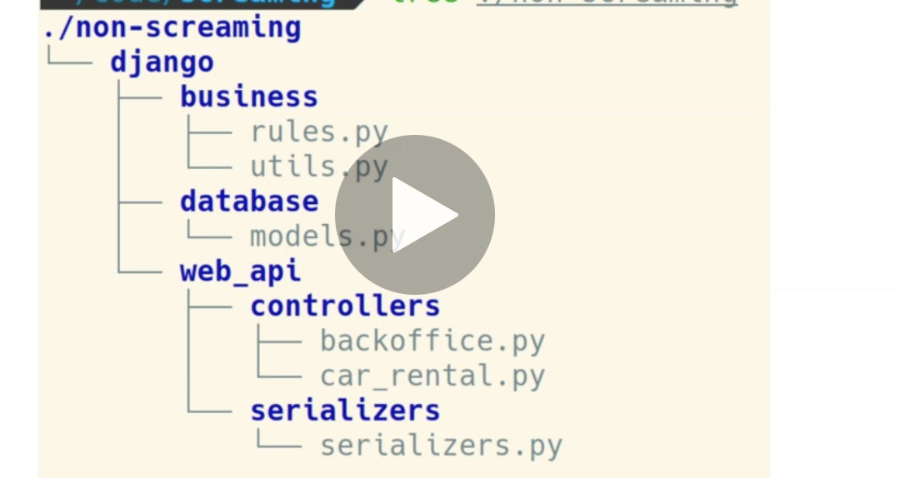
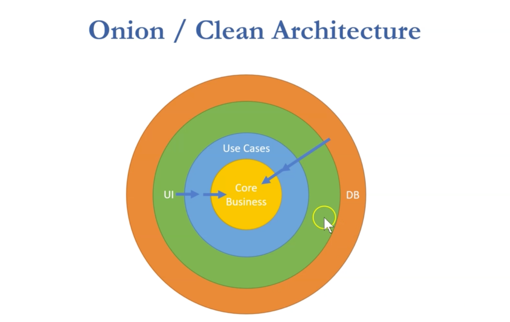

# DD Software Architecture

C'est un ensemble de règles qui cadre le processus de développement.

Une bonne architecture nous aide à réduire la complexité et à produire un logiciel simple.

### `Compléxité`

La complexité rend la compréhension et la modification d'un système difficile.

Une bonne architecture rend notre code facile à comprendre et facile à modifier.


## `S`eparation  `o`f  `C`oncern : `SoC`

Un des principe les plus important.

Séparer les **préoccupation en relation** dans différents `modules`.


## `Layered Architecture`

Pour suivre ce principe on peut découper le logiciel en couches ayant chacune sa préoccupation (responsabilité) :

- `app.Domain`
- `app.Repository` Accès aux données
- `app.Services` Logique business
- `app.UI`

`app.Services` qui envoie les données à la couche `app.UI` a besoin de l'accès à la base de données de la couche `app.Repository`.

Pour résoudre ces problèmes de dépendances, on utilise la `Depency Injection`.

### Version classique

```cs
class MyService
{
    private AppRepository _repository;

    // ctor de MyService
    public MyService()
    {
        _repository = new AppRepository();
    }
```

Cette approche est fortement couplée, et le moindre changement dans la classe `AppRepository` peut affecter le code de la classe `MyService`.

Les implémentations sont liées à la compilation.

Une couche supérieur (`Services`) ne doit pas être dépendante de l'implémentation d'une couche plus basse (`Repository`).


## `Dependency Injection`

```cs
class MyService
{
    private AppRepository _repository;

    // ctor de MyService
    public MyService(AppRepository repository)
    {
        _repository = repository;
    }
```


Ici les implémentations ne sont liées qu'au `runtime`.
L'objet `repository` est instancié en dehors de la classe `MyService`.

C'est la couche supérieur (le point d'entrée) qui est responsable de l'instanciation des dépendances.

```cs
static void Main()
{
    Application.AddServices<MyService>(new AppRepository());
    // ...
```


## `Dependency inversion`

L'`inversion de dépendances` stipule qu'un haut niveau ne doit pas être dépendant d'une implémentation particulière mais seulement d'abstraction (`interfaces`).

`IAppRepository`

```cs
public interface IAppRepository
{
    List<TrucNuche> GetTrucNucheListBySize(int Size);
}
```

```cs
class MyService
{
    private IAppRepository _repository;

    public MyService(IAppRepository repository)
    {
        _repository = repository;
```

Et bien sur chaque `repository` implémentera `IAppRepository`.

```cs 
public class TrucNucheRepository : IAppRepository
```

Jusqu'au niveau le plus haut, les différentes classes ne dépendent plus d'implémentations mais seulement d'abstraction (`contrats` = `interface`).

On peut utiliser `Microsoft.DependencyInjection` package pour implémenter l'injection de dépendances dans son application.

On a une classe `ServiceCollection` qui nous permet de gérer l'injection de services dans l'application (`dependency container`).

```cs
// Program.cs où il y a le Main

static void ConfigureServices(ServiceCollection services)
{
    services.AddTransient<IAppRepository, TrucNucheRepository>();
}
```

On passe une **implémentation** pour le type abstrait utilisé dans les classes.


## Problème de l'architecture en couche

On voudrait que chaque couche ne soit dépendante que de la précédente :


L'`Architecture en Couche` est avant tout une `Architecture centré sur les Donnée` (`Data Centric Architecture`).

Le problème est que le développement est centré sur la manière dont les données sont stockées en `BDD` et pas forcement sur la **logique métier**.

On voudrait une architecture plus centrée sur la **logique métier** (sur les `Use Cases`).


### Fuite de logique métier

De par leurs dépendances, la logique métier peut se retrouver sur la couche `repository` voire dans la `BDD` (procédures stockées).

La **logique métier** peut aussi *fuire* vers la couche `UI`, ce qui peut s'avérer problématique en cas de changement de technologie pour la couche `UI`.


##  Technologie Driven Architecture



Une architecture guidée par la technologie croit de manière horizontale et chaque couche peut devenir vraiment grosse.

La structure des couches est imposée par la technologie (`framework`) utilisée.


## Intent Driven Architecture

Une architecture peut aussi être guidée par les **intentions métier** (les attentes métier).


ce type d'architecture est découpée de manière verticale mais aussi horizontale, il en résulte une structure assez complexe.


## `Onion` ou `Clean Architecture`



### `Core`

`Core Business` contient la logique du métier en dehors de l'application (celle exécutée avec du papier et des stylos).

`Use Cases` ce sont ici la logique du logiciel, ce qu'on attend de lui.


On voit que la logique métier est indépendante de la `BDD` ou de l'`UI`, mais seulement dépendante du cœur métier (le `Model`).


## Plugins


Une `interface` permet de *pluger* différents types de sortie sur une même prise (connecteur).

`plug` = prise

Il suffit alors d'avoir une `abstraction` dans la partie `Business Logic` pour pouvoir la relier à n'importe quelle autre technologie (`BDD`, `mail`, `api`).


## Implémentation de la `Clean Architecture`

### Les projets

- `App.CoreBusiness`
- `App.UseCases`
- `App.WinForms`
- dossier `plugins`
  - `App.Plugins.Repository`

Les contrats (`interface`, `plugins`) sont définis dans la partie `App.UseCases`, ce qui permet à cette partie de n'avoir aucune dépendance à part celle vers `CoreBusiness`.

Chaque `Use Case` est implémenté dans un fichier propre.

#### Les `plugins` doivent implémenter les `interfaces` définie dans `App.UseCases`.


## Les bénéfices d'une `Clean Architecture`

- La **logique métier** n'a aucune dépendances (à part le `Model` = `CoreBusiness` = `Domain`).
- Le développement est simple, il suffit d'implémenter ses `Use Cases` dans la partie `UseCases`.
- Les éléments externe sont interchangeables.
- facilite les tests  `TDD` car le `Core` ne dépend de rien => `Tests Driven Devlopment`.
- Facilite aussi les `Unit Tests` (création d'un couche `Fake Data`).
  - On crée un projet `App.Plugins.InMemory` implémentant l'accès aux données défini dans `App.UseCases` et on peut s'en servir pour les tests (simple). Ainsi les `Unit Tests` ne sont pas dépendants de la `BDD` et tourne plus vite => `EF Core In Memory`.


## Erreur d'architecture

Coupler la logique métier avec le `framework` utilisé.
  - Mettre de la logique métier dans le `controller` (`MVC`)
  - Ou bien dans le framework `UI` : `Vuejs`


