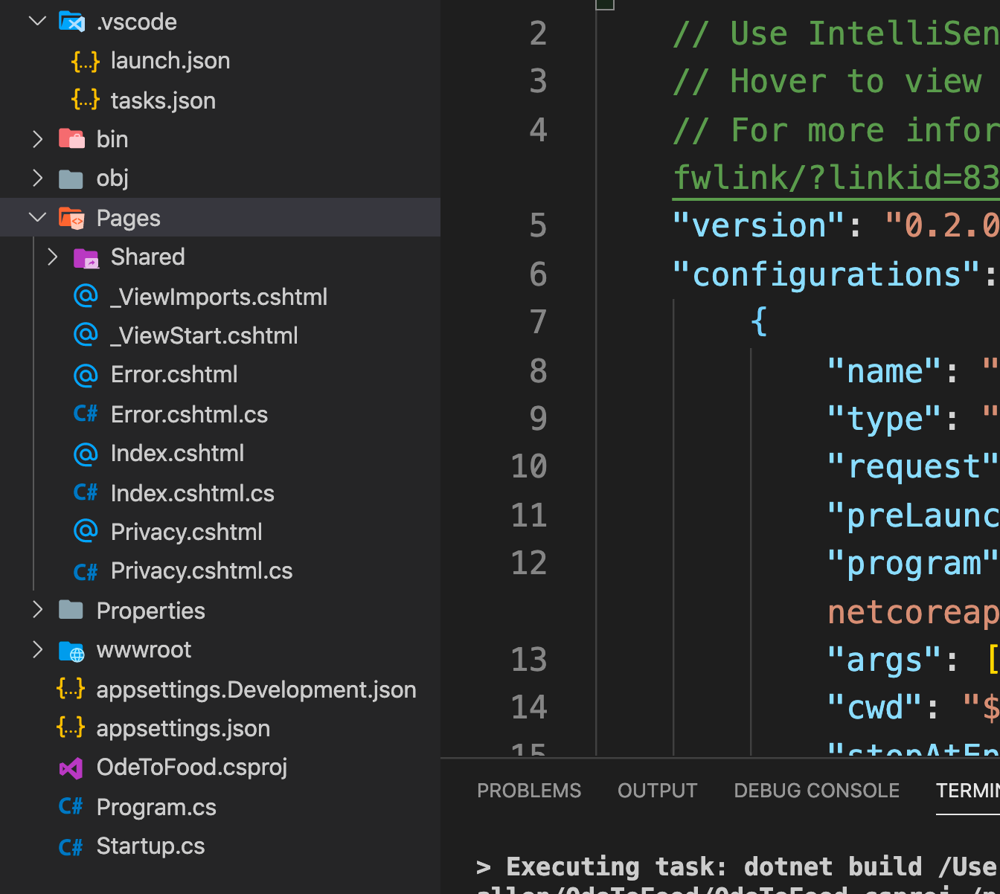

# 01. manipulation de données

## Github repository

https://github.com/OdeToCode/OdeToFood

## Créer le projet

```bash
🦄 OdeToFood dotnet new razor
```



Dans `Pages` on a les `Razor Page` d'extension `.cshtml`.

Pour avoir un aperçu en live :

```bash
🦄 OdeToFood dotnet watch run
watch : Started
```

## `_Layout.cshtml`

Toutes les pages héritent de `_Layout.cshtml`.

## Ajouter une `Razor Page`

Une `razor page` se compose de deux fichiers :

- `List.cshtml` le template `html` => la vue
- `Lits.cshtml.cs` Une classe qui représente le contrôleur et le modèle.

On peut automatiser la création de ces fichiers avec un utilitaire : `dotnet-aspnet-codegenerator`

```bash
dotnet tool install --global dotnet-aspnet-codegenerator --version 3.1.4
```

```bash
🦄 OdeToFood dotnet aspnet-codegenerator


Usage: aspnet-codegenerator [arguments] [options]

Arguments:
  generator  Name of the generator. Check available generators below.

Options:
  -p|--project             Path to .csproj file in the project.
  -n|--nuget-package-dir
  -c|--configuration       Configuration for the project (Possible values: Debug/ Release)
  -tfm|--target-framework  Target Framework to use. (Short folder name of the tfm. eg. net46)
  -b|--build-base-path
  --no-build

No code generators are available in this project.Add Microsoft.VisualStudio.Web.CodeGeneration.Design package to the project as a NuGet package reference.
```

```bash
dotnet add package Microsoft.VisualStudio.Web.CodeGeneration.Design
```

Maintenant différent `templates` sont disponibles :

```bash
🦄 OdeToFood dotnet aspnet-codegenerator


Usage: aspnet-codegenerator [arguments] [options]

Arguments:
  generator  Name of the generator. Check available generators below.

Options:
  -p|--project             Path to .csproj file in the project.
  -n|--nuget-package-dir
  -c|--configuration       Configuration for the project (Possible values: Debug/ Release)
  -tfm|--target-framework  Target Framework to use. (Short folder name of the tfm. eg. net46)
  -b|--build-base-path
  --no-build

Available generators:
  view      : Generates a view.
  area      : Generates an MVC Area.
  controller: Generates a controller.
  identity  : Generates an MVC Area with controllers and
  razorpage : Generates RazorPage(s).
```

Maintenant on va lister les options pour `razorpage` :

```bash
🦄 OdeToFood dotnet aspnet-codegenerator razorpage -h
# ...
Selected Code Generator: razorpage

Generator Arguments:
  razorPageName : Name of the Razor Page
  templateName  : The template to use, supported view templates: 'Empty|Create|Edit|Delete|Details|List'

Generator Options:
  --model|-m                          : Model class to use
  --dataContext|-dc                   : DbContext class to use
  --referenceScriptLibraries|-scripts : Switch to specify whether to reference script libraries in the generated views
  --layout|-l                         : Custom Layout page to use
  --useDefaultLayout|-udl             : Switch to specify that default layout should be used for the views
  --force|-f                          : Use this option to overwrite existing files
  --relativeFolderPath|-outDir        : Specify the relative output folder path from project where the file needs to be generated, if not specified, file will be generated in the project folder
  --namespaceName|-namespace          : Specify the name of the namespace to use for the generated PageModel
  --partialView|-partial              : Generate a partial view, other layout options (-l and -udl) are ignored if this is specified
  --noPageModel|-npm                  : Switch to not generate a PageModel class for Empty template
  --useSqlite|-sqlite                 : Flag to specify if DbContext should use SQLite instead of SQL Server.
```

### Génération des fichiers

```bash
dotnet aspnet-codegenerator razorpage List Empty -udl -outDir Pages/Restaurants/

Building project ...
Finding the generator 'razorpage'...
Running the generator 'razorpage'...
Added RazorPage : /Pages/Restaurants/List.cshtml
Added PageModel : /Pages/Restaurants/List.cshtml.cs
```

`List` Le nom de la `razor page`

`Empty` le template

`-udl` use default layout permet de ne pas générer le `head` et le `body` de la page `html`

`-outDir` chemin relatif où créer les fichiers de la `razor page`

### `List.cshtml`

```csharp
@page
@model ListModel
@{
    ViewData["Title"] = "List";
}

<h1>List Hello</h1>
```

### `List.cshtml.cs`

```csharp
using Microsoft.AspNetCore.Mvc.RazorPages;

namespace OdeToFood.Pages.Restaurants
{
    public class ListModel : PageModel
    {
        public void OnGet()
        {

        }
    }
}
```
