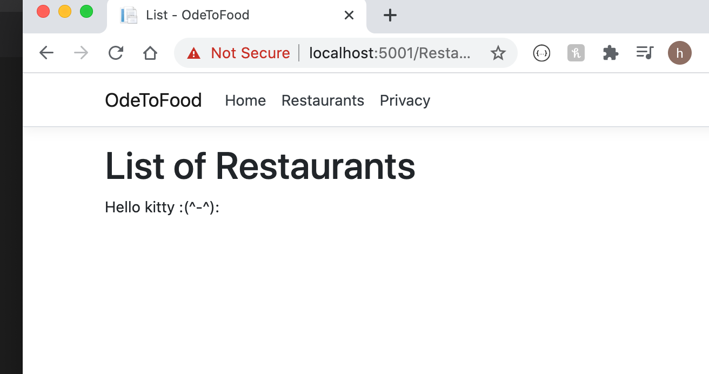

# 02. Envoyer des données sur une `razor page`

## Ajouter une `Property` : Modèle

On peut passer des données à la page via les propriétés :

```csharp
using Microsoft.AspNetCore.Mvc.RazorPages;

namespace OdeToFood.Pages.Restaurants
{
    public class ListModel : PageModel
    {
        public string Message { get; set; }

        public void OnGet()
        {
            Message = "Hello kitty :(^-^):";
        }
    }
}
```

`OnGet` méthode exécutée lors d'une requête `GET`.

Dans le template on utilise la directive `@Model` :

```csharp
@page
@model ListModel
@{
    ViewData["Title"] = "List";
}

<h1>List of Restaurants</h1>

@Model.Message
```



## Infos de `appsetting.json`

On peut récupérer dans le template des infos du fichier `appsetting.json` qui est un fichier de configuration du projet :

`appsetting.json`

```json
{
  "Logging": {
    "LogLevel": {
      "Default": "Information",
      "Microsoft": "Warning",
      "Microsoft.Hosting.Lifetime": "Information"
    }
  },
  "AllowedHosts": "*",
  "CustomMessage": "Hello from settings file (°-°)/"
}
```

Modification de la classe `List.cshtml.cs`

```csharp
using Microsoft.AspNetCore.Mvc.RazorPages;
using Microsoft.Extensions.Configuration;

namespace OdeToFood.Pages.Restaurants
{
    public class ListModel : PageModel
    {
        private readonly IConfiguration _config;

        public string Message { get; set; }

        public ListModel(IConfiguration config)
        {
            _config = config;
        }

        public void OnGet()
        {
            // Message = "Hello kitty :(^-^):";
            Message = _config["CustomMessage"];
        }
    }
}
```


On injecte dans le constructeur un service capable d'aller lire le fichier de configuration :

`public ListModel(IConfiguration config)`.
