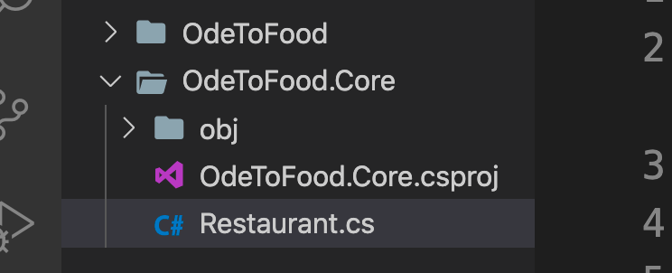

# 03. Créer des entities

Pour représenter nos éléments (restaurant par exemple) on va créer des entités.

Pour ce faire et bien organiser notre application on va créer une nouvelle librairie de classes.

```bash
🦄 asp-fundamentals-scott-allen dotnet new classlib -n OdeToFood.Core
```

Les deux projets sont au même niveau :



`Restaurant.cs`

```csharp
namespace OdeToFood.Core
{

    public class Restaurant
    {
        public int Id { get; set; }
        public string Name { get; set; }
        public string Location { get; set; }
        public CuisineType Cuisine { get; set; }
    }
}
```

`CuisineType.cs`

```csharp
namespace OdeToFood.Core
{
    public enum CuisineType
    {
        None,
        Mexican,
        Italian,
        Indian
    }
}
```
