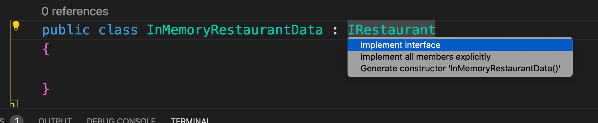
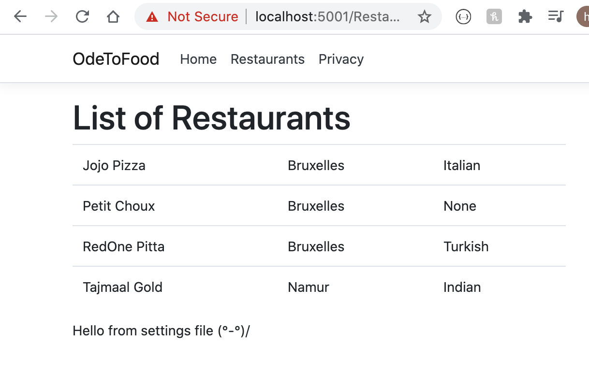

# 04. Data Access Service

Avant d'utiliser une BDD, on peut créer un service fournissant des données.

```bash
dotnet new classlib -n OdeToFood.Data
```

Il faut ajouter une référence à `OdeToFood.Core` à `OdeToFood.Data` :

```bash
🦄 asp-fundamentals-scott-allen dotnet add OdeToFood.Data/OdeToFood.Data.csproj reference OdeToFood.Core/OdeToFood.Core.csproj
```

`OdeToFood.Data.csproj`

```csharp
<Project Sdk="Microsoft.NET.Sdk">

  <ItemGroup>
    <ProjectReference Include="..\OdeToFood.Core\OdeToFood.Core.csproj" />
  </ItemGroup>

  <PropertyGroup>
    <TargetFramework>netstandard2.0</TargetFramework>
  </PropertyGroup>

</Project>
```



Pour avoir les quick fixs `cmd`+`.`

`IRestaurant.cs`

```csharp
using System.Collections.Generic;
using OdeToFood.Core;
using System.Linq;

namespace OdeToFood.Data
{
    public interface IRestaurant
    {
        IEnumerable<Restaurant> GetAll();
    }

    public class InMemoryRestaurantData : IRestaurant
    {

        List<Restaurant> restaurants;
        public InMemoryRestaurantData()
        {
            restaurants = new List<Restaurant>
            {
                new Restaurant { Id = 1, Name = "Jojo Pizza", Location = "Bruxelles", Cuisine = CuisineType.Italian},
                new Restaurant { Id = 2, Name = "Tajmaal Gold", Location = "Namur", Cuisine = CuisineType.Indian},
                new Restaurant { Id = 3, Name = "RedOne Pitta", Location = "Bruxelles", Cuisine = CuisineType.Turkish},
                new Restaurant { Id = 4, Name = "Petit Choux", Location = "Bruxelles", Cuisine = CuisineType.None},
            };
        }
        public IEnumerable<Restaurant> GetAll()
        {
            return from r in restaurants
                   orderby r.Name
                   select r;
        }
    }
}
```

Utilisation à la fin de `Linq`.

## Inversion de dépendance

Il faut rendre accessible l'interface `IRestaurant` aux pages `razor`.

### Créer un service dans `OdeToFood/Startup.cs`

Il faut ajouter une référence à `OdeToFood.Data` :

```bash
🦄 asp-fundamentals-scott-allen dotnet add OdeToFood/OdeToFood.csproj reference OdeToFood.Data/OdeToFood.Data.csproj
```

`OdeToFood/Startup.cs`

```csharp
// ...
using OdeToFood.Data;

namespace OdeToFood
{
    public class Startup
    {
       // ...

        // This method gets called by the runtime. Use this method to add services to the container.
        public void ConfigureServices(IServiceCollection services)
        {
            services.AddSingleton<IRestaurantData, InMemoryRestaurantData>();

         // ...
}
```

On ajoute un service `singleton`.

### On injecte le service dans le constructeur de `ListModel`

```cs
using System.Collections.Generic;
using Microsoft.AspNetCore.Mvc.RazorPages;
using Microsoft.Extensions.Configuration;
using OdeToFood.Core;
using OdeToFood.Data;

namespace OdeToFood.Pages.Restaurants
{
    public class ListModel : PageModel
    {
        private readonly IConfiguration config;
        private readonly IRestaurantData restaurantData;

        public string Message { get; set; }
        public IEnumerable<Restaurant> Restaurants { get; set; }

        public ListModel(IConfiguration config, IRestaurantData restaurantData)
        {
            this.config = config;
            this.restaurantData = restaurantData;
        }

        public void OnGet()
        {
            // Message = "Hello kitty :(^-^):";
            Message = config["CustomMessage"];
            Restaurants = restaurantData.GetAll();
        }
    }
}
```

Il faut aussi ajouter une référence à `OdeToFood.Core`.

```bash
🦄 asp-fundamentals-scott-allen dotnet add OdeToFood/OdeToFood.csproj reference OdeToFood.Core/OdeToFood.Core.csproj
```

## afficher dans la `razor page`

`List.cshtml`

```csharp
@page
@model ListModel
@{
    ViewData["Title"] = "List";
}

<h1>List of Restaurants</h1>

<table class="table">
    @foreach (var restaurant in Model.Restaurants)
    {
        <tr>
            <td>@restaurant.Name</td>
            <td>@restaurant.Location</td>
            <td>@restaurant.Cuisine</td>
        </tr>
    }
</table>

@Model.Message
```

`@` permet d'utiliser le `csharp`.

#### ! `Model` avec `M` majuscule


