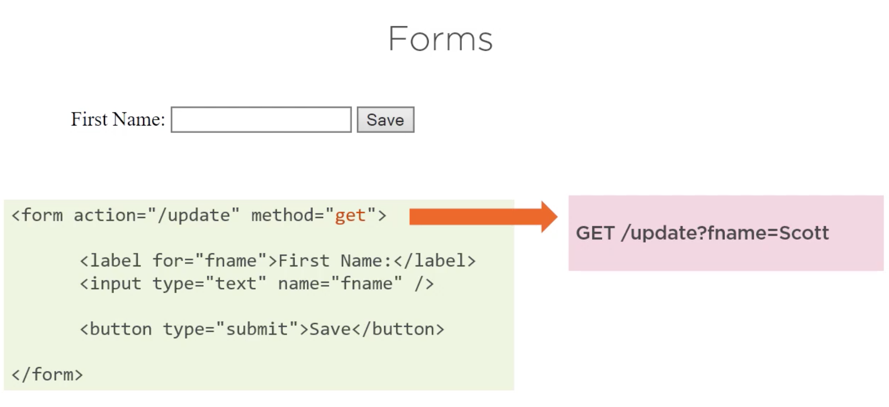
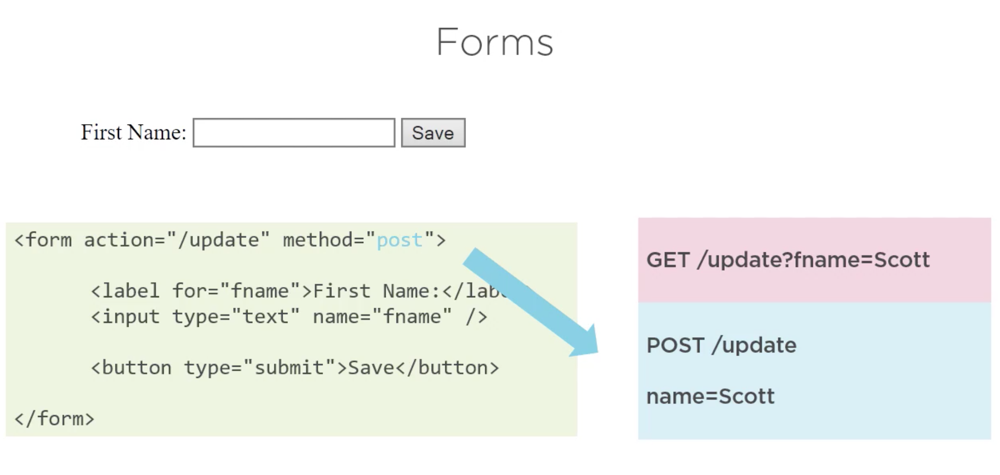

# 05. Les formulaires `html`

## `GET`

Une requête `GET` ne modifie jamais les données, c'est un bon choix pour un formulaire de recherche.

C'est une requête qui peut être enregistrée en favoris (`bookmarked`).

On parle de `query string`.

## `POST`

Les formulaire `POST` ne sont pas envoyé par l'`url` mais dans le body de la requête.

Ils modifie ou crée des données.
