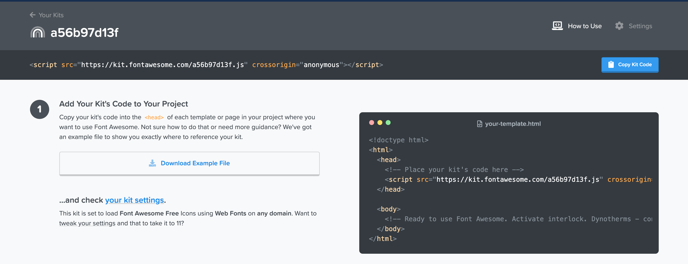
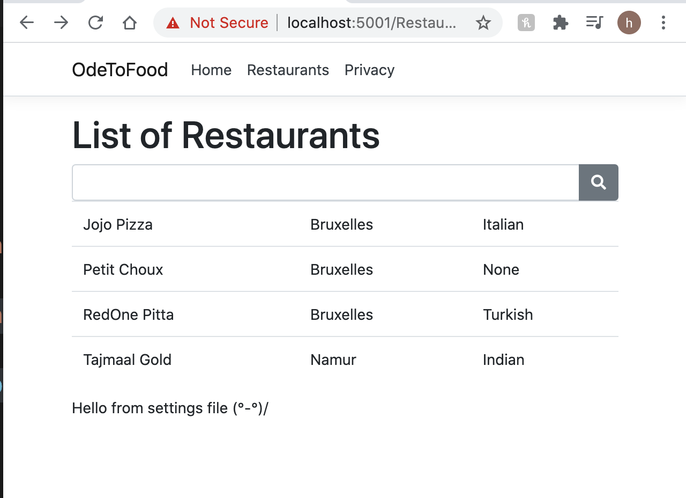
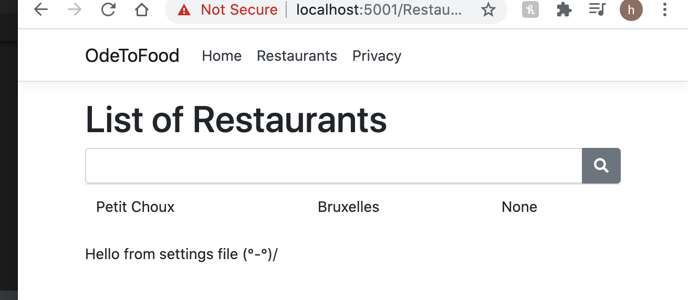
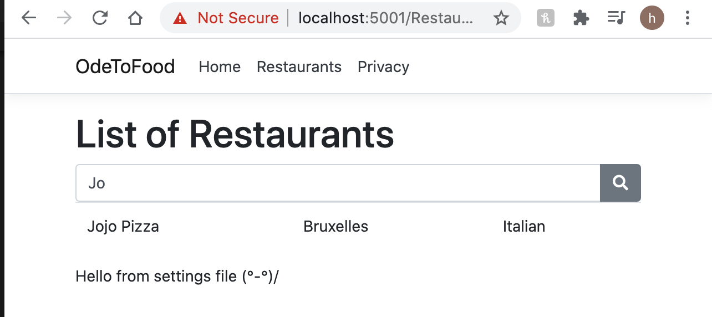

# 06. Formulaire de recherche

Dans notre page `razor` : `List.cshtml` on ajoute un formulaire de recherche `Bootstrap`.

```csharp
<form method="get">
    <div class="form-broup">
        <div class="input-group">
            <input type="search" class="form-control" value="">
            <div class="input-group-append">
                <button class="btn btn-secondary">
                    <i class="fas fa-search"></i>
                </button>
            </div>
        </div>
    </div>
</form>
```

## Ajout de `Font Awesome`

Pour avoir un `CDN` il faut un compte :



Dans `Shared/_Layout.cshtml`

```csharp
    <link rel="stylesheet" href="~/lib/bootstrap/dist/css/bootstrap.min.css" />
    <link rel="stylesheet" href="~/css/site.css" />
    <script src="https://kit.fontawesome.com/a56b97d13f.js" crossorigin="anonymous"></script>
</head>
```



## Rechercher par nom : utilisation du `model binding`

### Modifier notre méthode `GetAll` en `GetRestaurantsByName` dans `OdeToFood.Data`

```csharp
using System.Collections.Generic;
using OdeToFood.Core;
using System.Linq;

namespace OdeToFood.Data
{
    public interface IRestaurantData
    {
        IEnumerable<Restaurant> GetRestaurantsByName(string name);
    }

    public class InMemoryRestaurantData : IRestaurantData
    {

        List<Restaurant> restaurants;
        public InMemoryRestaurantData()
        {
            restaurants = new List<Restaurant> { /# ... #/ }
        }
        public IEnumerable<Restaurant> GetRestaurantsByName(string name)
        {
            return from r in restaurants
                   where string.IsNullOrEmpty(name) || r.Name.StartsWith(name)
                   orderby r.Name
                   select r;
        }
    }
}
```

`string.IsNullOrEmpty(<var>)` si c'est `null` ou vide le `where` ne filtre rien.

`.StartsWith` plus **user-friendly** qu'un `==`.

### Dans le template `List.cshtml`

```csharp
<input type="search" class="form-control" value="" name="searchTerm">
```

On donne un `name` à l'`input`.

### Ensuite dans `List.cshtml.cs`

```csharp
using // ...

namespace OdeToFood.Pages.Restaurants
{
    public class ListModel : PageModel
    {
        // ...

        public void OnGet(string searchTerm)
        {
            Message = config["CustomMessage"];
            Restaurants = restaurantData.GetRestaurantsByName(searchTerm);
        }
    }
}
```

On passe le modèle à lier (`binder`) à la méthode `OnGet` qui va rechercher automatiquement le terme dans les données de la requête.



```
https://localhost:5001/Restaurants/List?searchTerm=Pe
```

## Two way Data Binding `asp-for`

On voudrait que le `input type="search"` garde la valeur de recherche dans son attribut `value`.

Pour cela on va mettre en place une liaison dans les deux sens avec `asp-for`.

`asp-for` prends la valeur associé de l'`input` et l'envoie dans la méthode `OnGet` et aussi met à jour la valeur de l'attribut `value` de ce même `input`.

```csharp
using System.Collections.Generic;
using Microsoft.AspNetCore.Mvc;  // celui qu'il faut pour [BindProperty(options)]
using // ...

namespace OdeToFood.Pages.Restaurants
{
    public class ListModel : PageModel
    {
        // ...

        [BindProperty(SupportsGet = true)]
        public string SearchTerm { get; set; }

		//...

        public void OnGet()
        {
            // ...
        }
    }
}
```

On utilise l'`attribute` `BindProperty` pour lier la propriété `SearchTerm` avec son homologue dans le template `razor`.

Plus besoin de passer `searchTerm` dans la méthode `OnGet`.

Dans le template :

```csharp
<input type="search" class="form-control" asp-for="SearchTerm">
```

Plus besoin de `value` et de `name`, mais à la place `asp-for`.


