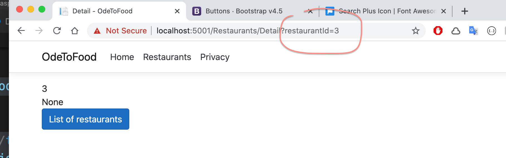
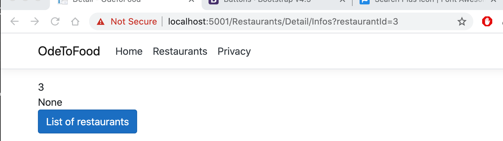
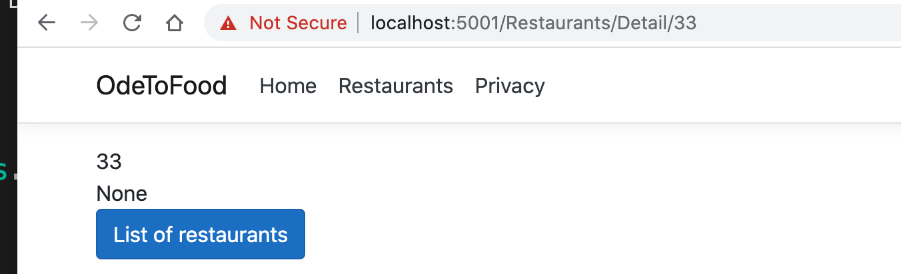
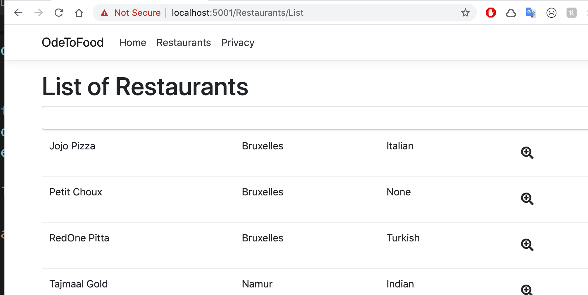
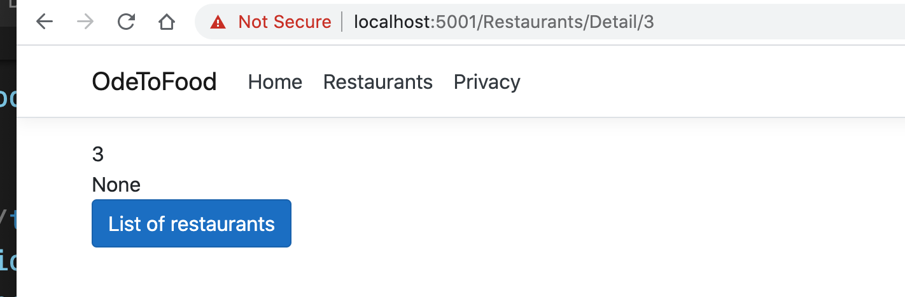

# 08. Passer des données entre deux pages

## Par les `query string`

`Detail.cshtml.cs`

```csharp
using // ...

namespace OdeToFood.Pages.Restaurants
{
    public class DetailModel : PageModel
    {
        public Restaurant Restaurant { get; set; }

        public void OnGet(int restaurantId)
        {
            Restaurant = new Restaurant();
            Restaurant.Id = restaurantId;
        }
    }
}
```

`List.cshtml`

```csharp
<!-- ... -->

<table class="table">
    @foreach (var restaurant in Model.Restaurants)
    {
        <tr>
            <td>@restaurant.Name</td>
            <td>@restaurant.Location</td>
            <td>@restaurant.Cuisine</td>
            <td>
                <a class="btn btn-lg" asp-page="./Detail" asp-route-restaurantId="@restaurant.Id">
                    <i class="fa fa-search-plus"></i></a>
            </td>
        </tr>
    }
</table>
```

`asp-page` permet de relier au chemin d'une page.

`asp-route-xxx` cet attribut dynamique transforme `xxx` en clé dans le `query string` :



## `URL` du type `/restaurant/Detail/12`

### Dans `Detail.cshtml` on va spécifier la directive `@page` :

On pourrait changer l'`url` d'accès en :

```csharp
@page "Infos"
```



Ou ajouter un paramètre optionnel:

```csharp
@page "{restaurantId?:int}"
```

On va juste ajouter un paramètre obligatoire de type `:int`

```cs
@page "{restaurantId:int}"
```



Sans changer le code de `List.cshtml`, le lien mène maintenant vers l'`url` modifié.

`asp-route-restaurantId="@restaurant.Id"` est un lien dynamique qui va prendre en compte la directive `@page` de `Detail.cshtml`.





En cliquant sur le troisième restaurant, j'ai bien une `url` de type `Restaurants/Detail/3` (et c'est automatique).
