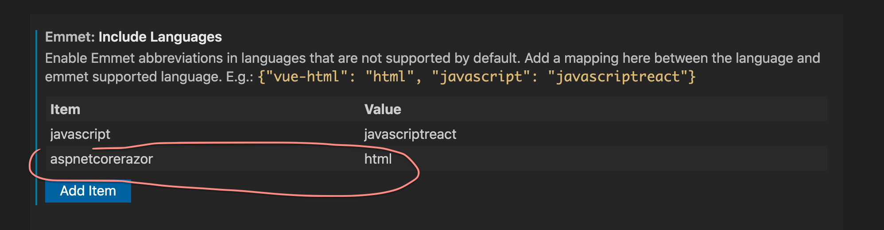
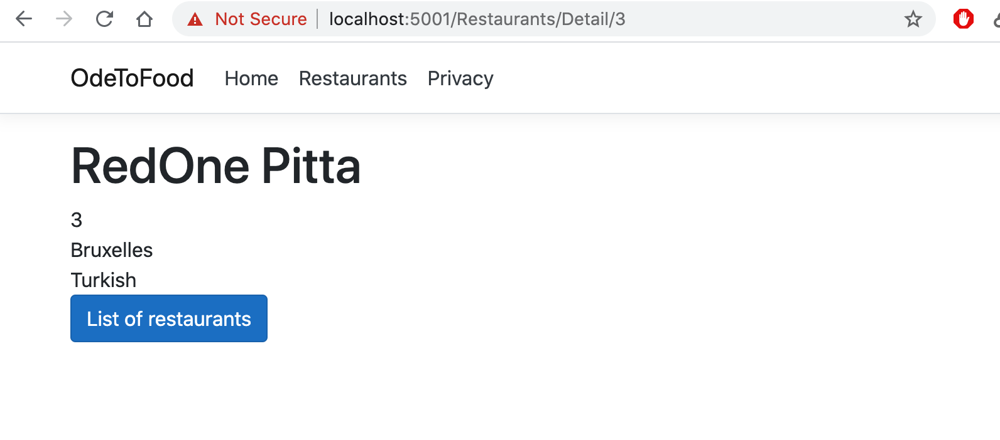

# AA VSCode tips

### Quick Fix

Pour faire apparaître les fix aller sur le mot souligné et faire `shift` + `cmd` + `;` (`cmd`+ `.`)

### Display Overloads

`shift` + `command` + `space` pour obtenir les surcharges de la méthode (`overloads`).

### Expend Emmet VSCode

Permettre à `emmet` de fonctionner dans les pages `razor` : settings



## `GetById`

On veut maintenant récupérer un restaurant par son `Id`

Dans `IRestaurantData.cs`

```cs
using System.Collections.Generic;
using OdeToFood.Core;
using System.Linq;

namespace OdeToFood.Data
{
    public interface IRestaurantData
    {
        IEnumerable<Restaurant> GetRestaurantsByName(string name);
        Restaurant GetById(int id);
    }

    public class InMemoryRestaurantData : IRestaurantData
    {
		// ...

        public Restaurant GetById(int id) => restaurants.SingleOrDefault(r => r.Id == id);

        // ...
    }
}
```

On doit ajouter une méthode à l'interface puis l'implémenter.

Seule l'interface est passée en injection aux pages.

`SingleOrDefault` est une méthode de `System.Linq` et prend un prédicat en argument.

Ensuite on injecte via le constructeur `IRestaurantData` dans `Detail.cshtml.cs` :

```csharp
using // ...;

namespace OdeToFood.Pages.Restaurants
{
    public class DetailModel : PageModel
    {
        public Restaurant Restaurant { get; set; }
        private readonly IRestaurantData restaurantData;

        public DetailModel(IRestaurantData restaurantData)
        {
            this.restaurantData = restaurantData;
        }

        public void OnGet(int restaurantId)
        {
            Restaurant = restaurantData.GetById(restaurantId);
        }
    }
}
```

Cette fois on retourne bien un restaurant :


