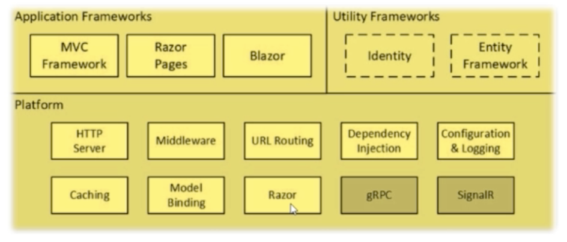
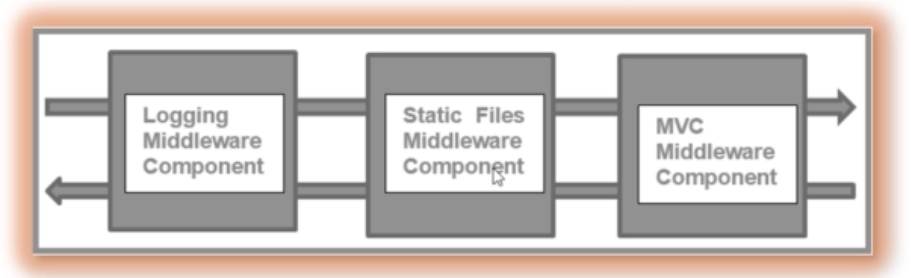

# 01 The `Big` Picture

`gRPC` google Remote Procedure Calls

`asp.net core` a trois fonctionnalités clé :

- Middleware Component
- Request Pipeline
- Services

## Middleware Component

Chaque `middleware` agit sur la requête ou la réponse.

L'ensemble des `middlewares` forme la `Request Pipeline`.

Chaque `middleware` par le relais au suivant du `pipeline` en appelant la méthode `Next`.

On voit ici les `built-in` `middleware`

- `Logging`
- `Static Files`
- `MVC`

## Request Pipeline

L'ensemble de la chaîne des `middlewares`.

## Services

Les `services` sont des classes disponibles partout dans l'application grâce à la `Dependancy Injection`.

`.net mvc` a un conteneur d'injection de dépendances qui est responsable de l'instanciation des `services` et de les fournir aux différents composants.

Le conteneur est aussi responsable de passer les services plus utilisés au `garbage collector` : `Dispose`.

Il y a plusieurs `services` `built-in` :

`ILogger` pour les log,

`IConfiguration` pour utiliser la configuration des fichiers `json` ,

et bien d'autres.

Tout comme on peut créer des `Custom Middleware`, on peut aussi créer des `Custom Service`.

## MVC

### `Controller`

C'est lui qui reçoit la `request` à la fin du traitement par le `pipeline`.

Alors il décide de quelle `View` renvoyer avec quelles données.

`MVC` est à propos de la séparation des responsabilités (`Separation Of Concerns`).

`asp.net mvc` utilise les **conventions** plutôt que la **configuration**.