# 02 Boiler Plate

## Créer une application d'exemple

Voici les différents types de projets possible en `asp` :

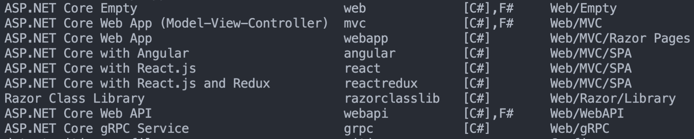

On créer une app `MVC` avec authentification `Windows`

```bash
dotnet new mvc --auth Windows -rrc -o Introduction
```

`--auth Windows` authentification avec  `Windows`

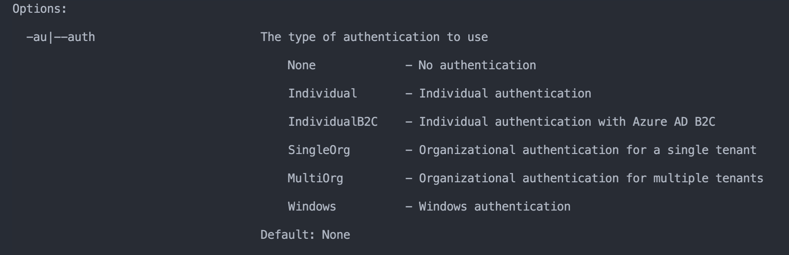

On utilise aussi `Razor runtime compilation` :

```bash
  -rrc|--razor-runtime-compilation  Determines if the project is configured to use Razor runtime compilation in Debug builds.                                                              
                                    bool - Optional                                                                                                                                        
                                    Default: false 
```

## `URL`

Dans `asp.net core mvc` les `URL` ne dont pas basé sur des fichiers (`File Based`) :

```
https://www.fda.gov/ucm/groups/documents/document/ucm509432.pdf
```

Mais ce sont des `URL` sémantiques (`URL Based`) :

```
https://localhost:5001/Home/Privacy
```

l'`URL` contient différent segments : `controller`/`action`


## `Convention` plutôt que `Configuration`

Il y a des conventions de nommage à suivre avec `.net mvc`, par exemple les contrôleur commence par le nom du contrôleur suivi par le mot `controller` : `HomeController` par exemple.


## IActionResult

C'est le type générique de retour d'une action (méthode d'un contrôleur).

Tous les autres types de retour d'une action dérive de ce type `IActionResult`.

```cs
public IActionResult Index()
{
  return View();
}
```

C'est le contrat le plus générique, on essaye normalement d'être le plus spécifique possible en sortie (`return`) et le plus générique possible en entrée (`parameters`).

Dans ce cas on devrait plutôt utiliser `ViewResult` car on sait que c'est une `View` qui est renvoyée.

```cs
public ViewResult Index()
{
  return View();
}
```

Si mon contrôleur peut renvoyer plusieurs type de réponse (par exemple `JsonResult` et `ViewResult`) alors il est intérressant d'utiliser `IActionResult` en retour :

```cs
public IActionResult Index(string mode)
{
  if (mode == "json")
  {
    return Json(new { nameof = "coco", size = 5 });
  }

  return View();
}
```

> ### `Json(obj)`
>
> Cette méthode renvoie un `JsonResult`, elle prend un objet en paramètre et renvoie sa représentation en `json`.


##  `ILogger`

`.net mvc` fournit de base un service de `log` par injection de dépendances :

```cs
private readonly ILogger<HomeController> _logger;

public HomeController(ILogger<HomeController> logger)
{
  _logger = logger;
}
```

On peut utiliser ce `logger` dans notre code pour afficher (`console` ou `fichier`) des informations :

```cs
public IActionResult Index()
{
  _logger.LogInformation("Hey I'm in the Index Action !");
  return View();
}

public IActionResult Privacy()
{
  _logger.LogInformation("Hey I'm in the Privacy Action !");
  return View();
}
```

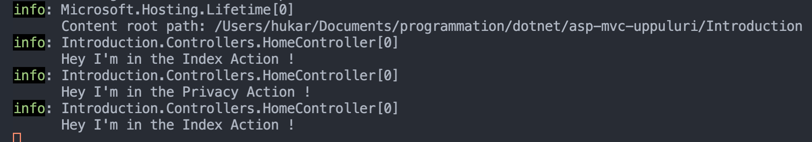


## `Properties/launchSettings.json`

C'est ici que se trouve la configuration pour `IIS` :

```json
{
  "iisSettings": {
    "windowsAuthentication": true,
    "anonymousAuthentication": false,
    "iisExpress": {
      "applicationUrl": "http://localhost:12328",
      "sslPort": 44377
    }
  },
  // ...
}

```

On observe que `windowsAuthentication` est à `true`.

Ensuite on a deux autres configurations :

Une pour `IIS Express`

```json
"IIS Express": {
  "commandName": "IISExpress",
  "launchBrowser": true,
  "environmentVariables": {
    "ASPNETCORE_ENVIRONMENT": "Development",
    "ASPNETCORE_HOSTINGSTARTUPASSEMBLIES": "Microsoft.AspNetCore.Mvc.Razor.RuntimeCompilation"
  }
```

Et une pour `Kestrel`

```json
"Introduction": {
  "commandName": "Project",
  "dotnetRunMessages": "true",
  "launchBrowser": true,
  "applicationUrl": "https://localhost:5001;http://localhost:5000",
  "environmentVariables": {
    "ASPNETCORE_ENVIRONMENT": "Development",
    "ASPNETCORE_HOSTINGSTARTUPASSEMBLIES": "Microsoft.AspNetCore.Mvc.Razor.RuntimeCompilation"
  }
}
```

Il peut être intérressant de mettre `launchBrowser` à `false`.

C'est aussi ici qu'on définit l'`environment` ici `Development`.


## `appSettings.json`

C'est ici qu'on va stocker toutes les clé/valeur dont on va avoir besoin.

Par exemple les `Connection Strings`, ou bien le niveau de `log` qui déjà présent par défaut :

```json
{
  "Logging": {
    "LogLevel": {
      "Default": "Information", // <= ici configuré sur Information
      "Microsoft": "Warning",
      "Microsoft.Hosting.Lifetime": "Information"
    }
  },
  "AllowedHosts": "*"
}
```


## `ViewData`

Les données définies par `ViewData` dans une page donnée sont transmises au `layout` qui les contient :

```cs
// page Index.cshtml
@{
    ViewData["Title"] = "Home Page";
}

<div class="text-center">
  <!-- ... -->
```

Et dans le `_Layout.cshtml` :

```cs
<!DOCTYPE html>
<html lang="en">
<head>
    <meta charset="utf-8" />
    <meta name="viewport" content="width=device-width, initial-scale=1.0" />
    <title>@ViewData["Title"] - Introduction</title>
```

On utilise `@ViewData` dans le `template`.


## `@User.Identy.Name`

Fait partie des fonctionnalités activées avec l'authentification (ici paramètrée sur `Windows`).

```csharp
<p class="nav navbar-text">Hello, @User.Identity.Name!</p>
```


## `@RenderBody()`

Signale l'endroit où les pages enfants seront rendues.

```csharp
<div class="container">
  <main role="main" class="pb-3">
    @RenderBody()
  </main>
</div>
```


## Les `Section`

On peut rendre de manière `async` des sections de notre `Layout` :

```cs
@await RenderSectionAsync("Scripts", required: false)
```


## `_ViewImports.cshtml`

Permet de rendre disponible des élements dans les `View`.

```csharp
@using Introduction
@using Introduction.Models
@addTagHelper *, Microsoft.AspNetCore.Mvc.TagHelpers
```

Par défaut on a les espaces de noms `Introduction` et `Introduction.Models` qui son disponible.

On ajoute aussi tous les `Tag Helper` built-in de la librairie (`package` ?) `Microsoft.AspNetCore.Mvc.TagHelpers`.


## `_ViewStart.cshtml`

C'est ici qu'est défini le `Layout` de base :

```cs
@{
    Layout = "_Layout";
}
```


## `_ValidationScriptsPartial.cshtml`

C'est un `partial` qui référence les scripts `jquery` de validation côté client.

```html
<script src="~/lib/jquery-validation/dist/jquery.validate.min.js"></script>
<script src="~/lib/jquery-validation-unobtrusive/jquery.validate.unobtrusive.min.js"></script>
```

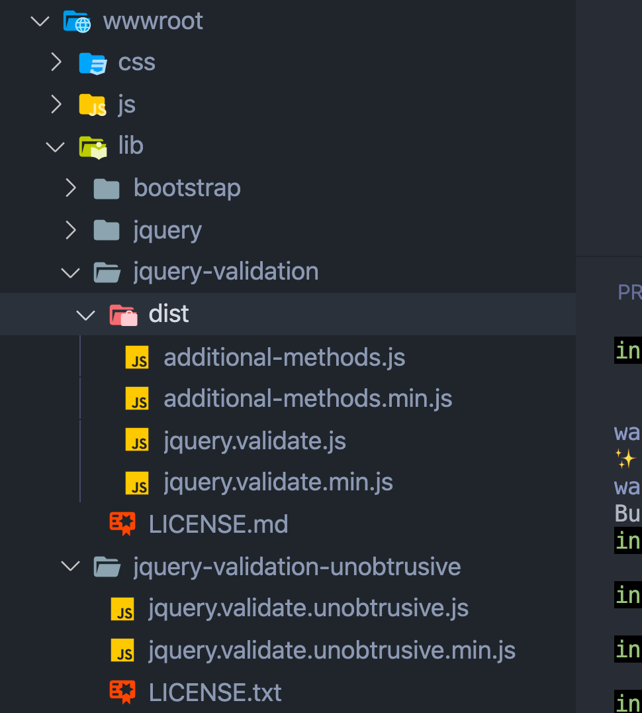

`~` dans l'`url` correspond au dossier `wwwroot`.


## `Views/Shared/Error.cshtml`

C'est une page d'erreur pré-formaté.

```csharp
@model ErrorViewModel
@{
    ViewData["Title"] = "Error";
}

<h1 class="text-danger">Error.</h1>
<h2 class="text-danger">An error occurred while processing your request.</h2>

@if (Model.ShowRequestId)
{
    <p>
        <strong>Request ID:</strong> <code>@Model.RequestId</code>
    </p>
}

<h3>Development Mode</h3>
<p>
    Swapping to <strong>Development</strong> environment will display more detailed information about the error that occurred.
</p>
<p>
    <strong>The Development environment shouldn't be enabled for deployed applications.</strong>
    It can result in displaying sensitive information from exceptions to end users.
    For local debugging, enable the <strong>Development</strong> environment by setting the <strong>ASPNETCORE_ENVIRONMENT</strong> environment variable to <strong>Development</strong>
    and restarting the app.
</p>

```

Pourtant si j'ajoute une erreur dans mon contrôleur :

```cs
public IActionResult Index()
        {
            _logger.LogInformation("Hey I'm 🍖 in the Index Action !");
            int a, b, c;
            a = 10;
            b = 0;
            c = a / b;
            return View();
        }
```

C'est une autre page que je vais voire :

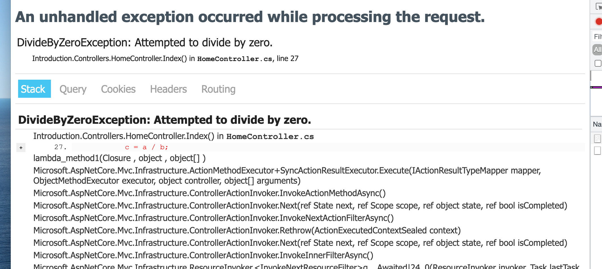

C'est parce qu'on a configuré les `DeveloperExceptionPage` dans la méthode `Configure` du fichier `Startup.cs` :

```cs
public void Configure(IApplicationBuilder app, IWebHostEnvironment env)
{
  if (env.IsDevelopment())
  {
    app.UseDeveloperExceptionPage();
  }
  else
  {
    app.UseExceptionHandler("/Home/Error");
    // The default HSTS value is 30 days. You may want to change this for production scenarios, see https://aka.ms/aspnetcore-hsts.
    app.UseHsts();
  }
```

On peut changer ce comportement :

```cs
public void Configure(IApplicationBuilder app, IWebHostEnvironment env)
{
  app.UseExceptionHandler("/Home/Error");
```

Et on a du coup notre template `Error.cshtml` :

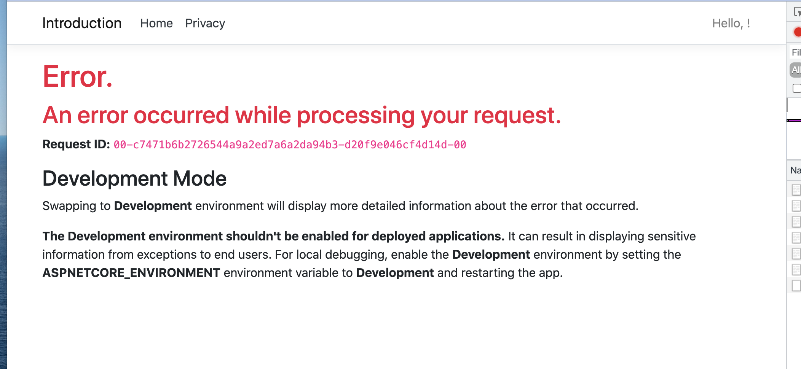

Pour tester, j'aurai pû tout simplement changer la valeur de `ASPNETCORE_ENVIRONMENT` dans le fichier `Propereties/launchSettings.json` :

```json
"Introduction": {
  "commandName": "Project",
  "dotnetRunMessages": "true",
  "launchBrowser": false,
  "applicationUrl": "https://localhost:5001;http://localhost:5000",
  "environmentVariables": {
    "ASPNETCORE_ENVIRONMENT": "Production",
    "ASPNETCORE_HOSTINGSTARTUPASSEMBLIES": "Microsoft.AspNetCore.Mvc.Razor.RuntimeCompilation"
  }
}
```

On obtient cette page car dans le `HomeController` on a une action `Error` :

```cs
[ResponseCache(Duration = 0, Location = ResponseCacheLocation.None, NoStore = true)]
public IActionResult Error()
{
  return View(new ErrorViewModel { RequestId = Activity.Current?.Id ?? HttpContext.TraceIdentifier });
}
```

Si une page (`View`) n'est pas dans le dossier du `controller`, elle sera automatiquement cherchée dans le dossier `Shared`.

C'est ainsi que des contrôleur peuvent se partager une page particulière (ici `Error`).


# `Program.cs`

C'est un point d'entrée qui démarre comme une application console et qui va configurer et lancer une `asp.net core` application.

Après cela c'est une `asp.net core` web application qui tourne.


## `IHost`, `IHostBuilder` et `Host`

`IHost` représente un `host` configuré.

`IHostBuilder` un *constructeur* pour `IHost`.

`IHostBuilder.Build()` construit un `IHost` qui va héberger la web application.

`IHost.Run()` fait tourner la web application.

`Host` fournit des méthodes pour créer des instances de `IHost` et `IHostBuilder` pré-configuré par défaut.

`Host.CreateDefaultBuilder(args)` retourne une instance de la classe `HostBuilder` qui est pré-configurée par défaut.

La ligne de code suivante :

```cs
public static void Main(string[] args)
{
  CreateHostBuilder(args).Build().Run();
}
```

Peut être remplacée par :

```cs
public static void Main(string[] args)
{
  IHostBuilder builder = CreateHostBuilder(args);
  IHost host = builder.Build();
  host.Run();
}
```

On créé un `builder` qui va lui même créer un `host` puis on fait tourner ce `host`.


## `CreateHostBuilder`

```cs
public static IHostBuilder CreateHostBuilder(string[] args) =>
            Host.CreateDefaultBuilder(args)
                .ConfigureWebHostDefaults(webBuilder =>
                {
                    webBuilder.UseStartup<Startup>();
                });
```

`CreateDefaultBuilder` retourne un `IHostBuilder` configuré par défaut puis `ConfigureWebHostDefaults` va appliqué la configuration par défaut pour une **web application**.

C'est ici que la main va être passé au fichier `Startup.cs`.


## `ConfigureWebHostDefaults`

> **Traduction des metadata**
>
> Résumé :
> Configure un `Microsoft.Extensions.Hosting.IHostBuilder` avec des valeurs par défaut pour l'hébergement d'une application web.
>         
> Paramètres :
>    builder :
>      L'instance de `Microsoft.Extensions.Hosting.IHostBuilder` à configurer.
>             
>    configure :
>       Le callback de configuration
>             
>    Retourne :
>       Une référence au `builder` une fois l'opération terminée.
>             
>    Remarques :
>       Les valeurs par défaut suivantes sont appliquées au  `Microsoft.Extensions.Hosting.IHostBuilde` :
>     - utiliser `Kestrel` comme serveur web et le configurer en utilisant le `provider` de la configuration de l'application.
>         - configurer `Microsoft.AspNetCore.Hosting.IWebHostEnvironment.WebRootFileProvider` pour inclure les `assets` web statiques des projets référencés par l'`assembly` d'entrée pendant le
>             développement
>             - ajoute le middleware `HostFiltering`
>             - ajoute le middleware `ForwardedHeaders` si `ASPNETCORE_FORWARDEDHEADERS_ENABLED=true`,
>             - activer l'intégration IIS


# `Startup.cs`

Ce fichier est responsable de deux choses :

1. Configurer les `services` => `ConfigureServices`
2. Configurer le `Request Pipeline` => `Configure`

Le constructeur de `Startup` accepte les dépendances stipulées par le `host`.

`ConfigureServices` est appelée par le `host` avant `Configure`.

Le `Request Pipeline` est configuré en ajoutant des composants middleware a une instance de `IApplicationBuilder`.


## `IConfiguration configuration`

```cs
public Startup(IConfiguration configuration)
{
  Configuration = configuration;
}

public IConfiguration Configuration { get; }
```

Ce service est injecté par le `host` dans le constructeur de `Startup`.

Il permet d'accéder aux couples clé/valeur du fichier `appsettings.json`.

Par exemple c'est l'objet `Configuration` qui va nous permettre de récupérer le `connections string`.


## `IServiceCollection`

```cs
public void ConfigureServices(IServiceCollection services)
{
  services.AddControllersWithViews();
}
```

Chaque nouveau `service` est ajouté au conteneur de `services` : `IServiceCollection`.

Celui-ci se charge de fournir les `services` aux composants de l'application et d'appeler le `Garbage Collector` quand l'utilisation du `service` est terminée.


## `Configure`

```cs
public void Configure(IApplicationBuilder app, IWebHostEnvironment env)
{
  if (env.IsDevelopment())
  {
    app.UseDeveloperExceptionPage();
  }
  else
  {
    app.UseExceptionHandler("/Home/Error");
    app.UseHsts();
  }
  app.UseHttpsRedirection();
  app.UseStaticFiles();

  app.UseRouting();

  app.UseAuthorization();

  app.UseEndpoints(endpoints =>
                   {
                     endpoints.MapControllerRoute(
                       name: "default",
                       pattern: "{controller=Home}/{action=Index}/{id?}");
                   });
}
```

Cette méthode accepte deux arguments, `app` qui est un `IApplicationBuilder` et `env` de type `IWebHostEnvironment`.

`env` va nous permettre de savoir si on est en `Development` ou en `Production` (ou en `Staging`).

l'`IApplicationBuilder` utilise des méthodes d'extension commençants toutes par `UseSomething` pour configurer le `Request Pipeline`.


## `app.UseStaticFiles`

C'est un serveur de fichier, on peut accéder au fichier dans le navigateur grâce à son chemin physique :

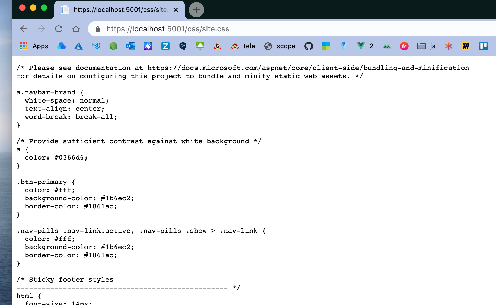

Si on commente `app.UseStaticFiles()`, l'application ne pourra plus fournir de fichier statique au navigateur avec leur adresse physique.


## `app.UseRouting`

C'est ce `middleware` qui permet à l'application de savoir quelle action contacter par rapport à une `URL` donnée.

Ce `middleware` utilise un autre `middleware` : `UseEndpoints` pour savoir comment les routes sont configurée.

Un `middleware` placé entre ces deux `middlewares` peut observer ou changer le `endpoint` qui sera contacté par la route.

```cs
app.UseRouting();

app.UseAuthorization(); // <= capable de modifier le endpoint

app.UseEndpoints(endpoints =>
                 {
                   endpoints.MapControllerRoute(
                     name: "default",
                     pattern: "{controller=Home}/{action=Index}/{id?}");
                 });
```

`app.UseRouting` et `app.UseEndpoints` doivent toujours être utilisés ensemble.

L'ordre des `middlewares` est très important et `UseAuthorization`ne pourrait pas être placé ailleurs.


# Le concept de `section`

Dans le fichier `_Layout.cshtml` on a le code suivant :

```cs
	@await RenderSectionAsync("Scripts", required: false)
</body>  
```

Le premier argument est le nom de la `section`

 Dans une `View` par exemple `Index.cshtml` on peut définir une `@section` :

```csharp
@{
    ViewData["Title"] = "Home Page";
}

<div class="text-center">
    <h1 class="display-4">Welcome</h1>
    <p>Learn about <a href="https://docs.microsoft.com/aspnet/core">building Web apps with ASP.NET Core</a>.</p>
</div>

@section Scripts
{
      
}
```

Le contenu de cette `section` sera rendu dans le layout à l'emplacement de `RenderSectionAsync`.

Le deuxième paramètre : `required: false` permet de créer des `View` avec ou sans la `section` `Scripts`. Par exemple `Index` a une `@section Scripts` alors que `Privacy` n'en a pas.

Si on met ce paramètre à `true`, la section devient obligatoire :

```cs
@await RenderSectionAsync("Scripts", required: true)
```

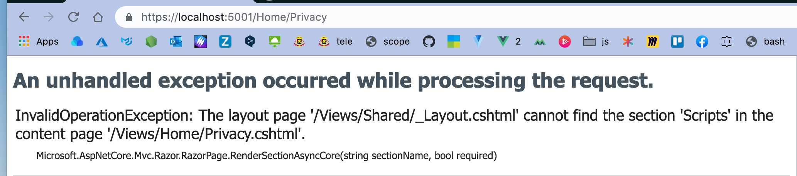

On peut ainsi par exemple associer certain fichier `js` à certaine `View` :

```cs
<div class="text-center">
    <h1 class="display-4">Welcome</h1>
    <p>Learn about <a href="https://docs.microsoft.com/aspnet/core">building Web apps with ASP.NET Core</a>.</p>
</div>

@section Scripts
{
     <script src="~/js/forIndex.js" asp-append-version="true"></script> 
}
```

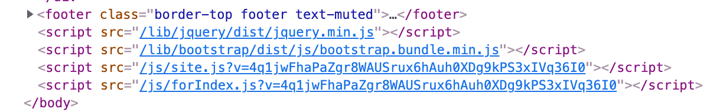

On voit qu'un `token` a été ajouté au nom du fichier, c'est à cause du `Tag Helper` : `app-append-version`. Pour l'instant on va le retirer :

```html
<script src="~/js/forIndex.js"></script> 
```

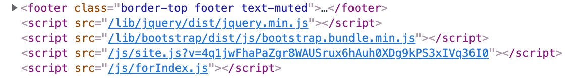


## Plusieurs `sections`

On peut bien sûr définir plusieurs `sections` :

`Index.cshtml`

```cs
<div class="text-center">
    <h1 class="display-4">Welcome</h1>
    <p>Learn about <a href="https://docs.microsoft.com/aspnet/core">building Web apps with ASP.NET Core</a>.</p>
</div>

@section MyMessage
{
<p style="font-size: 28px">here my message 🐷</p>
}

@section Scripts
{
<script src="~/js/forIndex.js"></script>
}
```

`_Layout.cshtml`

```cs
<footer class="border-top footer text-muted">
        <div class="container">
            &copy; 2021 - Introduction - 
              <a asp-area="" asp-controller="Home" asp-action="Privacy">
              	Privacy
              </a>
            @await RenderSectionAsync("MyMessage", required: false)
        </div>
    </footer>
              
    <script src="~/js/site.js" asp-append-version="true"></script>
    @await RenderSectionAsync("Scripts", required: false)
</body>
```

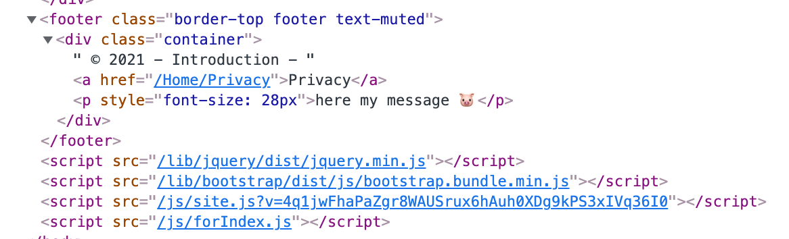

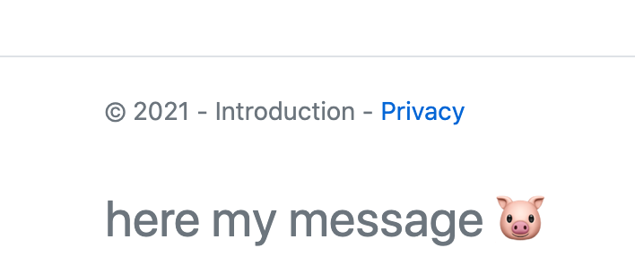


