# 03 Créer son `middleware`

## Créer le `middleware` dans `Startup`

`IApplicationBuilder` possède une méthode `Use` cette méthode prend en paramètre une `delegate` qui sera le `middleware`.

> Un `delegate` est un `type` représentant une référence vers une méthode avec une liste de paramètre et un type de retour particulier.
>
> ```cs
> public delegate string AgeDelegate(int age);
> 
> public class Coco
> {
>   public static string LieOnMyAge(int age) => $"My age : {age + 10}";
> }
> static void Main(string[] args) {
>   var ageCoco = new AgeDelegate(Coco.LieOnMyAge);
>   Console.WriteLine(ageCoco(45));
> }
> ```
>
> ```
> My age : 55
> ```

```cs
app.Use(async (context, next) => {
  if(context.Request.Method == HttpMethods.Get && context.Request.Query["iscertified"] == "true")
  {
    await context.Response.WriteAsync("Message from custom Middleware \n");
    await next();
  }
})
```

Le `context` accède à la `Requset` et à la `Response`, c'est un objet de type `HttpContext`.

C'est aussi dans `HttpContext` qu'on va récupérer le `user`.

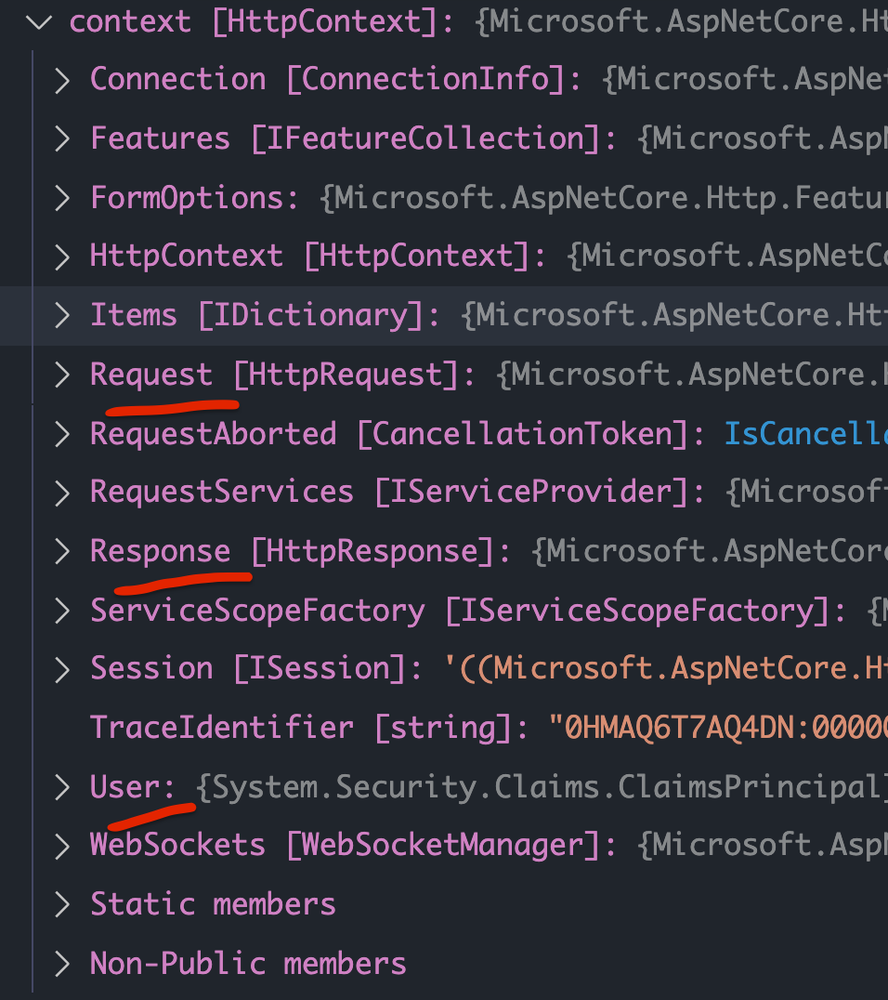

`next` appelle le prochain `middleware` du `pipeline`, c'est une fonction `async`.

`HttpMethods` fait partie de `Microsoft.AspNetCore.Http`.

`Query["..."]` récupère la valeur d'un `query string`.

On ajoute maintenant une route pour le test :

```cs
app.UseEndpoints(endpoints => {
  endpoints.MapGet("/", async context => 
                   await context.Response.WriteAsync("Hello Kiki"));
  
  // ...
})
```

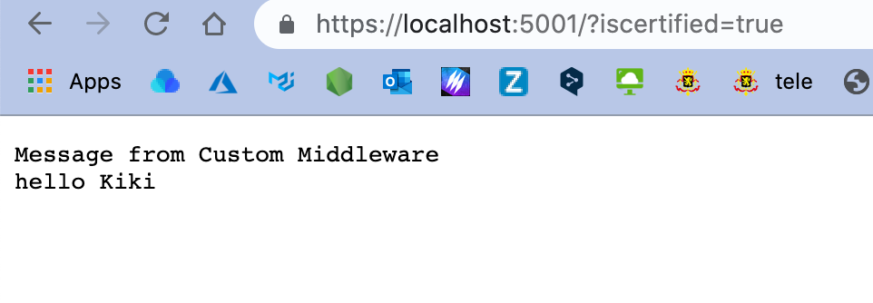

## Créer un `Custom Middleware` dans une classe séparée

On peut créer ses `middlewares` à l'aide de classe.

On ajoute d'abord un dossier `Middlewares` et dedans la classe `RequestQueryStringMiddleware`.

```cs
public class RequestQueryStringMiddleware
{
  private RequestDelegate next;
  
  public RequestQueryStringMiddleware(RequestDelegate nextDelegate)
  {
    next = nextDelegate;
  }
  
  public async Task Invoke(HttpContext context)
  {
    if(context.Request.Method == HttpMethods.Get && context.Request.Query["iscertified"] == "true")
    {
      await context.Response.WriteAsync("Hello from Class-Based Middleware \n");
    }
    
    await next(context);
  }
}
```

Le constructeur de la classe reçoit une méthode `next` de type `RequestDelegate`.

Le `middleware` contient une méthode particulière : `Invoke`.

Cette méthode est asynchrone est renvoie une `Task`, elle prend le `context` en paramètre.

C'est de sa responsabilité d'appeler `next`, cette fois on lui passe explicitement le `context` (contrairement à la version `lambda` dans le fichier `Startup`).

La classe `RequestDelegate` faut partie de `Microsoft.AspNetCore.Http`.

la classe `Task` utilise `System.Threading.Tasks`.

C'est `asp.net core` qui appelle la méthode `Invoke` dans le `request Pipeline`.

Le `middleware` est ajouté au `Pipeline` grâce à la méthode `UseMiddleware` :

```cs
// Startup.cs

app.UseMiddleware<RequestQueryStringMiddleware>();
```

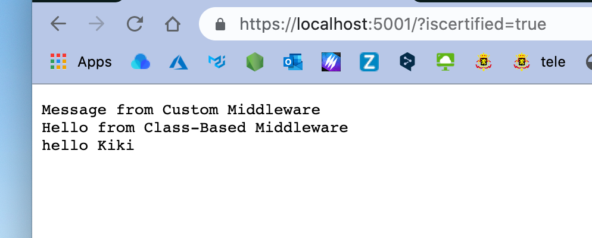


## Le chemin du retour du `Pipeline`

On veut modifier notre réponse même après que l'appel à `next` est été effectué.

On ajoute un nouveau middleware à notre `Pipeline`:

```cs
// ...
app.UseMiddleware<RequestQueryStringMiddleware>();

app.Use(async (context, next) => {
  await next();
  await context.Response.WriteAsync($"\nStatus Code: {context.Response.StatusCode}");
});
```

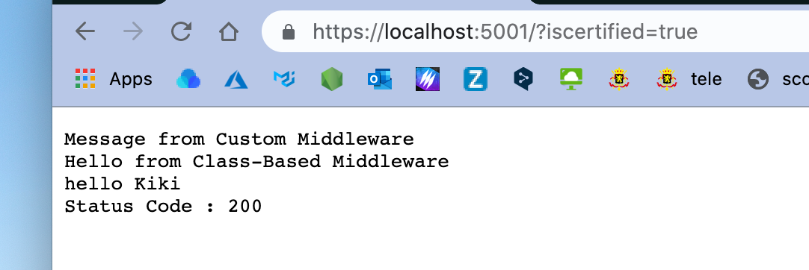

Le status code est ajouté à la réponse après que tous les `middleware` aient été appelés par le `pipeline`.

On peut donc midifier la `response` après que `next` ai été appelé.

Si on ajoute d'autre `middleware` avec ce comportement, on voit que l'appelle se fait dans le sens inverse du `pipeline` :

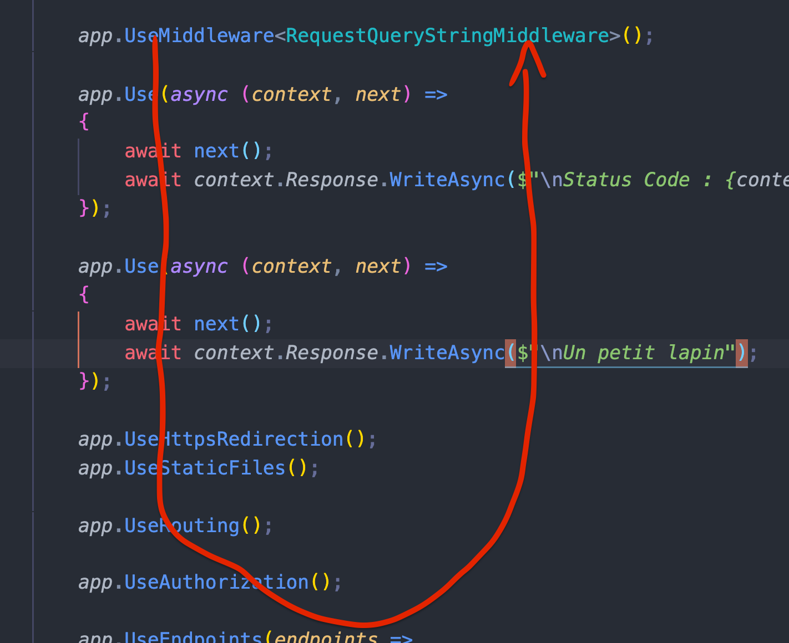

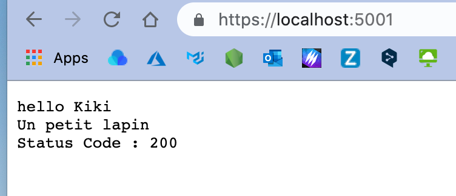


## Court-circuiter le `Request Pipeline`

Un `middleware` peut ne pas appeler la méthode `next`, dans ce cas on dit qu'il court-circuite le `Request Pipeline`.

```cs
app.Use(async (context, next) => {
  if(context.Request.Path == "/short")
  {
    await context.Response.WriteAsync($"Request short circuited");
  }
  else
  {
    await next();
  }
})
```

Suivant où se place le court-circuit, on peut avoir plusieurs scénario.

Ici il est placé après 

```cs
app.Use(async (context, next) => {
  await next();
  await context.Response.WriteAsync($"\nStatus Code: {context.Response.StatusCode}");
});
```

On a donc l'affichage suivant :

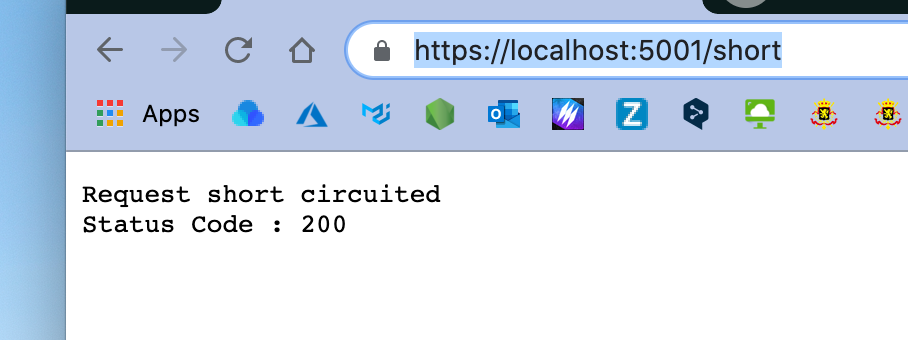

Et avec le `query string` :

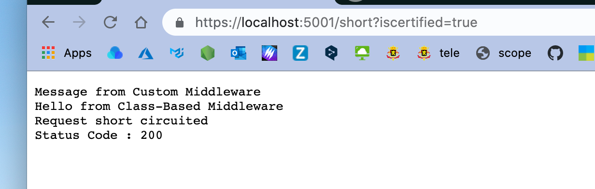


## Créer des branches dans le `Pipeline`

La méthode `Map` est utilisée pour créer des sections du `pipeline` pour une `url ` spécifique, créant une séquence unique de composants `middleware`.

Si une `url` correspond à une méthode `Map`, elle suis cette nouvelle branche et ne passe plus par le chemin principal de `middleware`.

```cs
// partie 1 du pipeline

// nouvelle branche partie 2
app.Map("/branch", branch => {
  branch.UseMiddleware<RequestQueryStringMiddleware>();
  branch.Use(async (context, next) => {
    await context.Response.WriteAsync("Branch Middleware");
  })
});

// suite de la partie 1 du pipeline
```

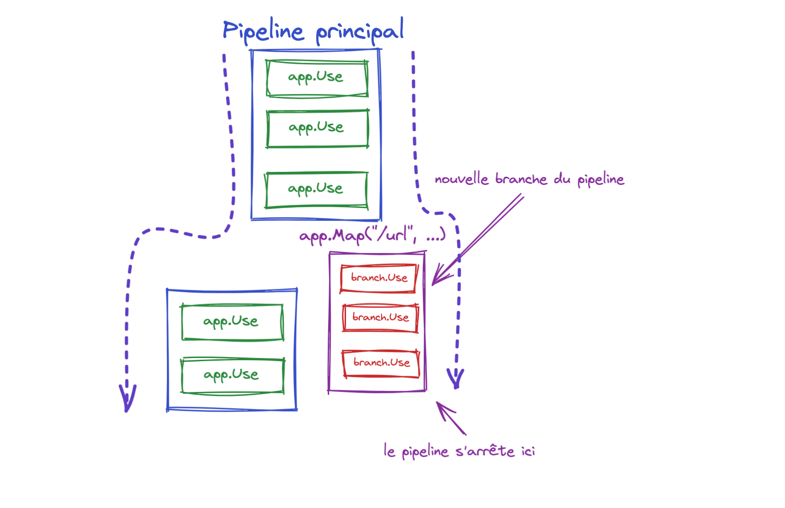

La méthode `Map` crée un branche correspondant à une `url`.

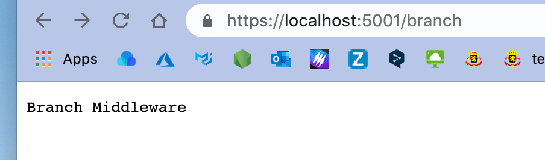

On n'a plus les `middlewares` définis après la branche (`use.Map`).

Ceux d'avant sont effectif, si on ajoute `?iscertified=true` on va observer leurs actions :

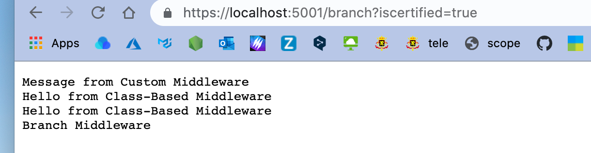


## Terminal `Middleware`

C'est un `middleware` qui termine toujours le `Request Pipeline`. Plus aucuns `middleware` n'est appelé après lui.

Il définit la fin du `Request Pipeline`.

Pour ce faire il faut utiliser `branch.Run` comme `Terminal Middleware`.

La méthode `Run` reçoit seulement le `context` (`HttpContext`), alle ne reçoit pas `next` car plus aucun `middleware` ne sera appelé après elle.

```cs
app.Map("/branch2", branch2 => {
  branch2.Run(new RequestQueryStringMiddleware().Invoke);
});
```

Pour pouvoir utiliser le `Class-Based Middleware` dans la méthode `Run`, on doit le modifier afin qu'il puisse être utilisé sans utiliser le `NextDelegate` :

On doit ajouter un constructeur sans argument et un appel conditionnel à `await Next(context);` :

```cs
public class RequestQueryStringMiddleware
{
  private RequestDelegate next;

  // constructor without RequestDelegate
  public RequestQueryStringMiddleware()
  {
  }
  // ...

  public async Task Invoke(HttpContext context)
  {
    // ...

    // await next(context);
    if(next != null)
    {
      await next(context);
    }
  }
}
```

Les conditions sont maintenant réunis pour utiliser `RequestQueryStringMiddleware` comme `Terminal Middleware`.


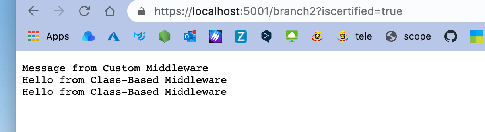

Si on veut explicitement définir un `middleware` comme `terminal` dans le `Request Pipeline`, on utilise alors la méthode `Run` dont le `delegate` ne prend que le `context` en argument.

On peut aussi définir un `Terminal Middleware` directement avec une `Lambda Function` :

```cs
app.Map("/branch", branch =>
        {
          branch.UseMiddleware<RequestQueryStringMiddleware>();
          branch.Run(async (context) =>
                     {
                       await context.Response.WriteAsync("Branch Run Middleware");
                     });
          branch.Use(async (context, next) =>
                     {
                       await context.Response.WriteAsync("Branch Middleware");
                     });

        });
```

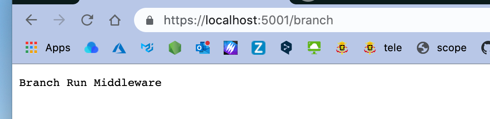

Le `middleware` suivant n'est jamais appelé.

```cs
app.Map("/branch", branch =>
        {
          branch.UseMiddleware<RequestQueryStringMiddleware>();
          branch.Use(async (context, next) =>
                     {
                       await context.Response.WriteAsync("Branch Middleware\n");
                       await next();
                     });
          branch.Use(async (context, next) =>
                     {
                       await context.Response.WriteAsync("Branch Middleware 2\n");
                       await next();
                     });
          branch.Run(async (context) =>
                     {
                       await context.Response.WriteAsync("Branch Run Middleware");
                     });

        });
```

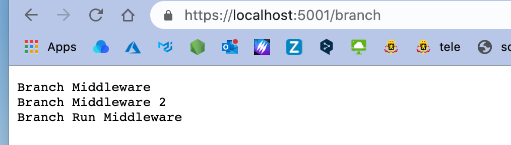


## `Options` Pattern

On va créer une classe `EmployeeLocationOptions` dans le dossier `Models` :

```cs
public class EmployeeLocationOptions
{
  public string CityName { get; set; } = "Los Angeles";
  public string CountryName { get; set; } = "USA";
}
```

On va changer ces valeurs dans le conteneur de `services` :

```cs
public void ConfigureServices(IServiceCollection services)
{
  services.AddControllersWithViews();

  services.Configure<EmployeeLocationOptions>(options => {
    options.CityName = "Atlanta";
    options.CountryName ="USA";
  });
```

On peut maintenant injecter un `IOptions` dans la méthode `Configure` :

```cs
using Microsoft.Extensions.Options;

// ...

public void Configure(IApplicationBuilder app, IWebHostEnvironment env, IOptions<EmployeeLocationOptions> locationOptions)
{
  // ...
  app.Use(async (context, next) => {
    if(context.Request.Path == "/Employeelocation")
    {
      EmployeeLocationOptions opts = locationOptions.Value;
      await context.Response.WriteAsync($"{opts.CityName}, {opts.CountryName}");
    }
    else
    {
      await next();
    }
  })
```

On essaye de démontré que le `middleware` peut accéder à des données du `Model`.

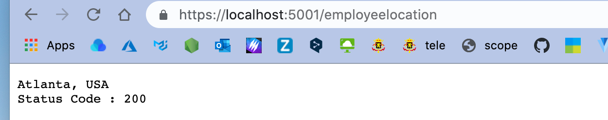


## `Class-Based Middleware` avec le `options` Pattern

On crée un nouveau `Class-Based Middleware` dans le dossier `Middlewares` :

`EmployeeLocationMiddleware`

```cs
public class EmployeeLocationMiddleware
{
  private RequestDelegate next;
  private EmployeeLocationOptions options;
  
  public EmployeeLocationMiddleware(RequestDelegate nextDelegate,IOptions<EmployeeLocationOptions> opts)
  {
    next = nextDelegate;
    options = opts.Value;
  }
  
  public async Task Invoke(HttpContext context)
  {
    if(context.Request.Path == "/Employeelocation2")
    {
      await context.Response.WriteAsync($"{options.CityName} 2, {options.CountryName} 2");
    }
    else
    {
      await next(context);
    }
  }
}
```

On l'utilise ensuite comme ceci dans `Startup.cs`:

```cs
app.UseMiddleware<EmployeeLocationMiddleware>();
```


