# 04 Les `controllers`

## Nouveau projet

Comme options on choisi `Enable Razor Runtime Compilation`.

```bash
dotnet new mvc -o TestController -rrc
```

`-rcc` `--razor-runtime-compilation`


## Création d'un `controller`

```cs
public class TestController : Controller
{
    public IActionResult Index() => View();
}
```

`asp.net mvc` est entièrement à propos des **conventions** plutôt que des **configurations**.

Les conventions de nom doivent être suivies.

Pour créer une `View` en relation à ce `controller`, il faut créer un dossier du nom du `controller`, ici `Test`, et un fichier du nom de l'`action`, `Index.cshtml`.

```cs
@{
    ViewData["Title"] = "Index";
}

<h1>Index</h1>
<h2>Hello Index Action</h2>
```


### Renvoyer du simple texte

On peut créer une `action` ne retournant qu'un simple `string` :

```cs
public string Index2() => "Welcome from Index 2 🌈";
```


### Spécifier le type de retour : `ViewResult`

On peut spécifier le type de manière plus précise avec `ViewResult` :

```cs
public ViewResult Index3() => View();
```

> ### Return the most specific type, accept the most generic type


### Avoir un nom de `view` différent du nom de l'`action`

On veut créer cette fois une `View` avec un nom différent de l'`action`, par exemple `Coco33.cshtml` :

```cs
@{
    ViewData["title"] = "Coco33";
}

<h1> Index 33 is here! </h1>
<h2>Hello From Index33 View</h2>
```

Cette fois il faut passer le nom de la `View` dans le retour du `controller` :

```cs
public ViewResult Index3() => View("Coco33");
```


### Passer des données du `controller` à la `view`

```cs
public ViewResult Index4()
{
    int hour = DateTime.Now.Hour;
    string viewModel = hour < 12 ? "Good morning" : "Good afternoon";
    return View(viewModel);
}
```

On crée bien sûr une `View` pour `Index4` :

```cs
@{
    ViewData["Title"] = "Index 4";
}

@model string
    
<h1>Hello to Index 3</h1>
<h2>@Model</h2>
```

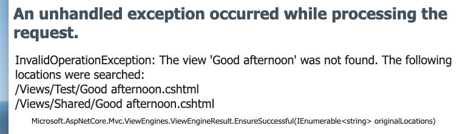

> La vue `Good afternoon` n'est pas trouvée.

Comme mon `viewModel` est juste un `string`, `asp.net mvc` le prend pour le nom de la `View` et du coup ne la trouve pas. Il suffit de passer le nom de la `View` en premier argument pour corriger ce problème :

```cs
return View("Index4", viewModel);
```

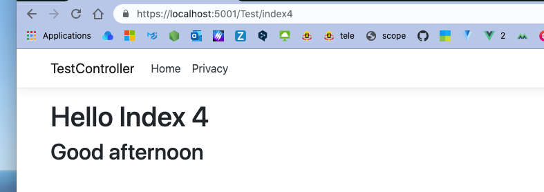

Pour utiliser les données passées à la `View` par le `controller`, il faut ajouter la directive `@model` à la `View` suivi du `type` de donnée attendu.

### `@model string`


### Modifier le `controller` de départ

Dans `Startup.cs` on peut changer le pattern de départ du routage :

```cs
app.UseEndpoints(endpoints =>
            {
                endpoints.MapControllerRoute(
                    name: "default",
                    //pattern: "{controller=Home}/{action=Index}/{id?}");
                    pattern: "{controller=Test}/{action=Index}/{id?}");


            });
```

Mon `controller` `Test` sera maintenant le `controller` par défaut.

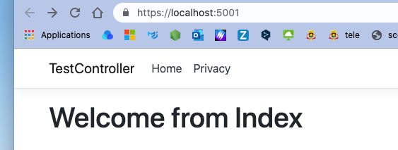


## `ViewBag`

### Utilisation de `ViewData`

`ViewData` va passer des données à la `View` au runtime.

Dans la `View` :

```cs
@{
    Viewdata["Title"] = "Coco 🐵 🙀";
}

<h1>Hello @Viewdata["Title"]</h1>
```

Dans le `_Layout` :

```cs
<title>@ViewData["Title"] - TestController</title>
```

On peut ajouter des valeurs dans le `controller` aussi :

```cs
public ViewResult Index()
{
    ViewData["MyQuote"] = "One for All 🤖";
    
    return View();
}
```

`Index.cshtml`

```cs
<h2>My prefered Quote : @ViewData["MyQuote"]</h2>
```

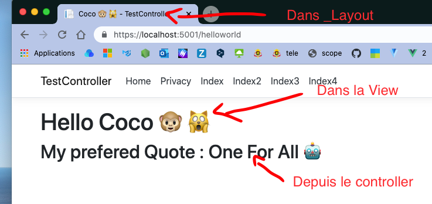


### `ViewBag`

La syntaxe est plus élégante que celle de `ViewData` mais cela fait la même chose.

```cs
public ViewResult TestBag()
{
    ViewBag.Name = "Olaf ⛄️";
    ViewBag.Season = "Winter ❄️";
    ViewBag.Food = "Ice Cream 🍦";
    
    return View();
}
```

```html
<p>Hey I'm @ViewBag.Name and I love @ViewBag.Season.</p>
<p>My favourite dessert is @ViewBag.Food</p>
```

`ViewBag` est passé automatiquement à la `View` sans qu'on ai besoin de le faire de manière explicite.


## Accéder au valeur des `Query String`

```cs
public ViewResult QueryStringDemo(string message = "Hello from default parameter value")
{
    ViewBag.Message = message;
    
    return View();
}
```

```html
<p>
     @ViewBag.Message
</p>
```

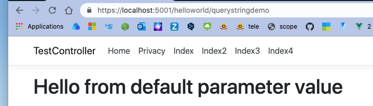

Maintenant en utilisant un `Query String` :


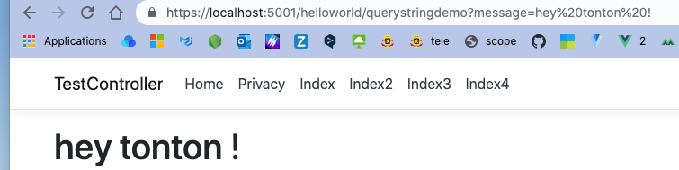

Il faut que le paramètre de l'`action` et le `query string` est le même nom , ici `message`.

Si on modifie `Startup.cs` :

```cs
app.UseEndpoints(endpoints =>
            {
                endpoints.MapControllerRoute(
                    name: "default",
                    pattern: "{controller=Test}/{action=Index}/{message?}");
            });
```

On a comme paramètre optionnel maintenant `message`, il faut ici aussi que le nom corresponde à celui du paramètre de l'`	action` :

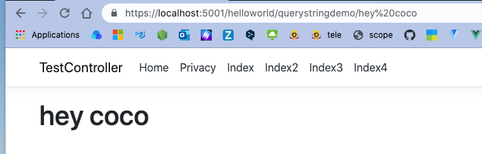


## Redirection : `Redirect(url)`

```cs
public IActionResult GoToUrl(string url="http://google.com")
{	
    return Redirect(url);
}
```

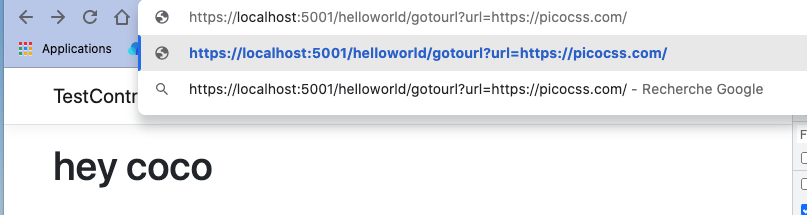

On utilise les `Query String` pour passer une `url` et la méthode `Redirect` pour ce rendre à cette adresse.

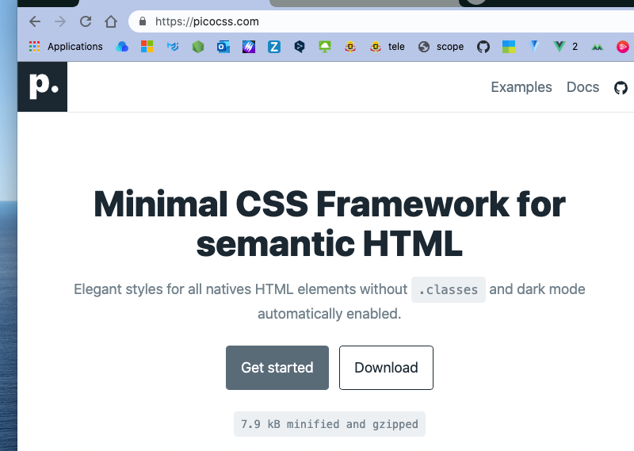

### La même chose avec la méthode `POST`

```html
<form asp-controller="HelloWorld" asp-action="GoToUrl" method="post">
    <label for="url">
        Url : <input class="form-control" id="url" name="url" type="text">
    </label>
    <button class="ml-5 btn btn-outline-primary">Submit</button>
</form>
```

La valeur de l'attribut `name` doit correspondre au nom du paramètre de l'`action`, ici `url`.

On utilise les `Tags Helpers`, leur import est défini dans le fichiers `_ViewImports.cshtml` :

```cs
@using TestController
@using TestController.Models
@addTagHelper *, Microsoft.AspNetCore.Mvc.TagHelpers
```

On peut retirer les `Tag Helpers` grâce à :

```cs
@removeTagHelper *, Microsoft.AspNetCore.Mvc.TagHelpers
```

On veut cette fois une `action` qui réponde à la méthode `POST` :

```cs
[HttpPost]
public RedirectResult GoToUrl(???)
{
  // ...
}
```

Cependant comme on a déjà une `action` avec un `string` comme paramètre, on va utiliser le type `IFormCollection` :

```cs
using Microsoft.AspNetCore.Http;
// ...

[HttpPost]
public RedirectResult GoToUrl(IFormCollection ifc)
{
  string url = ifc["url"];
  
  if(url == string.Empty)
  {
    return Redirect("http://google.com");
  }
  
  return Redirect(url);
}
```

Le `name` de l'élément de formulaire `html` est ici utilisé comme clé associative avec `IFormCollection`.


## `Custom Model`

On peut passer son propre `Model` à la `View`.

On remarque dans `_ViewImports.cshtml` que les `Models` sont importés dans les `View` :

```cs
@using TestController
@using TestController.Models // <= ici
@addTagHelper *, Microsoft.AspNetCore.Mvc.TagHelpers
```


On commence par créer un `Model` :

`Models/Author.cs`

```cs
public class Author
{
  public string Name { get; set; }
  public string Country { get; set; }
}
```

On instancie maintenant un `Author` dans le `controller` et plus précisément dans l'`action` `index` :

```cs
public ViewResult Index()
{
  ViewBag.Title = "Hello from Index";
  
  Author author = new Author {
    Name = "Connors Mac Greggor",
    Country = "USA"
  };
  
  return View(author);
}
```

Pour lier la `View` au `Model`, on utilise `@model <Type>` :

```cs
@{
    ViewData["Title"] = "Home Page";
}

@model Author


<div class="text-center">
    <h1 class="display-4"> @ViewBag.Title </h1>
    <p>@Model.Name</p>
    <p>@Model.Country</p>


    <form asp-controller="Home" asp-action="GoToUrl" method="post">
        <label for="url">Url :</label>
        <input class="form-control" name="url" type="text">
        <button class="btn btn-outline-secondary mt-5">Submit URL</button>
    </form>
</div>
```

On voit dans cette `View` 3 façon de passer les données :

- `ViewData`
- `ViewBag`
- `@model <Type>`

### `Strongly Typed Views`

L'instruction `@model` n'est pas obligatoire car les `View` sont calculée au `runtime`.

Le fait d'ajouter `@model Author` rend la `View` `Strongly Typed`.


## `RouteData`

On va créer un nouveau `controller` :

`RouteData` contient un dictionnaire `Values` avec les information sur l'`URL`.

`ShowURLElementController.cs`

```cs
public class ShowURLElementController : Controller
{
  public ViewResult Index()
  {
    string controller = RouteData.Values["controller"];
    string action = RouteData.Values["action"];
    string id = RouteData.Values["id"];

    string message = $"{controller} {action} {id}";

    ViewBag.Message = message;

    return View();
  }
}
```

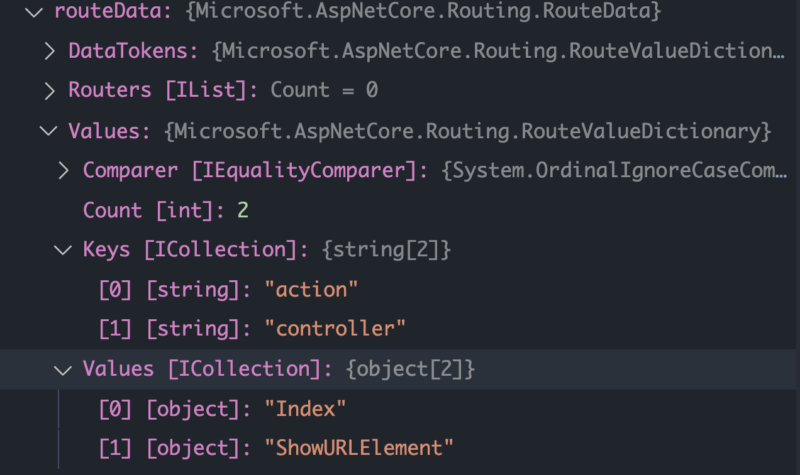

Cette fois avec un `id` :

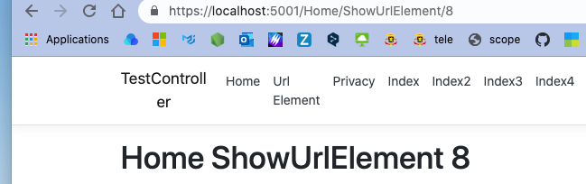

> ### **Pour rappel** `Request.Query`
>
> Pour récupérer la valeur d'une `Query String`, on utilise :
>
> ```cs
> var queryValue = Request.Query["name"];
> ```

