# Utiliser les différents types d'`IActionResult`

On peut retourner deux catégories d'`ActionResult`, un type générique : `IActionResult` ou bien un type spécifique comme par exemple `ContentResult`.

Si une action peut renvoyer plusieurs type spécifiques différents alors il vaut mieux utiliser `IActionResult`.

Sinon on utilise le type spécifique approprié.


## `ContentResult`

```cs
public ContentResult GreetUser() => Content("hello world from MVC Core 🍔");
```

Par défaut la réponse à un `Content-Type` : `text/plain; charset=utf-8`.

On peut aussi spécifier le `Content-Type` de la réponse :

```cs
public ContentResult GreetUser() 
    => Content("<h1>Hello Coco 🍄</h1>", "text/html; charset=utf-8");
```

Je passe le `charset` pour afficher correctement l'émoji :

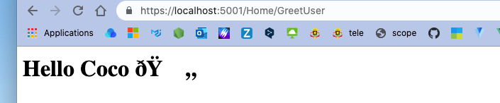

Ci-dessus avec juste `"text/html"`.

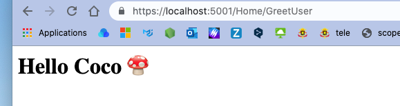

Cette fois avec `text/html; charset=utf-8`.

On peut jouer avec le `Type MIME` pour avoir une représentation dans le navigateur différente :

```cs
public ContentResult GreetUser() 
    => Content("<h1><b>Hello</b> Coco</h1>", "text/xml");
```

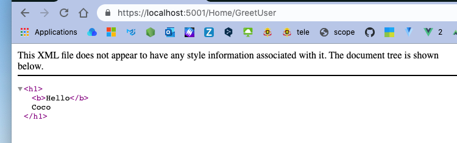

```cs
public ContentResult GreetUser() 
    => Content("{\"name\":\"roberto\",\"age\":56}", "application/json");
```

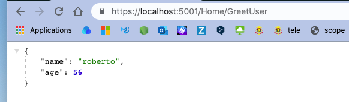

### `IWebHostEnvironment`

On va injecter l'`environment` dans le constructeur du contrôleur :

```cs
private readonly ILogger<HomeController> _logger;
private readonly IWebHostEnvironment _environment;

public HomeController(ILogger<HomeController> logger, IWebHostEnvironment environment)
{
    _environment = environment;
    _logger = logger;
}
```

On va afficher le chemin du dossier `root` de l'application, c'est un chemin

```cs
public ContentResult GreetUser() => Content(_environment.ContentRootPath);
```

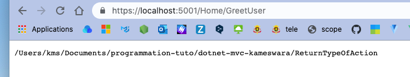

Et maintenant on peut aussi obtenir de l'`_environment` le `WebRootPath` :

```cs
public ContentResult GreetUser() => Content(_environment.WebRootPath);
```

```
/Users/kms/Documents/programmation-tuto/dotnet-mvc-kameswara/ReturnTypeOfAction/wwwroot
```

On obtient le chemin absolue du dossier où se trouve les `static files` : `wwwroot`.


## `ViewResult`

```cs
public ViewResult WichUser(string message = "Hello Coco")
{
    ViewBag.Message = message;
    return View();
}
```

Le message peut automatiquement être transmis par les `Query String`.

```cs
// WichUser.cshtml
<h1>Wich User</h1>

<h2>@ViewBag.Message</h2>
```

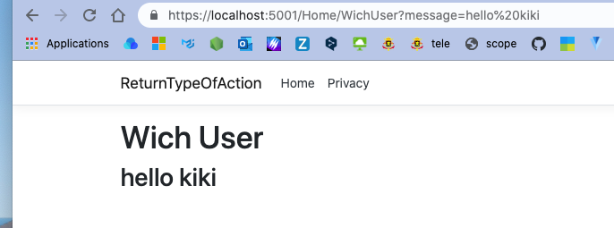


## `RedirectResult`

On peut utiliser deux méthode `Redirect` ou `RedirectPermanent`.

Le `status code` de `Redirect` est `302` tandis que celui de `RedirectPermanent` est `301`.

Cela permet au navigateur de mettre en cache la redirection si on utilise `RedirectPermanent` et d'économiser une nouvel requête à l'ancienne `url`.

**exemple :** Une page d'un `User` si celui si est supprimé peut être un bon candidat pour un `RedirectPermanent` :

https://stackoverflow.com/questions/17517318/redirect-vs-redirectpermanent-in-asp-net-mvc

```cs
public RedirectResult GoToUrl()
{
    // HTTP status code : 302
    return Redirect("https://picocss.com");
}

public RedirectResult GoToUrlPermanently()
{
    // HTTP status code : 301
    return RedirectPermanent("https://picocss.com");
}
```

Personnellement à part le `status code` je ne vois aucune différence.


## `RedirectToActionResult`

```cs
public RedirectToActionResult GoToContactAction()
{
    return RedirectToAction("WichUser", new { Message = "From Redirect to action"});
}
```

On passe en deuxième paramètre un objet `routeValues` avec la propriété `Message`.

`RedirectToAction` va renvoyer l'`url` :

```
/WichUser?Message=Hey%20from%20redirect%20to%20action
```

l'objet `routeValues` servira à donner une valeur au `Query String`.


## `RedirectToRouteResult`

```cs
public RedirectToRouteResult GoToAbout() =>
    RedirectToRoute("About");
```

`"about"` est le nom de la route.

Cette technique permet de séparer les routes des `controller` (`separation of concern`).

On doit d'abord créer une `route` dans `Startup.cs`, pour cela on doit définir un nouvel `endpoint` :

```cs
app.UseEndpoints(endpoints => {
    endpoints.MapControllerRoute(
    	name: "About",
        pattern: "GoToInfos",
        defaults: new { controller = "Home", action = "WishUser"}
    );
});
```

Avec moi cela ne fonctionne pas, voilà ma solution (plus simple) :

```cs
app.UseEndpoints(endpoints =>
            {
                endpoints.MapControllerRoute(
                    name: "About",
                    pattern: "Home/WishUser"
                // defaults: new { controller = "Home", action = "WishUser " }
                );
```


## `FileResult`

```cs
public FileResult DownloadFile() => File("/css/site.css", "text/plain", "newsite.css");

public FileResult ShowLogo() => File("./images/logo.png", "images/png");
```

`FileResult` renvoie un fichier comme réponse.

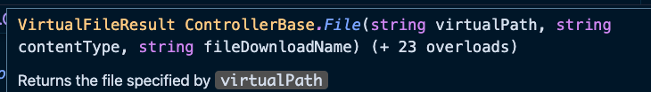

Sur le premier exemple on voit que le type de retour pourrait être encore plus spécifique avec `VirtualFileResult`.

Voilà ce que j'obtiens si je tape l'`url` : `/home/downloadfile` :

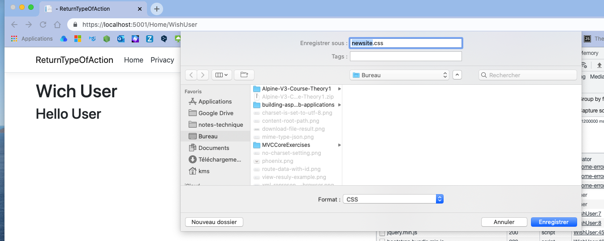

On voit le nouveau nom du fichier défini en troisième paramètre.


## `FileContentResult`

```cs
public FileContentResult DownloadContent()
{
    var myFile = System.IO.File.ReadAllBytes("./wwwroot/css/site.css");
    return new FileContentResult(myFile, "text/plain");
}
```

C'est une `ActionResult` qui écrit un **fichier binaire** (`binary file`) dans la réponse.

On remarque que le chemin du fichier est cette fois défini para rapport au dossier du projet et pas par rapport au dossier `wwwroot`.

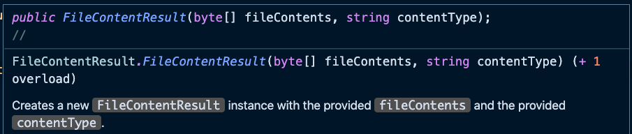

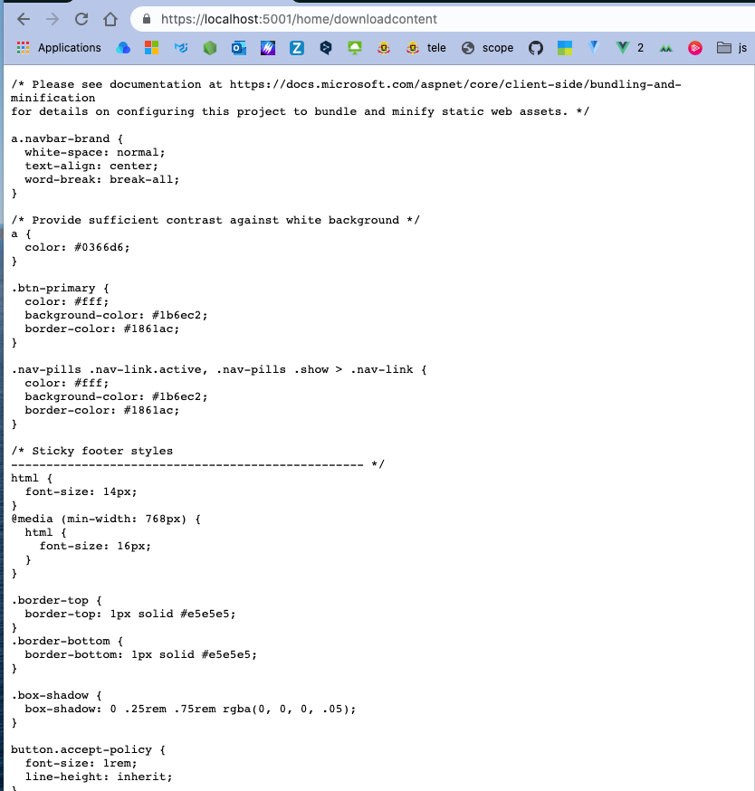

Cette fois ci le fichier n'ouvre pas une fenêtre mais affiche le contenu du fichier directement dans le navigateur.

### Avec un fichier `PDF`

```cs
public FileContentResult DownloadContent()
{
    var myPdf = System.IO.File.ReadAllBytes("./pdf/truc.pdf");
    return new FileContentResult(myPdf, "application/pdf");
}
```

On a un résultat natif avec lecteur de `PDF` :

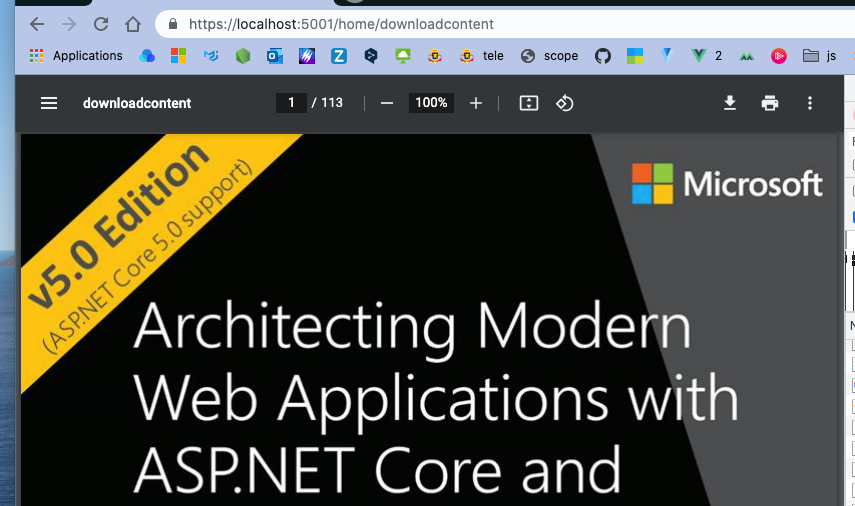

### Avec du `XML`

```cs
public FileContentResult DownloadContent =>
    new FileContentResult(System.IO.File.ReadAllBytes("./Data/stuff.xml", "text/xml"));
```

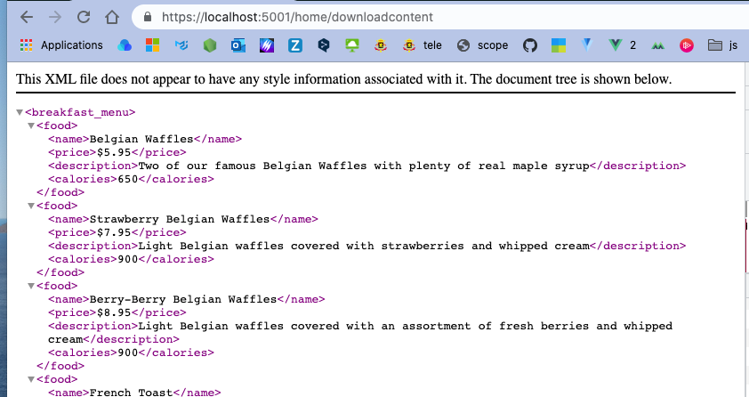


## Différence entre afficher et ouvrir le menu de téléchargement

Avec `FileResult` je peux avoir les deux comportements :

```cs
public FileResult DownloadPdf() => File("pdf/truc.pdf", "application/pdf");
```

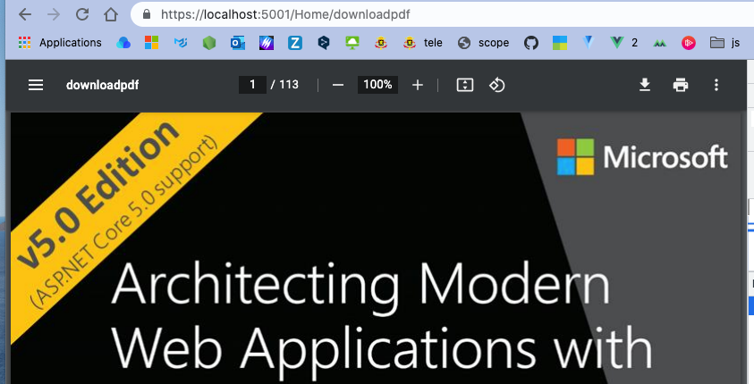

On a le `header` suivant :

```json
Content-Length: 3283561
Content-Type: application/pdf
Date: Thu, 19 Aug 2021 09:05:30 GMT
Last-Modified: Wed, 18 Aug 2021 13:10:02 GMT
Server: Kestrel
```

Maintenant en ajoutant un nom pour le fichier *downloadé* on obtient :

```cs
public FileResult DownloadPdf() => 
    File("pdf/truc.pdf", "application/pdf", "mynewtruc.pdf");
```

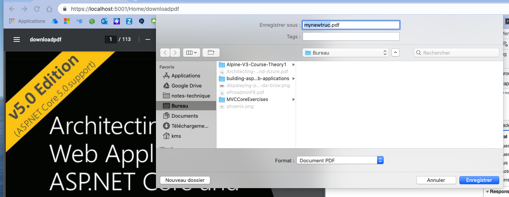

Avec un `header` modifié :

```json
Content-Disposition: attachment; filename=mynewtruc.pdf; filename*=UTF-8''mynewtruc.pdf
Content-Length: 3283561
Content-Type: application/pdf
Date: Thu, 19 Aug 2021 09:08:22 GMT
Last-Modified: Wed, 18 Aug 2021 13:10:02 GMT
Server: Kestrel
```

On voit apparaître un nouvel `header` : `Content-Disposition: attachment; ...`.

Voilà le header qui provoque le comportement du navigateur.

> ### Une réponse Stackoverflow
>
> https://stackoverflow.com/questions/6293893/how-do-i-force-files-to-open-in-the-browser-instead-of-downloading-pdf
>
> Pour indiquer au navigateur que le fichier doit être visualisé dans le navigateur, la réponse HTTP doit inclure ces `headers` :
>
> ```js
> Content-Type : application/pdf
> Content-Disposition : inline ; filename="filename.pdf"
> ```
>
>
> Pour que le fichier soit téléchargé plutôt que visualisé :
>
> ```js
> Content-Type : application/pdf
> Content-Disposition : attachment ; filename="filename.pdf"
> ```
>
>
> Les guillemets autour du nom de fichier sont nécessaires si le nom de fichier contient des caractères spéciaux tels que `filename[1].pdf` qui pourraient empêcher le navigateur de traiter la réponse.
>
> La manière dont vous définissez les `headers` de réponse HTTP dépend de votre serveur HTTP (ou, si vous générez la réponse PDF à partir d'un code côté serveur : de votre langage de programmation côté serveur).
>


## `FileStreamResult`

```cs
public FileStreamResult CreateFile()
{
    var myStream = new MemoryStream(Encoding.ASCII.GetBytes("Hello World Koko !"));
    return new FileStreamResult(myStream, new MediaTypeHeaderValue("text/plain"))
    {
        FileDownloadName = "test.txt"
    };
}
```

On utilise `FileStreamResult` pour écrire un fichier depuis un `stream` dans une réponse.

On peut remplacer `new MediaTypeHeaderValue("text/plain")` par `"text/plain"` tout simplement.

En tapant l'`url` : `/Home/CreateFile` on obtient la fenêtre suivante :

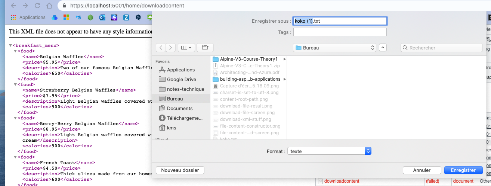


## `VirtualFileResult` et `PhysicalFileResult`

```cs
public VirtualFileResult VirtualFileResultDemo() => 
    new VirtualFileResult("/css/site.css", "text/plain");

public PhysicalFileResult ShowStuff() =>
    new PhysicalFileResult(_environment.ContentRootPath + "/Data/stuff.xml", "text/xml");

public PhysicalFileResult PhysicalFileResultDemo() =>
    new PhysicalFileResult(_environment.ContentRootPath + "/wwwroot/css/site.css", "text/plain");
```

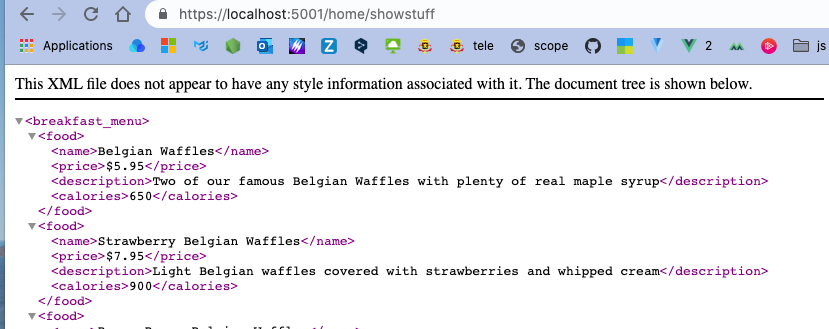

On est dans un affichage *direct* dans le navigateur avec `VirtualFileResult` ou `PhysicalFileResult`.

`_environment.ContentRootPath` vaut :

```cs
"/Users/kms/Documents/programmation-tuto/dotnet-mvc-kameswara/ReturnTypeOfAction"
```

`VirtualFileResult` utilise les `Virtual Path` (ici depuis `wwwroot`).

La seule différence est dans la manière de décrire le chemin vers le fichier.

Si le fichier désiré n'est pas dans le `wwwroot` alors on est obligé d'utiliser le `PhysicalFileResult` avec le chemin absolu vers le fichier.


## `JsonResult`

```cs
public JsonResult ShowNewProduct() => Json(new { 
	ProductCode = 101,
    ProductName = "Printer",
    Cost = 1500
});
```

> Un objet anonyme utilise la syntaxe :
>
> ```cs
> new { ... }
> ```
>
> sans les parenthèses.

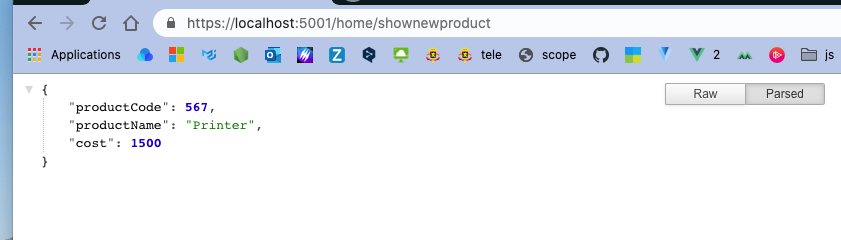


## `EmptyResult` et `NoContentResult`

```cs
public EmptyResult EmptyDemo() => new EmptyResult();

public NoContentResult NoContentDemo() => NoContent();
```

`EmptyResult` a un `status code` `200 OK` et affichage une page blanche.

`NoContentResult` a un `status code` `204 No Content` et reste sur la même page.


## `BadRequestResult` et `StatusCodesResult` 

Pour renvoyer un `status code ` `400 Bad Request` on peut utiliser `BadRequestResult` :

```cs
public BadRequestResult BadDemo() => BadRequest();
```

Pour renvoyer un `status code` de son choix on peut utiliser `StatusCodeResult` :

```cs
public StatusCodeResult ReturnBadRequest() =>
    StatusCode(StatusCodes.Status400BadRequest);
```

#### ! La méthode `StatusCode` sans `s`, la classe `SatusCodes` avec `s`

On obtient le `header` suivant :

```js
HTTP/1.1 400 Bad Request
Date: Thu, 19 Aug 2021 09:24:19 GMT
Server: Kestrel
Content-Length: 0
```

Le `status code` est dans la première ligne du `Header`.

On peut vouloir passer plus d'information à notre `BadRequest`, dans ce cas on utilise `BadRequestObjectResult` :

```cs
public BadRequestObjectResult BRORD()
{
    var modelState = new ModelStateDictionary();
    modelState.AddModelError("br", "Bad Request");
    
    return BadRequest(modelState);
}
```

On reçoit cette fois du `json` avec les messages définis :


## `UnauthorizedResult`

```cs
public UnauthorizedResult UnauthorizedDemo() => Unauthorized();
```

```cs
public UnauthorizedObjectResult UORD()
{
    var modelState = new ModelStateDictionary();
    modelState.AddModelError("br", "You're not authorized to visit this area");
    
    return Unauthorized(modelState);
}
```

Le `status code` est `401`.

Pour la deuxième méthode on obtient :

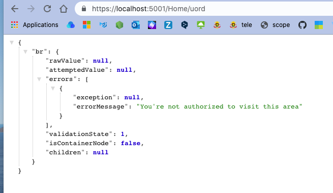

## `NotFoundResult`

```cs
public NotFoundResult ReturnNotFound() => NotFound();
```

```cs
public NotFoundObjectResult NFORD() =>
    NotFound(new { Id = 23, Error = "Not found this id" });
```

Le `status code` est `404`.


## `OkObjectResult`

Le `status code` est ici `200`.

```cs
public OkObjectResult ReturnOk() => Ok(new string[] {"O", "K", "A", "Y"});
```

Retourne du `json` :

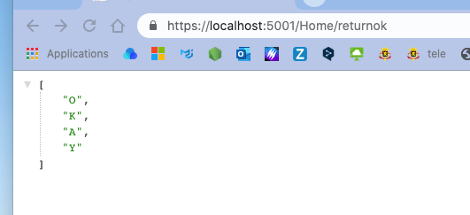

```cs
public OkObjectResult OkObjectResultDemo() => 
    OkObjectResult(new { Message = "Okay" });
```

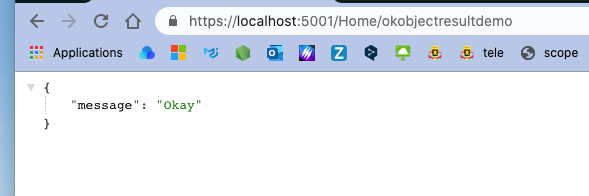

Code identique à :

```cs
public OkObjectResult OkObjectResultDemo2() => Ok(new { Message = "Okay" });
```


## `PartialViewResult`

```cs
public PartialViewResult ShowChildViewContent()
{
    Product prod = new()
    {
        Id = 10,
        Name = "Keyboard",
        Cost = 300
    };

    return PartialView(prod);
}
```

On doit créer cette `View` :

`ShowChildViewContent.cshtml`

```html
@model Product

@{
    ViewData["Title"] = "Show Child View Content";
}

<h1>Show Child View Content</h1>
    
<h1>Hey! I'm going to get some new content from child view shortly! </h1>

<partial name="ChildView" />

@await Html.PartialAsync("ChildView", Model)

@{
	await html.RenderPartialAsync("ChildView");
}

<h1>
    You can see the Content Child as above
</h1>
```

On a ici les trois manières d'appeler une `Partial View`

On crée en générale une `Partial View` dans le dossier `Shared`.

Cette `Partial View` ne peut pas être accéder directement par le navigateur, elle peut être accédée seulement par une autre `View`.

`ChildView.cshtml`

```html
@model Product

<h1>
    Hey I'm coming from a child View!
</h1>
<h2>@Model.Id</h2>
<h2>@Model.Name</h2>
<h2>@Model.Cost</h2>
```


On a la `View` sans le `_Layout`.

En fait on peut faire un exemple plus simple :

```cs
public PartialViewResult ChildView() => PartialView(new Product
        {
            Id = 5,
            Name = "Computer",
            Cost = 4500
        });
```

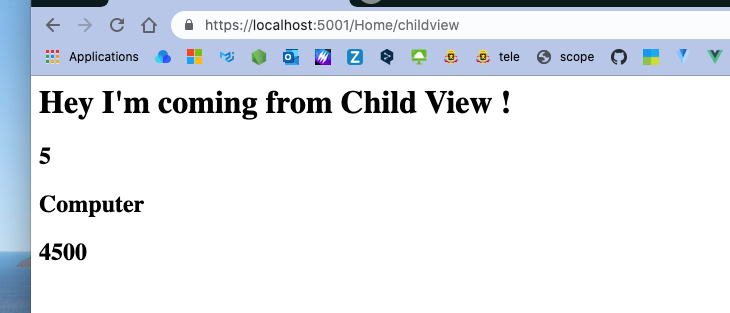

Si on utilise à la place `ViewResult` :

```cs
public ViewResult ChildView() => View(new Product
        {
            Id = 5,
            Name = "Computer",
            Cost = 4500
        });
```

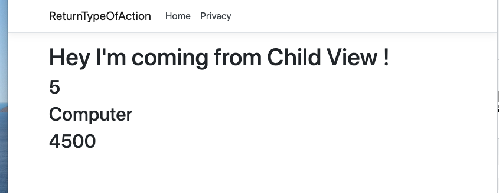

On voit que la `View` passe par le `_Layout` (par `_ViewStart.cshtml` en fait).


### Supprimer une `Session` : `Session.Remove(<key>)`

On peut supprimer une entrée en `Session` avec la méthode `Remove` en lui passant la clé :

```cs
public NoContentResult RemoveSession()
{
    HttpContext.Session.Remove("MyUsername");
    return NoContent();
}
```

J'ajoute un bouton :

```html
<h1>Reading session data : @HttpContextAccessor.HttpContext.Session.GetString("MyUsername")</h1>
<h2>The session Id is : @ViewBag.SessionId</h2>

<p><a class="btn btn-danger" asp-action="RemoveSession">Cancel Session</a></p>
```

Si j'appuie sur le bouton et que je rafraîchi, la donnée de `session` disparaît :

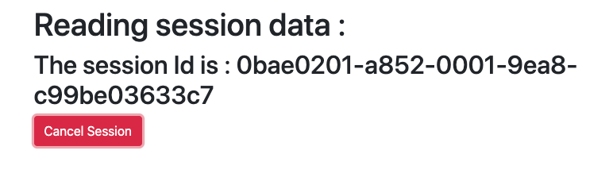

### `Session.Clear()` : rafraîchir toutes les `sessions`

```cs
public IActionResult Index()
{
    HttpContext.Session.SetString("MyUsername", "The Incredible Hukar");
    HttpContext.Session.SetString("MyPet", "Grisouille");
    HttpContext.Session.SetString("MyHobby", "JJB");

    return View();
}
```

On crée les variables de `session` `Action` : `Index`.

```cs
public RedirectToActionResult ClearSession()
{
    HttpContext.Session.Clear();
    return RedirectToAction("Privacy");
}
```

`Privacy.cshtml`

```html
<h1>Session :My Name @HttpContextAccessor.HttpContext.Session.GetString("MyUsername")</h1>
<h1>Session :My Pet @HttpContextAccessor.HttpContext.Session.GetString("MyPet")</h1>
<h1>Session :My Hobby @HttpContextAccessor.HttpContext.Session.GetString("MyHobby")</h1>
<h2>The session Id is : @ViewBag.SessionId</h2>

<p><a class="btn btn-warning" asp-action="RemoveSession">Cancel Name</a></p>
<p><a class="btn btn-danger" asp-action="ClearSession">Clear All</a></p>
```

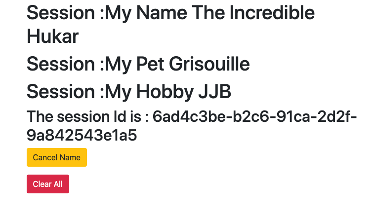

On click sur `Clear All` :

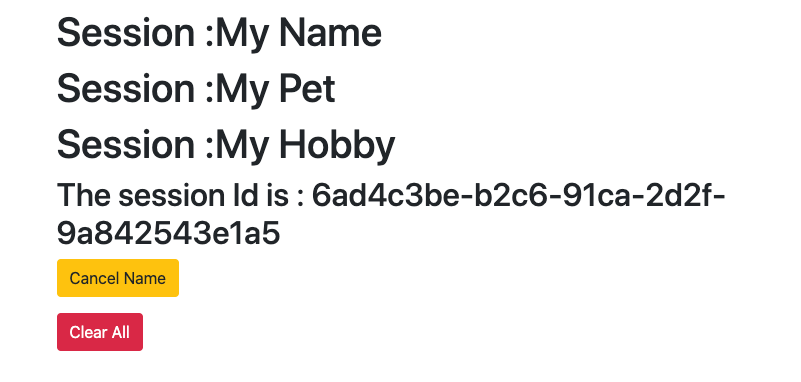


