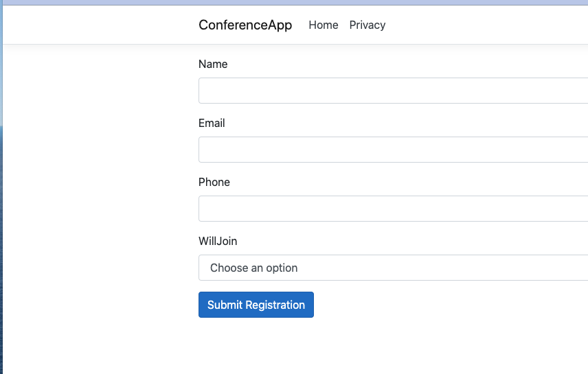
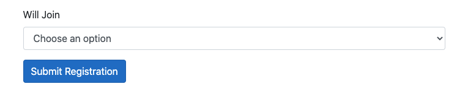
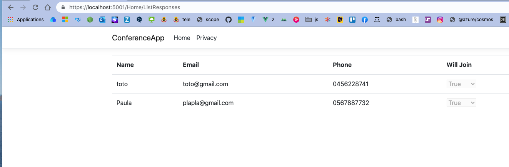

# 06 Simple `MVC` Core App

## `ConferenceApp`

```bash
dotnet new mvc -o ConferenceApp -rrc
```

Dans `wwwroot` on crée le dossier `images`.

Dans `Models` on va créer la classe `WebinarInvite.cs`

```cs
public class WebinarInvite
{
    [Required(ErrorMessage = "Please enter your name")]
    public string Name { get; set; }
    
    [Required(ErrorMessage = "Pleasee enter your email address")]
    [EmailAddress]
    public string Email { get; set; }
    
    [Required(ErrorMessage = "Please enter your phone number")]
    public string Phone { get; set; }
    
    [Required(ErrorMessage = "Please specifu whether you'll join")]
    public bool? WillJoin { get; set; }
}
```

Bien entendu on utilise `using System.ComponentModel.DataAnnotations;`.

`WillJoin` est `nullable` : `bool?`.


## Création du `Repository`

On crée le `repository` dans `Models`.

> Une classe `static` est une classe qui ne peut être instanciée.

`Repository.cs`

```cs
public static class Repository
{
    private static List<WebinarInvite> responses = new();
    
    public static IEnumerable<WebinarInvite> Responses => responses;
    
    public static void AddResponse(WebinarInvite response)
    {
        responses.Add(response);
    }
}
```


## `Controller` : `GET RegisterForm`

```cs
[HttpGet]
public ViewResult RegisterForm() => View();
```


## `View` : `Index.cshtml`

```html
<!-- ... -->
<a class="btn btn-primary" asp-action="RegisterForm">Register for Conference</a>
```


## `View` : `RegisterForm.cshtml`

```html
<form asp-action="RegisterForm" method="Post">
    <div asp-validation-summary="All"></div>
    <div class="form-group">
        <label asp-for="Name"></label>
        <input asp-for="Name" class="form-control">
    </div>
    <div class="form-group">
        <label asp-for="Email"></label>
        <input asp-for="Email" class="form-control">
    </div>
    <div class="form-group">
        <label asp-for="Phone"></label>
        <input asp-for="Phone" class="form-control">
    </div>
    <div class="form-group">
        <label asp-for="WillJoin"></label>
        <select asp-for="WillJoin" class="form-control">
            <option value="">Choose an option</option>
            <option value="true">Yes, I'll join conference</option>
            <option value="false">No I'm not</option>
        </select>
    </div>
    <button class="btn btn-primary">
        Submit Registration
    </button>
    
</form>
```

Si on ne place pas le `@model` ici, on obtient une erreur.

Il faut ajouter la ligne :

```csharp
@model WebinarInvite
```

en haut du fichier (cela `bind` la `View` et le `Model`).



Le `label` de `WillJoin` n'est pas `user friendly`, on doit ajouter une annotation dans le `Model` :

```cs
[Display(Name = "Will Join")]
[Required(ErrorMessage = "Please specifu whether you'll join")]
public bool? WillJoin { get; set; }
```




## `Controller` : `POST RegisterForm`

```cs
[HttpPost]
public ViewResult RegisterForm(WebinarInvite response)
{
    if(ModelState.IsValid)
    {
        Repository.AddResponse(response);
        return View("ThankYou", response);
    }
    
    return View();
}
```

`MVC` utilise une technique de `Binding` par défaut pour recevoir un objet du type du modèle de la `View` dans le `Controller`, ici `WebinarInvite`.

### `ModelState.IsValid`

Cela permet de vérifier la validation par rapport aux `annotations` misent dans le `Model`.


## `View` : `ThankYou`

```cs
@{
    ViewData["Title"] = "Thank You";
}

@model WebinarInvite


<h1>Thank You for your Registration</h1>

<h2>@Model.Name</h2>
<h3>@Model.Email - @Model.Phone</h3>

@if (Model.WillJoin == true)
{
    <p>Super !</p>
}
else
{
    <p>oh no !</p>
}

<a asp-action="ListResponses">Click here to see who is coming</a>
```

Dans du code `c#`, on écrit `Model` sans le `@`.

`@if` avec `@` et `else` sans `@`.


## `Controller` : `ListResponses`

```cs
public ViewResult ListResponses() => 
    View(Repository.Responses.Where(r => r.WillJoin == true));
```

Utilisation de la clause `Where` de `System.Linq`.

## `View` : `ListResponse`

`@Html.DisplayNameFor(model => model.WillJoin)` : affiche le nom de la propriété.

`@Html.DisplayFor(item => item.Name)` : affiche la **valeur** de la propriété.

```cs
@model IEnumerable<WebinarInvite>

@{
    ViewData["Title"] = "List Of Responses";
}
<table class="table">
    <thead>
        <th>@Html.DisplayNameFor(m => m.Name)</th>
        <th>@Html.DisplayNameFor(m => m.Email)</th>
        <th>@Html.DisplayNameFor(m => m.Phone)</th>
        <th>@Html.DisplayNameFor(m => m.WillJoin)</th>
    </thead>
    <tbody>
        @foreach (var response in Model)
        {
            <tr>
                <td>@response.Name</td>
                <td>@response.Email</td>
                <td>@Html.DisplayFor(model => response.Phone)</td>
                <td>@Html.DisplayFor(model => response.WillJoin)</td>
            </tr>
        }
    </tbody>
</table>
```



On voit que `@Html.DisplayNameFor(m => m.WillJoin)` utilise l'annotation `[Display(Name = "will Join")]` pour afficher le nom de la propriété.


