# 07 Techniques de `State Management`

## Utiliser les objets `ViewBag` et `ViewData`

On va créer un nouveau `Controller` :

`StateDemoController`

```cs
public class StateDemoController : Controller
{
    public IActionResult Index()
    {
        ViewData["Ecode"] = 107;
        return View();
    }
}
```

`ViewData` utilise un `ViewDataDictionary` avec le pattern `key/value pair`.

`ViewBag` utilise les propriétés dynamiques pour ajouter des données.

```cs
ViewBag.Message = "This is a message";

return View();
```

On peut appeler de la `View` les `ViewData` comme des `ViewBag` :

```cs
public IActionResult Index()
{
    ViewData["Ecode"] = 888;
    ViewData["name"] = "Polux";

    return View();
}
```

```html
<h1>1 - @ViewData["Ecode"]</h1>
<h1>2 - @ViewData["name"]</h1>
<h2>3 - @ViewBag.Ecode</h2>
<h2>4 - @ViewBag.name</h2>
<h2>5 - @ViewBag.Name</h2>
<h2>6 - @ViewBag.NaMe</h2>
```

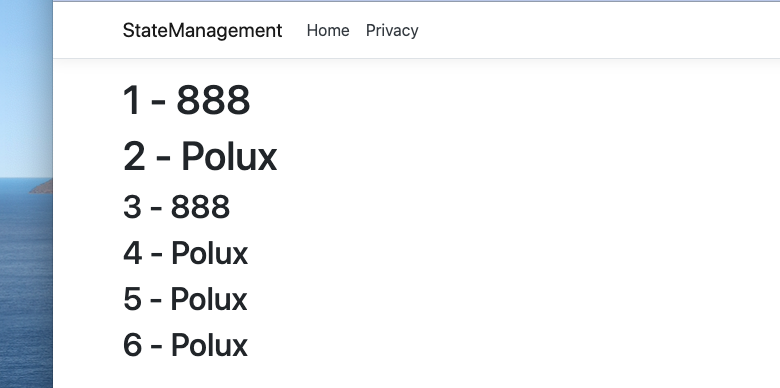

On observe que la **propriété dynamique** n'est pas sensible à la casse.

Et inversement un `ViewBag` peut être appelé comme un `ViewData` :

```cs
public IActionResult Index()
{
    ViewBag.Color = "blue";
    ViewBag.Price = 99;

    return View();
}
```

```html
<h1>1 - @ViewBag.Color</h1>
<h1>2 - @ViewBag.Price</h1>
<h2>3 - @ViewData["Color"]</h2>
<h2>4 - @ViewData["Price"]</h2>
<h2>5 - @ViewData["color"]</h2>
<h2>6 - @ViewData["cOlOr"]</h2>
```

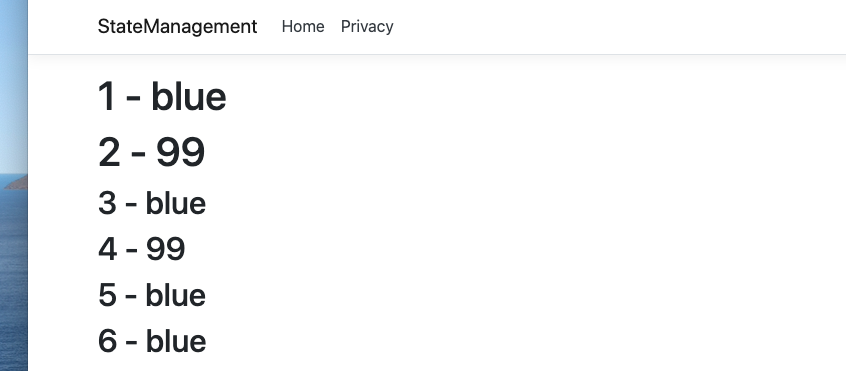

De nouveau le `process` semble insensible à la case.

```html
<h1>1 - @ViewBag.Color</h1>
<h1>2 - @ViewBag.Price</h1>
<h1>2 - @ViewBag.price</h1>
<h1>2 - @ViewBag.pRice</h1>
```


### Passer un objet à un `ViewBag`

J'ai eu une erreur en utilisant les objets anonyme :

```cs
public IActionResult Index()
{
    ViewBag.Robot = new
    {
        Code = "axt56",
        Weight = 456,
        Speed = 35
    };

    return View();
}
```

```html
<h1>@ViewBag.Robot.Code</h1>
<h2>@ViewBag.Robot.Weight</h2>
<h3>@ViewBag.Robot.Speed</h3>
```

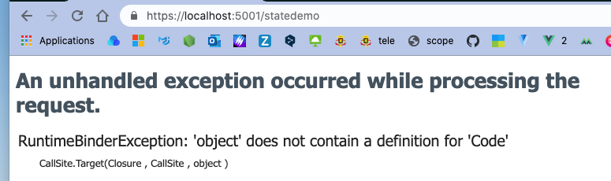

Cette erreur est corrigée si j'utilise plutôt un objet de type `Robot` (la classe est dans `Models`) :

```cs
public IActionResult Index()
{
    ViewBag.Robot = new Robot
    {
        Code = "axt56",
        Weight = 456,
        Speed = 35
    };

    return View();
}
```

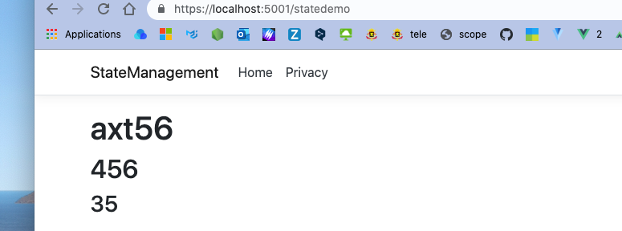


### Durée de vie d'un `ViewData`

Le `ViewData` n'existe que le temps de la requête.

Si on appelle le même `template` avec deux requêtes différentes (une `GET` et une `POST`), le contenu du `ViewData` n'est plus disponible.

```cs
[HttpGet]
public IActionResult Index()
{
    ViewBag.Robot = "Hey, I'm a ROBOT 🤖";

    return View();
}

[HttpPost]
public ViewResult Index(IFormCollection ifc) => View();
```

```html
<h1>@ViewBag.Robot</h1>

<form asp-controller="StateDemo" asp-action="Index" method="post">
    <input class="btn btn-danger" type="Submit" value="Submit Form">
</form>
```

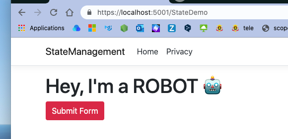

Si on appuie sur le bouton rouge, une nouvelle requête est envoyé et `ViewData` est vidé :

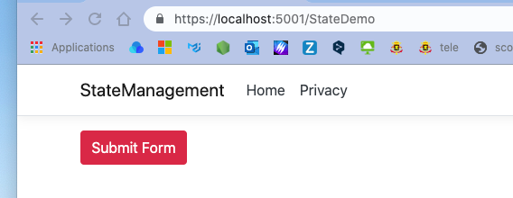

Comme le `Controller` en `POST` ne redéfini pas le contenu de `ViewBag.Robot`, rien ne s'affiche à cet endroit.


## `TempData`

`asp mvc` utilise deux types de fournisseur de données temporaire :

- Un basé sur les `Cookies` : `TempDataCookieState`
- Un basé sur la `session` : `SessionStateProvider`

Le `provider` basé sur les `Cookies` est celui par défaut, il n'y a quasiment pas de configuration à faire.

```cs
TempData.Add("country", "india");
```

On accède dans la `View` avec `@TempData` :

```html
<h2>@TempData["country"]</h2>
```

On observe qu'un `Cookie` a été créé :

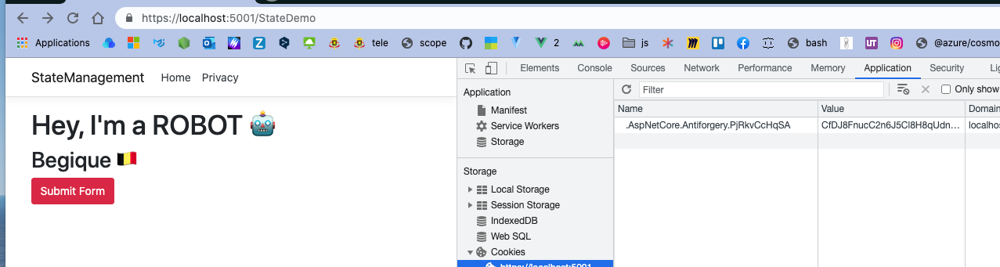

Mais en appuyant sur le bouton on a le même comportement *par requête* que précédemment :


Dès qu'un `TempDataDictionary` est lu, il est marqué pour effacement à la fin de la requête.

Les méthodes `Peek` et `Keep` nous permettent de lire le `TempData` sans le marqué pour l'effacement (`deletion`).


### `TempData.Peek`

```cs
<h2>Peek TempData</h2>

@if (TempData.Peek("country") != null)
{
    <h3>@TempData.Peek("country")</h3>
}
```

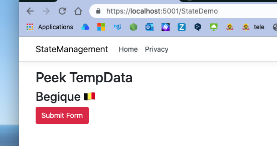

Cette fois les données de `TempData` sont conservées.

> Il y a parfois un problème de conflit de `cookies`, il faut alors effacer les `cookies` manuellement.

`TempData["country"]` => marqué pour effacement.

`TempData.Peek("country")` => pas marqué pour effacement.


### `TempData.Keep`

Avec `Keep` on spécifie une clé marqué pour effacement et on dit qu'on la veut.

```cs
<h2> Keep TempData </h2>
    
@{
   if (TempData["country"] != null)
    {
        <h3>Message : @TempData["country"]</h3>
    }

    TempData.Keep("country") 
}
```

Maintenant le `cookie` est repêché à chaque fois par `Peek`.

#### ! taille maximum d'un cookie : 4MB, il y a aussi un nombre maximum de cookies : 20 par domaine

Ces nombres peuvent varier d'un navigateur à l'autre.

https://stackoverflow.com/questions/283774/maximum-number-of-cookies-allowed


### Erreur : `An item with the same key has already been added`

Pour éviter cette erreur à chaque fois que l'application est relancée on doit tester l'existence du `cookie` avant de le créer :

```cs
public IActionResult Index()
{
    if (TempData["country"] == null)
    {
        TempData.Add("country", "Begique 🇧🇪");
    }

    return View();
}
```


## `SessionStateProvider`

On doit ici un peu plus configurer, dans `Startup.cs` on doit ajouter notre `provider` :

```cs
public void ConfigureServices(IserviceCollection services)
{
    services.AddControllersWithViews().AddSessionStateTempDataProvider();
    
    services.AddSession();
}
```

On doit aussi l'ajouter aux `middlewares`.

L'ordre des `middlewares` est important et on doit ajouter `UseSession` après `UseRouting` et avant `UseEndpoints` :

```cs
public void Configure(IApplicationBuilder app, IWebHostEnvironment env)
{
    // ...
    app.UseRouting();
    // ...
    
    app.UseSession();
    
    app.UseEndpoints(/* ... */);
}
```

Le reste du code ne change pas, mais maintenant `TempData` utilise le `SessionProvider` :

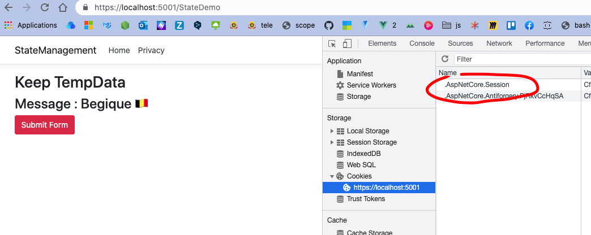


## Travailler avec les `Cookies`

### Configuration dans `Startup.cs`

```cs
public void ConfigureServices(IServiceCollection services)
{
    services.AddControllersWithViews();
    services.AddSingleton<IHttpContextAccessor, HttpContextAccessor>();
}
```

On injecte maintenant le `service` dans notre contrôleur :

```cs
// HomeController.cs

public class HomeController : Controller
{
    private readonly ILogger<HomeController> _logger;
    private readonly IHttpContextAccessor _httpContextAccessor;

    public HomeController(ILogger<HomeController> logger, IHttpContextAccessor httpContextAccessor)
    {
        _httpContextAccessor = httpContextAccessor;
        _logger = logger;
    }
```


### Création d'un `Cookie`

```cs
public ViewResult Index()
{
    // _httpContextAccessor.HttpContext.Response.Cookies.Delete("Username");
    
    CookieOptions options = new CookieOptions();
    options.Expires = DateTime.Now.AddMinutes(5);
    
    _httpContextAccessor.HttpContext.Response.Cookies.Append("Username", "hukar");
    
    return View();
}
```

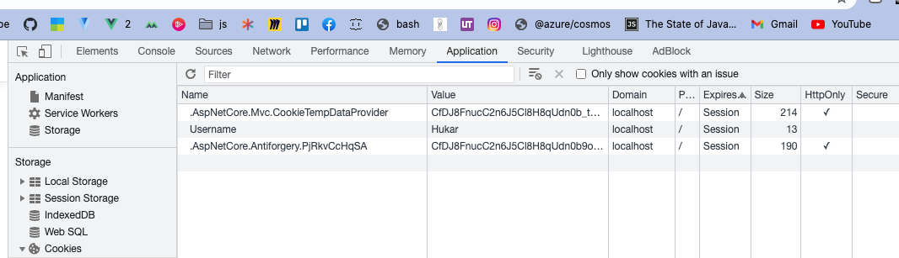


### Lire la valeur d'un `Cookie`

Dans une autre `View`, par exemple `Privacy`, on va récupérer la valeur de ce `Cookie` :

```html
@using Microsoft.AspNetCore.Http
@inject IHttpContextAccessor HttpContextAccessor
<h1>
    Reading cookie data @HttpContextAccessor.HttpContext.Request.Cookies["Username"]
</h1>
```


### Effacer un `cookie`

```cs
public ViewResult Index()
{
    _httpContextAccessor.HttpContext.Response.Cookies.Delete("Username");
```


### Correction et simplification

Pas besoin d'injecter `HttpContextAccessor` dans le `Controller` car on a déjà à `Response`.

```cs
public IActionResult Index()
{
    // Response.Cookies.Delete("Username");
    CookieOptions options = new CookieOptions();
    options.Expires = DateTime.Now.AddMinutes(3);

    Response.Cookies.Append("Username", "Hukar the Brave", options);

    return View();
}
```

Il faut aussi passer les options à la méthode `Append`.


On a maintenant bien une date d'expiration.

Pour lire un `cookie` dans un `controller` :

```cs
var myCookie = Request.Cookies["Username"];
```


## Utiliser l'objet `Session`

Il peut y avoir plusieurs stratégie pour stocker les données de `session`, ici on utilise le stockage `InMemory` de la `sessions`.

On doit configurer notre `session` dans `Startup.cs` ainsi que son mode de stockage :

```cs
public void ConfigureServices(IServiceCollection services)
{
    // ...
    
    services.AddDistributeMemoryCache();
    
    services.AddSession(options => {
        options.IdleTimeout = TimeSpan.FromMinutes(30);
        options.Cookie.IsEssential = true;
    })
}
```

> ### `IdleTimeout`
>
> L'`IdleTimeout` indique combien de temps la `session` peut rester inactive avant que son contenu ne soit abandonné. Chaque accès à la `session` réinitialise le délai d'attente. Notez que cela ne s'applique qu'au contenu de la `session`, et non au `cookie`.
>
> 
>
> ### `Timespan`
>
> Le `TimeSpan` représente un interval de temps.

On pourrait stocker notre `session` avec `SQL Server` ou `Redis Cache` aussi.

On doit aussi ajouter un `middleware` :

```cs
public void Configure(IApplicationBuilder app, IWebHostEnvironment env)
{
    // ...
    app.UseSession();
}
```


### Dans notre `Controller`

C'est `HttpContext` qui contient la `Session`, comme précédemment pas besoin d'injecter `HttpContextAccessor`.

```cs
HttpContext.Session.SetString("MyUsername", "The Incredible Hukar");
ViewBag.SessionId = HttpContext.Session.Id;

// session.Remove("MyUsername");
// session.Clear();
// string sessionId = Session.Id;
```


### Lire les informations de `session` dans une `View`

`Privacy.cshtml`

```cs
@using Microsoft.AspNetCore.Http
@inject IHttpContextAccessor HttpContextAccessor
    
<h1>Reading session data : @HttpContextAccessor.HttpContext.Session.GetString("MyUsername")</h1>
```

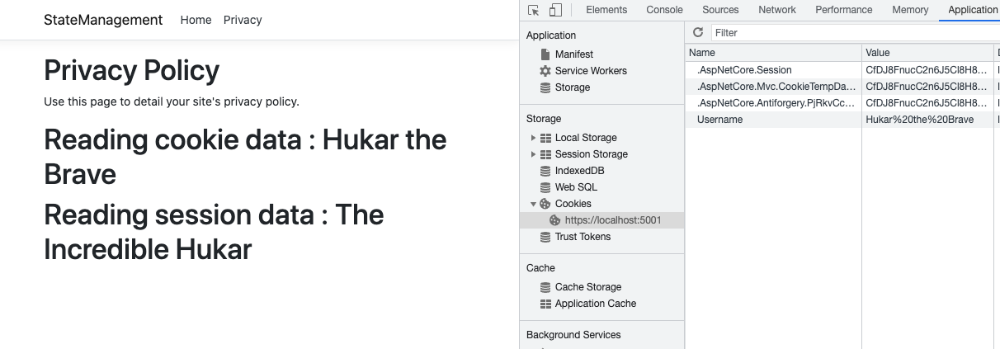

#### Écrire : `Session.SetString(<key>,<value>)`

#### Lire : `Session.GetString()`

Il existe aussi pour les valeurs entières `Session.SetInt32(<key>, <int value>)` et `Session.GetInt32()`.

### Obtenir l'`Id` de la `Session` : `Session.Id`

```cs
public IActionResult Privacy()
{
    ViewBag.SessionId = HttpContext.Session.Id;

    return View();
}
```

```asp
<h2>The session Id is : @ViewBag.SessionId</h2>
```


