# 08 L'échafaudage du `template` : `Scaffolding`

## On crée un `Controller` : `ProductController`

```cs
public class ProductController : Controller
{
    public ViewResult Index() => View();
}
```

## On Crée un `Model` : `Product`

```cs
public class Product
{
    public int ProductId { get; set; }
    public string ProductName { get; set; }
    public int Quantity { get; set; }
    public int UnitsInStock { get; set; }
    public bool Discontinued { get; set; }
    public double Cost { get; set; }
    public double Tax { get; set; }
    public DateTime LaunchDate { get; set; }
}
```

On crée une `list` de données en mémoire dans le `Controller`.

Cette `list` est `static` pour ne pas être effacée à chaque requête (car un nouveau `Controller` est instancié à chaque requête).

```cs
static List<Product> _Products = new List<Product>
{ // ... };
```


## `Strongly Typed View`

On passe un object à la `View` directement en argument :

```cs
var ViewModel = new List<Product>() { /* ... */ };
return View(ViewModel)
```

et dans la `View` on spécifie un `Model` du même type :

```cs
@model List<MyApp.Models.Product> 
```

On a ainsi une vérification à la compilation et l'aide de l'`intellisense` de `VSCode`.

Pour notre application on a :

```cs
public ViewResult Index() => View(_Products);
```

Et on va créer la `View` `Product/Index.cshtml`

```html
@{
    ViewBag.Title = "List Of Products";
}

@model IEnumerable<Product>

<h1>List Of products</h1>

<table class="table">
<thead>
    <th>@Html.DisplayNameFor(model => model.ProductID)</th>
    <th>@Html.DisplayNameFor(model => model.ProductName)</th>
    <th>@Html.DisplayNameFor(model => model.Quantity)</th>
    <th>@Html.DisplayNameFor(model => model.UnitsInStock)</th>
    <th>@Html.DisplayNameFor(model => model.Discontinued)</th>
    <th>@Html.DisplayNameFor(model => model.Cost)</th>
    <th>@Html.DisplayNameFor(model => model.Tax)</th>
    <th>@Html.DisplayNameFor(model => model.LaunchDate)</th>
</thead>
<tbody>
    @foreach(var product in @Model)
   {
       <tr>
           <td>@product.ProductID</td>
           <td>@product.ProductName</td>
           <td>@product.Quantity</td>
           <td>@product.UnitsInStock</td>
           <td>@product.Discontinued</td>
           <td>@product.Cost</td>
           <td>@product.Tax</td>
           <td>@product.LaunchDate</td>
           
       </tr>
   } 

</tbody>

</table>
```

Pour afficher le nom de propriété ou de l'attribut `Display(Name="toto")` on utlise :

#### `@Html.DisplayNameFor(model => model.PropertyName)`

Les `Helper HTML` était utilisés avant l'apparition des `Tag Helpers` (comme `asp-action`).

On peut écrire `@foreach(var product in @Model)` ou `in Model` sans le `@`.

### Définir `@model`

```asp
@model List<Product>
```

Ci-dessus cela ne fonctionne pas

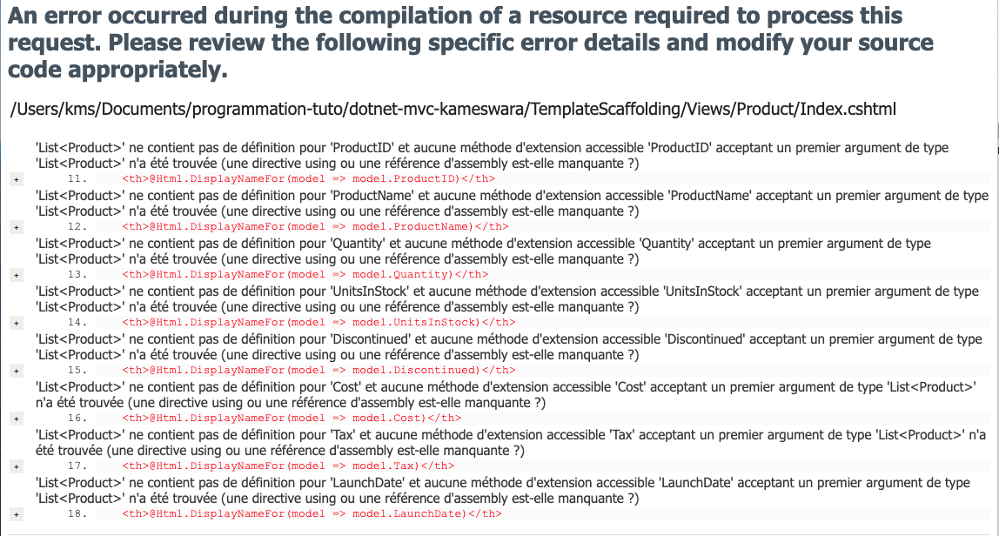

Il faut obligatoirement utiliser `IEnumerable` avec `@Html.DisplayNameFor` :

```asp
@model IEnumerable<Product>
```

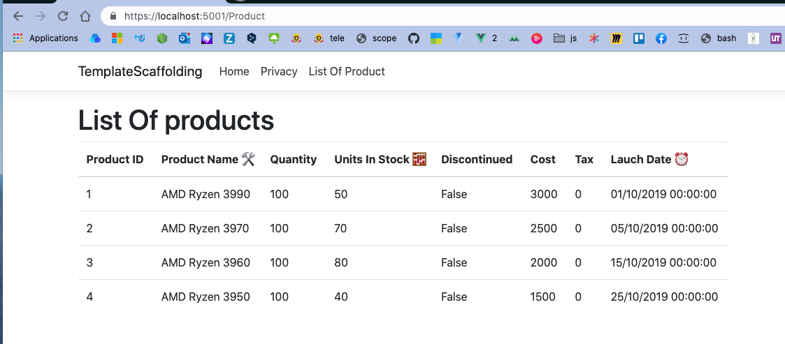

Il est possible d'utiliser les `List<>` avec la méthode `First` :

```csharp
@model List<Product>

<h1>List Of products</h1>

<table class="table">
    <thead>
        <th>@Html.DisplayNameFor(model => model.First().ProductID)</th>
        <th>@Html.DisplayNameFor(model => model.First().ProductName)</th>
        <th>@Html.DisplayNameFor(model => model.First().Quantity)</th>
        <th>@Html.DisplayNameFor(model => model.First().UnitsInStock)</th>
        <th>@Html.DisplayNameFor(model => model.First().Discontinued)</th>
        <th>@Html.DisplayNameFor(model => model.First().Cost)</th>
        <th>@Html.DisplayNameFor(model => model.First().Tax)</th>
        <th>@Html.DisplayNameFor(model => model.First().LaunchDate)</th>
    </thead>
```

> ## Explication dans `Stackoverflow`
>
> https://stackoverflow.com/questions/14391966/is-ienumerable-special-in-razor
>
> `@html.DisplayNameFor` est spécial dans la mesure où il possède un `overload` pour les modèles `IEnumerable`. Il sait que vous ne recherchez que le nom d'affichage de la propriété et, comme vous avez une liste `Strongly Typed`, il sait comment trouver le `Display(Name = ...)`. C'est une fonctionnalité pratique !
>
> 
>
> https://stackoverflow.com/questions/27396383/displaynamefor-for-interface-deriving-from-ienumerablet
>
> C'est juste comment la résolution des surcharges (`overload`) fonctionne en `C#` :
>
> ```cs
> public static void DoSomething<T>(T t)
> { }
> 
> public static void DoSomething<T>(IEnumerable<T> t)
> { }
> ```
>
> alors `DoSomething(new int[0])` appellera la surcharge `T` avec `T = int[]` plutôt que la surcharge `IEnumerable<T>` avec `T = int`.

Donc soit on utilise `IEnumerable<MonType>` soit on s'aide de `First()`.

### Ajout de lien et affichage propre de la date :

```cs
@{
    ViewBag.Title = "List Of Products";
}

@model List<Product>

<h1>List Of products</h1>

<table class="table">
    <thead>
        <th>@Html.DisplayNameFor(model => model.First().ProductID)</th>
        <th>@Html.DisplayNameFor(model => model.First().ProductName)</th>
        <th>@Html.DisplayNameFor(model => model.First().Quantity)</th>
        <th>@Html.DisplayNameFor(model => model.First().UnitsInStock)</th>
        <th>@Html.DisplayNameFor(model => model.First().Discontinued)</th>
        <th></th>
        <th>@Html.DisplayNameFor(model => model.First().Cost)</th>
        <th>@Html.DisplayNameFor(model => model.First().Tax)</th>
        <th>@Html.DisplayNameFor(model => model.First().LaunchDate)</th>
        <th></th>
    </thead>
    <tbody>
        @foreach (var product in @Model)
        {
            <tr>
                <td>@product.ProductID</td>
                <td>@product.ProductName</td>
                <td>@product.Quantity</td>
                <td>@product.UnitsInStock</td>
                <td>@product.Discontinued</td>
                <td>@Html.DisplayFor(Toto => product.Discontinued)</td>
                <td>@product.Cost</td>
                <td>@product.Tax</td>
                <td>@product.LaunchDate.ToString("dd MM yyyy")</td>
                <td>
                    <a asp-action="Edit">Edit</a>
                    <a asp-action="Detail">Detail</a>
                    <a class="text-danger" asp-action="Delete">Delete</a>
                </td>
            </tr>
        }
    </tbody>
</table>
```

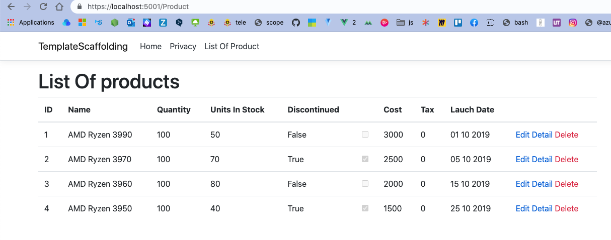

`@Html.DisplayFor(Toto => product.Discontinued)` permet d'automatiquement afficher la coche pour un `boolean`.

Pour avoir un affichage propre du `DateTime` on utilise `ToString(<format>)` :

```cs
@product.LaunchDate.ToString("dd MM yyyy")
```

On aurait aussi pu utiliser les annotations dans le `Model` :

```cs
[Display(Name = "Lauch Date")]
[DisplayFormat(DataFormatString = "{0:dd MM yyyy}")]
public DateTime LaunchDate { get; set; }
```

Et dans le `template` :

```html
<td>@Html.DisplayFor(Toto => product.LaunchDate)</td>
```


## `Detail` d'un produit

### `ActionLink`

Pour le moment mon lien utilise le `tag helper` :  `asp-route-monkiki` pour passer un paramètre à mon contrôleur :

```html
<a asp-action="Detail" asp-route-monkiki="@product.ProductID">Detail</a>
```

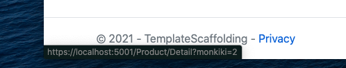

On le récupère dans l'argument du `Controller` :

```cs
public IActionResult Detail(int monkiki)
{
    var product = _Products.SingleOrDefault(p => p.ProductID == monkiki);

    if (product is null)
    {
        return NotFound();
    }

    return View(product);
}
```

On utilise la méthode de `Linq` :  `SingleOrDefault`.

Il faut donc tester si le `product` est `null`.

On peut aussi utiliser le `Helper HTML` à la place :

```cs
@Html.ActionLink("allez vers detail", "detail", new { monkoko=product.ProductID})
```

Le premier paramètre est le texte affiché dans le lien.

Le deuxième paramètre est le nom de l'`Action`.

Le troisième correspond au paramètres de route.


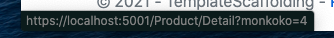

On peut aussi utiliser `Find` plutôt que `SingleOrDefault` :

```cs
public IActionResult Detail(int id)
{
    var prod = _Products.Find(p => p.ProductID.Equals(id));
    
    return View(prod);
}
```

### Paramètre de route plutôt que `Query String`

Si on utilise le mot `id` à la place de n'importe quel autre mot, notre route utilisera un pramètre de route plutôt qu'un `Query String` :

```cs
@Html.ActionLink("allez vers detail", "detail", new { id=product.ProductID})
```

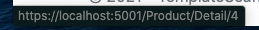


## Éditer un produit

Dans le `Controller` on a une surcharge de l'`Action` `Edit`.

Une pour la méthode `HTTP` `GET` et une pour `POST`.

```cs
[HttpGet]
public IActionResult Edit(int id)
{
    var prod = _Products.Find(p => p.ProductID == id);

    if (prod is null)
    {
        return NotFound();
    }

    return View(prod);
}

[HttpPost]
public RedirectToActionResult Edit(Product product)
{
    var prod = _Products.Find(p => p.ProductID == product.ProductID);

    if (prod is not null)
    {
        prod.ProductName = product.ProductName;
    }

    return RedirectToAction("Index");
}
```

Dans le `template` je doit passer l'`id` au formulaire pour pouvoir `update` le bon produit.

Il faut tester si le produit existe pour ne pas avoir d'`Exception`.

```html
@{
    ViewBag.Title = "Edit Product";
}

@model Product

<form asp-action="Edit" method="post">
    <input type="hidden" asp-for="@Model.ProductID">
    <label asp-for="@Model.ProductName">
        <input asp-for="@Model.ProductName" type="text">
    </label>

    <button class="btn btn-primary">Submit Modification</button>
</form>
```

Une fois le produit `update`, on utilise `RedirectToAction` pour retourner à la liste des produits.

### Solution du cours

Pour tester la validation il faut modifier le `Models/Product`

```cs
public class Product
{
    [Display(Name = "ID")]
    public int ProductID { get; set; }
    
    [Display(Name = "Name")]
    [Required]
    [MinLength(6, ErrorMessage = "The name have at least 6 caracters")]
    public string ProductName { get; set; }
```

On ajoute `[Required]` et `[MinLength]` avec un message personnalisé `ErrorMessage="..."`.

Dans le `template` on doit aussi ajouter quelques éléments :

```html

<form asp-action="Edit" method="post">
    <div asp-validation-summary="All" class="text-danger"></div>

    <input type="hidden" asp-for="@Model.ProductID">
    <div class="form-group">
        <label asp-for="@Model.ProductName" class="form-label"></label>
        <input asp-for="@Model.ProductName" type="text" class="form-control">
        <span asp-validation-for="@Model.ProductName" class="text-danger"></span>
    </div>
```

`<div asp-validation-summary="All">` va afficher le résumé de tous les problèmes de validation, doit être placée dans le formulaire.

Après champs par champs, on a `<span asp-validation-for="@Model.ProductName">`.

On doit aussi tester la validité des données dans le `Controller` :

```cs
[HttpPost]
public IActionResult Edit(Product product)
{
    if (!ModelState.IsValid)
    {
        return View(product);
    }

    var prod = _Products.Find(p => p.ProductID == product.ProductID);

    if (prod is not null)
    {
        prod.ProductName = product.ProductName;
    }

    return RedirectToAction("Index");
}
```

Le type de retour est `IActionResult` car on peut avoir `ViewResult` et `RedirectToActionResult`.

On teste la validité des données par rapport au `Model` avec `ModelState.IsValid`.

Si le formulaire n'est pas `Valid` on le renvoie.

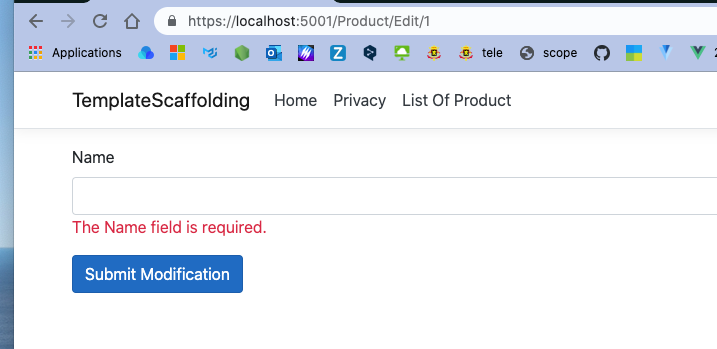

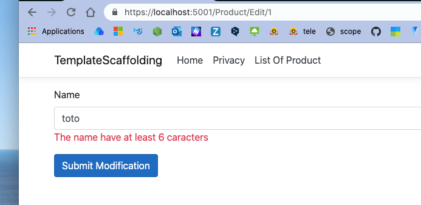

Si je click sur le bouton `Submit Modification`, je génère une requête vers le serveur à chaque fois :

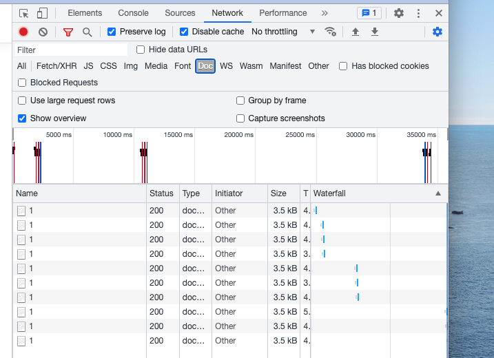

La validation est dite `Server Side`.

Il suffit d'ajouter un script pour avoir une validation `Client Side` :

```cs
@section Scripts
{
	@{await Html.RenderPartialAsync("_ValidationScriptsPartial");}
}
```


Maintenant je n'ai plus de requêtes envoyées pour la validation.

Si j'essaye d'envoyer le formulaire depuis `Postman` (sans validation client), la validation `server side` prend le relais :

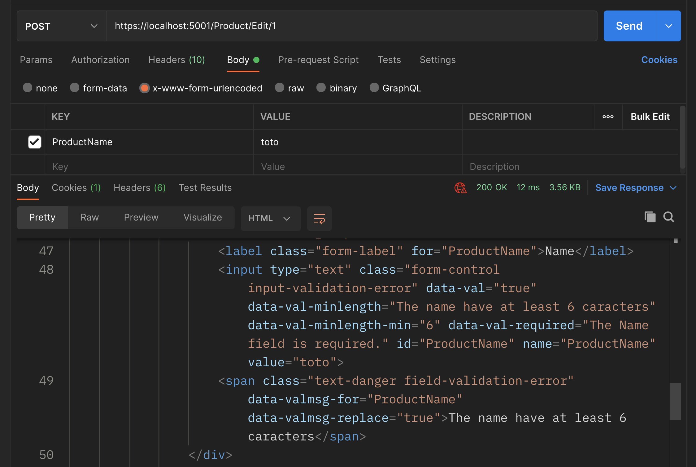


### Simplifier le `template`

On peut enlever le `@Model` du formulaire :

```html
@{
    ViewBag.Title = "Edit Product";
}

@model Product


<form asp-action="Edit" method="post">
    <div asp-validation-summary="All" class="text-danger"></div>

    <input type="hidden" asp-for="ProductID">
    <div class="form-group">
        <label asp-for="ProductName" class="form-label"></label>
        <input asp-for="ProductName" type="text" class="form-control">
        <span asp-validation-for="ProductName" class="text-danger"></span>
    </div>

    <button class="btn btn-primary">Submit Modification</button>
</form>

@section Scripts
{
@{await Html.RenderPartialAsync("_ValidationScriptsPartial");}
}
```


### Cas particulier du `checkbox`

```html
<div class="form-group form-check">
    <label class="form-check-label">
        <input class="form-check-input" asp-for="Discontinued">
        @Html.DisplayNameFor(model => model.Discontinued)
    </label>
</div>
```

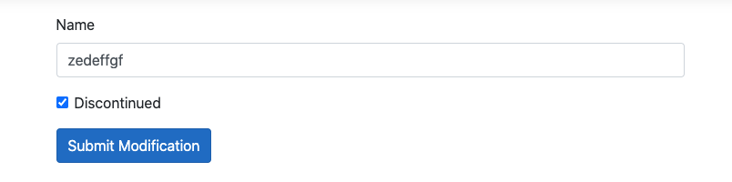


### Modifier le produit

```cs
[HttpPost]
public IActionResult Edit(Product modifiedProduct)
{
    var prod = _Products.FirstOrDefault(prod => prod.ProductID.Equals(modifiedProduct.ProductID));
    var indexOf = _Products.IndexOf(prod);
    
    _Products[indexOf] = modifiedProduct;
    
    return View(modifiedProduct);
}
```

Si on savait que l'`Id` est unique on pourrait alors utiliser `SingleOrDefault`.

`SingleOrDefault` `0` ou `1` sinon il envoie une `Exceptiion`.

`FirstOrDefault` renvoie le premier s'il y en a `1` ou plusieurs ou la valeur par défaut (`null` pour un objet) s'il y en a `0`.

### Afficher le calendrier ou un champ numérique

```html
<div class="form-group">
    <label asp-for="Quantity" class="control-label"></label>
    <input asp-for="Quantity" class="form-control">
    <span asp-validation-for="Quantity" class="text-danger"></span>
</div>

<div class="form-group form-check">
    <label class="form-check-label">
        <input class="form-check-input" asp-for="Discontinued">
        @Html.DisplayNameFor(model => model.Discontinued)
    </label>
</div>

<div class="form-group">
    <label asp-for="LaunchDate" class="control-label"></label>
    <input asp-for="LaunchDate" class="form-control">
    <span asp-validation-for="LaunchDate" class="text-danger"></span>
</div>
```

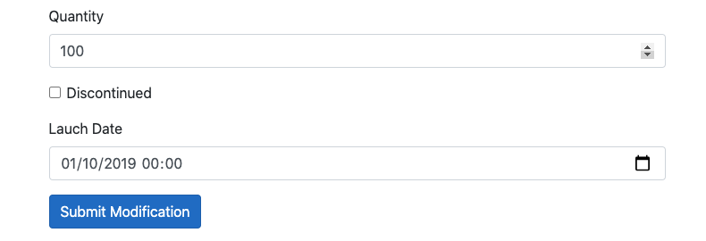

Si le `type` de l'`input` n'est pas précisé, `asp mvc` choisira le meilleur `type`.

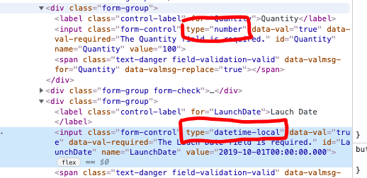


## Supprimer un produit : `_Products.Remove(prod)`

Le plus direct :

```cs
public RedirectToActionResult Delete(int id)
{
    var prod = _Products.SingleOrDefault(p => p.ProductID == id);
    _Products.Remove(prod);

    return RedirectToAction("Index");
}
```

Version avec page de **"êtes-vous sûr ?"**

`Delete.cshtml`

```html
@{
    ViewBag.Title = "Delete Product";
}

@model Product

<h1>Are-you-sure to delete this product ?</h1>

<h2>@Model.ProductID - @Model.ProductName</h2>
<h3>Q : @Model.Quantity, UiS : @Model.UnitsInStock</h3>
<h3>@Html.DisplayNameFor(m => m.Discontinued) @Html.DisplayFor(model => model.Discontinued)</h3>
<form asp-action="Delete" method="post">
    <input type="hidden" asp-for="ProductID">
    <button class="btn btn-danger">Delete Product @Model.ProductID</button> <a class="btn btn-primary"
        asp-action="Index">Return to the list</a>
</form>
```

On passe l'`id` grâce à un `input` de type `hidden`.

`ProductController.cs`

```cs
[HttpGet]
public IActionResult Delete(int id)
{
    var prod = _Products.SingleOrDefault(p => p.ProductID == id);
    
    if (prod is null)
    {
        return NotFound();
    }
    
    return View(prod);
}

[HttpPost]
public RedirectToActionResult Delete(Product product)
{
    var prod = _Products.SingleOrDefault(p => p.ProductID == product.ProductID);
    _Products.Remove(prod);

    return RedirectToAction("Index");
}
```

On peut le faire plus simplement encore en utilisant `[ActionName]` :

```cs
[HttpPost]
[ActionName("Delete")]
public RedirectToActionResult DeleteProduct(int id)
{
    var prod = _Products.SingleOrDefault(p => p.ProductID == id);
    _Products.Remove(prod);

    return RedirectToAction("Index");
}
```

Ainsi il n'y a pas d'obligation d'`overload` (surcharge).

Dans le `template` il suffit de passer l'`id` avec le `Tag Helper` : `asp-route-id`

```html
<form asp-action="Delete" method="post" asp-route-id="@Model.ProductID">
    <button class="btn btn-danger">Delete Product @Model.ProductID</button> 
    <a class="btn btn-primary" asp-action="Index">
        Return to the list
    </a>
</form>
```


## Créer un produit

C'est avant tout un beau formulaire.

`Create.cshtml`

```html
@{
    ViewBag.Title = "Create Product";
}

@model Product

<form asp-action="Create" method="post">
    <div class="form-group">
        <label class="label-control" asp-for="ProductName"></label>
        <input class="form-control" asp-for="ProductName">
        <span class="text-danger" asp-validation-for="ProductName"></span>
    </div>

    <div class="form-group">
        <label class="label-control" asp-for="Quantity"></label>
        <input class="form-control" asp-for="Quantity">
        <span class="text-danger" asp-validation-for="Quantity"></span>
    </div>

    <div class="form-group">
        <label class="label-control" asp-for="UnitsInStock"></label>
        <input class="form-control" asp-for="UnitsInStock">
        <span class="text-danger" asp-validation-for="UnitsInStock"></span>
    </div>

    <div class="form-group form-check">
        <label class="form-check-label" asp-for="Discontinued">
            <input class="form-check-input" asp-for="Discontinued">
            @Html.DisplayNameFor(m => m.Discontinued)
        </label>
        <span class="text-danger" asp-validation-for="Discontinued"></span>
    </div>

    <div class="form-group">
        <label class="label-control" asp-for="Cost"></label>
        <input class="form-control" asp-for="Cost">
        <span class="text-danger" asp-validation-for="Cost"></span>
    </div>

    <button class="btn btn-primary">Create Product</button>
</form>

@section Scripts{
@{await Html.RenderPartialAsync("_ValidationScriptsPartial");}
}
```

On a ensuite deux `action` dans le `Controller` :

```cs
[HttpGet]
public ViewResult Create() => View();

[HttpPost]
public IActionResult Create(Product product)
{
    if (!ModelState.IsValid)
    {
        return View(product);
    }

    product.ProductID = _Products.Max(p => p.ProductID) + 1;
    product.LaunchDate = DateTime.Now;
    product.Tax = (product.Cost * 9.7) / 100;

    _Products.Add(product);

    return RedirectToAction("Index");
}
```

Il n'y a pas de conflit pour les deux signatures de `Create`.

### Modification de l'affichage de la `Tax` : `ToString("c")`

```html
<!-- Dans Index.cshtml -->
<td>@product.Tax.ToString("c")</td>
```


### Passer les colonnes optionelles à `Nullable`

Automatiquement les types numériques sont considérés comme `required` :

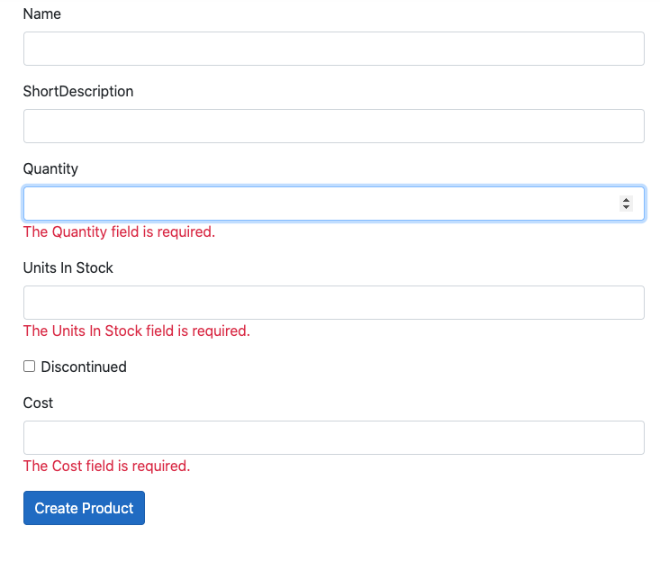

On doit utiliser les types `nullable` : `?` pour rendre optionnel les colonnes que l'ont désire :

```cs
public class Product
{
    [Display(Name = "ID")]
    public int ProductID { get; set; }
    [Display(Name = "Name")]
    // [Required]
    // [MinLength(6, ErrorMessage = "The name have at least 6 caracters")]
    public string ProductName { get; set; }
    public int? Quantity { get; set; }
    [Display(Name = "Units In Stock")]
    public int? UnitsInStock { get; set; }
    public bool Discontinued { get; set; }
    public double Cost { get; set; }
    public double Tax { get; set; }
    [Display(Name = "Lauch Date")]
    [DisplayFormat(DataFormatString = "{0:dd MM yyyy}")]
    public DateTime LaunchDate { get; set; }
}
```

Ici `Quantity` et `UnitsInStock` sont `int?` :

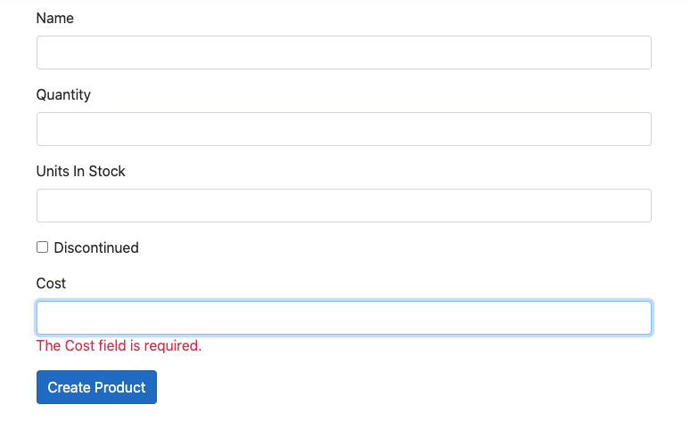

On observe que la validation ne les considère plus comme `required`.

