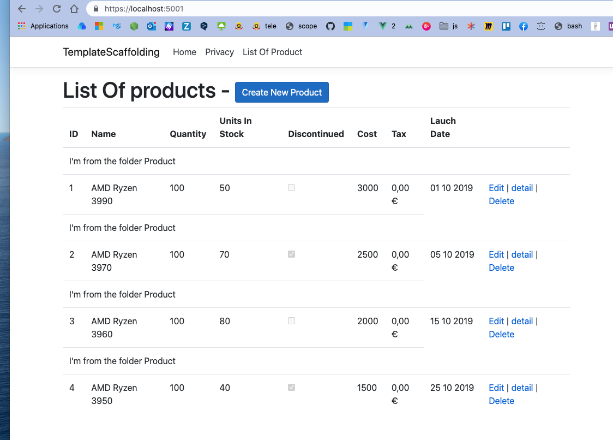
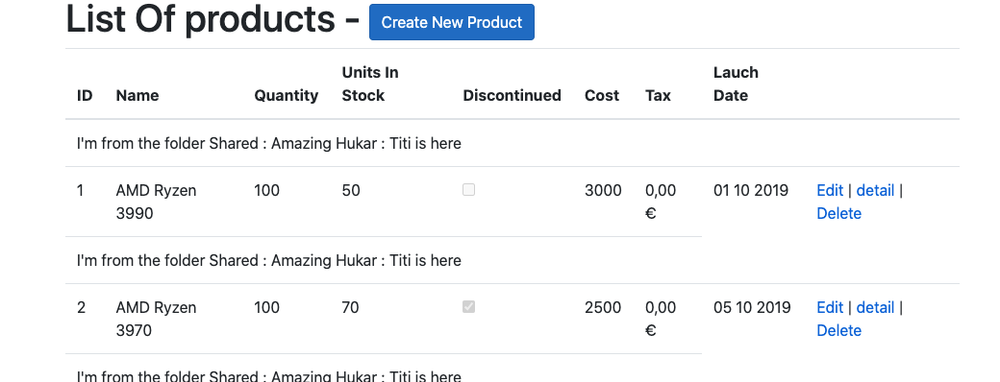

# Strongly Typed `Partial Views`

Tout comme une `View` peut être `Strongly Typed`, une `Partial View` peut l'être aussi.

En générale on place les `Partial View` dans le dossier `Shared`.

Par convention, une `Partial View` commence par `_` (`underscore`).

## Création de `_ShowProductData.cshtml`

On place cette `Partial View` dans le dossier `Shared`.

Les `Partial Views` permettent de réduire le code de la page lorsque celle-ci devient complexe.

Cela permet une meilleur maintenance et une meilleur lisibilité du code.

On peut aussi créer des `Partial Views` pour pouvoir les ré-utiliser dans plusieurs page.

```cs
@model Product
@{
    var product = Model;
}

<tr>
    <td>@product.ProductID</td>
    <td>@product.ProductName</td>
    <td>@product.Quantity</td>
    <td>@product.UnitsInStock</td>
    <td>@Html.DisplayFor(Toto => product.Discontinued)</td>
    <td>@product.Cost</td>
    <td>@product.Tax.ToString("c")</td>
    <td>@Html.DisplayFor(Toto => product.LaunchDate)</td>
    <td>
        <a asp-action="Edit" asp-route-id="@product.ProductID">Edit</a> |
        @Html.ActionLink("detail", "Detail", new { id=product.ProductID }) | 
        <a class="text-danger" asp-route-action="Delete" asp-route-id="@product.ProductID">Delete</a>

    </td>
</tr>
```
On voit ici qu'on a ajouter ces lignes :

```cs
@{
    var product = Model;
}
```

C'est pour pouvoir continuer de garder le nom `product` dans le `template`.


> ## Rendre la page `Product/Index` la page par défaut
>
> Il faut aller dans `Startup.cs`
>
> ```cs
> app.UseEndpoints(endpoints =>
>             {
>                 endpoints.MapControllerRoute(
>                     name: "default",
>                     pattern: "{controller=Product}/{action=Index}/{id?}");
>             });
> ```
> On a changé le `controller=Home` par `controller=Product`. 


## Rendre la `Partial View` dans le `template`

Dans `Index.cshtml` on va rendre la `Partial View` dans le `foreach` :

```html
@{
    ViewBag.Title = "List Of Products";
}

@model List<Product>

<h1>List Of products - <a asp-action="Create" class="btn btn-primary">Create New Product</a>
</h1>

<table class="table">
    <thead>
        <!-- ... -->
    </thead>
    <tbody>
        @foreach (var product in @Model)
        {
           <partial name="_ShowProductData" model="product" />
        }

    </tbody>

</table>
```

`name` : le nom du `partial` sans l'extension `cshtml`.

`model` : les données qui seront attribuées au `model` de la `Partial View`.

Il n'est pas nécéssaire de spécifier le chemin vers `_ShowProductData`, le `Razor View Engine` va d'abord chercher dans le dossier de la page (ici `Product`), puis dans le dossier `Shared`.

`Shared/_ShowProductData.cshtml`

```html
@model Product
@{
    var product = Model;
}

<tr>
    <td colspan="7">I'm from the folder Shared</td>
</tr>

<tr>
    <!-- ... -->
```


Maintenant si je spécifie l'extension `.cshtml` dans l'attribut `name` de mon `partial` :

```html
<tbody>
        @foreach (var product in @Model)
        {
            <partial name="_ShowProductData.cshtml" model="product" />
        }

    </tbody>
```


Une `exception` est levée. car le `razor view engine` ne cherche plus amors que dans le dossier de la page parente, ici `Product`.

Si je copie le `partial` dans le dossier `Product` en modifiant un peu le texte :

`Product/_ShowProductData.cshtml`

```html
@model Product
@{
    var product = Model;
}

<tr>
    <td colspan="7">I'm from the folder Product</td>
</tr>

<tr>
    <!-- ... -->
```



#### Si je met l'extension `.cshtml`, je force le partial à se trouver dans le même dossier que la page parente.


## `ViewBag` et `ViewData`

Des `ViewBag` ou `ViewData` définis dans la page mère, sont disponible dans le partial :

`Index.cshtml`

```cs
@{
    ViewBag.Title = "List Of Products";
    ViewBag.Hukar = "Amazing Hukar";
    ViewData["titi"] = "Titi is here";
}

// ...
```


`_ShowProductData.cshtml`

```html
@model Product
@{
    var product = Model;
}

<tr>
    <td colspan="7">I'm from the folder Shared : @ViewBag.Hukar : @ViewData["titi"]</td>
</tr>
```



