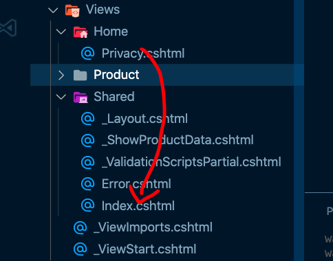
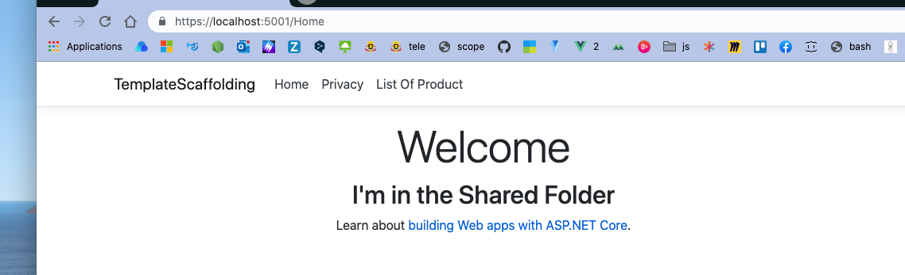
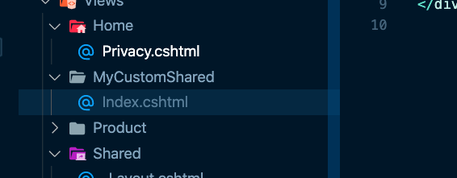
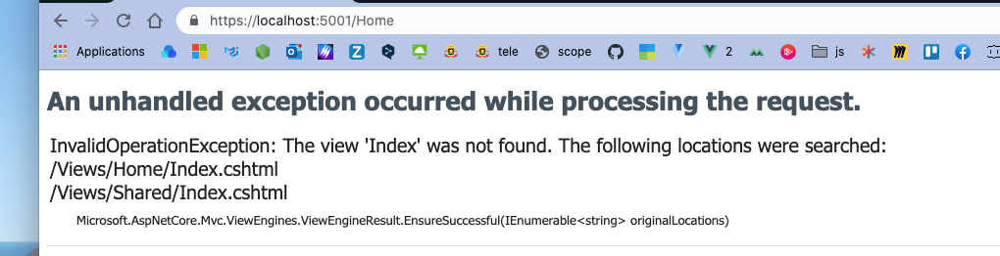
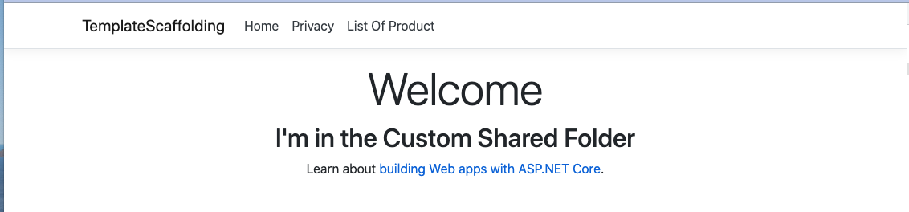

# 10 `Views` Location

Par défaut pour l'`Action` : `Index` du `Controller` : `Home` , le `Razor View engine` va chercher la `View` dans `Views/Home/index.cshtml`.

Je peux placer ma `View` : `Index.cshtml` aussi dans le dossier `Shared` :





Cela fonctionne toujours.


## Définir son propre dossier pour les `Views`

On crée un dossier `MyCustomShared` et on place la `View` : `Index.cshtml` dedans. 





On obtient une `exception` qui nous explique que la `View ` est d'abord cherchée dans `/Views/Home/Index.cshtml` puis dans `/Views/Shared/Index.cshtml`.


## Ajouter un `service` pour gérer les `View Locations`

Dans `Startup.cs`, dans la méthode `ConfigureServices` on va ajouter une `RazorViewEngineOptions` :

```cs
using Microsoft.AspNetCore.Mvc.Razor;
// ...

public void ConfigureServices(IServiceCollection services)
{
    services.AddControllersWithViews();
    services.Configure<RazorViewEngineOptions>(o => 
 o.ViewLocationFormats.Add("~/Views/MyCustomShared/{0}" + RazorViewEngine.ViewExtension)
    );
}
```

`RazorViewEngine.ViewExtension` vaut `".cshtml"`.

`{0}` est le nom du fichier de la page.



