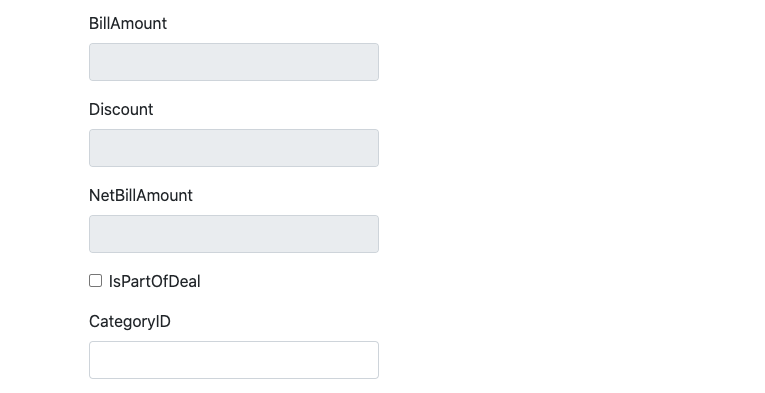
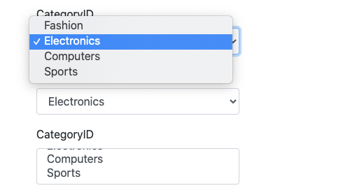
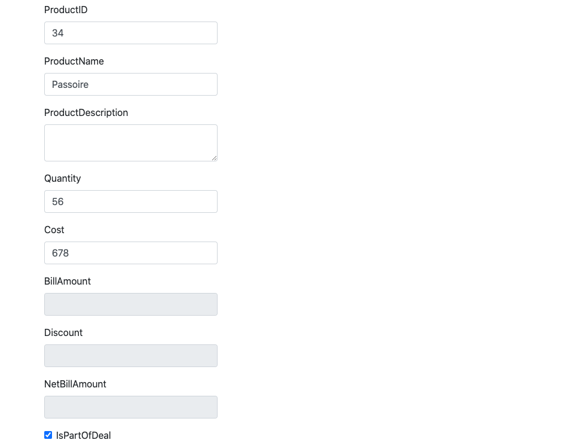
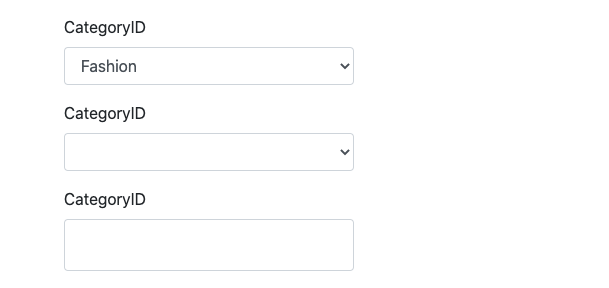

# 11 Form `Tag Helpers`

## Utilisation de `Code Generator`

### Installation ou mise à jour

```bash
dotnet tool install -g dotnet-aspnet-codegenerator
```

```bash
dotnet tool update -g dotnet-aspnet-codegenerator
```

On doit aussi ajouter le `Nuget Package` contenant les `templates` :

```bash
dotnet add package Microsoft.VisualStudio.Web.CodeGeneration.Design --version 5.0.2
```


### Créer un template `Create`

```bash
dotnet aspnet-codegenerator view Index Create -m Product -outDir Views/Home -scripts -udl
```

`Index` le nom de la `View`

`Create` le nom du `Template` utilisé

`-m` définit le modèle

`-outDir` Chemin relatif au dossier du projet où créer la `View`

`-scripts` ajoute `_ValidationScriptsPartial`

`-udl` Utilise le `Layout` par défaut (sinon mais le `Layout = null`)


## Liste des `Tag Helpers` du `template` généré

### `asp-validation-summary` 

Affiche les problèmes de validation :

```html
<div asp-validation-summary="ModelOnly" class="text-danger"></div>
<div asp-validation-summary="All" class="text-danger"></div>
```


### `asp-controller` 

Définit le `Controller` à joindre.

Par défaut celui correspondant au nom du dossier contenant la `View`.

```html
<form asp-controller="Home" asp-action="Index">
```


### `asp-action `

Définit l'`Action` à joindre.

Par défaut celle correspondant au nom du fichier de la `View`.

```html
<form asp-action="Index">
```


### `asp-for`

Relie un `<label>` et un `<input>` à une propriété précise du `Model`.

```html
<label asp-for="ProductID" class="control-label"></label>
<input asp-for="ProductID" class="form-control" />
```

On peut aussi utiliser un `textarea` :

```html
<label asp-for="ProductDescription" class="control-label"></label>
<textarea asp-for="ProductDescription" class="form-control"></textarea>
```


### `asp-validation-for`

Si une propriété a une validation par défaut (type non `nullable`) ou une validation ajoutée (`annotation` ou `fluent api`), cela affichera le message d'erreur de validation dans l'élément associé à l'attribut.

```html
<span asp-validation-for="ProductID" class="text-danger"></span>
```

Si on ne veut pas qu'une propriété numérique est une validation par défaut, on peut la mettre à `nullable`.

Elle devient alors optionnelle.

```cs
public decimal? BillAmount { get; set; }
```


## `html` : `readonly`

Si on ne veut pas qu'un élément de formulaire soit modifiable on peut le mettre à `readonly :

```html
<input asp-for="BillAmount" class="form-control" readonly />
```




## `html` : dropdown list

```html
<div class="form-group">
    <label asp-for="CategoryID" class="control-label"></label>
    <select asp-for="CategoryID" class="form-control">
        <option value="1">Fashion</option>
        <option value="2">Electronics</option>
        <option value="3">Computers</option>
        <option value="4">Sports</option>
    </select>
    <span asp-validation-for="CategoryID" class="text-danger"></span>
</div>
```

Pour l'instant les valeurs sont *hard-codée*.

###  `asp-items`

On va recoder notre `dropdown` avec `asp-items`.

`asp-items` reçoit une collection de `SelectListItem` :  `IEnumerable<SelectListItem>`

```html
<select asp-for="CategoryID" asp-items="@ViewBag.Categories"></select>
```

Dans le `Controller` on a :

```cs
using Microsoft.AspNetCore.Mvc.Rendering;
// ...

ViewBag.Categories = new List<SelectListItem>
{
    new SelectListItem { Value = "1", Text = "Fashion" },
    new SelectListItem { Value = "2", Text = "Electronics" },
    new SelectListItem { Value = "3", Text = "Computers"  },
    new SelectListItem { Value = "4", Text = "Sports"  }
};
```




## `Radio Type`

```html
<div class="form-group">
    <label asp-for="PaymentType" class="control-label"></label>
    <div>
        <label class="radio-inline">
            <input type="radio" asp-for="PaymentType" class="form-check-input" value="Credit Card" />Credit Card
        </label>
    </div>
    <div>
        <label class="radio-inline">
            <input type="radio" asp-for="PaymentType" class="form-check-input" value="Net Banking" />Net Banking
        </label>
    </div>
    <div>
        <label class="radio-inline">
            <input type="radio" asp-for="PaymentType" class="form-check-input" value="Debit Card" />debit Card
        </label>
    </div>
    <span asp-validation-for="PaymentType" class="text-danger"></span>
</div>
```


Chaque `input type="radio"` a le même `asp-for="PaymentType"`.

## Reception des données

```cs
[HttpPost]
public IActionResult Index(Product prod)
{
    prod.BillAmount = prod.Cost * prod.Quantity;
    
    if (prod.BillAmount > 100 && prod.IsPartOfDeal)
    {
        prod.Discount = prod.BillAmount * 10/100;
    }
    else
    {
        prod.Discount = prod.BillAmount * 5 / 100;
    }
    
    prod.NetBillAmount = prod.BillAmount - prod.Discount;
    
    return View(prod);
}
```



On voit que `BillAmount`, `Discount` et `NetBillAmount` ne sont pas retournés vers la `View`.

On doit manuellement remettre le `Model` envoyé à la `View` à zéro :

```cs
[HttpPost]
public IActionResult Index(Product prod)
{
    ModelState.Clear();

    prod.BillAmount = prod.Cost * prod.Quantity;
    // ...
```


On a maintenant toutes les données calculées affichées aussi.



On remarque que les `select` générés dynamiquement grâce au `ViewBag` on disparu.

Pour rappel, les `ViewBag` n'existe que pour une seule requête, il faut donc ajouter ce `ViewBag.Categories` à la requête en `POST` en plus de celle en `GET` :

```cs
[HttpPost]
public IActionResult Index(Product prod)
{
    ModelState.Clear();

    ViewBag.Categories = new List<SelectListItem>
    {
        new SelectListItem { Value = "1", Text = "Fashion" },
        new SelectListItem { Value = "2", Text = "Electronics" },
        new SelectListItem { Value = "3", Text = "Computers"  },
        new SelectListItem { Value = "4", Text = "Sports"  }
    };

    prod.BillAmount = prod.Cost * prod.Quantity;
	// ...
```


Maintenant tout fonctionne.


## Résumé

`asp-for` va permettre un `two ways binding` entre le `model` et le `form`.

Si on renvoie des valeurs calculées, il faut au préalable remettre le `Model` à zéro : `ModelState.Clear()`. 


