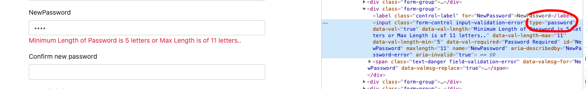
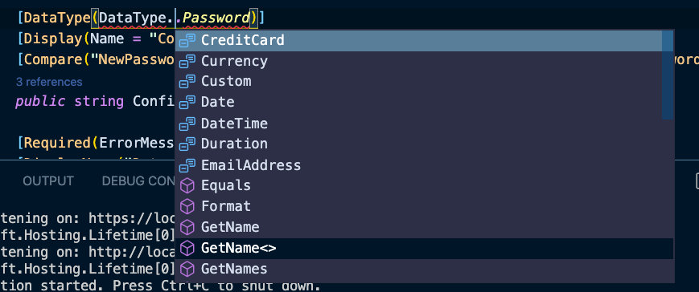
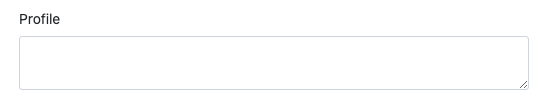
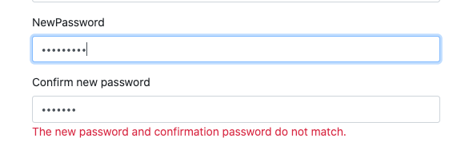
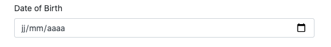
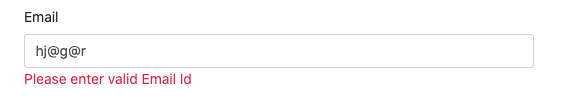
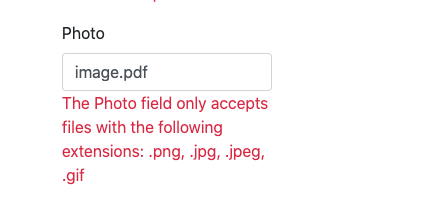
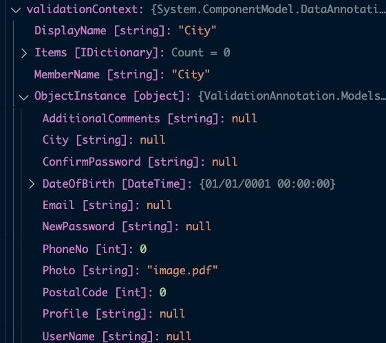
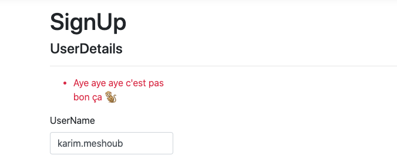

# 12 Validation grâce aux `data annotations`

### `System.ComponentModel.DataAnnotations`

## `Required`


## `StringLength`

Définit le maximum de caractères d'une chaîne de caractères :

```cs
[StringLength(250)]
public string Description { get; set; }
```

On peut aussi spécifier le `MinimumLength` :

```cs
[StringLength(250, MinimumLength = 5)]
public string Description { get; set; }
```

On peut aussi avoir un `ErrorMessage` personnalisé :

```cs
[StringLength(15, MinimumLength = 5, ErrorMessage = "User Name cannot be more than 15 characters")]
public string UserName { get; set; }
```


## `Range`

Définit un interval numérique :

```cs
[Range(0, 100)]
public int Quantity { get; set; }
```


## `DataType`

Spécifie le type additionnel d'un champs.

En clair ajoute `type="password"` à un `input`.

```cs
[DataType("password")]
public string NewPassword { get; set; }
```



Si je manipule un peu cet attribut :

```cs
[DataType("date")]
public string NewPassword { get; set; }
```

J'obtiens un `input type="date"` :


### `[DataType(DataType.Password)]`

On peux aussi utiliser `DataType.` pour avoir la liste de tous les `type` possibles :



### Un `textarea` : `DataType.MultilineText`

```cs
[DataType(DataType.MultilineText)]
public string Profile { get; set; }
```




## `Compare`

Permet de comparer ce champs et un autre pour voire s'il sont similaire.

Utile pour le `Confirm Password`.

```cs
public string Password { get; set; }

[Compare("Password", ErrorMessage = "Password and confirm password don't match.")]
public string ConfirmPassword { get; set; }
```




## `Display`

Permet d'afficher dans le `label` une chaîne de caractères autre que le nom de la propriété si nécéssaire.

```cs
[Display(Name = "Date of Birth")]
public DateTime DateOfBirth { get; set; }
```

ou bien cette syntaxe

```cs
[DisplayName("Date of Birth")]
public DateTime DateOfBirth { get; set; }
```




## `EmailAddress`

```cs
[EmailAddress(ErrorMessage = "Please enter valid Email Id")]
public string Email { get; set; }
```




## `FileExtensions`

```cs
[FileExtensions(Extensions = "png,jpg,jpeg,gif")]
public string Photo { get; set; }
```

Permet de valider certaines extensions de fichiers uniquement.




## Création de la `View` : `SignUp`

```bash
dotnet aspnet-codegenerator view SignUp Create -m UserDetails -outDir Views/Home -scripts -udl
```


## Création de l'`Action` `POST` : `SignUp`

```cs
[HttpPost]
public IActionResult SignUp(UserDetails user)
{
    if (ModelState.IsValid)
    {
        return Content("You can now pu data into the database ... ");
    }
    return View(user);
}
```

Au niveau de l'`Action` du `Controller` c'est avec `ModelState.IsValid` que l'on va pouvoir connaître l'état de la validation.


## Custom Validation Attribute

On va créer ses propres `annotation` de `validation`.

Par exemple on a une propriété `City` et on veut restreindre cette valeur à une liste de possibilités.

```cs
// Paris Bruxelles Tokyo
[City]  // mon custom validation Attribute
public string City { get; set; }
```

On crée un dossier `Validations` à la racine.

On crée une classe à l'intérieur de ce dossier : `CityAttribute.cs`

```cs
namespace ValidationAnnotation.Validations
{
    public class CityAttribute: ValidationAttribute
    {
        protected override ValidationResult IsValid(Object value, ValidationContext validationContext)
        {
            var ud = (UserDetails)validationContext.ObjectInstance;
            
            if(ud.City == null)
            {
                return new ValidationResult("Bakel City can't be null");
            }
            
            switch(ud.City)
            {
                case "Paris":
                case "Bruxelles":
                case "Tokyo":
                    return ValidationResult.Success;
                    break;
                default:
                    return new ValidationResult("city must be Paris, Bruxelles or Tokyo");
            }
        }
    }
}
```

On hérite de la classe `ValidationAttribute`.

On doit ensuite implémenter la méthode `overridé` `IsValid`.



L'objet `validationContext` possède une propriété `ObjectInstance` avec tous les champs du `Model` (ici `UserDetails`).

On doit caster cet objet pour avoir un `UserDetails` :

```cs
var ud = (UserDetails)validationContext.ObjectInstance;
```


### Simplification du code

En fait `object value` contient la valeur du champ ou `null`.

On peut donc simplifier le code à un unique `switch` :

```cs
protected override ValidationResult IsValid(object value, ValidationContext validationContext)
{
    switch (value)
    {
        case null:
            return new ValidationResult("Cotellette City can't be null");
        case "Paris":
        case "Bruxelles":
        case "Tokyo":
            return ValidationResult.Success;
        default:
            return new ValidationResult("city must be Paris, Bruxelles or Tokyo");
    }
}
```


### Concepts importants 

`validationContext.ObjectInstance` contient les valeurs du `Model` envoyé par le formulaire.

`ValidationResult.Success` lorsque le champ est validé.

`new ValidationResult("message d'erreur de validation")` lorsque la validation a échoué.


## Custom Model Level `Validation Attribute`

On va maintenant mettre une validation au niveau du `Model` tout entier.

On va créer une nouvelle `class` : `CityPostalCodeAttribute` toujours dans le dossier `Validations`.

On veut mettre en relation la vérification de la `City` et de son `PostalCode` :

```cs
public class CityPostalCodeAttribute : ValidationAttribute
{
    protected override ValidationResult IsValid(object value, ValidationContext validationContext)
    {
        var ud = (UserDetails)value;
        
        if (ud.City.ToLower() == "tokyo" && ud.PostalCode > 500)
        {
            return new ValidationResult("Aye aye aye c'est pas bon ça 🐒");
        }
        
        return ValidationResult.Success;
    }
}
```

On accroche maintenant l'`Attribute` à la classe et non plus à un champ :

```cs
[CityPostalCode]
public class UserDetails
{
    // ...
}
```


> ## Différence entre `as` et un `cast`
>
> Réponse d'`overflow` : https://stackoverflow.com/questions/132445/direct-casting-vs-as-operator
>
> ```cs
> string s = (string)o; // 1
> ```
>
> Lance une  `InvalidCastException` si `o` n'est pas un  `string`. Sinon, assigne `o` à  `s`, même si `o` est `null`.
>
> ```cs
> string s = o as string; // 2
> ```
>
> Assigne `null` à `s` si `o` n'est pas un `string` ou si `o` est `null`. Pour cette raison on ne peut pas l'utiliser avec les `value types` (l'opérateur ne peut jamais retourner `null` dans ce cas). Sinon, assigne `o` à `s`.
>
> Utilisez `1` pour la plupart des conversions - c'est simple et direct. J'ai tendance à ne presque jamais utiliser `2` car si quelque chose n'est pas du bon type, je m'attends généralement à ce qu'une exception se produise. 

On a maintenant un message de validation au niveau du `Model`, la `div asp-validation-summary="ModelOnly"` va apparaître en haut :




