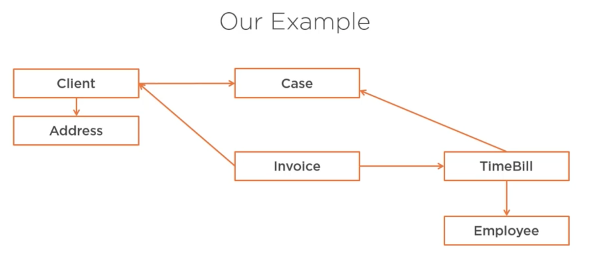
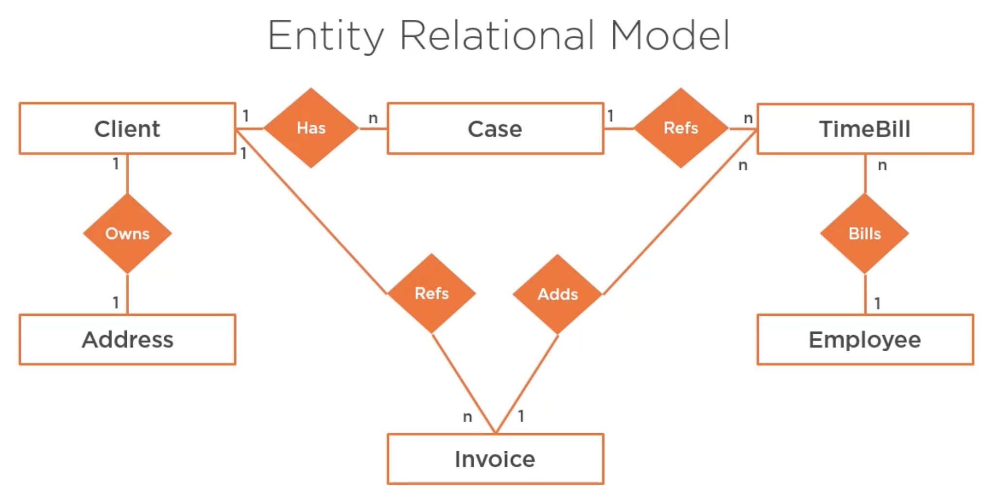
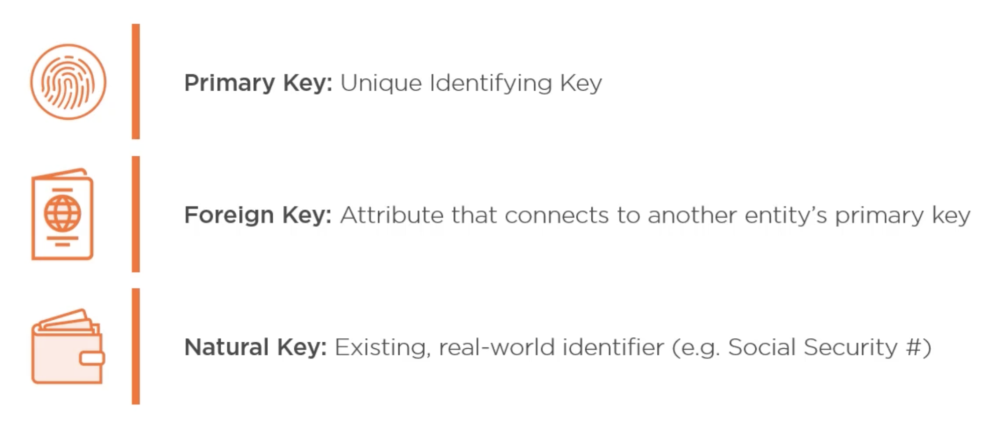
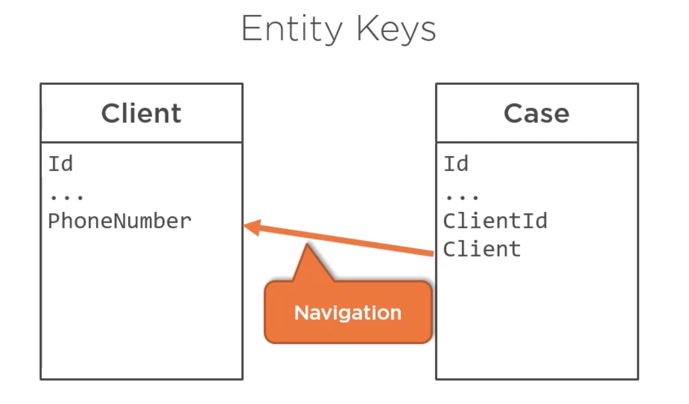
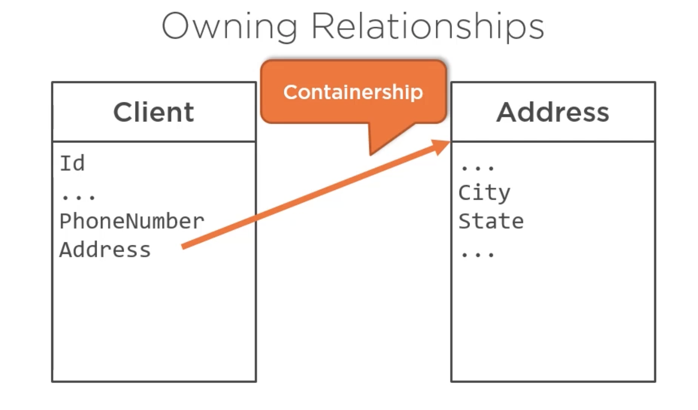
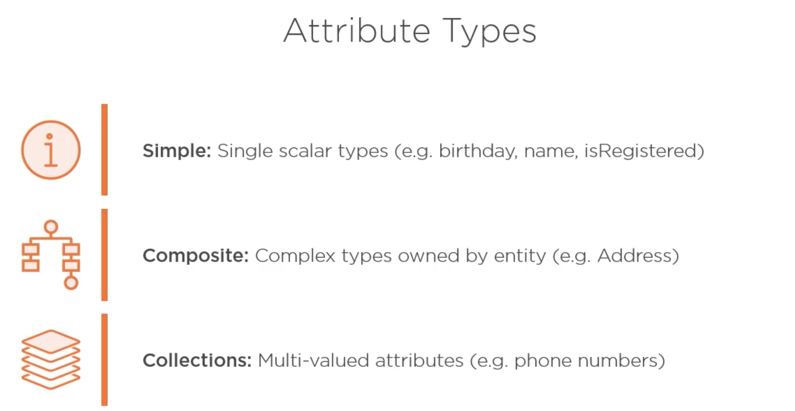

# 01 The Big Picture

## Une entité

Quelque chose qui existe par elle-même.

A un identifaint unique.

Les entités sont des noms :

- Une `Personne`

- Une `Facture`
- Un `Client`
- Un `Log`
- Un `Produit`
- Une `Adresse`


## Notre example



`TimeBill` facture horaire

`Case` affaire

`Invoice` facture

## Le modèle relationnel

 


## Les clés d'entités



Trois sortes de clés :

- clé primaire
- clé étrangère
- clé naturelle (venant du monde réel) => numéro de sécurité sociale



La propriété de navigation n'est pas la clé étrangère.

### Possédé une relation : `Adresse`



L'`Adresse` n'existe pas sans le `Client`.Le `Client` possède l'`Adresse`.


## Les types d'attributs



Un attribut peut être un type scalaire (une valeur `string`, `date`, `bool`, `int`), un type composé (un `object`) ou de type `collections`. 


## Créer la base de données

Aller dans le projet `JurisTempus`

```bash
cd JurisTempus
dotnet ef database update
```

#### ! bien utilisé son propre `connection string` dans `appsetti,gs.json`.


## Collections

On déclare les collections `ICollection`.

`ICollection` implémente `IEnumerable` et apporte des méthode tel que `Add`, `Contains` ou encore `Remove` (et d'autres).


## Propriété possédée : `Owns property`

`Address` n'a pas d'existence sans `Client`.

`Address` n'a pas d'identifiant unique (`Id`), ce n'est pas une entité mais plutôt un sac de propriétés enrelation et appartenant à `Client`.


## Les entités

Ce sont des structures de données qui sont persistées entre leurs différentes invocations.

