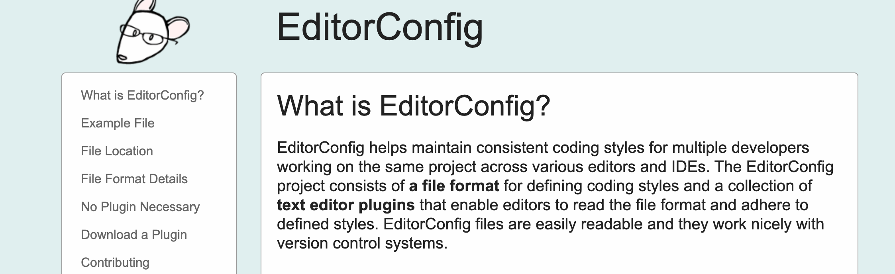
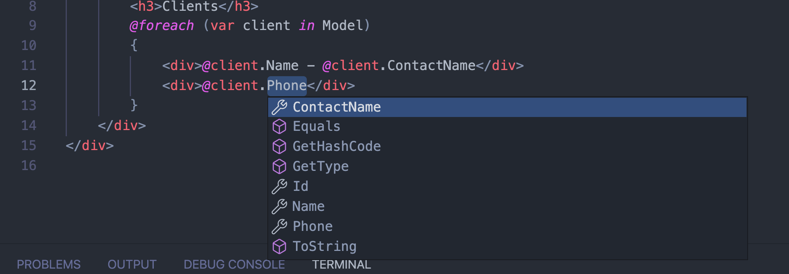

# 02 `View Model`

C'est une structure de données spécifique pour se raccorder à l'`UI` ou à une `API`.

On peut aussi parler de `DTO` (Data Transfert Object), de `Data Model` et de `Data View`.

On peut avoir une validation au niveau des `View Model` en complément de la validation au niveau `Data`.


## Création d'une `View Model` pour `Client`

`ClientViewModel.cs`

```cs
public class ClientViewModel
{
  public int Id { get; set; }
  public string Name { get; set; }
  public string ContactName { get; set; }
  public string Phone { get; set; }
}
```

On peut alors l'utiliser manuellement dans son contrôleur :

Au lieu de ça

```cs
public IActionResult Index()
{
  var result = _context.Clients.Include(c => c.Address).ToArray();
  return View(result);
}
```

On va avoir ça 

```cs
public IActionResult Index()
{
  var result = _context.Clients
    // .Include(c => c.Address)
    .Select(c => new ClientViewModel
            {
              Id = c.Id,
              Name = c.Name,
              ContactName = c.Contact,
              Phone = c.Phone
            })
    .ToArray();
  return View(result);
}
```

> ### Problème d'indentation
>
> Un fichier `.editorconfig` masquait mes réglages.
>
> https://editorconfig.org/
>
> 

L'utilisation de `View Model` permet une meilleure complétion du code dans une application `MVC`.

```cs
@{
  ViewData["Title"] = "Home Page";
}
@model ClientViewModel[]

  <div class="row">
    <div class="col-8 offset-2">
      <h3>Clients</h3>
      @foreach (var client in Model)
    {
      <div>@client.Name - @client.ContactName</div>
        <div>@client.Phone</div>
    }
</div>
  </div>
```



On a bien les propriété de `ClientViewModel` (et pas celle de `Client`).


